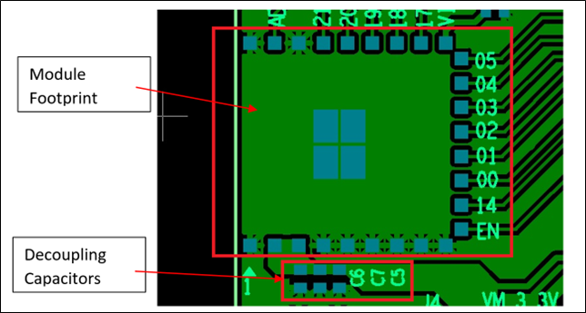

.. _power supply to module:

Power Supply to the Module
##########################

For the Talaria TWO module, input voltage source V_3.3V should be
powered with a 3.3V +/- 10% tightly regulated power supply. Power supply
source should be able to supply 300mA peak current. Considering other
components on the board, a suitable DC-DC regulator should be chosen.

It is important to have decoupling capacitors placed close to the
modules’ power pins VCC and GND as depicted in Figure 1.

|image1|

.. rst-class:: imagefiguesclass
Figure 1: Decoupling Capacitors on VCC pins 2 and 3 VCC and GND pins 1
and 4

