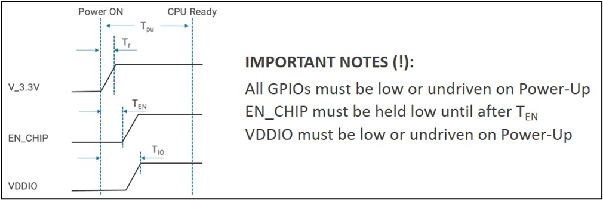

.. _reset:

Reset
#####

This PIN is used to reset the module.

    - LOW on this PIN puts the module in a reset stage
    - HIGH on this PIN releases the module from reset

During the reset stage, all the GPIOs must be LOW or in an undriven
state. EN_CHIP/RST must be held below 0.6V to reset device.

Figure 1 depicts the power-up sequence for Talaria TWO.

|image2|

Figure 1: Power-up sequence

Figure 2 depicts the suggested reset circuit which can be used in the
application boards. This reset circuit gives the module sufficient time
delay to settle down after power-up or after a reset.

|image3|

Figure 2: Reset circuit

