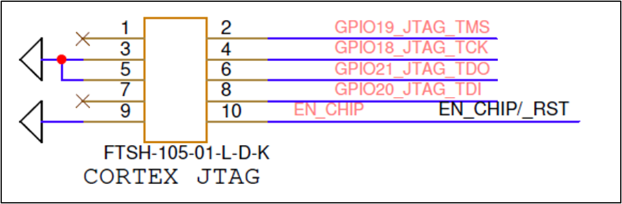

.. _module peripherals:

Module Peripherals
##################

Talaria TWO modules have a rich set of peripherals in a compact
formfactor with UART, SPI, ADC, PWM I2C, I2S and multiple GPIOs. It is
also equipped with a JTAG interface which can be used for extensive
debugging. Peripherals are multiplexed with GPIOs, which can be selected
through software.

UART Interface
--------------

There is only one UART interface available on Talaria TWO modules on the
PINS **GPIO1 - TXD** and **GPIO2 - RXD** by default on power-up. The
other GPIOs of the module can also be configured to work as a UART. UART
flow control pins RTS and CTS are optional and can be configured to any
of the GPIO pins. UART interface can be used as a host interface through
which a microcontroller/processor can send and receive commands from the
module.

Module supports standard baudrates starting from 300 to 2560000, 921600
being the default baudrate.

|image4|

Figure 1: Host with UART Interface

.. table:: Table 2: UART PINS

   +----------------+------------+-----------+-----------+-----------+-----------+-----------+-----------+------------+------------+------------+------------+------------+------------+
   | **Interface**  | **Signal** | **GPIO0** | **GPIO1** | **GPIO2** | **GPIO3** | **GPIO4** | **GPIO5** | **GPIO14** | **GPIO17** | **GPIO18** | **GPIO19** | **GPIO20** | **GPIO21** |
   +================+============+===========+===========+===========+===========+===========+===========+============+============+============+============+============+============+
   | **UART**       | **RXD**    |           |           |     l     |           |           |           |            |            |            |            |            |            |
   +----------------+------------+-----------+-----------+-----------+-----------+-----------+-----------+------------+------------+------------+------------+------------+------------+
   |                | **TXD**    |           |    l      |           |           |           |           |            |            |            |            |            |            |
   +----------------+------------+-----------+-----------+-----------+-----------+-----------+-----------+------------+------------+------------+------------+------------+------------+
   |                | **CTS**    |           |           |           |           |           |           |            |            |            |            |            |            |
   +----------------+------------+-----------+-----------+-----------+-----------+-----------+-----------+------------+------------+------------+------------+------------+------------+
   |                | **RTS**    |           |           |           |           |           |           |            |            |            |            |            |            |
   +----------------+------------+-----------+-----------+-----------+-----------+-----------+-----------+------------+------------+------------+------------+------------+------------+
   | **Console**    | **TX**     |           |           |           |           |           |           |            |     n      |            |            |            |            |
   +----------------+------------+-----------+-----------+-----------+-----------+-----------+-----------+------------+------------+------------+------------+------------+------------+

l : Default Power-up GPIO

n : Function Supported on GPIO

n : Required for factory production firmware loading

Console UART
------------

Console UART TXD is a unidirectional PIN available on GPIO 17 by
default. Apart from the regular UART, the console UART TXD PIN is only a
transmit PIN which can give out debug messages from the module. This PIN
works at a very high baudrate of 2457600.

It is important to have this PIN available on a header for debug
purposes.

|image5|

Figure 2: Console for debug messages

Layout Considerations:

1. Let the RXD and TXD pass side-by-side and make the length as short as
   possible.

2. Avoid routing through multiple layers.

SPI Slave Interface
-------------------

There is one SPI slave available on Talaria TWO module. SPI slave PINS
are non-configurable, and are available only on GPIO0 - CLK, GPIO1 -
MOSI, GPIO2 - MISO and GPIO5 - CS.

For SPI slave, the maximum SPI CLK supported is 25Mhz.

.. table:: Table 3: SPI slave specifications

   +-----------------------------------+-----------------------------------+
   | **SPI Slave Specifications**      | **Details**                       |
   +===================================+===================================+
   | Maximum Clock Frequency           | 25MHz                             |
   +-----------------------------------+-----------------------------------+
   | Clock Polarity and Phase Modes    | Mode 0 (CPOL=0, CPHA=0)           |
   | Supported                         | Mode 3 (CPOL=1, CPHA=1)           |
   +-----------------------------------+-----------------------------------+
   | Data In/Out Sequence              | MSB First                         |
   +-----------------------------------+-----------------------------------+
   | Other Features                    | Dual SPI Mode Capable             |
   |                                   | Read Status                       |
   |                                   | Reset                             |
   +-----------------------------------+-----------------------------------+

SPI slave is generally used to connect the module to a host
microcontroller/processor. Host acts as the Master to send commands and
receive responses to control the module.

.. table:: Table 4: SPI slave PIN-OUTs

    +----------------+------------+-----------+-----------+-----------+-----------+-----------+-----------+------------+------------+--------------+------------+------------+------------+
    | **Interface**  | **Signal** | **GPIO0** | **GPIO1** | **GPIO2** | **GPIO3** | **GPIO4** | **GPIO5** | **GPIO14** | **GPIO17** | **GPIO18\2** | **GPIO19** | **GPIO20** | **GPIO21** |
    +================+============+===========+===========+===========+===========+===========+===========+============+============+==============+============+============+============+
    | **SPI Slave**  | **CLK**    |     l     |           |           |           |           |           |            |            |              |            |            |            |
    +----------------+------------+-----------+-----------+-----------+-----------+-----------+-----------+------------+------------+--------------+------------+------------+------------+
    |                | **CS**     |           |           |           |           |           |      l    |            |            |              |            |            |            |
    +----------------+------------+-----------+-----------+-----------+-----------+-----------+-----------+------------+------------+--------------+------------+------------+------------+
    |                | **MOSI**   |           |           |           |           |           |           |            |            |              |            |            |            |
    +----------------+------------+-----------+-----------+-----------+-----------+-----------+-----------+------------+------------+--------------+------------+------------+------------+
    |                | **MISO**   |           |     l     |           |           |           |           |            |            |              |            |            |            |
    +----------------+------------+-----------+-----------+-----------+-----------+-----------+-----------+------------+------------+--------------+------------+------------+------------+
    |                | **TX**     |           |           |     l     |           |           |           |            |            |              |            |            |            |
    +----------------+------------+-----------+-----------+-----------+-----------+-----------+-----------+------------+------------+--------------+------------+------------+------------+

l: Default power-up GPIO

n: Function supported on GPIO

|image6|

Figure 3: MCU/MPU SPI Master Host

Layout Considerations:

1. Keep all the SPI traces close to each other.

2. All the SPI lines should be length matched.

3. Have constant impedance across the SPI traces, run a ground plane in
   the layers beneath the SPI lines to ensure consistency in impedance
   throughout the trace.

4. Avoid routing through multiple layers.

5. Keep the length of the SPI lines as short as possible and without
   vias in between.

**Note:** GPIO4 is used as SPI_INT during Talaria TWO SPI slave mode.
During SPI salve communication, GPIO4 generates a SPI_INT HIGH to
indicate the Host that there is data on SPI data lines.

SDIO Interface
--------------

SDIO 2.0 interface is available on Talaria TWO modules with the maximum
clock frequency supported being 10Mhz. SDIO interface is available only
on the 5 GPIOs specified in Table 5.

.. table:: Table 5: SDIO PIN-OUTs

    +---------------+----------------+-----------+-----------+-----------+-----------+-----------+-----------+------------+------------+--------------+------------+------------+------------+
    | **Interface** | **Signal**     | **GPIO0** | **GPIO1** | **GPIO2** | **GPIO3** | **GPIO4** | **GPIO5** | **GPIO14** | **GPIO17** | **GPIO18\2** | **GPIO19** | **GPIO20** | **GPIO21** |
    +===============+================+===========+===========+===========+===========+===========+===========+============+============+==============+============+============+============+
    | **SDIO**      | **SDIO_CLK**   |           |           |           |           |           |           |            |            |              |            |            |            |
    +---------------+----------------+-----------+-----------+-----------+-----------+-----------+-----------+------------+------------+--------------+------------+------------+------------+
    |               | **SDIO_CMD**   |           |           |           |           |           |           |            |            |              |            |            |            |
    +---------------+----------------+-----------+-----------+-----------+-----------+-----------+-----------+------------+------------+--------------+------------+------------+------------+
    |               | **SDIO_DATA0** |           |           |           |           |           |           |            |            |              |            |            |            |
    +---------------+----------------+-----------+-----------+-----------+-----------+-----------+-----------+------------+------------+--------------+------------+------------+------------+
    |               | **SDIO_DATA2** |           |           |           |           |           |           |            |            |              |            |            |            |
    +---------------+----------------+-----------+-----------+-----------+-----------+-----------+-----------+------------+------------+--------------+------------+------------+------------+
    |               | **SDIO_DATA2** |           |           |           |           |           |           |            |            |              |            |            |            |
    +---------------+----------------+-----------+-----------+-----------+-----------+-----------+-----------+------------+------------+--------------+------------+------------+------------+
    |               | **SDIO_DATA3** |           |           |           |           |           |           |            |            |              |            |            |            |
    +---------------+----------------+-----------+-----------+-----------+-----------+-----------+-----------+------------+------------+--------------+------------+------------+------------+

|image7|

Figure 4: MPU/MCU SDIO Interface host

Talaria TWO SDIO interface schematics reference is as shown in Figure 8.

|image8|

Figure 5: SDIO Block Diagram

To enable the sleep and wakeup mechanism, two additional GPIOs are
required. GPIO20 is an output from Talaria TWO which will put the Host
MPU/MCU to sleep or wake the Host from sleep. GPIO14 is an input to
Talaria TWO module which comes from a Host MPU/MCU. This PIN indicates
the sleep and wakeup signals to the module.

Layout Considerations:

1. Keep all the SDIO traces close to each other.

2. All the SDIO lines should be length matched.

3. It is better to have constant impedance across the SDIO traces, run a
   ground plane in the layers beneath the SDIO lines to have consistency
   in impedance throughout the trace.

4. Avoid routing through multiple layers.

5. Keep the length of the SDIO lines as short as possible and without
   vias in between.

GPIO
----

Talaria TWO has twelve GPIOs available. All the GPIOs are pulled HIGH by
default internally with 51KΩ resister on power-up except for GPIO 18
which is a 51KΩ pull-down.

All the GPIO must be pulled LOW or must be undriven on power-up. Each
GPIO can drive with a maximum current of 10mA and can sink current up to
9mA. Reference voltage for all the GPIOs is established from VDDIO
voltage internally.

I2C Interface
-------------

There is one I2C module available on Talaria TWO which can act as a
Slave as well as a Master. Any of the PINs except GPIO17 and GPIO18 can
be configured for I2C. There are no default GPIOs for I2C. Internally,
the SCL and SDA lines have a 51K pull-up.

.. table:: Table 6: GPIO for I2C

    +---------------+----------------+-----------+-----------+-----------+-----------+-----------+-----------+------------+------------+--------------+------------+------------+------------+
    | **Interface** | **Signal**     | **GPIO0** | **GPIO1** | **GPIO2** | **GPIO3** | **GPIO4** | **GPIO5** | **GPIO14** | **GPIO17** | **GPIO18\2** | **GPIO19** | **GPIO20** | **GPIO21** |
    +===============+================+===========+===========+===========+===========+===========+===========+============+============+==============+============+============+============+
    | **I2c**       | **SCL**        |           |           |           |           |           |           |            |            |              |            |            |            |
    +---------------+----------------+-----------+-----------+-----------+-----------+-----------+-----------+------------+------------+--------------+------------+------------+------------+
    |               | **SDA**        |           |           |           |           |           |           |            |            |              |            |            |            |
    +---------------+----------------+-----------+-----------+-----------+-----------+-----------+-----------+------------+------------+--------------+------------+------------+------------+

.. table:: Table 7: I2C Specification

   +-----------------------------------+-----------------------------------+
   | **I2C Specification**             | **Details**                       |
   +===================================+===================================+
   | Data Rates                        | 100Kbps, 400Kbps, 1Mbps           |
   +-----------------------------------+-----------------------------------+
   | Address Modes                     | 7-bit, 10-bit                     |
   +-----------------------------------+-----------------------------------+
   | Other Features                    | Send STOP at End                  |
   |                                   | NOSTART Before Msg                |
   |                                   | IGNORE NAK From Slave             |
   +-----------------------------------+-----------------------------------+

ADC Interface
-------------

Talaria TWO module has a 12-bit SAR ADC for measuring the internal
Talaria TWO supply voltage and temperature levels. There are separate
API’s: os_vbat(), os_core_temp() available to measure the Talaria TWO
supply voltage and temperature.

In addition to these functions, there is an external ADC available on
PIN 25 of the Talaria TWO module, which can be used to measure any
external analog voltages (0-1V). The API to measure this external 12-bit
SAR ADC is os_adc().

To connect the ADC to an external analog voltage, follow the reference
design circuit in Figure 9.

|image9|

Figure 6: ADC Signal Conditioning

For low power consumption during ADC measurement, circuit in Figure 10
is suggested. This uses a MOSFET to turn ON and OFF the buffer circuit
during ADC measurement.

|image10|

Figure 7: ADC with Low power

PWM Interface
-------------

There are four PWMs available on Talaria TWO modules capable of
generating a maximum frequency of 160MHz. PWM is multiplexed with other
functions on GPIOs. Through software, the PIN must be initialized to
work as a PWM. Frequency and duty cycle of the PWM can be set through
software registers.

.. table:: Table 8: PWM Specifications

   +-----------------------------------+-----------------------------------+
   | **PWM Specification**             | **Details**                       |
   +===================================+===================================+
   | Base Frequency                    | 160MHz                            |
   +-----------------------------------+-----------------------------------+
   | Duty Rate Range                   | 0% to 100%                        |
   +-----------------------------------+-----------------------------------+
   | Pulse Alignment                   | Left Aligned                      |
   +-----------------------------------+-----------------------------------+
   | Other                             | Audio Capable                     |
   +-----------------------------------+-----------------------------------+

JTAG/SWD
--------

Compliant with ARM JTAG/SWD standards for debug purposes.

JTAG PINs are fixed on the PINs mentioned in Table 9. They are
multiplexed with other peripherals with highest priority given to
functions which are set as default on power-up.

.. table:: Table 9: JTAG/SWD PIN-OUT

    +---------------+----------------+-----------+-----------+-----------+-----------+-----------+-----------+------------+------------+--------------+------------+------------+------------+
    | **Interface** | **Signal**     | **GPIO0** | **GPIO1** | **GPIO2** | **GPIO3** | **GPIO4** | **GPIO5** | **GPIO14** | **GPIO17** | **GPIO18\2** | **GPIO19** | **GPIO20** | **GPIO21** |
    +===============+================+===========+===========+===========+===========+===========+===========+============+============+==============+============+============+============+
    |               | **TCK/SWCLK**  |           |           |           |           |           |           |            |            |      *       |            |            |            |
    +               +----------------+-----------+-----------+-----------+-----------+-----------+-----------+------------+------------+--------------+------------+------------+------------+
    |               | **TMS/SWDIO**  |           |           |           |           |           |           |            |            |              |     *      |            |            |
    + **JTAG/SWD**  +----------------+-----------+-----------+-----------+-----------+-----------+-----------+------------+------------+--------------+------------+------------+------------+
    |               | **TDI**        |           |           |           |           |           |           |            |            |              |            |     *      |            |
    +               +----------------+-----------+-----------+-----------+-----------+-----------+-----------+------------+------------+--------------+------------+------------+------------+
    |               | **TDO/SWO**    |           |           |           |           |           |           |            |            |              |            |            |      *     |
    +---------------+----------------+-----------+-----------+-----------+-----------+-----------+-----------+------------+------------+--------------+------------+------------+------------+

|image11|

Figure 8: SWD connector on the Talaria TWO

|image12|

Figure 9: JTAG Connector on Talaria TWO

.. |image13| image:: media/image13.emf
   :width: 4.72441in
   :height: 3.03837in
.. |image14| image:: media/image14.emf
   :width: 3.54331in
   :height: 4.18874in
.. |image15| image:: media/image15.png
   :width: 7.48031in
   :height: 3.51456in
.. |image16| image:: media/image16.png
   :width: 7.48031in
   :height: 2.4243in
