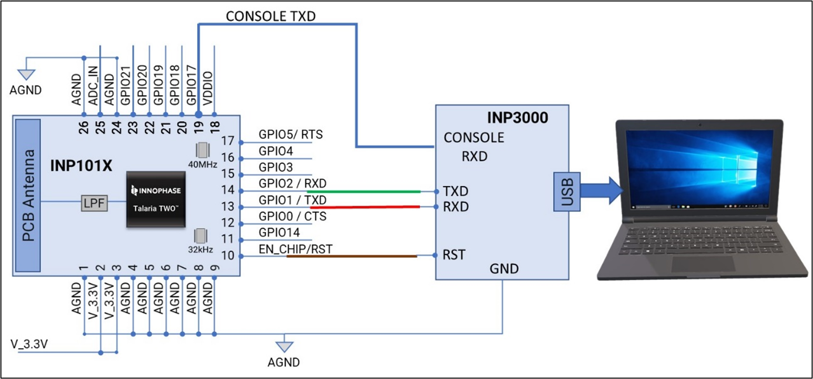

.. _pc-based programming:

PC-based Programming
####################

There are two ways in which the module can be programmed using the PC:

1. UART-based programming

2. SWD-based programming

UART-based Programming
~~~~~~~~~~~~~~~~~~~~~~

To perform UART-based programming, the module must be connected to the
PC with 6 pins listed in Table 10.

.. table:: Table 10: UART Programming PIN-OUT

   +-----------------------------------+-----------------------------------+
   | **PINS**                          | **PIN DETAILS**                   |
   +===================================+===================================+
   | 1                                 | GND                               |
   +-----------------------------------+-----------------------------------+
   | 2                                 | EN_CHIP/RST                       |
   +-----------------------------------+-----------------------------------+
   | 3                                 | TXD                               |
   +-----------------------------------+-----------------------------------+
   | 4                                 | RXD                               |
   +-----------------------------------+-----------------------------------+
   | 5                                 | GPIO17/CONSOLE                    |
   +-----------------------------------+-----------------------------------+
   | 6                                 | GND                               |
   +-----------------------------------+-----------------------------------+

The block diagram for the same is discussed in Figure 1 and the
schematics can be extracted from the evaluation board schematics listed
on the InnoPhase IoT website:
https://innophaseiot.com/wp-content/uploads/modules/INP301x-EVB-A-Schematics.pdf.

|image1|

.. rst-class:: imagefiguesclass
Figure 1: UART-based Programming

In case of a custom application board, it is recommended to use the
INP3000 programmer board to program the module. The INP3000 programmer
board comes with a Molex cable part number 151340601 (*PicoBlade
Female-to-PicoBlade Female Off-the-Shelf (OTS) Cable Assembly*).

The mating connector for the same is 532610671 Pitch 1.25mm, (*PicoBlade
PCB Header, Single Row, Right-Angle, Surface mount, Tin (Sn) Plating,
Friction Lock, 6 Circuits*).

|image2|

.. rst-class:: imagefiguesclass
Figure 2: Molex cable part number 151340601

|image3|

.. rst-class:: imagefiguesclass
Figure 3: Mating connector part number 532610671

|image4|

.. rst-class:: imagefiguesclass
Figure 4: Programming Cable PIN-OUTs J7

SWD-based Programming
~~~~~~~~~~~~~~~~~~~~~

To perform SWD-based programming, the module must be connected as shown
in Figure 5.

|image5|

.. rst-class:: imagefiguesclass
Figure 5: SWD-based programming

In case of a custom application board, it is recommended to use the
INP3000 programmer board to program the module. The INP3000 programmer
board comes with a 10 pin 1.27mm connector on board with part number
3221-10-0100-00. The mating cable part number for SWD is 1528-2009-ND
Digikey.

The connector on the INP3000 board is a 10-pin connector with the
following connector details:

.. table:: Table 11: SWD programming PIN-OUT

   +-----------------------------------+-----------------------------------+
   | **PINS**                          | **PIN DETAILS**                   |
   +===================================+===================================+
   | 1                                 | VCC (If VCC required from INP3000 |
   |                                   | board)                            |
   +-----------------------------------+-----------------------------------+
   | 2                                 | SWDIO/ GPIO19                     |
   +-----------------------------------+-----------------------------------+
   | 3                                 | GND                               |
   +-----------------------------------+-----------------------------------+
   | 4                                 | SWCLK/ GPIO18                     |
   +-----------------------------------+-----------------------------------+
   | 5                                 | GND                               |
   +-----------------------------------+-----------------------------------+
   | 6                                 | NC                                |
   +-----------------------------------+-----------------------------------+
   | 7                                 | GPIO17/CONSOLE                    |
   +-----------------------------------+-----------------------------------+
   | 8                                 | NC                                |
   +-----------------------------------+-----------------------------------+
   | 9                                 | GND                               |
   +-----------------------------------+-----------------------------------+
   | 10                                | EN_CHIP/RST                       |
   +-----------------------------------+-----------------------------------+

|image6|

.. rst-class:: imagefiguesclass
Figure 6: SWD Connector on the application board

