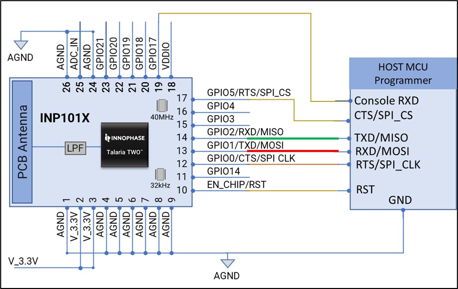
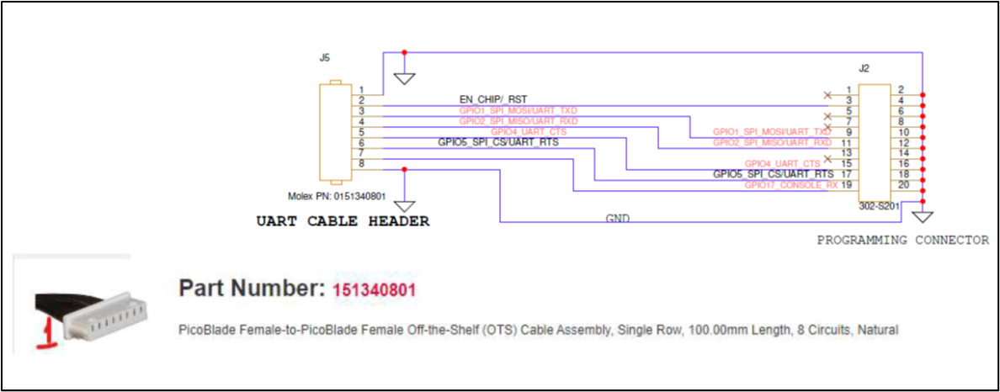
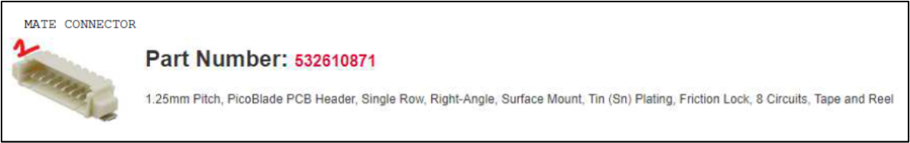

.. host-based programming:

Host-based Programming
######################

Talaria TWO module when connected to the Host microcontroller/processor
can also perform firmware upgrade. Host Interface SPI/UART block diagram
is as shown in Figure 1.

|image7|

Figure 1: Host Programming UART/SPI Slave

|image8|

Figure 2: Evaluation board connector details

The cable part number: 161340801 as shown in Figure 2 will be provided
for programming. The mating connector for the same, with part number:
532610871 is as shown in Figure 3. This connector can be used on the
factory setup application board along with the factory loader software
application to program the modules.

|image9|

Figure 3: Programming Connector

Ensure to isolate the programming header from the host communication
MCU/MPU header by adding jumper options on the application board.

