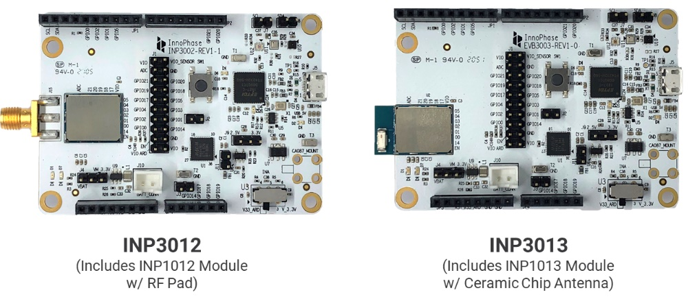
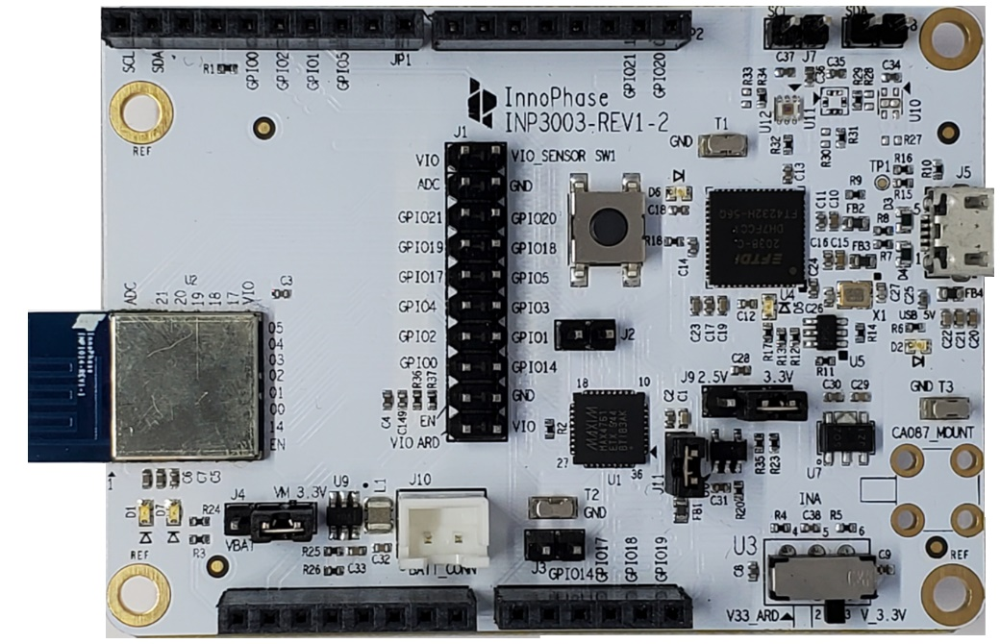

Module Placement Guidelines – INP1010/INP1013/INP1014 
======================================================

Talaria TWO family of modules should be placed at the edge of the
application PCB for better RF performance as indicated in Figure 21.
INP1010/13/14 modules have antenna on them which makes it easy for
integrating on application PCB.

In the above case, ensure that the antenna portion is outside of the
application PCB as indicated in Figure 21.

|A close-up of a circuit board Description automatically generated|

Figure 21: Antenna Keep Out Area

**Note**: No metal layer or metal blocking is allowed in the area
specified as keep out area in the figure above on all the sides of the
antenna X, Y and Z directions.

|A picture containing text, scoreboard Description automatically
generated|

Figure 22:Module placement

|A picture containing text, electronics, circuit Description
automatically generated|

Figure 23: INP1013 module with antenna portion outside application PCB

|image1|

Figure 24: INP1014 module with antenna portion outside application PCB

.. |A close-up of a circuit board Description automatically generated| image:: media/image1.png
   :width: 7.48031in
   :height: 4.46026in
.. |A picture containing text, scoreboard Description automatically generated| image:: media/image2.png
   :width: 7.48031in
   :height: 5.35622in

