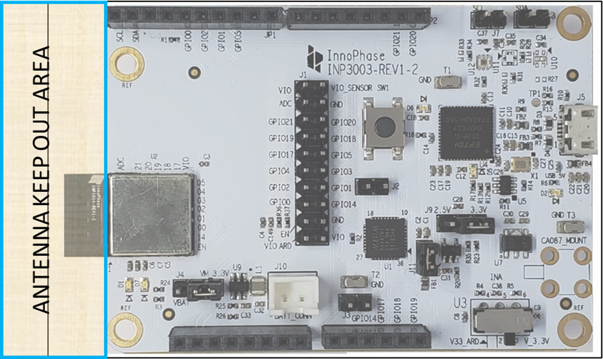
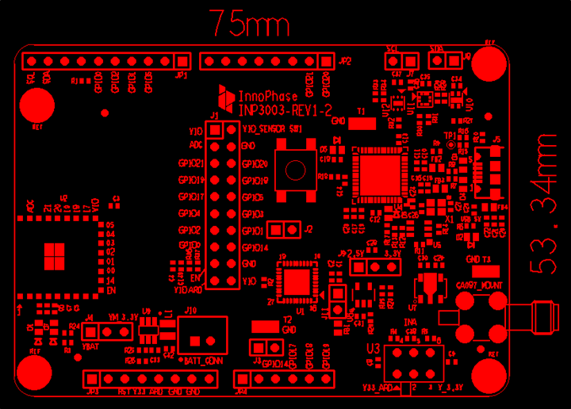
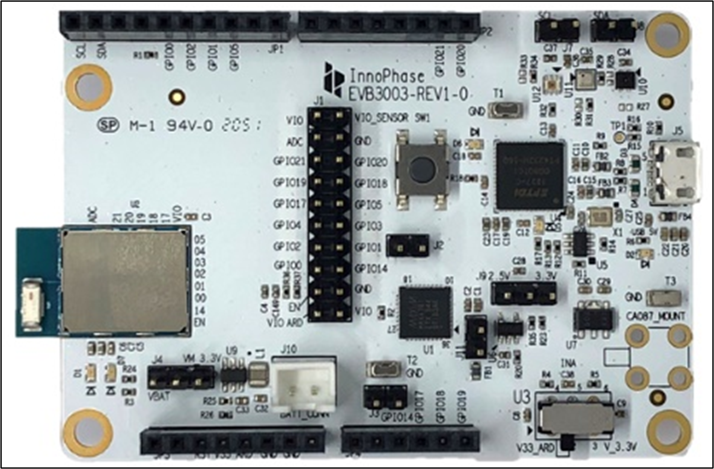
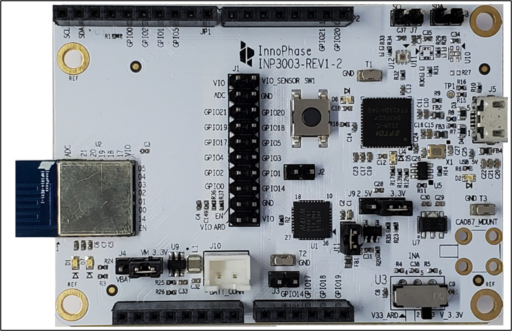

.. _module placement - 1010:

Module Placement Guidelines
--------------

**Module Placement Guidelines - INP1010/INP1013/INP1014**

Talaria TWO family of modules should be placed at the edge of the
application PCB for better RF performance as indicated in Figure 1.
INP1010/13/14 modules have antenna on them which makes it easy for
integrating on application PCB.

In the above case, ensure that the antenna portion is outside of the
application PCB as indicated in Figure 1.

|image1|

Figure 1: Antenna Keep Out Area

**Note**: No metal layer or metal blocking is allowed in the area
specified as keep out area in the figure above on all the sides of the
antenna X, Y and Z directions.

|image2|

Figure 2:Module placement

|image3|

Figure 3: INP1013 module with antenna portion outside application PCB

|image4|

Figure 4: INP1014 module with antenna portion outside application PCB

