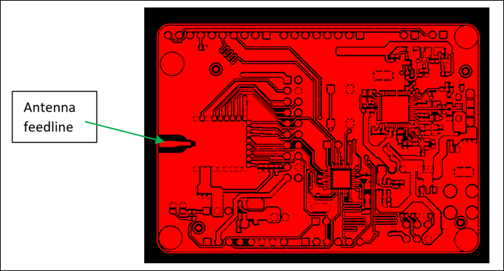
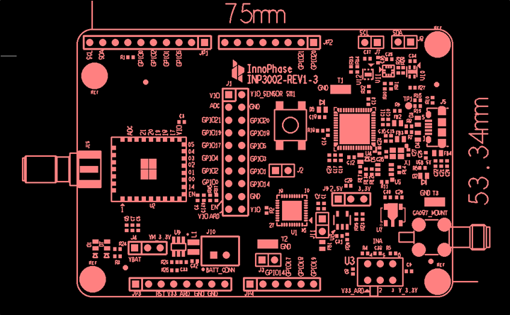

.. _module placement - 1012:

Module and Antenna Placement Guidelines – INP1012
#################################################

Talaria TWO module INP1012 does not have an antenna on the module. The
following are the guidelines to be executed to place the antenna on the
application PCB.

1. The RFIO(Ant) PIN 30 on INP1012 has a feed point for antenna
   connection.

2. Feed Line coming out of the module should be 50Ω impedance matched as
   shown in Figure 1.

3. Figure 1 indicates the connector placement for the antenna.

4. Follow the clearance area specification provided by the antenna
   manufacturer.

5. Comply to the minimum ground plan requirement provided by the antenna
   manufacturer.

6. If a connector is placed on the application PCB, ensure it is 50Ω Ohm
   impedance connector.

|image5|

.. rst-class:: imagefiguesclass
Figure 1: Antenna placement diagram

|image6|

.. rst-class:: imagefiguesclass
Figure 2: INP1012 module antenna connector placement

