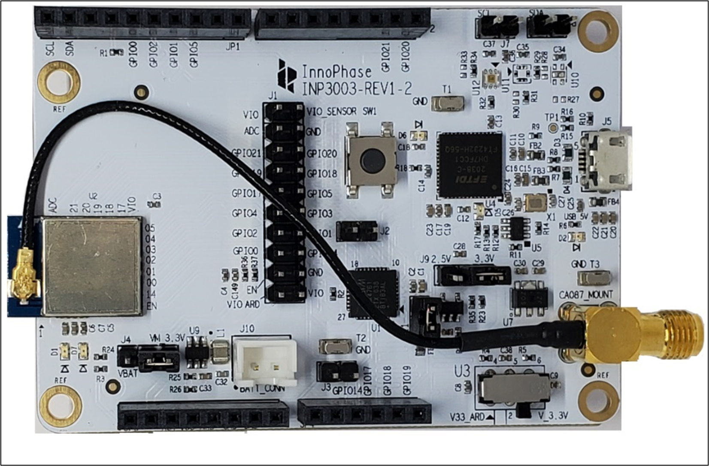
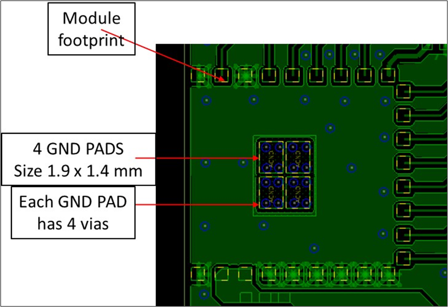

.. _module placement - 1011:

Module Placement Guidelines – INP1011/INP1015
#############################################

INP1011 and INP1015 have u.fl RF connector on the module which makes it
easy to plug-in an external antenna with a mating u.fl connector.
Antenna placement option is indicated in the evaluation board in Figure 1. In case of u.fl, select the antenna with the specifications
mentioned in the datasheet to leverage the FCC certifications.

**Note**: While choosing external antennas for modules 1011,1012 & 1015,
take precautions to follow the antenna design guidelines provided by the
antenna manufacturer while placing the antenna onto the application PCB.

|image7|

Figure 1: u.fl to SMA connector for INP1011/INP1015

Thermal Group Pad
----------------

Talaria TWO modules have thermal ground pads placed in the middle of the footprint. These modules should be grounded through four vias in each PAD. The size of each pad is 1.4mm x 1.9mm. The size of the via is 12mils. Figure 28 shows the layout and via pattern for thermal conduction.

|image8|

Figure 2: Thermal ground pads

