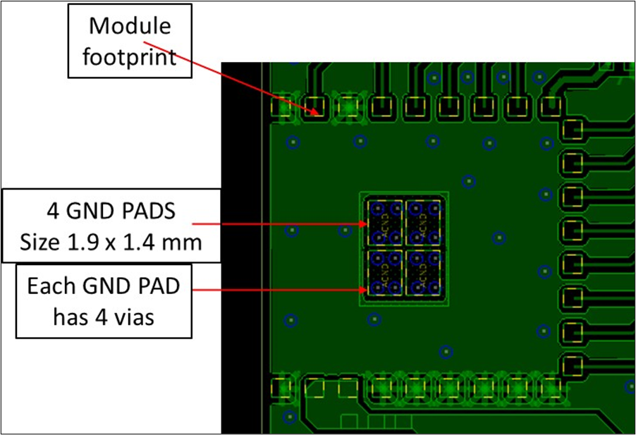

.. _thermal ground pad:

Thermal Ground Pad
##################

Talaria TWO modules have thermal ground pads placed in the middle of the
footprint. These modules should be grounded through four vias in each
PAD. The size of each pad is 1.4mm x 1.9mm. The size of the via is
12mils. Figure 30 shows the layout and via pattern for thermal
conduction.

|image17|

.. rst-class:: imagefiguesclass
Figure 1: Thermal ground pads

