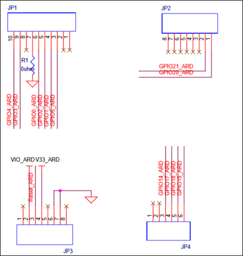

.. _inp301x:

INP301x Development Board
#########################

Jumpers on the Board
~~~~~~~~~~~~~~~~~~~~~~~~~~~~

|image1|

Figure 1: INP301x EVB-A control and connectivity points

.. table:: Table 1: Jumper Information

   +-----------+----------------------------------------------------------+
   | **Jumper**| **Mode and Operation**                                   |
   +===========+==========================================================+
   | J1        | IO header                                                |
   +-----------+----------------------------------------------------------+
   | J2        | Used to enable Console logging in shield mode            |
   +-----------+----------------------------------------------------------+
   | J3        | Connect LED D1 to GPIO14, for debug purposes             |
   +-----------+----------------------------------------------------------+
   | J4        | Select power from USB or battery connector, also used    |
   |           | for current measurements                                 |
   +-----------+----------------------------------------------------------+
   | J7        | Connect SCL to GPIO4                                     |
   +-----------+----------------------------------------------------------+
   | J8        | Connect SDA to GPIO3                                     |
   +-----------+----------------------------------------------------------+
   | J9        | Select IO voltage for FTDI IOs                           |
   +-----------+----------------------------------------------------------+
   | J10       | Battery terminal                                         |
   +-----------+----------------------------------------------------------+
   | J11       | Enable the multi-port SPDT switch                        |
   +-----------+----------------------------------------------------------+
   | JP1 to    | Arduino UNO shield compatible header (3.3V support only) |
   | JP4       |                                                          |
   +-----------+----------------------------------------------------------+
   | U3        | Switch between Stand-alone mode and Arduino Shield Mode  |
   +-----------+----------------------------------------------------------+

Power Supply and Mode Switch
~~~~~~~~~~~~~~~~~~~~~~~~~~~~

The INP301x board is designed to supply power to the INP101x module in
following ways:

1. In standalone mode, power is drawn from USB connector

2. In shield mode, power is drawn from shield connector

3. A battery header is also available to provide power to the module

|image2|

Figure 2: Power supply section

The power supply section is shown in Figure 2. The INP101x module
requires 3.3V supply. The DPDT switch (U3) selects between USB and
Arduino header supply using the common net Vm_3.3V. The jumper J4 is
used to select between battery supply and Vm_3.3V. The same jumper can
be used for measuring current consumption of the module.

IO Header (J1)
~~~~~~~~~~~~~~~~~~~~~~~~~~~~

The J1 header brings out all the IOs from INP101x module. These IOs can
be used for debug, and/or any external interfacing needs. The pinout of
this header is shown in Figure 3. To work with on board sensor, pins 1 &
2 needs to be shorted.

|image3|

Figure 3: IO Header

Shield Headers (JP1 to JP4)
~~~~~~~~~~~~~~~~~~~~~~~~~~~~

Arduino UNO compatible headers are available in the INP301x board to
interface with any compatible host micro-controller.

The GPIOs assigned to shield headers are carefully chosen to achieve
following capability:

1. INP101x’s SPI slave pins available on JP1

2. INP101x’s I2C master pins available on JP1

3. Remaining GPIOs are available on JP2 and JP4

Note that INP301x supports 2.5V IO as the default configuration. The
shield header connections are as shown in JP2 of Figure 4.

|image4|

Figure 4: Arduino UNO shield compatible jumpers

On Board Sensors
~~~~~~~~~~~~~~~~~~~~~~~~~~~~

|image5|

Figure 5: On board sensors

The INP301x board has following sensors available on board for quick
prototyping/testing:

1. Temperature/Humidity (Sensirion SHTC3)

2. Pressure (Bosch BMP388)

3. Light (TI OPT3002)

To use the sensors, J7, J8, pins 1 & 2 of J1 should be connected. This
enables power connection to the sensors on board, I2C connection on
GPIOs 3 & 4.

Functional Description
~~~~~~~~~~~~~~~~~~~~~~~~~~~~

Following are the functional modes that can be achieved in the INP301x
board:

1. Stand-alone mode (host-less)

2. Shield mode (hosted)

More details about each mode are available in subsequent sections.
Switching between the modes is handled by DPDT switch U3 for power, and
multi-port SPDT switch U1 for the GPIOs.

Stand-alone Mode
~~~~~~~~~~~~~~~~~~~~~~~~~~~~

The stand-alone mode is intended for following use cases:

1. Host-less application development on INP101x modules

2. Programing access to INP101x modules

In stand-alone mode, the U3 switch is pushed towards pin 3, which
disconnects power and IO from shield headers and connects them to FTDI.
The FTDI port layout is shown in Table 2.

.. table:: Table 2: FTDI Layout

   +-----------------------------------+-----------------------------------+
   | **FTDI Bus**                      | **Interface to Talaria TWO**      |
   +===================================+===================================+
   | A                                 | JTAG                              |
   +-----------------------------------+-----------------------------------+
   | B                                 | RESET                             |
   +-----------------------------------+-----------------------------------+
   | C                                 | UART                              |
   +-----------------------------------+-----------------------------------+
   | D                                 | CONSOLE (UART)                    |
   +-----------------------------------+-----------------------------------+

The A & B bus of FTDI device supports MPSEE protocol, hence JTAG is
assigned to A-bus. The BDBUS7 is connected EN_CHIP of the INP101x
module. The C & D bus of FTDI device used as UARTs, with C-bus connected
to peripheral UART of INP101x module and D-bus connected is CONSOLE port
(GPIO17) of INP101x module.

The JTAG on A-bus is used for debugging applications on the INP101x
module. The UART on C-bus is used for programming the INP101x module.
The CONSOLE port is a unidirectional UART from INP101x module that
operates at high baud rate of 2457600, used for debug prints.

Shield Mode
~~~~~~~~~~~~~~~~~~~~~~~~~~~~

This mode will make the EVB-A board to act as a Wi-Fi/BLE5 shield. To
enable this mode, flip the switch U3 towards V33_ARD. This also pulls up
the INA pin of the multi-port SPDT device MAX4761ETX, which then routes
the GPIOs from the INP101x module to the shield headers JP1, JP2, JP3
and JP4. In the shield mode a suitable firmware (such as Serial to Wi-Fi
application available in the SDK) should be pre-flashed in the INP101x.

EVB-A as Wi-Fi Shield with STM32 Nucleo Board
~~~~~~~~~~~~~~~~~~~~~~~~~~~~~~~~~~~~~~~~~~~~~

A comprehensive set of host application packages are available to
download via the InnoPhase website to demonstrate the use of EVB-A as a
Wi-Fi/BLE5 shield board.

Mount the Talaria TWO EVB on the STM32 board on Arduino connector.
Connect GPIO4 of Talaria TWO (J1 Connector) to Pin2 of CN6 connector.
Talaria TWO uses this GPIO4 pin to interrupt ST when Talaria TWO wants
to send data/notification to ST.

|image6|

Figure 6: INP3010 EVB-A as Wi-Fi Shield

Antenna
~~~~~~~~~~~~~~~~~~~~~~~~~~~~

The antennas integrated with INP2045 are listed in Table 3 have been
approved for FCC/ISED, EU(RED) and TELEC.

.. table:: Table 3: Module ID with Antenna details

   +--------+----------------+---------------+-------------+-------------+
   | **     | **Antenna      | **Model       | **Antenna   | **Max Peak  |
   | Module | Type**         | Number**      | Man         | Antenna     |
   | ID**   |                |               | ufacturer** | Gain        |
   |        |                |               |             | (dBi)**     |
   +========+================+===============+=============+=============+
   | I      | PCB Antenna    | INP1010 PCB   | InnoPhase   | 0.9         |
   | NP1010 |                | TRACE         |             |             |
   +--------+----------------+---------------+-------------+-------------+
   | I      | SMA Antenna    | W24-ASMA-M    | Inventek    | 2.15        |
   | NP1011 | (External      |               |             |             |
   |        | Antenna)       |               |             |             |
   +--------+----------------+---------------+-------------+-------------+
   | I      | SMA Antenna    | W24-ASMA-M    | Inventek    | 2.15        |
   | NP1012 | (External      |               |             |             |
   |        | Antenna)       |               |             |             |
   +--------+----------------+---------------+-------------+-------------+
   | I      | SMD Chip       | 2450AT42B100  | Johanson    | 0           |
   | NP1013 | Antenna        |               |             |             |
   +--------+----------------+---------------+-------------+-------------+
   | I      | PCB Antenna    | 1014 PCB      | InnoPhase   | 5.33        |
   | NP1014 |                | Trace         |             |             |
   +--------+----------------+---------------+-------------+-------------+
   | I      | SMA Antenna    | W24-ASMA-M    | Inventek    | 2.15        |
   | NP1015 | (External      |               |             |             |
   |        | Antenna)       |               |             |             |
   +--------+----------------+---------------+-------------+-------------+

INP1010
~~~~~~~~~~~~~~~~~~~~~~~~~~~~

Talaria TWO INP1010 module has a proprietary integrated/printed antenna.
It is a Double-sided Inverted F (IFA) antenna and has been implemented
as printed PCB elements.

By design and verification, Antenna does not require any additional
matching component if the module is used as standalone product. This
INP1010 PCB antenna integrated with INP2045 has been approved for
FCC/ISED, EU(RED) and TELEC.

.. table:: Table 4: INP1010 - Antenna specifications

   +----------+------------+----------------+-----------------------------+
   | **Module | **Antenna  | **Model        | **Max Peak Antenna Gain     |
   | ID**     | Type**     | Number**       | (dBi)**                     |
   +==========+============+================+=============================+
   | INP1010  | PCB        | INP1010 PCB    | 0.9                         |
   |          | Antenna    | TRACE          |                             |
   +----------+------------+----------------+-----------------------------+

INP1011/INP1012/INP1015
~~~~~~~~~~~~~~~~~~~~~~~~~~~~

Talaria TWO INP1011/INP1012/INP1015 module has been certified with
External SMA antenna W24-ASMA-M which has been approved for FCC/ISED,
EU(RED) and TELEC.

.. table:: Table 5: INP1011/012/015 - Antenna specifications

   +-----------+----------------+-----------+----------------------------+
   | **Module  | **Antenna      | **Model   | **Max Peak Antenna Gain    |
   | ID**      | Type**         | Number**  | (dBi)**                    |
   +===========+================+===========+============================+
   | INP101    | SMA Antenna    | W         | 2.15                       |
   | 1/012/015 | (External      | 24-ASMA-M |                            |
   |           | Antenna)       |           |                            |
   +-----------+----------------+-----------+----------------------------+

INP1013
~~~~~~~~~~~~~~~~~~~~~~~~~~~~

Talaria TWO INP1013 module has been certified with SMD chip antenna
2450AT42B100 which has been approved for FCC/ISED and TELEC.

.. table:: Table 6: INP1013 - Antenna specifications

   +-----------+----------------+-----------+----------------------------+
   | **Module  | **Antenna      | **Model   | **Max Peak Antenna Gain    |
   | ID**      | Type**         | Number**  | (dBi)**                    |
   +===========+================+===========+============================+
   | INP1013   | SMD chip       | 245       | 0                          |
   |           | antenna        | 0AT42B100 |                            |
   +-----------+----------------+-----------+----------------------------+

INP1014
~~~~~~~~~~~~~~~~~~~~~~~~~~~~

Talaria TWO INP1014 module has a proprietary integrated/printed PCB
antenna. By design and verification, antenna does not require any
additional matching components if the module is used as a stand-alone
product. INP1014 PCB antenna integrated with INP2045 has been approved
for FCC/ISED and TELEC.

.. table:: Table 7: INP1014 Antenna specifications

   +-----------+----------------+-----------+----------------------------+
   | **Module  | **Antenna      | **Model   | **Max Peak Antenna Gain    |
   | ID**      | Type**         | Number**  | (dBi)**                    |
   +===========+================+===========+============================+
   | INP1014   | PCB Antenna    | 1014 PCB  | 5.33                       |
   |           |                | Trace     |                            |
   +-----------+----------------+-----------+----------------------------+

