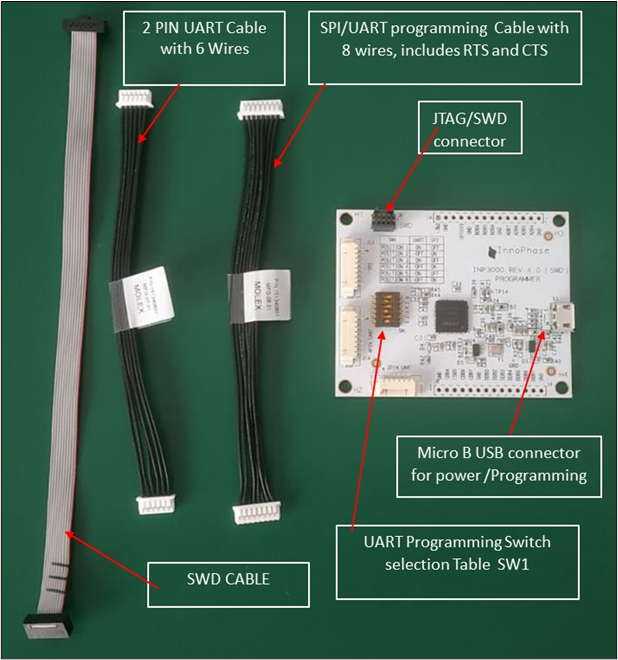
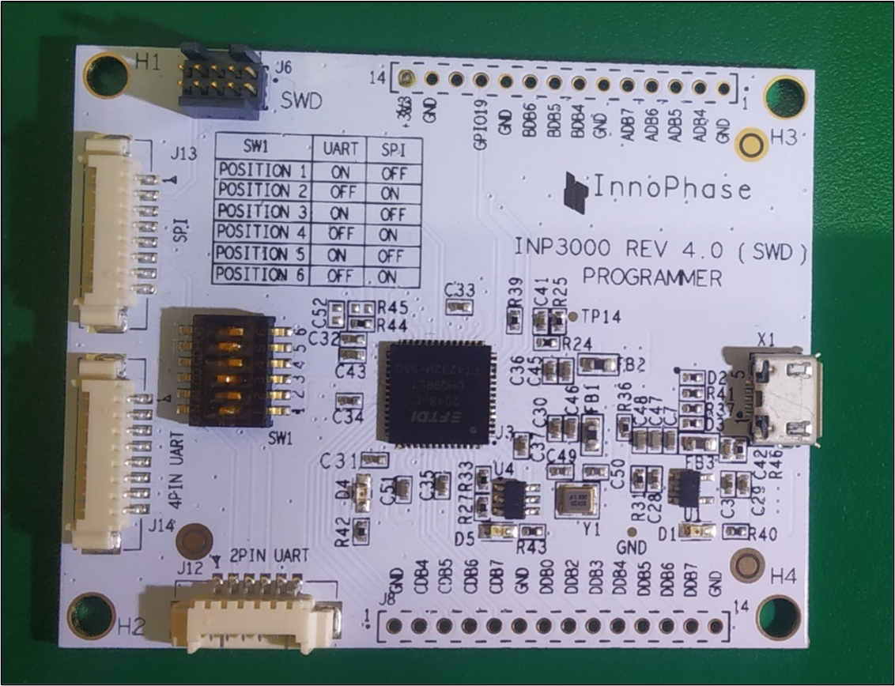

.. _inp3000 prog board 4.0:

INP3000 Programmer Board
========================

VERSION 4.0
-----------

|image1|

Figure 1: INP3000 programmer kit contents - version 4.0

|image2d|

Figure 2: INP3000 programmer board – version 4.0

J6 SWD Connector Pin-out:

.. table:: Table 1: J6 SWD Connector Pin-out

   +--------------------------+--------+-----------+---------------------+
   | **Description**          |**PIN** | **PIN**   | **Description**     |
   +==========================+========+===========+=====================+
   | +3V3                     | 1      | 2         | SWDIO               |
   +--------------------------+--------+-----------+---------------------+
   | GND                      | 3      | 4         | SWCLK               |
   +--------------------------+--------+-----------+---------------------+
   | GND                      | 5      | 6         | NC                  |
   +--------------------------+--------+-----------+---------------------+
   | GPIO17_CONSOLE_RX        | 7      | 8         | NC                  |
   +--------------------------+--------+-----------+---------------------+
   | GND                      | 9      | 10        | EN_CHIP/\_RST       |
   +--------------------------+--------+-----------+---------------------+

The INP3000 version 4.0 board supports only SWD programming and does not
support JTAG programming. JTAG is supported in versions 3.0 and lower.
All the other connectors are same as version 3.0 board.

