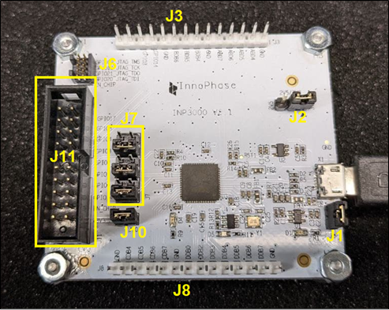
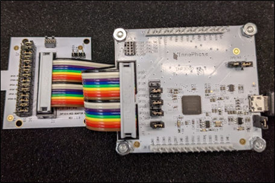
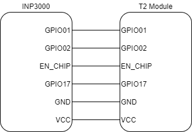
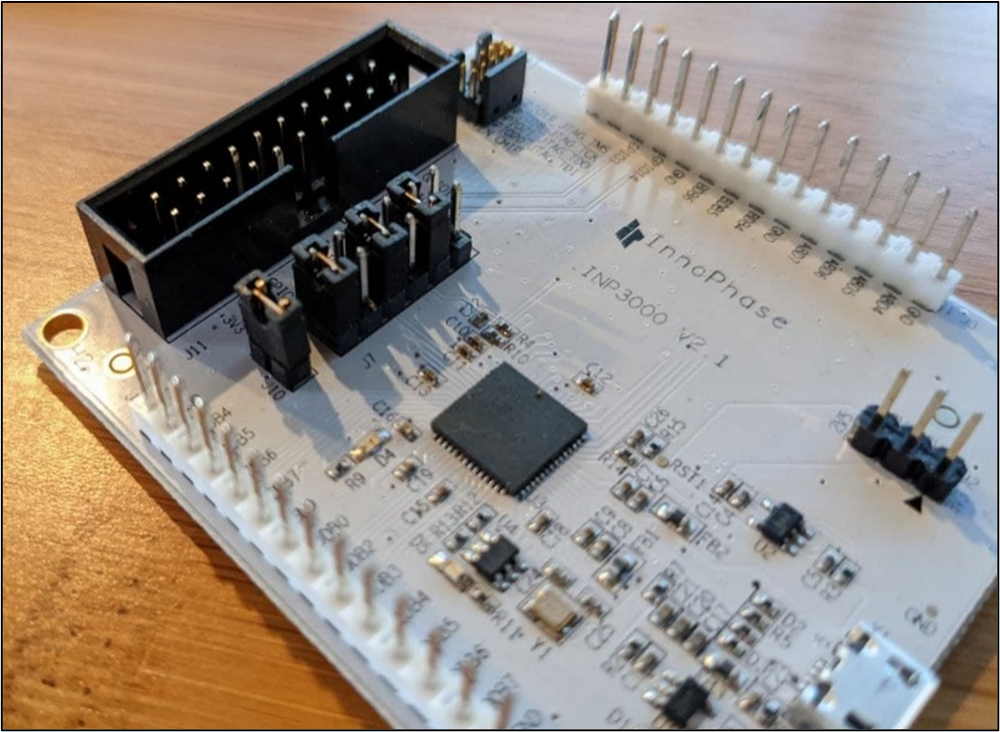
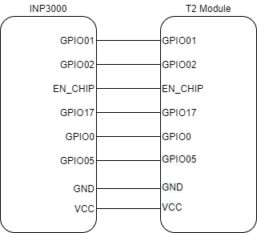
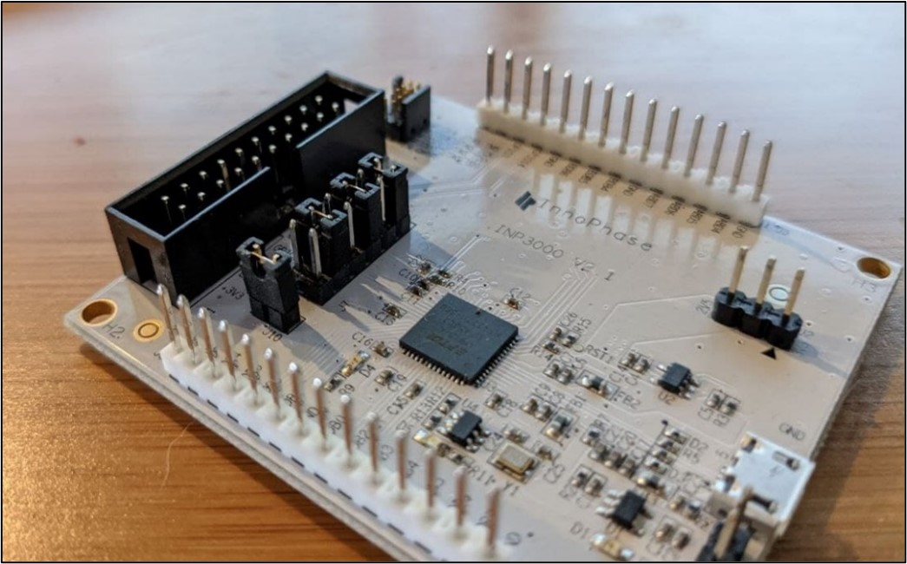

.. _inp3000 prog board 2.1:

INP3000 Programmer Board 2.1
========================

VERSION 2.1
-----------

|image6|

.. rst-class:: imagefiguesclass
Figure 1: INP3000 programmer board – version 2.1

Table 1 provides the description of each jumper:

.. table:: Table 1: INP3000 jumpers with description

   +-------------------+--------------------------------------------------+
   | **Jumper**        | **Description**                                  |
   +===================+==================================================+
   | J1                | Enable 3.3V supply                               |
   +-------------------+--------------------------------------------------+
   | J2                | Select between 2.5V and 3.3V                     |
   +-------------------+--------------------------------------------------+
   | J3                | GPIO headers                                     |
   +-------------------+--------------------------------------------------+
   | J6                | JTAG header                                      |
   +-------------------+--------------------------------------------------+
   | J7                | UART/SPI programming interface selector          |
   +-------------------+--------------------------------------------------+
   | J8                | GPIO headers                                     |
   +-------------------+--------------------------------------------------+
   | J10               | Enable 3.3V on programming header                |
   +-------------------+--------------------------------------------------+
   | J11               | Programming header                               |
   +-------------------+--------------------------------------------------+

When programming a Talaria TWO module on an INP1014, they can be
connected using a 20-pin ribbon cable as shown in Figure 2.

|image7|

.. rst-class:: imagefiguesclass
Figure 2: INP3000 programmer board with Talaria TWO module

Connecting via UART interface
~~~~~~~~~~~~~~~~~~~~~~~~~~~~~

|image8|

.. rst-class:: imagefiguesclass
Figure 3: UART connection diagram

Figure 3 is the connection diagram showing the connection of INP3000
programmer board to a Talaria TWO module via UART. Table 2 provides the
description of each connection:

.. table:: Table 2: UART Connection & Description

   +------------------------+---------------------------------------------+
   | **Connection**         | **Description**                             |
   +========================+=============================================+
   | GPIO01                 | UART TX                                     |
   +------------------------+---------------------------------------------+
   | GPIO02                 | UART RX                                     |
   +------------------------+---------------------------------------------+
   | EN_CHIP                | Used for resetting the Talaria TWO module   |
   +------------------------+---------------------------------------------+
   | GPIO17                 | Talaria TWO console debug output (default   |
   |                        | baud is 2457600)                            |
   +------------------------+---------------------------------------------+

To use UART, ensure that the J7 jumpers are configured as shown in
Figure 3.

|image9|

.. rst-class:: imagefiguesclass
Figure 4: INP3000 programmer board version 2.1 - UART jumper setting

Once connected as shown in Figure 3 and Figure 4, Talaria TWO module can
be programmed via the factory loader script or the Talaria TWO download
tool.

Connecting via SPI interface
~~~~~~~~~~~~~~~~~~~~~~~~~~~~

|image10|

.. rst-class:: imagefiguesclass
Figure 5: SPI connection diagram

Figure 5 is the connection diagram showing the connection of INP3000
programmer board to a Talaria TWO module via SPI. Table 3 provides the
description for each connection:

.. table:: Table 3: SPI Connection & Description

   +--------------------+-------------------------------------------------+
   | **Connection**     | **Description**                                 |
   +====================+=================================================+
   | GPIO01             | MOSI                                            |
   +--------------------+-------------------------------------------------+
   | GPIO02             | MISO                                            |
   +--------------------+-------------------------------------------------+
   | GPIO00             | SCLK                                            |
   +--------------------+-------------------------------------------------+
   | GPIO05             | CS                                              |
   +--------------------+-------------------------------------------------+
   | EN_CHIP            | Used for resetting Talaria TWO module           |
   +--------------------+-------------------------------------------------+
   | GPIO17             | Talaria TWO console debug output (default baud  |
   |                    | is 2457600)                                     |
   +--------------------+-------------------------------------------------+

To use SPI, ensure that the J7 jumpers are as shown in Figure 6.

|image11|

.. rst-class:: imagefiguesclass
Figure 6: INP3000 programmer board version 2.1 - SPI jumper setting

