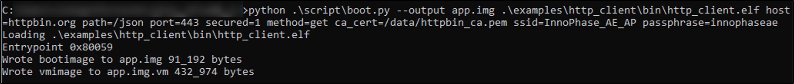
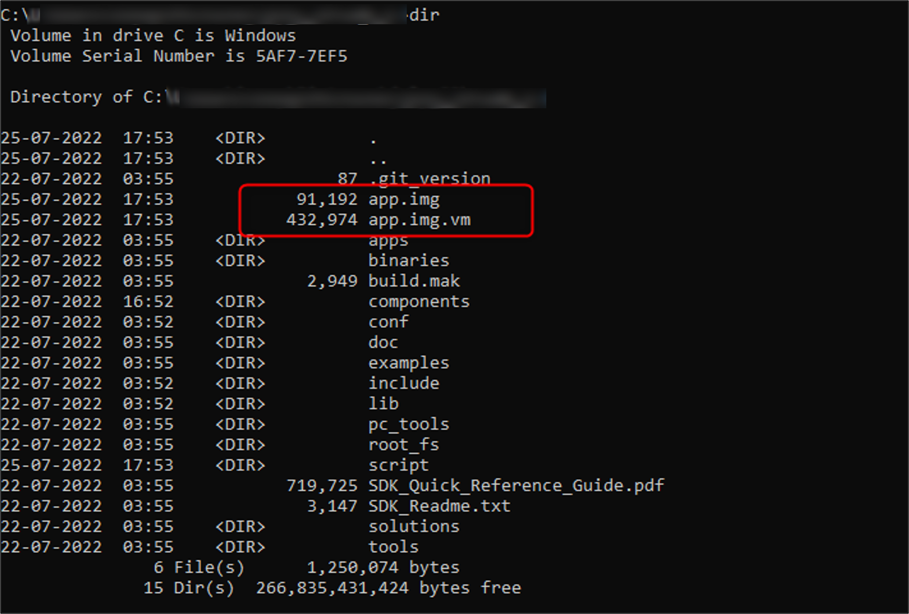
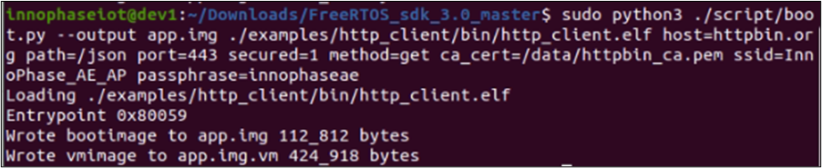
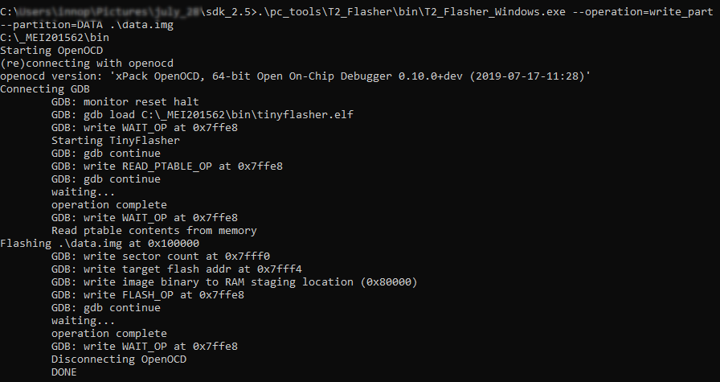

.. _generating app image:

Generating the Application Image 
---------------------------------

This section describes generating an application image (.img) and its
virtual image (.img.vm) using the ELF.

In Windows 
~~~~~~~~~~~~~~~~~~~~~~~~

An application image and its virtual image must be generated over
command line for programming the application over JTAG/SWD. From the SDK
directory, execute the following steps to generate the application
image:

.. code:: shell

    python .\script\boot.py  --output app.img  <path to the generated elf> <boot argument 1> <boot argument 2>

For Example:

.. code:: shell

     python .\script\boot.py --output app.img .\examples\http_client\bin\http_client.elf host=httpbin.org path=/json port=443 secured=1 method=get 
     ca_cert=/data/httpbin_ca.pem ssid=InnoPhase_AE_AP passphrase=innophaseae

This command generates the app.img and app.img.vm in the current
directory.

|image1|

.. rst-class:: imagefiguesclass
Figure 1: Generating the application image – Windows

|image2|

.. rst-class:: imagefiguesclass
Figure 2: Application image and its VM image – Windows

In Linux
~~~~~~~~~~~~~~~~~~~~~~~~

To generate the application image in Linux, execute the following
command from the FreeRTOS SDK directory

.. code:: shell

    sudo python3 ./script/boot.py --output <application image name> <path of the application>

For example:

.. code:: shell

     sudo python3 ./script/boot.py --output app.img ./examples/http_client/bin/http_client.elf host=httpbin.org path=/json port=443 secured=1 method=get 
     ca_cert=/data/httpbin_ca.pem ssid=InnoPhase_AE_AP passphrase=innophaseae

This command generates the app.img and app.img.vm in the current
directory.

|image3|

.. rst-class:: imagefiguesclass
Figure 3: Generating the application image – Linux

|image4|

.. rst-class:: imagefiguesclass
Figure 4: Application image and its VM image – Linux

