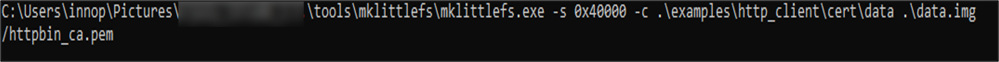
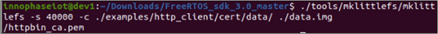

.. _generating data fs image:

Generating the Data FS Image
----------------------------
Data image is a user file system which is a .img format. Data FS
contains user defined configurations or application specific
information, such as network configuration file, certificates, user data
and so on. This image should be written over DATA partition which starts
from sector 256. The data partition has a total of 240 sectors to write
user data files.

This section describes generating the data image with certificates.

In Windows
~~~~~~~~~~~~~~~~~~~~~~~~

This section describes generating the file system image and loading it
onto the Talaria TWO module file system.

In this example, the data FS is generated using certificates. The
certificate is used to authenticate the server for HTTP/MQTT connection.

Copy the required files or certificates to the directory data, and
execute the following instruction which generates an image file which
needs to be flashed to Talaria TWO:

For generating data.img in Windows, execute the following command from
the FreeRTOS SDK directory:

.. code:: shell

      .\tools\mklittlefs\mklittlefs -s 40000 -c < path to the data folder which needs to be updated > .\< path to store the generated data.img>\data.img

**Note:** For example, the http_client application needs a certificate
to connect to the server. Copy the files to the data directory and
execute this instruction to create a data.img:

.. code:: shell

    .\tools\mklittlefs\mklittlefs.exe -s 0x40000 -c .\examples\http_client\cert\data .\data.img

This command generates data.img in the current directory.

|image5|

.. rst-class:: imagefiguesclass
Figure 1: Generating the data image - Windows

|image6|

.. rst-class:: imagefiguesclass
Figure 2: Generated data image – Windows

In Linux
~~~~~~~~~~~~~~~~~~~~~~~~

For generating data.img in Linux, execute the following command from the
FreeRTOS SDK directory:

.. code:: shell

     ./tools/mklittlefs/mklittlefs -s 40000 -c < path to the data folder which needs to be updated > < path to store the generated data.img>

**Note:** For example, the http_client application needs a certificate
to connect to the server. Copy the files to the data directory and
execute this instruction to create a data.img:

.. code:: shell

     ./tools/mklittlefs/mklittlefs -s 40000 -c ./examples/http_client/cert/data/ ./data.img /httpbin_ca.pem

This command generates data.img in the current directory.

|image7|

.. rst-class:: imagefiguesclass
Figure 3: Generating the data image - Linux

|image8|

.. rst-class:: imagefiguesclass
Figure 4: Generated data image -Linux

.. |image6| image:: media/image6.png
   :width: 8in

