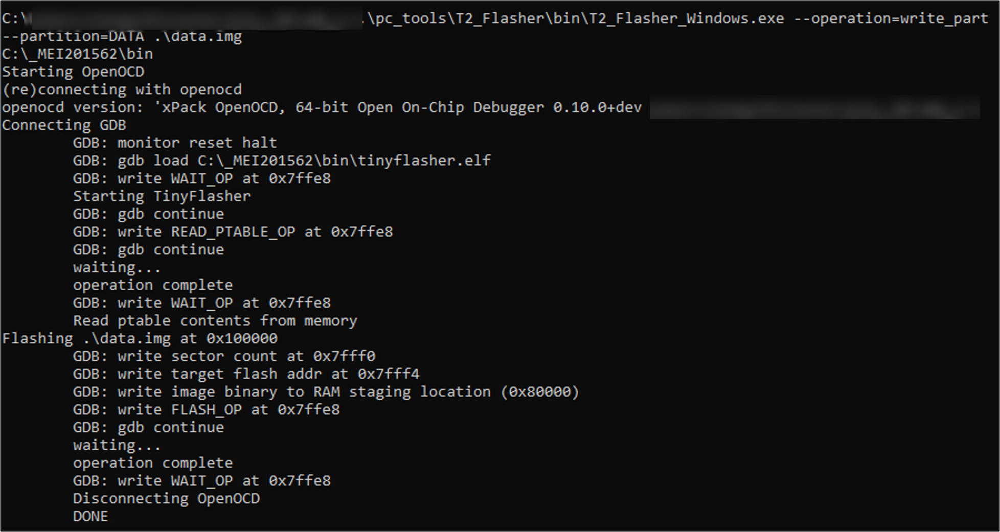

.. _programming over swd:

Programming Talaria TWO over SWD
---------------------------------
The INP3000 Programmer board version 4.0 has the SWD interface to
program Talaria TWO modules.

Install the appropriate dependencies for programming over JTAG.

In Windows
~~~~~~~~~~~~~~~

1. Open command prompt and reset the device in a boot loader mode by
   executing the following command from the FreeRTOS SDK directory:

.. code:: shell

      .\script\reset.py evk42_bl

|image10|

Figure 1: SWD- Resetting the device in boot loader mode- Console output
(Windows)

2. In the same terminal start OpenOCD by executing the following command
   from the FreeRTOS SDK directory:

.. code:: shell

      openocd -s .\conf -f ftdi_swd.cfg -f t2_swd.cfg

The following output is observed on the command prompt console:

|image11|

Figure 2: SWD - Starting OpenOCD – console output – Windows

3. In a separate command prompt window, execute the following command
   from the FreeRTOS SDK directory:

.. code:: shell

     .\pc_tools\T2_Flasher\bin\T2_Flasher_Windows.exe --operation=write_ptable   .\<path to the standard_part_table.json file available in 
     freertos_sdk_x.y/tools/partition_files directory>

The following output is observed after flashing the default partition
table:

|image12|

Figure 3: SWD - Flashing the default partition table – console output

4. In the same terminal, execute the following command from the FreeRTOS SDK
   directory to flash the data image (data.img).

**Note**: This step is needed only if the application uses any
certificates.

.. code:: shell

      .\pc_tools\T2_Flasher\bin\T2_Flasher_Windows.exe --operation=write_part --partition=DATA .\<path to the generated data image>\data.img 

The following output is observed after flashing the data image:

|image13|

Figure 4: SWD - Flashing the data image - console output

a. To generate the application image, refer section: *In Windows*. In
   the same terminal, execute the following command from the FreeRTOS SDK
   directory to flash the application image:

.. code:: shell

     .\pc_tools\T2_Flasher\bin\T2_Flasher_Windows.exe --operation=write_part --partition=BOOT .\<path to the generated application image>\app.img

   The following output is observed after flashing the application
   image:

   |image14|

Figure 5: SWD - Flashing the application image - console output

b. In the same terminal, flash the VM image of the application by
   executing the following command:

.. code:: shell

     .\pc_tools\T2_Flasher\bin\T2_Flasher_Windows.exe --operation=write_part --partition=VIRT .\<path to the generated application image.vm>\app.img.vm

   The following output is observed after flashing the application’s VM
   image:

   |image15|

Figure 6: SWD - Flashing application's VM image - console output

   The application is successfully flashed over SWD. Now, OpenOCD needs
   to be terminated before debugging using Eclipse. Close all the
   command prompt windows to terminate OpenOCD.

5. On INP3000 version 4.0, the console output can be seen using the
   Download Tool by clicking the reset button.

|image16|

Figure 7: INP3000 version 4.0 - Download tool console output – Windows

In Linux
~~~~~~~~~~~~~

1. Open command prompt and reset the device in boot loader mode by
   executing the following command from the FreeRTOS SDK directory:

.. code:: shell

     ./script/reset.py evk42_bl

|image17|

Figure 8: SWD - Resetting the device in boot loader mode- console
output (Windows)

2. Open the command prompt and start OpenOCD by executing the following
   command from the FreeRTOS SDK directory:

.. code:: shell

     openocd -s ./conf -f ftdi_swd.cfg -f t2_swd.cfg

The following output is seen on command prompt console:

|image18|

Figure 9: SWD - Starting OpenOCD – console output

3. Flash the default partition table by executing the following command:

.. code:: shell

      ./pc_tools/T2_Flasher/bin/T2_Flasher_Linux --operation=write_ptable   .\<path to the standard_part_table.json file available in 
      freertos_sdk_x.y/tools/partition_files directory>

Following output is observed after flashing the default partition table:

|image19|

Figure 10: SWD - Flashing the default partition table – console output

4. In the same terminal, execute the following command from the FreeRTOS SDK
   directory to flash the data image (data.img).

**Note**: This step is needed only if the application uses any
certificates.

.. code:: shell

      ./pc_tools/T2_Flasher/bin/T2_Flasher_Linux --operation=write_part --partition=DATA ./<path to the generated data image>/data.img

The following output is observed after flashing the data image:

|image20|

Figure 11: SWD - Flashing the data image - console output

5. In a separate command prompt window, execute the following command
   from the FreeRTOS SDK directory to flash the application image:

.. code:: shell

     ./pc_tools/T2_Flasher/bin/T2_Flasher_Linux --operation=write_part --partition=BOOT ./<path to the generated application image>/app.img

Following output is observed after flashing the application image:

|image21|

   Figure 12: SWD - Flashing the application image - console output

6. In the same terminal, flash the VM image of the application by
   executing the following command:

.. code:: shell

      ./pc_tools/T2_Flasher/bin/T2_Flasher_Linux –operation=write_part –partition=VIRT ./<path to the generated application image.vm>./app.img.vm

Following output is observed after flashing the application’s VM image:

|image22|

Figure 13: SWD - Flashing application's VM image – console output

The application is successfully flashed over SWD. Now, OpenOCD needs to
be terminated before debugging using Eclipse. Close all the command
prompt windows to terminate OpenOCD.

7. On INP3000 version 4.0, the console output can be seen using the
   Download Tool by clicking on a reset button.

.. |image16| image:: media/image16.png
   :width: 5.51181in
   :height: 7.43752in

