.. _programming over jtag:

Programming Talaria TWO over JTAG
----------------------------------

The INP3000 Programmer Board version 3.0 has the JTAG interface to
program Talaria TWO modules.

Install the appropriate dependencies for programming over JTAG.

In Windows
~~~~~~~~~~~~~~~~~~~~

1. Open command prompt and reset the device in boot loader mode by
   executing the following command from the FreeRTOS SDK directory:

.. code:: shell

     .\script\reset.py evk42_bl

|image23|

.. rst-class:: imagefiguesclass
Figure 1: JTAG - Resetting the device in boot loader mode- console
output (Windows)

2. Open the command prompt and start OpenOCD by executing the following
   command from the FreeRTOS SDK directory:

.. code:: shell

     openocd -s .\conf -f ftdi.cfg -f t2.cfg

The following output is seen on command prompt console:

|image24|

.. rst-class:: imagefiguesclass
Figure 2: JTAG - Starting OpenOCD – console output

3. Flash the default partition table by executing the following command:

.. code:: shell

     .\pc_tools\T2_Flasher\bin\T2_Flasher_Windows.exe --operation=write_ptable   .\<path to the standard_part_table.json file available in 
      freertos_sdk_x.y/tools/partition_files directory>

Following output is observed after flashing the default partition table:

|image25|

.. rst-class:: imagefiguesclass
Figure 3: JTAG - Flashing the default partition table – console output

4. In the same terminal, execute the following command from the FreeRTOS SDK
   directory to flash the data image (data.img).

**Note**: This step is needed only if the application uses any
certificates.

.. code:: shell

      .\pc_tools\T2_Flasher\bin\T2_Flasher_Windows.exe --operation=write_part --partition=DATA .\<path to the generated data image>\data.img

The following output is observed after flashing the data image:

|image26|

.. rst-class:: imagefiguesclass
Figure 4: JTAG - Flashing the data image - console output

5. In a separate command prompt window, execute the following command
   from the FreeRTOS SDK directory to flash the application image:

.. code:: shell

      .\pc_tools\T2_Flasher\bin\T2_Flasher_Windows.exe --operation=write_part --partition=BOOT .\<path to the generated application image>\app.img

The following output is observed after flashing the application image:

|image27|

.. rst-class:: imagefiguesclass
Figure 5: JTAG - Flashing the application image - console output

6. In the same terminal, flash the VM image of the application by
   executing the following command:

.. code:: shell

     .\pc_tools\T2_Flasher\bin\T2_Flasher_Windows.exe --operation=write_part --partition=VIRT .\<path to the generated application image.vm>

Following output is observed after flashing the application’s VM image:

|image28|

.. rst-class:: imagefiguesclass
Figure 6: JTAG - Flashing application's VM image – console output

The application is successfully flashed over JTAG. Now, OpenOCD needs to
be terminated before debugging using Eclipse. Close all the command
prompt windows to terminate OpenOCD.

In Linux
~~~~~~~~~~~~~~~~~~~~

1. Open command prompt and reset the device in boot loader mode by
   executing the following command from the FreeRTOS SDK directory:

.. code:: shell

    ./script/reset.py evk42_bl

|image29|

.. rst-class:: imagefiguesclass
Figure 7: JTAG - Resetting the device in boot loader mode- console
output (Windows)

2. Open command prompt and start OpenOCD by executing the following
   command from the FreeRTOS SDK directory:

.. code:: shell

    openocd -s ./conf -f ftdi.cfg -f t2.cfg

The following output is seen on command prompt console:

|image30|

.. rst-class:: imagefiguesclass
Figure 8: JTAG - Starting OpenOCD – console output

3. Flash the default partition table by executing the following command:

.. code:: shell

     .\pc_tools\T2_Flasher\bin\T2_Flasher_Linux --operation=write_ptable   .\<path to the standard_part_table.json file available in 
     freertos_sdk_x.y/tools/partition_files directory>

Following output is observed after flashing the default partition table:

|image31|

.. rst-class:: imagefiguesclass
Figure 9: JTAG - Flashing the default partition table – console output

4. In the same terminal, execute the following command from the FreeRTOS SDK
   directory to flash the data image (data.img).

**Note**: This step is needed only if the application uses any
certificates.

.. code:: shell

     .\pc_tools\T2_Flasher\bin\T2_Flasher_Linux --operation=write_part --partition=DATA .\<path to the generated data image>\data.img

The following output is observed after flashing the data image:

|image32|

.. rst-class:: imagefiguesclass
Figure 10: JTAG - Flashing the data image - console output

5. In a separate command prompt window, execute the following command
   from the FreeRTOS SDK directory to flash the application image:

.. code:: shell

      .\pc_tools\T2_Flasher\bin\T2_Flasher_Linux --operation=write_part --partition=BOOT .\<path to the generated application image>\app.img

The following output is observed after flashing the application image:

|image33|

.. rst-class:: imagefiguesclass
Figure 11: JTAG - Flashing the application image - console output

6. In the same terminal, flash the VM image of the application by
   executing the following command:

.. code:: shell

     .\pc_tools\T2_Flasher\bin\T2_Flasher_Linux –operation=write_part –partition=VIRT .\<path to the generated application image.vm>\app.img.vm

Following output is observed after flashing the application’s VM image:

|image34|

.. rst-class:: imagefiguesclass
Figure 12: JTAG - Flashing application's VM image – console output

The application is successfully flashed over JTAG. Now, OpenOCD needs to
be terminated before debugging using Eclipse. Close all the command
prompt windows to terminate OpenOCD.

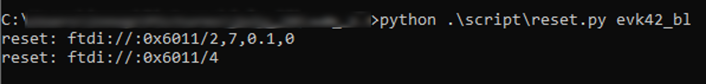
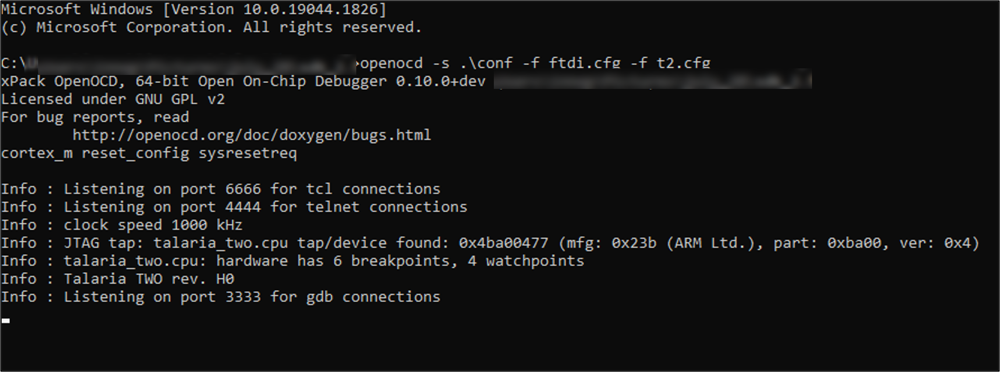
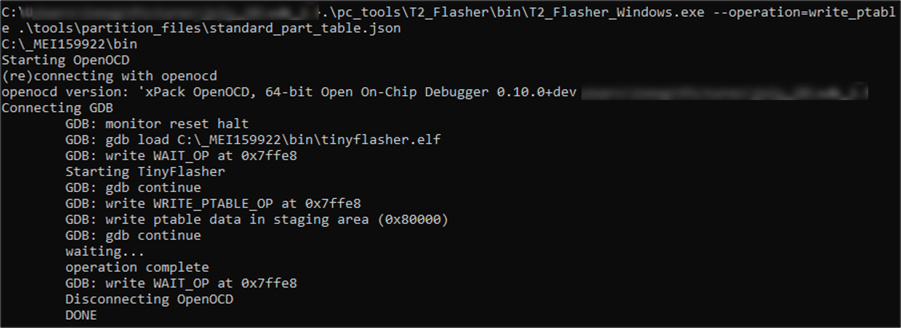
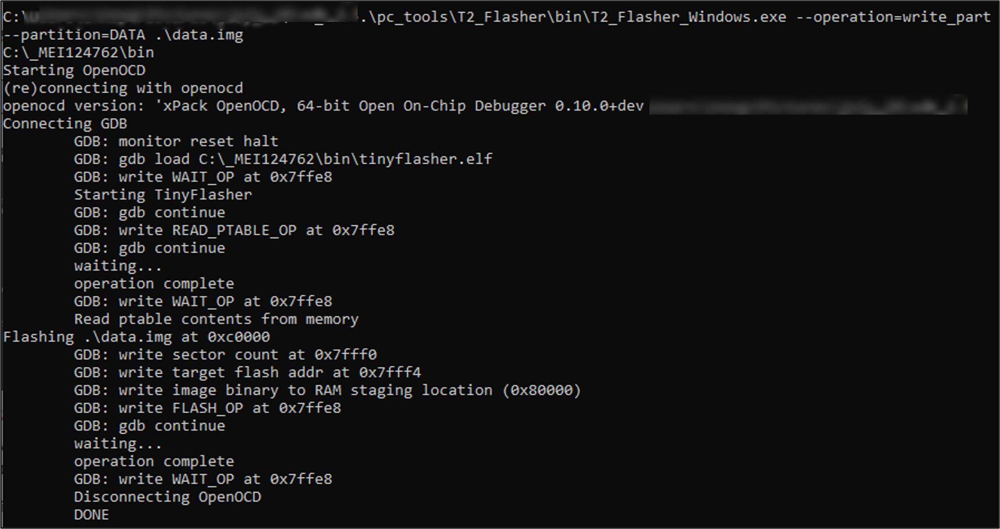
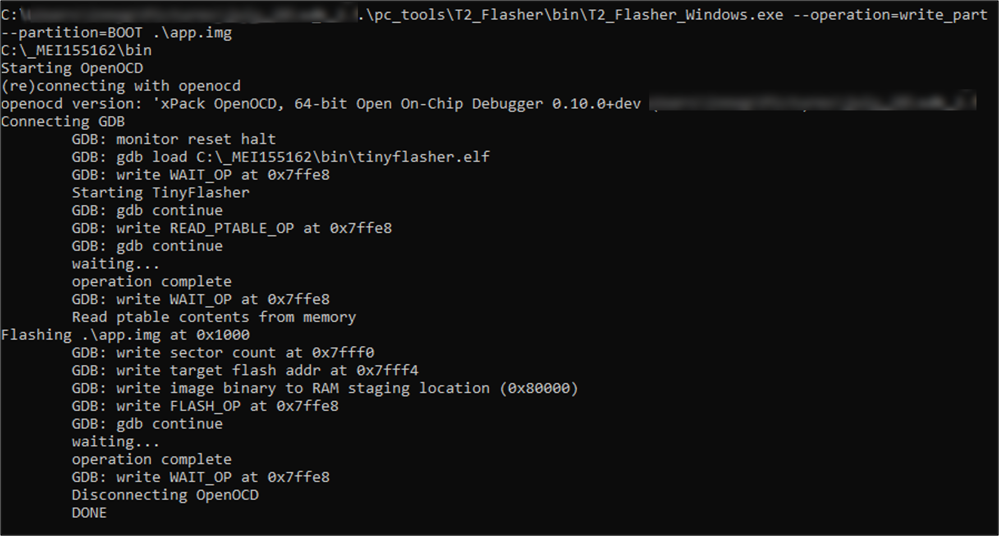
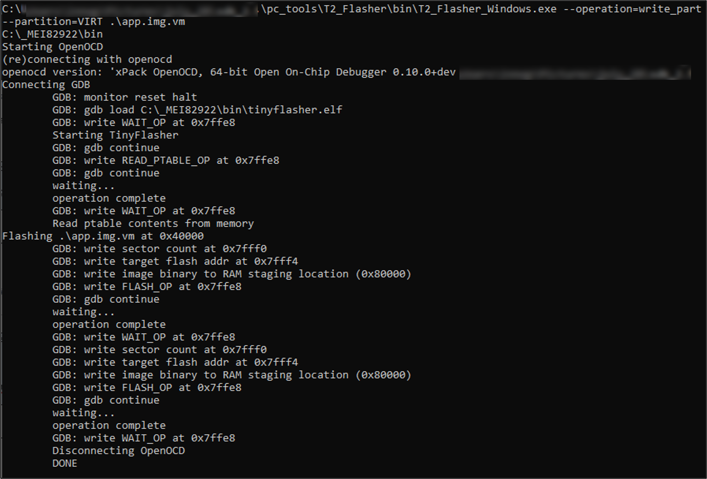
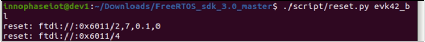
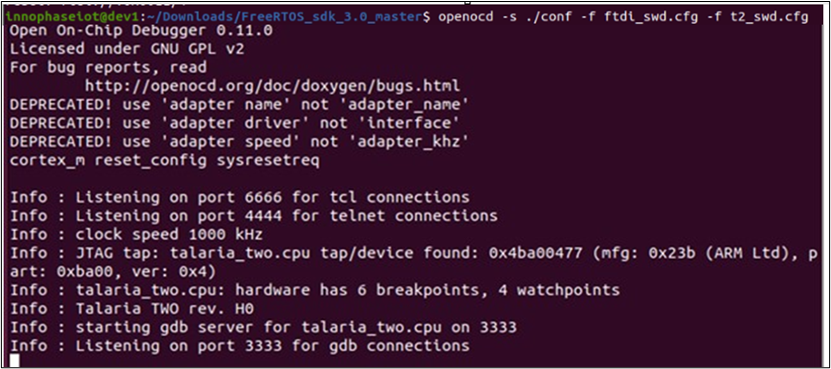
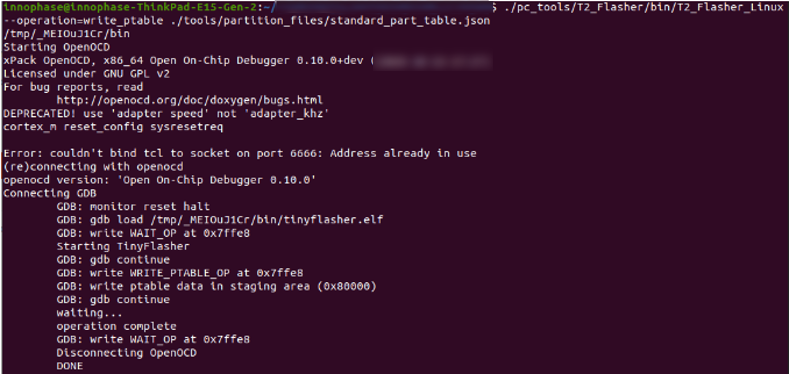
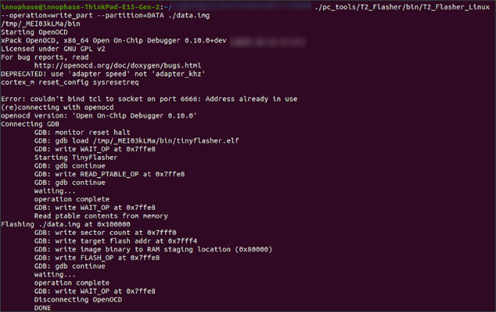
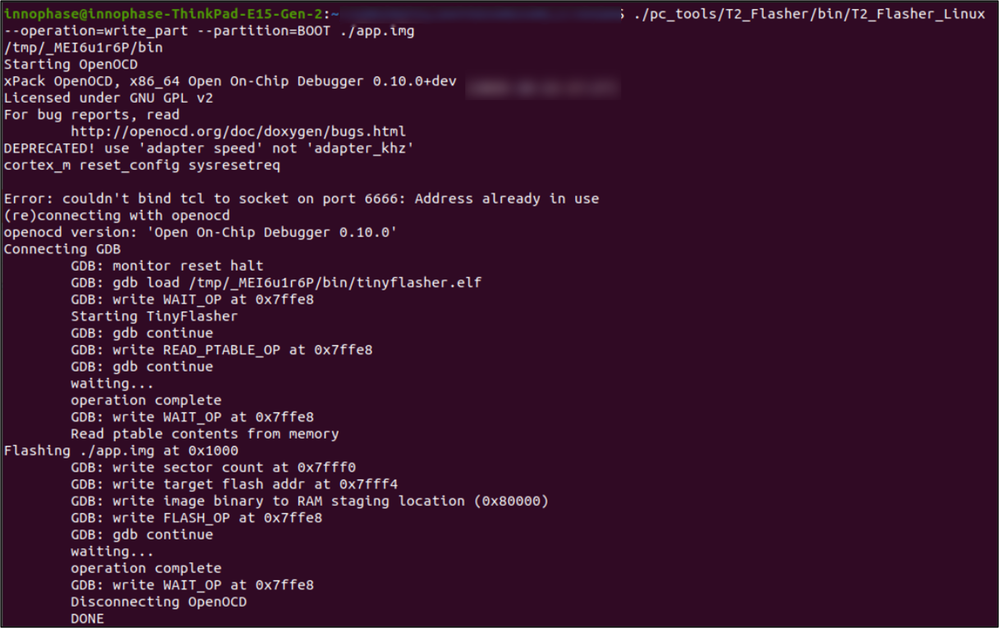
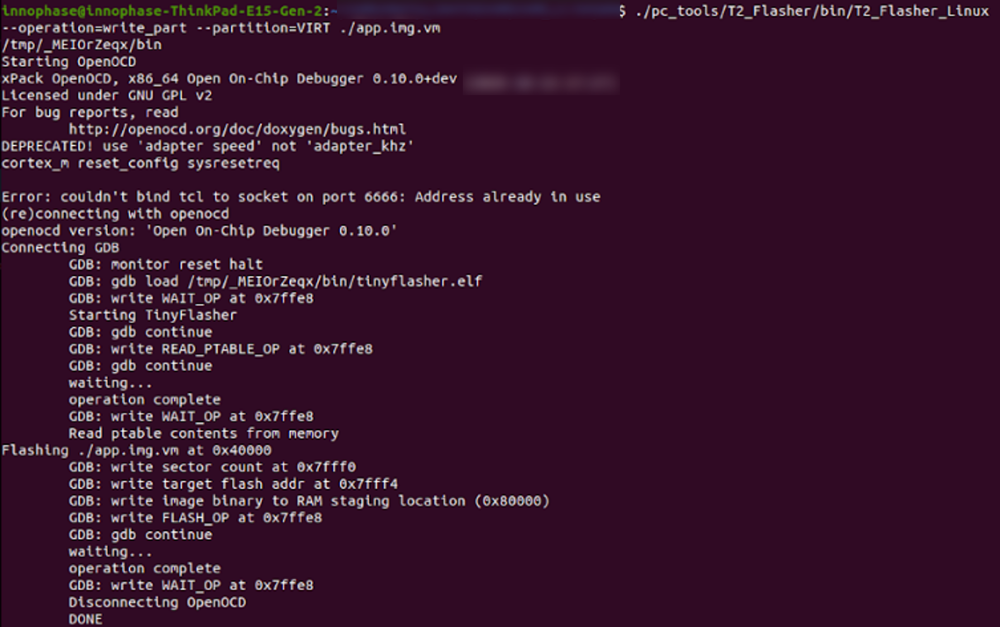
