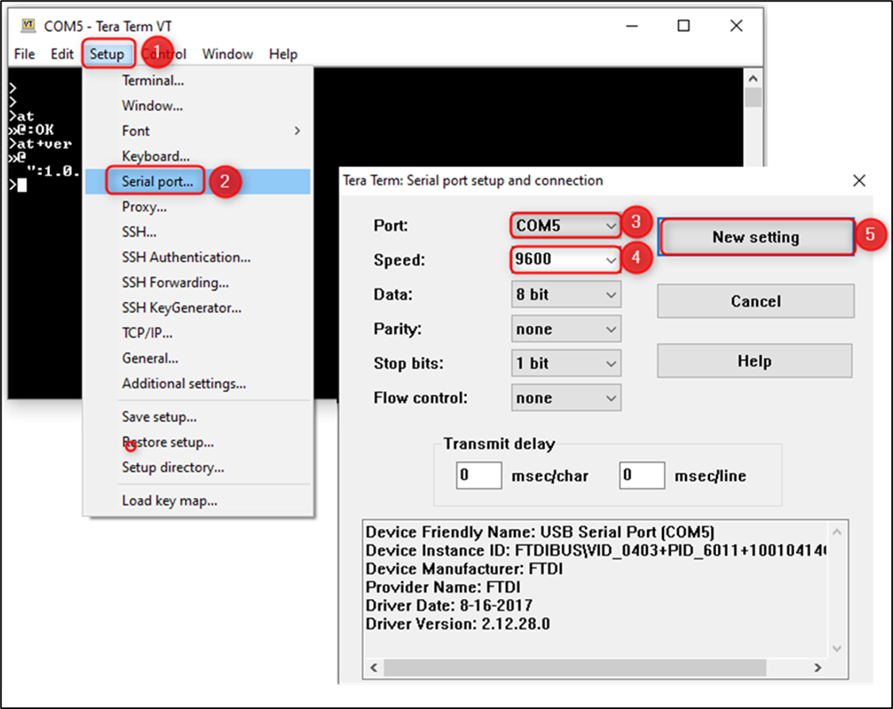

.. _at cmds config serial port:

Configure the Serial Port 
--------------------------

This section provides Serial Host interface configuration to send serial
data (AT commands) to Talaria TWO. The host can be interfaced with
Talaria TWO over UART/SPI. The default UART configuration is as follows:

a. Baud Rate: 115200bps

b. Data: 8 bits

c. Parity: None

d. Stop bits: 1 bit

e. Flow Control: None

Using Teraterm, select USB Port #5 and baudrate 9600 since the firmware
is configured with baudrate=9600.

|image3|

.. rst-class:: imagefiguesclass
Figure 1: Tera Term Setup

