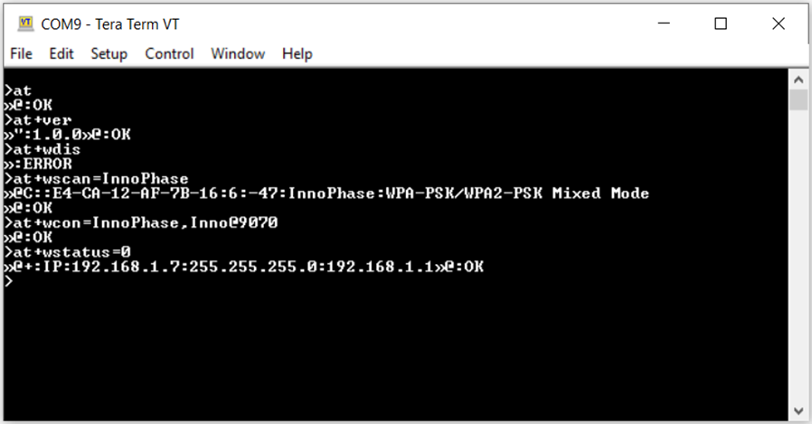

.. _at cmds run app:

Run the Application
-------------------

Press the enter button and issue the following commands:

.. table:: Table 1: AT Commands with description

   +-------------------+--------------------------------------------------+
   | **Command**       | **Description**                                  |
   +===================+==================================================+
   | at                | Check the connection state                       |
   +-------------------+--------------------------------------------------+
   | at+ver            | Get the Firmware version                         |
   +-------------------+--------------------------------------------------+
   | at+wdis           | Disconnect from any previously connected network |
   +-------------------+--------------------------------------------------+
   | at+wscan          | Check the availability of APs in the vicinity    |
   +-------------------+--------------------------------------------------+
   | at+wcon           | Connect to a secured access point providing      |
   |                   | network details of SSID and password( In this    |
   |                   | example SSID=Innophase and passhrase=Inno@9070)  |
   +-------------------+--------------------------------------------------+
   | at+wstatus        | Get the WLAN status                              |
   +-------------------+--------------------------------------------------+

**Note**:

a. On executing AT+WDIS, STW responds with OK/ERROR. Proceed with
   executing AT+WSTATUS=0 to get the WLAN status. AT+WDIS responds with
   ERROR only if the network status is disconnected.

b. AT+WSTATUS=0 parameter is used to get the IP address

   a. If a valid IP address is present, WLAN state = Connected

   b. No IP implies WLAN state = Disconnected

|image4|

.. rst-class:: imagefiguesclass
Figure 1: AT Commands - Tera Term output

