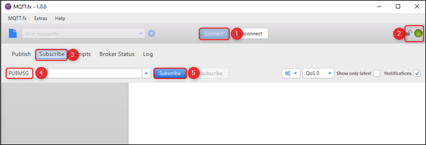

.. _at cmds uc np:

Network protocols
--------------------

Static IP Configuration
~~~~~~~~~~~~~~

Description
~~~~~~~~~~~

This use case is to demonstrate configuring static IP to the Talaria TWO
module. IP address can be assigned to the module in two ways, DHCP based
and Static IP configuration.

Prerequisites 
~~~~~~~~~~~~~~

Access Point configured with WPA/WPA2 personal security.

AT Command Sequence
~~~~~~~~~~~~~~~~~~~

.. table:: Table 1: Static IP Configuration - AT Commands

   +--------------+-------------------------------------------------------+
   | **AT         | **Description**                                       |
   | Command**    |                                                       |
   +==============+=======================================================+
   | *at*         | Check communication state                             |
   +--------------+-------------------------------------------------------+
   | *at+wscan*   | Get list of available APs from the vicinity           |
   +--------------+-------------------------------------------------------+
   | *at+         | Set WLAN Configuration                                |
   | wcfgset*     |                                                       |
   +--------------+-------------------------------------------------------+
   | *at+wcon*    | Connect to WLAN Network as a Station                  |
   +--------------+-------------------------------------------------------+
   | *at+wstatus* | Get IP address of Talaria TWO to verify the           |
   |              | connection is successful                              |
   +--------------+-------------------------------------------------------+

Procedure
~~~~~~~~~

Execute the following commands on Talaria TWO:

.. code:: shell

      at
at+wscan
at+wcfgset=1,192.168.1.8,255.255.255.0,192.168.1.8,8.8.8.8
at+wcon=InnoPhase,Inno@9070
at+wstatus=0

Serial Log
~~~~~~~~~~

|image42|

Figure 1: Static IP Configuration – Serial log

Ping and Reset Functionality
~~~~~~~~~~~~~~

.. _description-1:

Description 
~~~~~~~~~~~~

This use case is to demonstrate generic operations like getting firmware
version, setting system name, ping operation, and software reset.

.. _prerequisites-1:

Prerequisites 
~~~~~~~~~~~~~~

Access Point configured with WPA/WPA2 personal security.

.. _at-command-sequence-1:

AT Command Sequence 
~~~~~~~~~~~~~~~~~~~~

.. table:: Table 2: TCP Server - AT Commands

   +-------------+--------------------------------------------------------+
   | **AT        | **Description**                                        |
   | Command**   |                                                        |
   +=============+========================================================+
   | *at*        | Check communication state                              |
   +-------------+--------------------------------------------------------+
   | *at+ver*    | Get software version                                   |
   +-------------+--------------------------------------------------------+
   | *at+wscan*  | Get list of available APs from the vicinity            |
   +-------------+--------------------------------------------------------+
   | *at+wcon*   | Connect to a desired AP from the received scan results |
   +-------------+--------------------------------------------------------+
   | *           | Get IP address of Talaria TWO to verify the            |
   | at+wstatus* | connection(L2+L3) is successful                        |
   +-------------+--------------------------------------------------------+
   | *           | Set system name                                        |
   | at+sysname* |                                                        |
   +-------------+--------------------------------------------------------+
   | *at+nping*  | Connect to a desired AP from the received scan results |
   +-------------+--------------------------------------------------------+
   | *at+reset*  | Reset the device                                       |
   +-------------+--------------------------------------------------------+

.. _procedure-1:

Procedure 
~~~~~~~~~~

**Step 1**: Connect your laptop to the same access point “InnoPhase” to
which the Talaria TWO is connected.

|image43|

Figure 2: Connecting to AP

**Step 2**: Check the IP address of the Windows laptop using ipconfig
command.

|image44|

Figure 3: Checking IP address

**Step 3**: Execute the following commands on Talaria TWO:

.. code:: shell

      at
at+ver
at+wscan
at+wcon=InnoPhase,Inno@9070
at+wstatus=0
at+nping=192.168.1.5
at+reset
at+wstatus=0

.. _serial-log-1:

Serial Log
~~~~~~~~~~

|image4|

Figure 45: Ping and Reset Functionality - Serial log

.. |image42| image:: media/image42.png
   :width: 7.48031in
   :height: 3.89762in
.. |image43| image:: media/image43.png
   :width: 0.64172in
   :height: 0.30836in
.. |image44| image:: media/image44.png
   :width: 3.14961in
   :height: 5.28344in
.. |image45| image:: media/image45.png
   :width: 7.48031in
   :height: 3.37856in

.. |image47| image:: media/image47.png
   :width: 7.48031in
   :height: 2.37106in
.. |image48| image:: media/image48.png
   :width: 0.64172in
   :height: 0.30836in
.. |image49| image:: media/image49.png
   :width: 5.51181in
   :height: 4.82421in

.. |image51| image:: media/image51.png
   :width: 6.29921in
   :height: 3.85857in
.. |image52| image:: media/image52.png
   :width: 0.64172in
   :height: 0.30836in
.. |image53| image:: media/image53.png
   :width: 5.51181in
   :height: 4.80772in

.. |image55| image:: media/image55.png
   :width: 7.48031in
   :height: 3.75291in
.. |image56| image:: media/image56.png
   :width: 5.90551in
   :height: 5.64058in
.. |image57| image:: media/image57.png
   :width: 0.64172in
   :height: 0.30836in

.. |image60| image:: media/image60.png
   :width: 7.08661in
   :height: 3.15095in

.. |image62| image:: media/image62.png
   :width: 5.90551in
   :height: 5.19685in
.. |image63| image:: media/image63.png
   :width: 0.64172in
   :height: 0.30836in
.. |image64| image:: media/image64.png
   :width: 5.90551in
   :height: 5.17486in
.. |image65| image:: media/image65.png
   :width: 1.49167in
   :height: 0.27014in
.. |image66| image:: media/image66.png
   :width: 7.48031in
   :height: 3.97424in

.. |image68| image:: media/image68.png
   :width: 4.72441in
   :height: 4.14882in
.. |image69| image:: media/image69.png
   :width: 0.64172in
   :height: 0.30836in

.. |image71| image:: media/image71.png
   :width: 7.48031in
   :height: 3.91585in
.. |image72| image:: media/image72.png
   :width: 7.48031in
   :height: 3.98215in
.. |image73| image:: media/image73.png
   :width: 7.48031in
   :height: 4.00536in

.. |image75| image:: media/image75.png
   :width: 7.48031in
   :height: 5.61397in
.. |image76| image:: media/image76.png
   :width: 7.48031in
   :height: 5.43661in

.. |image78| image:: media/image78.png
   :width: 7.48031in
   :height: 3.90259in
.. |image79| image:: media/image79.png
   :width: 7.48031in
   :height: 2.59068in
.. |image80| image:: media/image80.png
   :width: 7.48031in
   :height: 3.41114in

.. |image82| image:: media/image82.png
   :width: 6.49606in
   :height: 4.69706in
.. |image83| image:: media/image83.png
   :width: 6.49606in
   :height: 2.78269in
.. |image84| image:: media/image84.png
   :width: 6.49606in
   :height: 1.48467in

.. |image86| image:: media/image86.png
   :width: 6.29921in
   :height: 1.46864in
.. |image87| image:: media/image87.png
   :width: 6.29921in
   :height: 0.29098in
.. |image88| image:: media/image88.png
   :width: 6.29921in
   :height: 0.68122in

.. |image90| image:: media/image90.png
   :width: 7.48031in
   :height: 2.62119in
.. |image91| image:: media/image91.png
   :width: 3.14961in
   :height: 5.09205in

.. |image93| image:: media/image93.png
   :width: 7.48031in
   :height: 2.23763in
