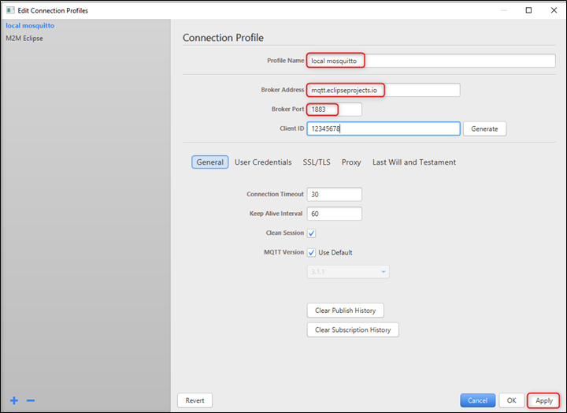

.. _at cmds uc np:

Network protocols
--------------------

Static IP Configuration
~~~~~~~~~~~~~~

Description
~~~~~~~~~~~

This use case is to demonstrate configuring static IP to the Talaria TWO
module. IP address can be assigned to the module in two ways, DHCP based
and Static IP configuration.

Prerequisites 
~~~~~~~~~~~~~~

Access Point configured with WPA/WPA2 personal security.

AT Command Sequence
~~~~~~~~~~~~~~~~~~~

.. table:: Table 1: Static IP Configuration - AT Commands

   +--------------+-------------------------------------------------------+
   | **AT         | **Description**                                       |
   | Command**    |                                                       |
   +==============+=======================================================+
   | *at*         | Check communication state                             |
   +--------------+-------------------------------------------------------+
   | *at+wscan*   | Get list of available APs from the vicinity           |
   +--------------+-------------------------------------------------------+
   | *at+         | Set WLAN Configuration                                |
   | wcfgset*     |                                                       |
   +--------------+-------------------------------------------------------+
   | *at+wcon*    | Connect to WLAN Network as a Station                  |
   +--------------+-------------------------------------------------------+
   | *at+wstatus* | Get IP address of Talaria TWO to verify the           |
   |              | connection is successful                              |
   +--------------+-------------------------------------------------------+

Procedure
~~~~~~~~~

Execute the following commands on Talaria TWO:

.. code:: shell

    at
    at+wscan
    at+wcfgset=1,192.168.1.8,255.255.255.0,192.168.1.8,8.8.8.8
    at+wcon=InnoPhase,Inno@9070
    at+wstatus=0

Serial Log
~~~~~~~~~~

|image42|

.. rst-class:: imagefiguesclass
Figure 42: Static IP Configuration – Serial log

Ping and Reset Functionality
~~~~~~~~~~~~~~

.. _description-1:

Description 
~~~~~~~~~~~~

This use case is to demonstrate generic operations like getting firmware
version, setting system name, ping operation, and software reset.

.. _prerequisites-1:

Prerequisites 
~~~~~~~~~~~~~~

Access Point configured with WPA/WPA2 personal security.

.. _at-command-sequence-1:

AT Command Sequence 
~~~~~~~~~~~~~~~~~~~~

.. table:: Table 13: Ping and Reset Functionality - AT Commands

   +-------------+--------------------------------------------------------+
   | **AT        | **Description**                                        |
   | Command**   |                                                        |
   +=============+========================================================+
   | *at*        | Check communication state                              |
   +-------------+--------------------------------------------------------+
   | *at+ver*    | Get software version                                   |
   +-------------+--------------------------------------------------------+
   | *at+wscan*  | Get list of available APs from the vicinity            |
   +-------------+--------------------------------------------------------+
   | *at+wcon*   | Connect to a desired AP from the received scan results |
   +-------------+--------------------------------------------------------+
   | *           | Get IP address of Talaria TWO to verify the            |
   | at+wstatus* | connection(L2+L3) is successful                        |
   +-------------+--------------------------------------------------------+
   | *           | Set system name                                        |
   | at+sysname* |                                                        |
   +-------------+--------------------------------------------------------+
   | *at+nping*  | Connect to a desired AP from the received scan results |
   +-------------+--------------------------------------------------------+
   | *at+reset*  | Reset the device                                       |
   +-------------+--------------------------------------------------------+

.. _procedure-1:

Procedure 
~~~~~~~~~~

**Step 1**: Connect your laptop to the same access point “InnoPhase” to
which the Talaria TWO is connected.

|image43|

.. rst-class:: imagefiguesclass
Figure 43: Connecting to AP

**Step 2**: Check the IP address of the Windows laptop using ipconfig
command.

|image44|

.. rst-class:: imagefiguesclass
Figure 44: Checking IP address

**Step 3**: Execute the following commands on Talaria TWO:

.. code:: shell

    at
    at+ver
    at+wscan
    at+wcon=InnoPhase,Inno@9070
    at+wstatus=0
    at+nping=192.168.1.5
    at+reset
    at+wstatus=0

.. _serial-log-1:

Serial Log
~~~~~~~~~~

|image45|

.. rst-class:: imagefiguesclass
Figure 45: Ping and Reset Functionality - Serial log

Application Protocol and Data Transfer
======================================

TCP Server
----------

.. _description-2:

Description
~~~~~~~~~~~

This use case is to demonstrate creating TCP server socket and TCP data
communication over the created socket.

.. _prerequisites-2:

Prerequisites
~~~~~~~~~~~~~~

1. Access Point configured with WPA/WPA2 personal security.

2. Hercules tool to create TCP client in Windows laptop.

.. _at-command-sequence-2:

AT Command Sequence
~~~~~~~~~~~~~~~~~~~~

.. table:: Table 14: TCP Server - AT Commands

    +--------------+---------------------------------------------------------+
    | **AT         | **Description**                                         |
    | Command**    |                                                         |
    +==============+=========================================================+
    | *at*         | Check communication state                               |
    +--------------+---------------------------------------------------------+
    | *at+wscan*   | Get list of available APs from the vicinity             |
    +--------------+---------------------------------------------------------+
    | *at+wcon*    | Connect to a desired AP from the received scan results  |
    +--------------+---------------------------------------------------------+
    | *at+wstatus* | Get IP address of Talaria TWO to verify the             |
    |              | connection(L2+L3) is successful                         |
    +--------------+---------------------------------------------------------+
    | *at+socsrv*  | Start TCP server                                        |
    +--------------+---------------------------------------------------------+
    | *at+socsend* | Send data                                               |
    +--------------+---------------------------------------------------------+

.. _procedure-2:

Procedure
~~~~~~~~~

**Step 1**: Execute the following commands on Talaria TWO:

.. code-block:: shell

    at
    at+wscan
    at+wcon=InnoPhase,Inno@9070
    at+wstatus=0
    at+socsrv=0,0,0,9000

|image46|

.. rst-class:: imagefiguesclass
Figure 46: TCP Server – Serial log

**Step 2**: Connect your laptop to the same access point “InnoPhase” to
which the Talaria TWO is connected.

|image47|

.. rst-class:: imagefiguesclass
Figure 47: Connecting to AP

**Step 3**: Start TCP client using Hercules and connect to Talaria TWO
TCP server.

|image48|

.. rst-class:: imagefiguesclass
Figure 48: Starting TCP client

**Step 4**: Log for data communication between application endpoints.

**Note**: Send data from Talaria TWO using command
at+socsend=1,ASCII,5,Hello.

|image49|

.. rst-class:: imagefiguesclass
Figure 49: Log for data communication between application endpoints –
Tera Term

|image50|

.. rst-class:: imagefiguesclass
Figure 50: Log for data communication between application endpoints -
Hercules

TCP Client
-----------

.. _description-3:

Description
~~~~~~~~~~~

This use case is to demonstrate creating TCP client socket and TCP data
communication over the created socket.

.. _prerequisites-3:

Prerequisites
~~~~~~~~~~~~~

1. Access Point configured with WPA/WPA2 personal security.

2. Any network tool (Hercules tool in this example) to be used to create
   TCP server in Windows/Linux laptop.

.. _at-command-sequence-3:

AT Command Sequence
~~~~~~~~~~~~~~~~~~~

.. table:: Table 15: TCP Client - AT Commands

    +------------+---------------------------------------------------------+
    | **AT       | **Description**                                         |
    | Command**  |                                                         |
    +============+=========================================================+
    | *at*       | Check communication state                               |
    +------------+---------------------------------------------------------+
    | *at+wscan* | Get list of available APs from the vicinity             |
    +------------+---------------------------------------------------------+
    | *at+wcon*  | Connect to a desired AP from the received scan results  |
    +------------+---------------------------------------------------------+
    | *a         | Get IP address of Talaria TWO to verify the             |
    | t+wstatus* | connection(L2+L3) is successful                         |
    +------------+---------------------------------------------------------+
    | *          | Create TCP client socket                                |
    | at+soccli* |                                                         |
    +------------+---------------------------------------------------------+
    | *a         | Send data                                               |
    | t+socsend* |                                                         |
    +------------+---------------------------------------------------------+

.. _procedure-3:

Procedure
~~~~~~~~~

**Step 1**: Connect your laptop to the same access point “InnoPhase” to
which the Talaria TWO is connected.

|image51|

.. rst-class:: imagefiguesclass
Figure 51: Connecting to AP

**Step 2**: Using Hercules tool create TCP server socket.

|image52|

.. rst-class:: imagefiguesclass
Figure 52: Creating TCP server socket

**Step 3**: Get IP address of the server/laptop using the command
ipconfig.

|image53|

.. rst-class:: imagefiguesclass
Figure 53: Getting the IP address

**Step 4**: Execute the following commands on Talaria TWO:

.. code:: shell

    at
    at+wscan
    at+wcon=InnoPhase,Inno@9070
    at+soccli=0,0,0,8000,192.168.1.5
    at+socsend=0,ASCII,12,Hello Server

**Step 5**: Data communication between the application endpoints.

|image54|

.. rst-class:: imagefiguesclass
Figure 54: Data communication – Tera Term

|image55|

.. rst-class:: imagefiguesclass
Figure 55: Data communication - Hercules

UDP Server
----------

.. _description-4:

Description
~~~~~~~~~~~~

This use case is to demonstrate creating UDP server socket and UDP data
communication over the created socket.

.. _prerequisites-4:

Prerequisites
~~~~~~~~~~~~~

1. Access Point configured with WPA/WPA2 personal security.

2. Hercules tool to create UDP client in Windows laptop.

.. _at-command-sequence-4:

AT Command Sequence
~~~~~~~~~~~~~~~~~~~~

.. table:: Table 16: UDP Server - AT Commands

    +-------------+--------------------------------------------------------+
    | **AT        | **Description**                                        |
    | Command**   |                                                        |
    +=============+========================================================+
    | *at*        | Check communication state                              |
    +-------------+--------------------------------------------------------+
    | *at+wscan*  | Get list of available APs from the vicinity            |
    +-------------+--------------------------------------------------------+
    | *at+wcon*   | Connect to a desired AP from the received scan results |
    +-------------+--------------------------------------------------------+
    | *           | Get IP address of Talaria TWO to verify the            |
    | at+wstatus* | connection(L2+L3) is successful                        |
    +-------------+--------------------------------------------------------+
    | *at+socsrv* | Start UDP server                                       |
    +-------------+--------------------------------------------------------+
    | *at+soccli* | Start UDP client                                       |
    +-------------+--------------------------------------------------------+
    | *           | Send data                                              |
    | at+socsend* |                                                        |
    +-------------+--------------------------------------------------------+

.. _procedure-4:

Procedure
~~~~~~~~~

**Step 1**: Connect your laptop to the same access point InnoPhase to
which the Talaria TWO is connected.

|image56|

.. rst-class:: imagefiguesclass
Figure 56: Connecting to AP

**Step 2**: Start UDP client using Hercules and connect to Talaria TWO
UDP server of IP address 192.168.1.2 and port 9000.

|image57|

.. rst-class:: imagefiguesclass
Figure 57: Starting UDP Client

**Step 3**: Get IP address of the server/laptop using the command
ipconfig.

|image58|

.. rst-class:: imagefiguesclass
Figure 58: ipconfig output

**Step 4**: Execute the following commands to associate to an Access
Point. Start the UDP server. Start the UDP client.

UDP server socket can only receive data, hence a client socket should be
created if data needs to be sent.

.. code-block:: shell

    at
    at+wscan
    at+wcon=InnoPhase,Inno@9070 at+wstatus=0
    at+socsrv=0,1,1,9000
    at+soccli=0,1,1,9000,192.168.1.6
    at+socsend=1,ASCII,5,HELLO

**Step 5**: Data communication between two application endpoints.

|image59|

.. rst-class:: imagefiguesclass
Figure 59: Data communication – Tera Term

|image60|

.. rst-class:: imagefiguesclass
Figure 60: Data communication - Hercules

UDP Client
-----------

.. _description-5:

Description
~~~~~~~~~~~

This use case is to demonstrate creating TCP client socket and TCP data
communication over the created socket.

.. _prerequisites-5:

Prerequisites
~~~~~~~~~~~~~~

1. Access Point configured with WPA/WPA2 personal security.

2. Any network tool (Hercules tool in this example) to be used to create
   UDP server in Windows/Linux laptop.

.. _at-command-sequence-5:

AT Command Sequence
~~~~~~~~~~~~~~~~~~~~

.. table:: Table 17: UDP Client – AT Commands

    +--------------+-------------------------------------------------------+
    | **AT         | **Description**                                       |
    | Command**    |                                                       |
    +==============+=======================================================+
    | *at*         | Check communication state                             |
    +--------------+-------------------------------------------------------+
    | *at+wscan*   | Get list of available APs from the vicinity           |
    +--------------+-------------------------------------------------------+
    | *at+wcon*    | Connect to a desired AP from the received scan        |
    |              | results                                               |
    +--------------+-------------------------------------------------------+
    | *at+wstatus* | Get IP address of T2 to verify the connection(L2+L3)  |
    |              | is successful                                         |
    +--------------+-------------------------------------------------------+
    | *at+soccli*  | Create UDP client socket                              |
    +--------------+-------------------------------------------------------+
    | *at+socsend* | Send data                                             |
    +--------------+-------------------------------------------------------+

.. _procedure-5:

Procedure
~~~~~~~~~~

**Step 1**: Connect your laptop to the same access point “InnoPhase” to
which the Talaria TWO is connected.

|image61|

.. rst-class:: imagefiguesclass
Figure 61: Connecting to AP

**Step 2**: Using Hercules tool create UDP socket.

|image62|

.. rst-class:: imagefiguesclass
Figure 62: Creating TCP server socket

**Step 3**: Get IP address of the server/laptop using the command
ipconfig.

|image63|

.. rst-class:: imagefiguesclass
Figure 63: Getting the IP address

**Step 4**: Execute the following commands on Talaria TWO:

.. code-block:: shell

    at
    at+wscan
    at+wcon=InnoPhase,Inno@9070
    at+wstatus=0
    at+soccli=0,1,1,8000,192.168.1.6
    at+socsend=0,ASCII,12,Hi InnoPhas

**Step 5**: Data communication between the application endpoints.

|image64|

.. rst-class:: imagefiguesclass
Figure 64: Data communication – Tera Term

|image65|

.. rst-class:: imagefiguesclass
Figure 65: Data communication – Hercules

HTTP Client
------------

Non-Secured HTTP Client
~~~~~~~~~~~~~~~~~~~~~~~

.. _description-6:

Description
^^^^^^^^^^^

This use case is to demonstrate HTTP client and perform GET/POST
operations.

.. _prerequisites-6:

Prerequisites
^^^^^^^^^^^^^

1. Access Point configured with WPA/WPA2 personal security.

2. HFS tool to start local HTTP server.

.. _at-command-sequence-6:

AT Command Sequence
^^^^^^^^^^^^^^^^^^^
.. table:: Table 18: HTTP Client (non-secured) - AT Commands

    +---------------+------------------------------------------------------+
    | **AT          | **Description**                                      |
    | Command**     |                                                      |
    +===============+======================================================+
    | *at*          | Check communication state                            |
    +---------------+------------------------------------------------------+
    | *at+wscan*    | Get list of available APs from the vicinity          |
    +---------------+------------------------------------------------------+
    | *at+wcon*     | Connect to a desired AP from the received scan       |
    |               | results                                              |
    +---------------+------------------------------------------------------+
    | *at+wstatus*  | Get IP address of Talaria TWO to verify the          |
    |               | connection(L2+L3) is successful                      |
    +---------------+------------------------------------------------------+
    | *at+hchdrset* | Set HTTP client header                               |
    +---------------+------------------------------------------------------+
    | *at+hcstart*  | Start HTTP Client                                    |
    +---------------+------------------------------------------------------+
    | *at+hcreqsnd* | Send GET request from the HTTP client                |
    +---------------+------------------------------------------------------+

.. _procedure-6:

Procedure
^^^^^^^^^^

**Step 1**: Connect your laptop to the same access point “InnoPhase” to
which the Talaria TWO is connected.

|image66|

.. rst-class:: imagefiguesclass
Figure 66: Connecting to AP

**Step 2**: Start HFS server and add data.txt file into the data path,
as shown in Figure 67.

|image67|

.. rst-class:: imagefiguesclass
Figure 67: Starting HFS server

**Step 3**: Execute the following commands on Talaria TWO:

.. code-block:: shell

    at
    at+wscan
    at+wcon=InnoPhase,Inno@9070
    at+wstatus=0
    at+hchdrset=13,192.168.1.5
    at+hcstart=192.168.1.5,80
    at+hcreqsnd=0,1,/data.txt

.. _serial-log-2:

Serial Log
^^^^^^^^^^

|image68|

.. rst-class:: imagefiguesclass
Figure 68: HTTP Client (non-secured) - Serial Log

Secured HTTP Client without Server Certificate Validation
~~~~~~~~~~~~~~~~~~~~~~~~~~~~~~~~~~~~~~~~~~~~~~~~~~~~~~~~~

.. _description-7:

Description
^^^^^^^^^^^^

This use case is to demonstrate secured HTTP client connection without
server certificate validation (time validation).

.. _prerequisites-7:

Prerequisites
^^^^^^^^^^^^^^

1. Access Point configured with WPA/WPA2 personal security.

2. HTTPs server.

.. _at-command-sequence-7:

AT Command Sequence
^^^^^^^^^^^^^^^^^^^^
.. table:: Table 19: HTTP Client (secured without server certificate validation) - AT Commands

    +--------------+-------------------------------------------------------+
    | **AT         | **Description**                                       |
    | Command**    |                                                       |
    +==============+=======================================================+
    | *at*         | Check communication state                             |
    +--------------+-------------------------------------------------------+
    | *at+wscan*   | Get list of available APs from the vicinity           |
    +--------------+-------------------------------------------------------+
    | *at+wcon*    | Connect to a desired AP from the received scan        |
    |              | results                                               |
    +--------------+-------------------------------------------------------+
    | *at+wstatus* | Get IP address of Talaria TWO to verify the           |
    |              | connection(L2+L3) is successful                       |
    +--------------+-------------------------------------------------------+
    | *at+hcstart* | Start HTTP Client                                     |
    +--------------+-------------------------------------------------------+
    | *at+hcclose* | Close HTTP connection                                 |
    +--------------+-------------------------------------------------------+

.. _procedure-7:

Procedure
^^^^^^^^^^

**Step 1:** Ensure that the server is running before triggering
connection from Talaria TWO\ **.** In this example, httpbin.org server
is used for connecting to the secure port.

**Step 2:** Execute the following commands on Talaria TWO:

.. code-block:: shell

    at
    at+wscan
    at+wcon=InnoPhase,Inno@9070
    at+wstatus=0
    at+hcstart=httpbin.org,443,1
    at+hcclose=0

.. _serial-log-3:

Serial Log
^^^^^^^^^^

|image69|

.. rst-class:: imagefiguesclass
Figure 69: HTTP Client (secured without server certificate validation) -
Serial log

Secured HTTP Client (with Server Certificate Validation)
~~~~~~~~~~~~~~~~~~~~~~~~~~~~~~~~~~~~~~~~~~~~~~~~~~~~~~~~

.. _description-8:

Description
^^^^^^^^^^^^

This use case is to demonstrate secured HTTP client connection with
server certificate validation (load CA certificate).

.. _prerequisites-8:

Prerequisites
^^^^^^^^^^^^^^

1. Access Point configured with WPA/WPA2 personal security.

2. HTTPs server.

.. _at-command-sequence-8:

AT Command Sequence
^^^^^^^^^^^^^^^^^^^^

.. table:: Table 20: HTTP Client (secured with server certificate validation) – AT Commands

    +--------------+-------------------------------------------------------+
    | **AT         | **Description**                                       |
    | Command**    |                                                       |
    +==============+=======================================================+
    | *at*         | Check communication state                             |
    +--------------+-------------------------------------------------------+
    | *at+wscan*   | Get list of available APs from the vicinity           |
    +--------------+-------------------------------------------------------+
    | *at+wcon*    | Connect to a desired AP from the received scan        |
    |              | results                                               |
    +--------------+-------------------------------------------------------+
    | *at+wstatus* | Get IP address of Talaria TWO to verify the           |
    |              | connection(L2+L3) is successful                       |
    +--------------+-------------------------------------------------------+
    | *At+certadd* | To load certificate                                   |
    +--------------+-------------------------------------------------------+
    | *at+hcstart* | Start HTTP Client                                     |
    +--------------+-------------------------------------------------------+
    | *at+hcclose* | Close HTTP connection                                 |
    +--------------+-------------------------------------------------------+

.. _procedure-8:

Procedure
^^^^^^^^^^

**Step 1:** Ensure that the server is running and ready for any incoming
connection, before triggering the HTTP client connection from Talaria
TWO\ **.** In this example, httpbin.org server is used for connecting to
the secure port (443).

**Step 2:** Execute the following commands on Talaria TWO:

.. code-block:: shell

    at
    at+wscan
    at+wcon=InnoPhase,Inno@9070
    at+wstatus=0
    at+certadd=httpbin-org-chain,4754
    at+hcstart=httpbin.org,443,2,httpbin-org-chain
    at+hcclose=0

.. _serial-log-4:

Serial Log
^^^^^^^^^^

|image70|

.. rst-class:: imagefiguesclass
Figure 70: HTTP Client (secured with server certificate validation) -
Serial log

MQTT Client
------------

.. _description-9:

Description
~~~~~~~~~~~~

This use case is to demonstrate MQTT client and data communication using
Publish and Subscribe methods.

.. _prerequisites-9:

Prerequisites
~~~~~~~~~~~~~~

1. Access Point configured with WPA/WPA2 personal security.

2. MQTT.fx tool to start another MQTT client to perform
   Publish/Subscribe b/w two clients.

.. _at-command-sequence-9:

AT Command Sequence
~~~~~~~~~~~~~~~~~~~

.. table:: Table 21: MQTT Client - AT Commands

    +---------------+------------------------------------------------------+
    | **AT          | **Description**                                      |
    | Command**     |                                                      |
    +===============+======================================================+
    | *at*          | Check communication state                            |
    +---------------+------------------------------------------------------+
    | *at+wscan*    | Get list of available APs from the vicinity          |
    +---------------+------------------------------------------------------+
    | *at+wcon*     | Connect to a desired AP from the received scan       |
    |               | results                                              |
    +---------------+------------------------------------------------------+
    | *at+wstatus*  | Get IP address of Talaria TWO to verify the          |
    |               | connection(L2+L3) is successful                      |
    +---------------+------------------------------------------------------+
    | *at+mqttconf* | Set MQTT configurations                              |
    +---------------+------------------------------------------------------+
    | *at+mqttconn* | Connect to MQTT Broker                               |
    +---------------+------------------------------------------------------+
    | *at+mqttpub*  | Publish the MQTT topic with Payload                  |
    +---------------+------------------------------------------------------+
    | *at+mqttsub*  | Subscribe to the MQTT topic                          |
    +---------------+------------------------------------------------------+
    | *at           | Disconnect MQTT client connection                    |
    | +mqttdisconn* |                                                      |
    +---------------+------------------------------------------------------+

.. _procedure-9:

Procedure
~~~~~~~~~

**Step 1**: Connect your laptop to the same access point “InnoPhase” to
which the Talaria TWO is connected.

|image71|

.. rst-class:: imagefiguesclass
Figure 71: Connecting to AP

**Step 2**: Start another MQTT client in the PC using MQTT.fx tool to
send data to Talaria TWO using Publish method and receive data sent from
Talaria TWO using Subscribe method.

Configure the following settings from MQTT.fx to configure MQTT
parameters for the public broker mqtt.eclipseprojects.io.Click on the
settings button:

|image72|

.. rst-class:: imagefiguesclass
Figure 72: MQTT.fx – settings

|image73|

Figure 73: MQTT.fx - Connection Profile

**Note**: Ensure the client ID is unique to the device.

**Step 3**: Click on Connect and check the green color button for
successful connection.

**Step 4**: Click on Subscribe and enter topic as PUBMSG to receive any
data sent from Talaria TWO MQTT client.

|image74|

.. rst-class:: imagefiguesclass
Figure 74: MQTT.fx – Subscribe

**Step 5**: Execute the following commands on Talaria TWO:

.. code-block:: shell

    at
    at+wscan
    at+wcon=InnoPhase,Inno@9070
    at+wstatus=0
    at+mqttconf=clientid,12345678
    at+mqttconf=admin,admin
    at+mqttconf=password,xyz

    at+mqttconn=mqtt.eclipseprojects.io,1883
    at+mqttpub=0,PUBMSG,0,5,Hello
    at+mqttsub=0,SUBMSG,0

|image75|

.. rst-class:: imagefiguesclass
Figure 75: MQTT Client - Serial log

**Step 6**: Click on Publish and enter topic as SUBMSG to send the data
to Talaria TWO MQTT client.

|image76|

.. rst-class:: imagefiguesclass
Figure 76: MQTT.fx – Publish

**Step 7**: Data communication between two application end points.

|image77|

.. rst-class:: imagefiguesclass
Figure 77: Data communication

Secure MQTT
-----------

.. _description-10:

Description
~~~~~~~~~~~

This use case is to demonstrate MQTT client connection over secured
layer(SSL/TLS).

.. _prerequisites-10:

Prerequisites
~~~~~~~~~~~~~~

1. Secure MQTT broker with client certificates- Root CA, Client cert and
   client private key

2. Mosquito tool for windows

.. _procedure-10:

Procedure
~~~~~~~~~~

Following are the two methods to load the certificate to the filesystem.
Use any one of them to add the certificates:

1. **Using Download tool**: Write the certificates to Talaria TWO’s
   FLASH using the Download tool.

For more information on writing certificates, refer section: *Show File
System Contents -> Write Files* of the document: UG_Download_Tool.pdf
(*freertos_sdk_x.y\\pc_tools\\Download_Tool\\doc)*.

**Note**: x and y in freertos_sdk_x.y refer to the SDK release version.

2. Using AT Commands: The AT command will load the certificates on to
   the Talaria TWO’s RAM.

   a. Issue the below commands to load the certificates:

.. code-block:: shell

    at+certadd=<cert name>,<cert length>

b. Once the command is issued, Talaria TWO will send “<” as response to
   the command:

..

   |image78|

.. rst-class:: imagefiguesclass
Figure 78: Command Validation

c. Send the certificate after receiving the command response (<).

d. Go to File -> Send file… from the Tera Term and browse the
   certificates

..

   |image79|

.. rst-class:: imagefiguesclass
Figure 79: Send Certificate

   |image80|

.. rst-class:: imagefiguesclass
Figure 80: Browse to add the Certificates

e. Execute this step to add all three certificates:

..

   |image81|

.. rst-class:: imagefiguesclass
Figure 81: AT Commands- To add the certificate

.. code-block:: shell

    at
    at+certadd=mqtt_root_ca,1452
    at+certadd=mqtt_device_cert,1330
    at+certadd=client.key,1679

.. _at-command-sequence-10:

AT Command Sequence
~~~~~~~~~~~~~~~~~~~~

.. table:: Table 22: Secure MQTT - AT Commands

    +-----------------------+----------------------------------------------+
    | **AT Command**        | **Description**                              |
    +=======================+==============================================+
    | *at*                  | To check the connection state                |
    +-----------------------+----------------------------------------------+
    | *at+certadd*          | To load the certificate                      |
    +-----------------------+----------------------------------------------+
    | *at+wcon*             | To connect to a secured access point         |
    +-----------------------+----------------------------------------------+
    | *at+mqttconf*         | Set MQTT configurations                      |
    +-----------------------+----------------------------------------------+
    | *at+mqttconn*         | Connect to MQTT broker                       |
    +-----------------------+----------------------------------------------+
    | *at+mqttsub*          | Subscribe to a MQTT topic                    |
    +-----------------------+----------------------------------------------+
    | *at+mqttpub*          | Publish the MQTT topic with Payload          |
    +-----------------------+----------------------------------------------+

.. _procedure-11:

Procedure
~~~~~~~~~

**Step 1**: Execute the following commands on Talaria TWO:

.. code-block:: shell

    at+wcon=InnoPhase,43083191
    at+mqttconf=clientid,789012
    at+mqttconf=username,innophase
    at+mqttconf=password,123
    at+mqttconf=kainterval,10
    at+mqttconn=test.mosquitto.org,8884,1,1,/data/mqtt_root_ca.crt,/,/data/mqtt_device_cert.crt,/data/client.key
    at+mqttsub=0,inno/test,0
    at+mqttpub=0,inno/test,0,5,hello

|image82|

.. rst-class:: imagefiguesclass
Figure 82: Secure MQTT- serial log

**Step 2**: To observe Publish messages and to Subscribe any message,
execute the following commands on the command prompt:

1. To publish:

   a. Start a mosquito server to subscribe to inno/test topic:

.. code-block:: shell

    mosquitto_sub.exe -h test.mosquitto.org -P 8884 -u innophase -P 123 -t inno/test

..

   |image83|

.. rst-class:: imagefiguesclass
Figure 83: Command Prompt Output (Publish message)

b. Issue the following command to publish message to the subscribed
   topic from the serial terminal:

.. code-block:: shell

    at+mqttpub=0,inno/test,0,5,hello

..

   |image84|

.. rst-class:: imagefiguesclass
Figure 84: To publish

2. To subscribe

   a. Start a mosquito server to publish to inno/test topic:

.. code-block:: shell

    mosquitto_pub.exe -h test.mosquitto.org -P 8884 -u innophase -P 123 -t inno/test -m "Hii Innophase"

..

   |image85|

.. rst-class:: imagefiguesclass
Figure 85: Command Prompt Output (Subscribe message)

b. Issue the following command to subscribe to inno/test topic on the
   serial terminal and get the published message:

.. code-block:: shell

    at+mqttsub=0,inno/test,0

..

   |image86|

.. rst-class:: imagefiguesclass
Figure 86: To subscribe

DNS Lookup – Get host IP by name
--------------------------------

.. _description-11:

Description
~~~~~~~~~~~~

This use case is to demonstrate getting IP address from the host name.

.. _prerequisites-11:

Prerequisites
~~~~~~~~~~~~~~

Access Point configured with WPA/WPA2 personal security.

.. _at-command-sequence-11:

AT Command Sequence
~~~~~~~~~~~~~~~~~~~~

.. table:: Table 23: DNS Lookup – Get host IP by name - AT Commands

    +--------------+-------------------------------------------------------+
    | **ATCommand**| **Description**                                       |
    +==============+=======================================================+
    | *at*         | Check communication state                             |
    +--------------+-------------------------------------------------------+
    | *at+wscan*   | Get list of available APs from the vicinity           |
    +--------------+-------------------------------------------------------+
    | *at+wcon*    | Connect to a desired AP from the received scan        |
    |              | results                                               |
    +--------------+-------------------------------------------------------+
    | *at+wstatus* | Get IP address of Talaria TWO to verify the           |
    |              | connection(L2+L3) is successful                       |
    +--------------+-------------------------------------------------------+
    | *at          | Get host IP address by name                           |
    | +nhostipget* |                                                       |
    +--------------+-------------------------------------------------------+

.. _procedure-12:

Procedure
~~~~~~~~~~

**Step 1**: Execute the following commands on Talaria TWO:

.. code-block::

    at
    at+wscan
    at+wcon=InnoPhase,Inno@9070
    at+wstatus=0
    at+nhostipget

.. _serial-log-5:

Serial Log
~~~~~~~~~~

|image87|

.. rst-class:: imagefiguesclass
Figure 87: DNS Lookup – Get host IP by name - Serial log

Service Discovery using mDNS
----------------------------

.. _description-12:

Description
~~~~~~~~~~~

This module is used to start the mDNS procedure of the node with IPv4
network.

It supports following services:

1. mDNS Service Announce.

2. mDNS Service Discover.

.. _prerequisites-12:

Prerequisites
~~~~~~~~~~~~~~

1. Access Point configured with any Wi-Fi security types (WPA/WPA2/WPA3
   Personal/Enterprise protocols).

2. Bonjour Browser for windows OS or from a Windows command line, use
   dns-sd command to browse for services that are being broadcast on the
   local network by Talaria TWO.

.. _at-command-sequence-12:

AT Command Sequence
~~~~~~~~~~~~~~~~~~~~

.. table:: Table 24: Service Discovery using mDNS - AT Commands

    +------------+---------------------------------------------------------+
    | *          | **Description**                                         |
    | *Command** |                                                         |
    +============+=========================================================+
    | *at*       | Check communication state                               |
    +------------+---------------------------------------------------------+
    | *at+wscan* | Get list of available APs from the vicinity             |
    +------------+---------------------------------------------------------+
    | *at+wcon*  | Connect to a desired AP from the received scan results  |
    +------------+---------------------------------------------------------+
    | *a         | Get IP address of Talaria TWO to verify the             |
    | t+wstatus* | connection(L2+L3) is successful                         |
    +------------+---------------------------------------------------------+
    | *at+       | Starts mDNS                                             |
    | mdnsstart* |                                                         |
    +------------+---------------------------------------------------------+
    | *a         | Register the mDNS service by passing the service        |
    | t+mdnsreg* | name,type,proto,port and the description                |
    +------------+---------------------------------------------------------+
    | *at        | De-Register mDNS Service by providing the service       |
    | +mdnsdreg* | Identifier that was captured when the registration was  |
    |            | done                                                    |
    +------------+---------------------------------------------------------+
    | *a         | Stops mDNS                                              |
    | t+mdnstop* |                                                         |
    +------------+---------------------------------------------------------+

.. _procedure-13:

Procedure
~~~~~~~~~

**Step 1**: Connect your laptop to the same access point “InnoPhase” to
which the Talaria TWO is connected.

|image88|

.. rst-class:: imagefiguesclass
Figure 88: Connecting to an Access Point

**Step 2**: Issue the following commands to advertise the services on
local network. Connect the Talaria TWO module to an AP of SSID
"InnoPhase" and passphrase "43083191".

Check the WLAN status with at+wstatus command. Start the mDNS service
and register to service name “Inno_Provisioning“ of service type “TCP”
on port number 80 and “Provisioning” as service description.

.. code-block::

    at
    at+wscan
    at+wcon=InnoPhase,43083191
    at+wstatus=0
    at+mdnsstart
    at+mdnsreg=Inno_Provisioning,_http,1,80,Provisioning

**Step 3**: Start Bonjour Browser and Scan for the services that are
announced by Talaria TWO.

|image89|

.. rst-class:: imagefiguesclass
Figure 89: Starting Bonjour Browser and Scanning for the services

Alternate way of Service discovery can be done from a Windows command
line, using the dns-sd command to browse for services that are being
broadcast on the local network by Talaria TWO.

|image90|

.. rst-class:: imagefiguesclass
Figure 90: Service discovery from Windows command line

Serial Log:

|image91|

.. rst-class:: imagefiguesclass
Figure 91: Service Discovery using mDNS - Serial log

**Step 3**: De-register mDNS service, registered using command
AT+MDNSREG and stop the mDNS service using the following commands:

.. code-block:: shell

    at+mdnsdreg=0
    at+mdnsstop

|image92|

.. rst-class:: imagefiguesclass
Figure 92: De-registering from mDNS service

Get Time from NTP Server
------------------------

.. _description-13:

Description
~~~~~~~~~~~~

This use case is to demonstrate getting time from the NTP server.

.. _prerequisites-13:

Prerequisites
~~~~~~~~~~~~~~

Access Point configured with WPA/WPA2 personal security.

.. _at-command-sequence-13:

AT Command Sequence
~~~~~~~~~~~~~~~~~~~~

.. table:: able 25: Get Time from NTP Server - AT Commands

    +--------------+-------------------------------------------------------+
    | **AT         | **Description**                                       |
    | Command**    |                                                       |
    +==============+=======================================================+
    | *at*         | Check communication state                             |
    +--------------+-------------------------------------------------------+
    | *at+wscan*   | Get list of available APs from the vicinity           |
    +--------------+-------------------------------------------------------+
    | *at+wcon*    | Connect to a desired AP from the received scan        |
    |              | results                                               |
    +--------------+-------------------------------------------------------+
    | *at+wstatus* | Get IP address of Talaria TWO to verify the           |
    |              | connection(L2+L3) is successful                       |
    +--------------+-------------------------------------------------------+
    | *at          | Get time from NTP server                              |
    | +ntptimeget* |                                                       |
    +--------------+-------------------------------------------------------+

.. _procedure-14:

Procedure
~~~~~~~~~~

**Step 1**: Execute the following commands on Talaria TWO:

.. code-block:: shell

    at
    at+wscan
    at+wcon=InnoPhase,Inno@9070
    at+wstatus=0
    at+ntptimeget

.. _serial-log-6:

Serial Log
~~~~~~~~~~

|image93|

.. rst-class:: imagefiguesclass
Figure 93: Get Time from NTP Server - Serial log

.. |image43| image:: media/image43.png
   :class: .image-resizing
   :width: 4in

.. |image46| image:: media/image46.png
   :width: 8in
.. |image47| image:: media/image47.png
   :class: .image-resizing
   :width: 4in

.. |image49| image:: media/image49.png
   :width: 8in
.. |image50| image:: media/image50.png
   :width: 8in
.. |image51| image:: media/image51.png
   :class: .image-resizing
   :width: 4in

.. |image54| image:: media/image54.png
   :width: 8in
.. |image55| image:: media/image55.png
   :width: 8in
.. |image56| image:: media/image56.png
   :class: .image-resizing
   :width: 4in

.. |image58| image:: media/image58.png
   :width: 8in
.. |image59| image:: media/image59.png
   :width: 8in

.. |image61| image:: media/image61.png
   :class: .image-resizing
   :width: 4in

.. |image64| image:: media/image64.png
   :width: 8in

.. |image66| image:: media/image66.png
   :class: .image-resizing
   :width: 4in
.. |image67| image:: media/image67.png
   :width: 8in

.. |image69| image:: media/image69.png
   :width: 8in
.. |image70| image:: media/image70.png
   :width: 8in
.. |image71| image:: media/image71.png
   :class: .image-resizing
   :width: 4in

.. |image74| image:: media/image74.png
   :width: 8in

.. |image77| image:: media/image77.png
   :width: 8in

.. |image81| image:: media/image81.png
   :width: 8in

.. |image85| image:: media/image85.png
   :width: 8in

.. |image89| image:: media/image89.png
   :width: 8in

.. |image92| image:: media/image92.png
   :width: 8in

