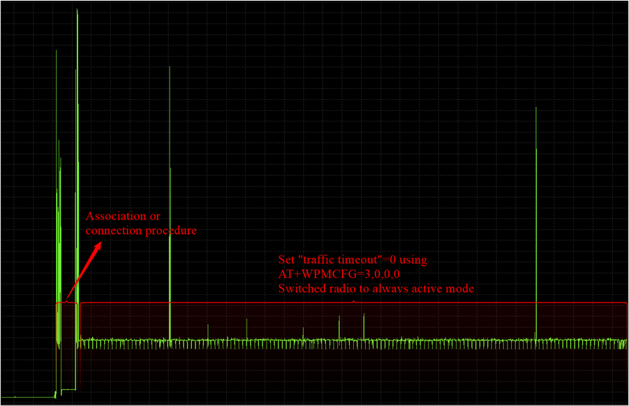
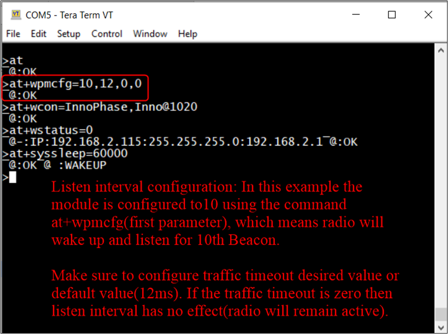
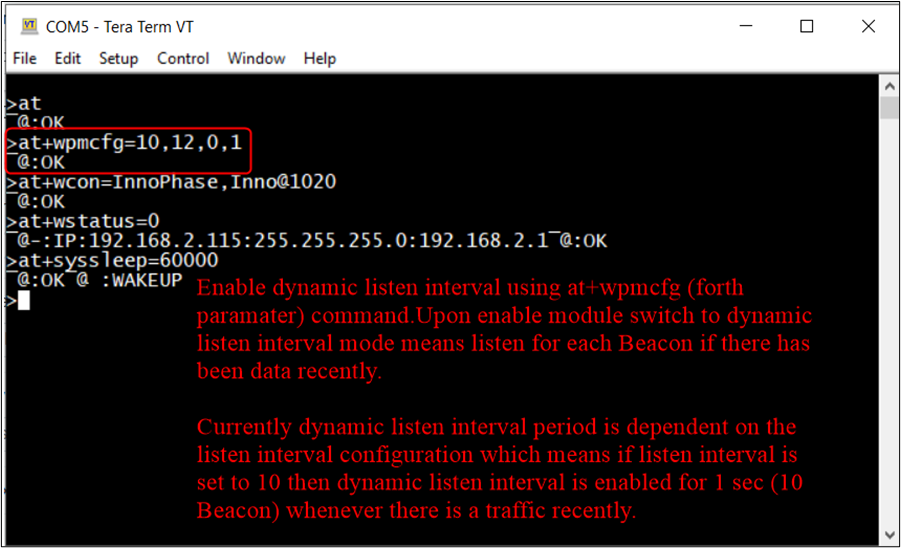
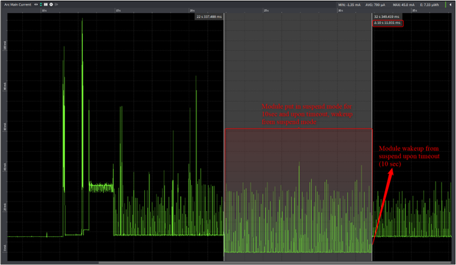
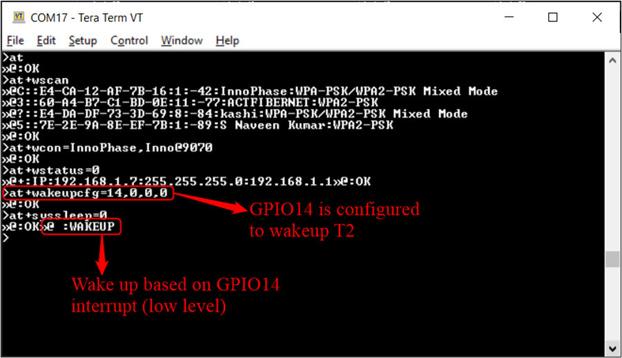
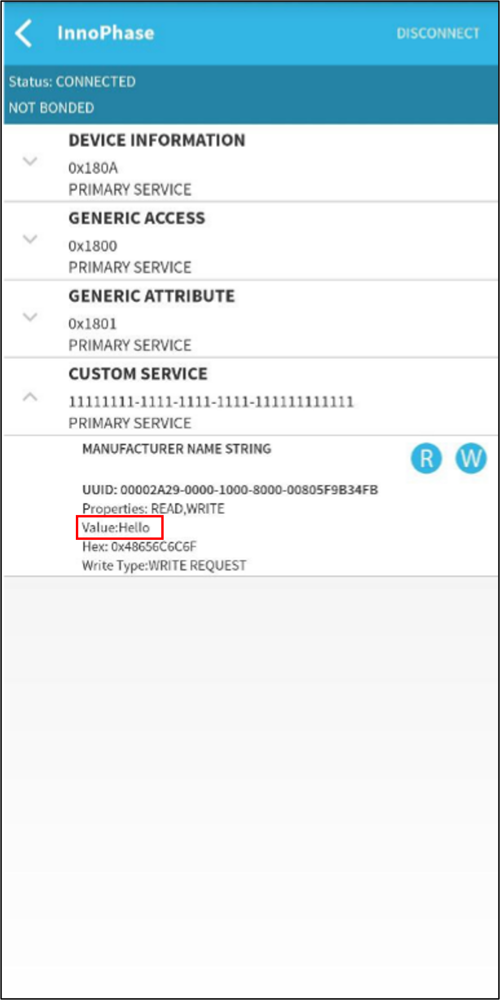
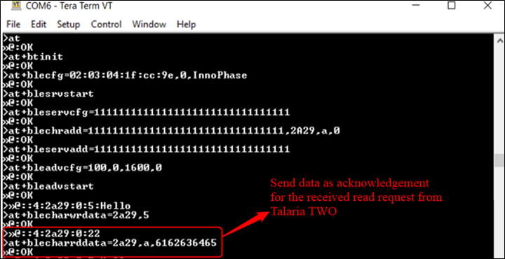
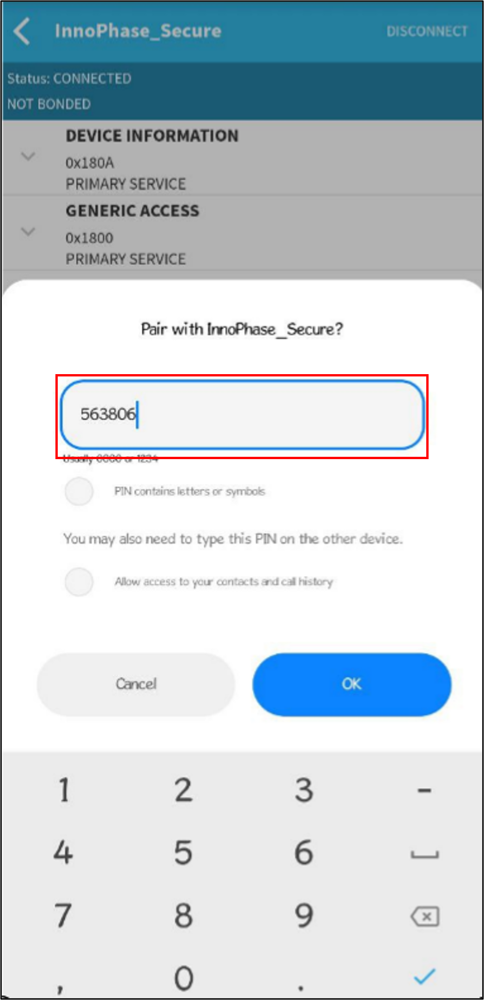
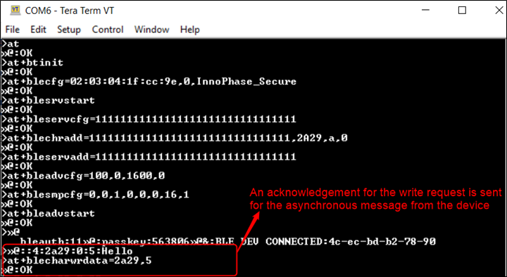

.. _at cmds uc ap dt:

Application Protocol and Data Transfer
~~~~~~~~~~~~~~~~~~~~

TCP Server
~~~~~~~~~~~~~~~~~~~~

.. _description-2:

Description
~~~~~~~~~~~

This use case is to demonstrate creating TCP server socket and TCP data
communication over the created socket.

.. _prerequisites-2:

Prerequisites 
~~~~~~~~~~~~~~

1. Access Point configured with WPA/WPA2 personal security.

2. Hercules tool to create TCP client in Windows laptop.

.. _at-command-sequence-2:

AT Command Sequence 
~~~~~~~~~~~~~~~~~~~~

.. table:: Table 3: UDP Server - AT Commands

   +------------+---------------------------------------------------------+
   | **AT       | **Description**                                         |
   | Command**  |                                                         |
   +============+=========================================================+
   | *at*       | Check communication state                               |
   +------------+---------------------------------------------------------+
   | *at+wscan* | Get list of available APs from the vicinity             |
   +------------+---------------------------------------------------------+
   | *at+wcon*  | Connect to a desired AP from the received scan results  |
   +------------+---------------------------------------------------------+
   | *a         | Get IP address of Talaria TWO to verify the             |
   | t+wstatus* | connection(L2+L3) is successful                         |
   +------------+---------------------------------------------------------+
   | *          | Start TCP server                                        |
   | at+socsrv* |                                                         |
   +------------+---------------------------------------------------------+
   | *a         | Send data                                               |
   | t+socsend* |                                                         |
   +------------+---------------------------------------------------------+

.. _procedure-2:

Procedure
~~~~~~~~~

**Step 1**: Execute the following commands on Talaria TWO:

.. code:: shell

      at
at+wscan
at+wcon=InnoPhase,Inno@9070
at+wstatus=0
at+socsrv=0,0,0,9000

|image46|

Figure 5: TCP Server – Serial log

**Step 2**: Connect your laptop to the same access point “InnoPhase” to
which the Talaria TWO is connected.

|image47|

Figure 6: Connecting to AP

**Step 3**: Start TCP client using Hercules and connect to Talaria TWO
TCP server.

|image48|

Figure 7: Starting TCP client

**Step 4**: Log for data communication between application endpoints.

**Note**: Send data from Talaria TWO using command
at+socsend=1,ASCII,5,Hello.

|image49|

Figure 8: Log for data communication between application endpoints –
Tera Term

|image50|

Figure 9: Log for data communication between application endpoints -
Hercules

TCP Client 
~~~~~~~~~~~~~~

.. _description-3:

Description
~~~~~~~~~~~

This use case is to demonstrate creating TCP client socket and TCP data
communication over the created socket.

.. _prerequisites-3:

Prerequisites
~~~~~~~~~~~~~

1. Access Point configured with WPA/WPA2 personal security.

2. Any network tool (Hercules tool in this example) to be used to create
   TCP server in Windows/Linux laptop.

.. _at-command-sequence-3:

AT Command Sequence
~~~~~~~~~~~~~~~~~~~

.. table:: Table 4: HTTP Client (non-secured) - AT Commands

   +------------+---------------------------------------------------------+
   | **AT       | **Description**                                         |
   | Command**  |                                                         |
   +============+=========================================================+
   | *at*       | Check communication state                               |
   +------------+---------------------------------------------------------+
   | *at+wscan* | Get list of available APs from the vicinity             |
   +------------+---------------------------------------------------------+
   | *at+wcon*  | Connect to a desired AP from the received scan results  |
   +------------+---------------------------------------------------------+
   | *a         | Get IP address of Talaria TWO to verify the             |
   | t+wstatus* | connection(L2+L3) is successful                         |
   +------------+---------------------------------------------------------+
   | *          | Create TCP client socket                                |
   | at+soccli* |                                                         |
   +------------+---------------------------------------------------------+
   | *a         | Send data                                               |
   | t+socsend* |                                                         |
   +------------+---------------------------------------------------------+

.. _procedure-3:

Procedure
~~~~~~~~~

**Step 1**: Connect your laptop to the same access point “InnoPhase” to
which the Talaria TWO is connected.

|image51|

Figure 10: Connecting to AP

**Step 2**: Using Hercules tool create TCP server socket.

|image52|

Figure 11: Creating TCP server socket

**Step 3**: Get IP address of the server/laptop using the command
ipconfig.

|image53|

Figure 12: Getting the IP address

**Step 4**: Execute the following commands on Talaria TWO:

.. code:: shell

      at
at+wscan
at+wcon=InnoPhase,Inno@9070
at+wstatus=0
at+soccli=0,0,0,8000,192.168.1.5
at+socsend=0,ASCII,12,Hello Server

**Step 5**: Data communication between the application endpoints.

|image54|

Figure 13: Data communication – Tera Term

|image55|

Figure 14: Data communication - Hercules

UDP Server
~~~~~~~~~~~~~~

.. _description-4:

Description 
~~~~~~~~~~~~

This use case is to demonstrate creating UDP server socket and UDP data
communication over the created socket.

.. _prerequisites-4:

Prerequisites
~~~~~~~~~~~~~

1. Access Point configured with WPA/WPA2 personal security.

2. Hercules tool to create UDP client in Windows laptop.

.. _at-command-sequence-4:

AT Command Sequence 
~~~~~~~~~~~~~~~~~~~~

.. table:: Table 5: HTTP Client (secured with server certificate
validation) – AT Commands

   +-------------+--------------------------------------------------------+
   | **AT        | **Description**                                        |
   | Command**   |                                                        |
   +=============+========================================================+
   | *at*        | Check communication state                              |
   +-------------+--------------------------------------------------------+
   | *at+wscan*  | Get list of available APs from the vicinity            |
   +-------------+--------------------------------------------------------+
   | *at+wcon*   | Connect to a desired AP from the received scan results |
   +-------------+--------------------------------------------------------+
   | *           | Get IP address of Talaria TWO to verify the            |
   | at+wstatus* | connection(L2+L3) is successful                        |
   +-------------+--------------------------------------------------------+
   | *at+socsrv* | Start UDP server                                       |
   +-------------+--------------------------------------------------------+
   | *at+soccli* | Start UDP client                                       |
   +-------------+--------------------------------------------------------+
   | *           | Send data                                              |
   | at+socsend* |                                                        |
   +-------------+--------------------------------------------------------+

.. _procedure-4:

Procedure
~~~~~~~~~

**Step 1**: Connect your laptop to the same access point InnoPhase to
which the Talaria TWO is connected.

|image56|

Figure 15: Connecting to AP

**Step 2**: Start UDP client using Hercules and connect to Talaria TWO
UDP server of IP address 192.168.1.2 and port 9000.

|image57|

Figure 16: Starting UDP Client

**Step 3**: Get IP address of the server/laptop using the command
ipconfig.

|image58|

Figure 17: ipconfig output

**Step 4**: Execute the following commands to associate to an Access
Point. Start the UDP server. Start the UDP client.

UDP server socket can only receive data, hence a client socket should be
created if data needs to be sent.

.. code:: shell

      at 
at+wscan
at+wcon=InnoPhase,Inno@9070 at+wstatus=0 
at+socsrv=0,1,1,9000
at+soccli=0,1,1,9000,192.168.1.6
at+socsend=1,ASCII,5,HELLO

**Step 5**: Data communication between two application endpoints.

|image59|

Figure 18: Data communication – Tera Term

|image60|

Figure 19: Data communication - Hercules

UDP Client 
~~~~~~~~~~~~~~

.. _description-5:

Description
~~~~~~~~~~~

This use case is to demonstrate creating TCP client socket and TCP data
communication over the created socket.

.. _prerequisites-5:

Prerequisites 
~~~~~~~~~~~~~~

1. Access Point configured with WPA/WPA2 personal security.

2. Any network tool (Hercules tool in this example) to be used to create
   UDP server in Windows/Linux laptop.

.. _at-command-sequence-5:

AT Command Sequence 
~~~~~~~~~~~~~~~~~~~~

.. table:: Table 6: Secure MQTT - AT Commands

   +--------------+-------------------------------------------------------+
   | **AT         | **Description**                                       |
   | Command**    |                                                       |
   +==============+=======================================================+
   | *at*         | Check communication state                             |
   +--------------+-------------------------------------------------------+
   | *at+wscan*   | Get list of available APs from the vicinity           |
   +--------------+-------------------------------------------------------+
   | *at+wcon*    | Connect to a desired AP from the received scan        |
   |              | results                                               |
   +--------------+-------------------------------------------------------+
   | *at+wstatus* | Get IP address of T2 to verify the connection(L2+L3)  |
   |              | is successful                                         |
   +--------------+-------------------------------------------------------+
   | *at+soccli*  | Create UDP client socket                              |
   +--------------+-------------------------------------------------------+
   | *at+socsend* | Send data                                             |
   +--------------+-------------------------------------------------------+

.. _procedure-5:

Procedure 
~~~~~~~~~~

**Step 1**: Connect your laptop to the same access point “InnoPhase” to
which the Talaria TWO is connected.

|image61|

Figure 20: Connecting to AP

**Step 2**: Using Hercules tool create UDP socket.

|image62|

Figure 21: Creating TCP server socket

**Step 3**: Get IP address of the server/laptop using the command
ipconfig.

|image63|

Figure 22: Getting the IP address

**Step 4**: Execute the following commands on Talaria TWO:

.. code:: shell

      at
at+wscan
at+wcon=InnoPhase,Inno@9070
at+wstatus=0
at+soccli=0,1,1,8000,192.168.1.6
at+socsend=0,ASCII,12,Hi InnoPhase

**Step 5**: Data communication between the application endpoints.

|image64|

Figure 23: Data communication – Tera Term

|image65|

Figure 24: Data communication – Hercules

HTTP Client 
~~~~~~~~~~~~~~

Non-Secured HTTP Client
~~~~~~~~~~~~~~~~~~~~~~~

.. _description-6:

Description
^^^^^^^^^^^

This use case is to demonstrate HTTP client and perform GET/POST
operations.

.. _prerequisites-6:

Prerequisites
^^^^^^^^^^^^^

1. Access Point configured with WPA/WPA2 personal security.

2. HFS tool to start local HTTP server.

.. _at-command-sequence-6:

AT Command Sequence
^^^^^^^^^^^^^^^^^^^

.. table:: Table 7: Service Discovery using mDNS - AT Commands

   +---------------+------------------------------------------------------+
   | **AT          | **Description**                                      |
   | Command**     |                                                      |
   +===============+======================================================+
   | *at*          | Check communication state                            |
   +---------------+------------------------------------------------------+
   | *at+wscan*    | Get list of available APs from the vicinity          |
   +---------------+------------------------------------------------------+
   | *at+wcon*     | Connect to a desired AP from the received scan       |
   |               | results                                              |
   +---------------+------------------------------------------------------+
   | *at+wstatus*  | Get IP address of Talaria TWO to verify the          |
   |               | connection(L2+L3) is successful                      |
   +---------------+------------------------------------------------------+
   | *at+hchdrset* | Set HTTP client header                               |
   +---------------+------------------------------------------------------+
   | *at+hcstart*  | Start HTTP Client                                    |
   +---------------+------------------------------------------------------+
   | *at+hcreqsnd* | Send GET request from the HTTP client                |
   +---------------+------------------------------------------------------+

.. _procedure-6:

Procedure 
^^^^^^^^^^

**Step 1**: Connect your laptop to the same access point “InnoPhase” to
which the Talaria TWO is connected.

|image66|

   Figure 25: Connecting to AP

**Step 2**: Start HFS server and add data.txt file into the data path,
as shown in Figure 26.

|image67|

Figure 26: Starting HFS server

**Step 3**: Execute the following commands on Talaria TWO:

.. code:: shell

      at
at+wscan
at+wcon=InnoPhase,Inno@9070
at+wstatus=0
at+hchdrset=13,192.168.1.5
at+hcstart=192.168.1.5,80
at+hcreqsnd=0,1,/data.txt

.. _serial-log-2:

Serial Log
^^^^^^^^^^

|image68|

Figure 27: HTTP Client (non-secured) - Serial Log

Secured HTTP Client without Server Certificate Validation
~~~~~~~~~~~~~~~~~~~~~~~~~~~~~~~~~~~~~~~~~~~~~~~~~~~~~~~~~

.. _description-7:

Description 
^^^^^^^^^^^^

This use case is to demonstrate secured HTTP client connection without
server certificate validation (time validation).

.. _prerequisites-7:

Prerequisites 
^^^^^^^^^^^^^^

1. Access Point configured with WPA/WPA2 personal security.

2. HTTPs server.

.. _at-command-sequence-7:

AT Command Sequence 
^^^^^^^^^^^^^^^^^^^^

.. table:: Table 8: Secured HTTP Client without Server Certificate Validation - AT Commands
+--------------+-------------------------------------------------------+
| **AT         | **Description**                                       |
| Command**    |                                                       |
+==============+=======================================================+
| *at*         | Check communication state                             |
+--------------+-------------------------------------------------------+
| *at+wscan*   | Get list of available APs from the vicinity           |
+--------------+-------------------------------------------------------+
| *at+wcon*    | Connect to a desired AP from the received scan        |
|              | results                                               |
+--------------+-------------------------------------------------------+
| *at+wstatus* | Get IP address of Talaria TWO to verify the           |
|              | connection(L2+L3) is successful                       |
+--------------+-------------------------------------------------------+
| *at+hcstart* | Start HTTP Client                                     |
+--------------+-------------------------------------------------------+
| *at+hcclose* | Close HTTP connection                                 |
+--------------+-------------------------------------------------------+

.. _procedure-7:

Procedure 
^^^^^^^^^^

**Step 1:** Ensure that the server is running before triggering
connection from Talaria TWO\ **.** In this example, httpbin.org server
is used for connecting to the secure port.

**Step 2:** Execute the following commands on Talaria TWO:

.. code:: shell

      at
at+wscan
at+wcon=InnoPhase,Inno@9070
at+wstatus=0
at+hcstart=httpbin.org,443,1
at+hcclose=0

.. _serial-log-3:

Serial Log
^^^^^^^^^^

|image69|

Figure 28: HTTP Client (secured without server certificate validation) -
Serial log

Secured HTTP Client (with Server Certificate Validation)
~~~~~~~~~~~~~~~~~~~~~~~~~~~~~~~~~~~~~~~~~~~~~~~~~~~~~~~~

.. _description-8:

Description 
^^^^^^^^^^^^

This use case is to demonstrate secured HTTP client connection with
server certificate validation (load CA certificate).

.. _prerequisites-8:

Prerequisites 
^^^^^^^^^^^^^^

1. Access Point configured with WPA/WPA2 personal security.

2. HTTPs server.

.. _at-command-sequence-8:

AT Command Sequence 
^^^^^^^^^^^^^^^^^^^^

.. table:: Table 9: Secured HTTP Client (with Server Certificate Validation) - AT Commands
+--------------+-------------------------------------------------------+
| **AT         | **Description**                                       |
| Command**    |                                                       |
+==============+=======================================================+
| *at*         | Check communication state                             |
+--------------+-------------------------------------------------------+
| *at+wscan*   | Get list of available APs from the vicinity           |
+--------------+-------------------------------------------------------+
| *at+wcon*    | Connect to a desired AP from the received scan        |
|              | results                                               |
+--------------+-------------------------------------------------------+
| *at+wstatus* | Get IP address of Talaria TWO to verify the           |
|              | connection(L2+L3) is successful                       |
+--------------+-------------------------------------------------------+
| *At+certadd* | To load certificate                                   |
+--------------+-------------------------------------------------------+
| *at+hcstart* | Start HTTP Client                                     |
+--------------+-------------------------------------------------------+
| *at+hcclose* | Close HTTP connection                                 |
+--------------+-------------------------------------------------------+

.. _procedure-8:

Procedure 
^^^^^^^^^^

**Step 1:** Ensure that the server is running and ready for any incoming
connection, before triggering the HTTP client connection from Talaria
TWO\ **.** In this example, httpbin.org server is used for connecting to
the secure port (443).

**Step 2:** Execute the following commands on Talaria TWO:

.. code:: shell

      at
at+wscan
at+wcon=InnoPhase,Inno@9070
at+wstatus=0
at+certadd=httpbin-org-chain,4754
at+hcstart=httpbin.org,443,2,httpbin-org-chain
at+hcclose=0

.. _serial-log-4:

Serial Log
^^^^^^^^^^

|image70|

Figure 29: HTTP Client (secured with server certificate validation) -
Serial log

MQTT Client 
~~~~~~~~~~~~~~

.. _description-9:

Description 
~~~~~~~~~~~~

This use case is to demonstrate MQTT client and data communication using
Publish and Subscribe methods.

.. _prerequisites-9:

Prerequisites 
~~~~~~~~~~~~~~

1. Access Point configured with WPA/WPA2 personal security.

2. MQTT.fx tool to start another MQTT client to perform
   Publish/Subscribe b/w two clients.

.. _at-command-sequence-9:

AT Command Sequence
~~~~~~~~~~~~~~~~~~~

.. table:: Table 10: MQTT Client - AT Commands
+---------------+------------------------------------------------------+
| **AT          | **Description**                                      |
| Command**     |                                                      |
+===============+======================================================+
| *at*          | Check communication state                            |
+---------------+------------------------------------------------------+
| *at+wscan*    | Get list of available APs from the vicinity          |
+---------------+------------------------------------------------------+
| *at+wcon*     | Connect to a desired AP from the received scan       |
|               | results                                              |
+---------------+------------------------------------------------------+
| *at+wstatus*  | Get IP address of Talaria TWO to verify the          |
|               | connection(L2+L3) is successful                      |
+---------------+------------------------------------------------------+
| *at+mqttconf* | Set MQTT configurations                              |
+---------------+------------------------------------------------------+
| *at+mqttconn* | Connect to MQTT Broker                               |
+---------------+------------------------------------------------------+
| *at+mqttpub*  | Publish the MQTT topic with Payload                  |
+---------------+------------------------------------------------------+
| *at+mqttsub*  | Subscribe to the MQTT topic                          |
+---------------+------------------------------------------------------+
| *at           | Disconnect MQTT client connection                    |
| +mqttdisconn* |                                                      |
+---------------+------------------------------------------------------+

.. _procedure-9:

Procedure
~~~~~~~~~

**Step 1**: Connect your laptop to the same access point “InnoPhase” to
which the Talaria TWO is connected.

|image71|

Figure 30: Connecting to AP

**Step 2**: Start another MQTT client in the PC using MQTT.fx tool to
send data to Talaria TWO using Publish method and receive data sent from
Talaria TWO using Subscribe method.

Configure the following settings from MQTT.fx to configure MQTT
parameters for the public broker mqtt.eclipseprojects.io.Click on the
settings button:

|image72|

Figure 31: MQTT.fx – settings

|image73|

Figure 32: MQTT.fx - Connection Profile

**Note**: Ensure the client ID is unique to the device.

**Step 3**: Click on Connect and check the green color button for
successful connection.

**Step 4**: Click on Subscribe and enter topic as PUBMSG to receive any
data sent from Talaria TWO MQTT client.

|image74|

Figure 33: MQTT.fx – Subscribe

**Step 5**: Execute the following commands on Talaria TWO:

.. code:: shell

      at
at+wscan
at+wcon=InnoPhase,Inno@9070
at+wstatus=0 
at+mqttconf=clientid,12345678 
at+mqttconf=admin,admin 
at+mqttconf=password,xyz

at+mqttconn=mqtt.eclipseprojects.io,1883
at+mqttpub=0,PUBMSG,0,5,Hello
at+mqttsub=0,SUBMSG,0

|image75|

Figure 34: MQTT Client - Serial log

**Step 6**: Click on Publish and enter topic as SUBMSG to send the data
to Talaria TWO MQTT client.

|image76|

Figure 35: MQTT.fx – Publish

**Step 7**: Data communication between two application end points.

|image77|

Figure 36: Data communication

Secure MQTT
~~~~~~~~~~~~~~

.. _description-10:

Description
~~~~~~~~~~~

This use case is to demonstrate MQTT client connection over secured
layer(SSL/TLS).

.. _prerequisites-10:

Prerequisites 
~~~~~~~~~~~~~~

1. Secure MQTT broker with client certificates- Root CA, Client cert and
   client private key

2. Mosquito tool for windows

.. _procedure-10:

Procedure 
~~~~~~~~~~

Following are the two methods to load the certificate to the filesystem.
Use any one of them to add the certificates:

1. **Using Download tool**: Write the certificates to Talaria TWO’s
   FLASH using the Download tool.

For more information on writing certificates, refer section: *Show File
System Contents -> Write Files* of the document: UG_Download_Tool.pdf

2. Using AT Commands: The AT command will load the certificates on to
   the Talaria TWO’s RAM.

   a. Issue the below commands to load the certificates:

.. code:: shell

      at+certadd=<cert name>,<cert length>

b. Once the command is issued, Talaria TWO will send “<” as response to
   the command:

..

|image78|

Figure 37: Command Validation

c. Send the certificate after receiving the command response (<).

d. Go to File -> Send file… from the Tera Term and browse the
   certificates

..

|image79|

Figure 38: Send Certificate

|image80|

Figure 39: Browse to add the Certificates

e. Execute this step to add all three certificates:

..

|image81|

Figure 40: AT Commands- To add the certificate

.. code:: shell

      at 
at+certadd=mqtt_root_ca,1452
at+certadd=mqtt_device_cert,1330
at+certadd=client.key,1679

.. _at-command-sequence-10:

AT Command Sequence 
~~~~~~~~~~~~~~~~~~~~

.. table:: Table 11: MQTT Client - AT Commands
+-----------------------+----------------------------------------------+
| **AT Command**        | **Description**                              |
+=======================+==============================================+
| *at*                  | To check the connection state                |
+-----------------------+----------------------------------------------+
| *at+certadd*          | To load the certificate                      |
+-----------------------+----------------------------------------------+
| *at+wcon*             | To connect to a secured access point         |
+-----------------------+----------------------------------------------+
| *at+mqttconf*         | Set MQTT configurations                      |
+-----------------------+----------------------------------------------+
| *at+mqttconn*         | Connect to MQTT broker                       |
+-----------------------+----------------------------------------------+
| *at+mqttsub*          | Subscribe to a MQTT topic                    |
+-----------------------+----------------------------------------------+
| *at+mqttpub*          | Publish the MQTT topic with Payload          |
+-----------------------+----------------------------------------------+

.. _procedure-11:

Procedure
~~~~~~~~~

**Step 1**: Execute the following commands on Talaria TWO:

.. code:: shell

      at+wcon=InnoPhase,43083191
at+mqttconf=clientid,789012
at+mqttconf=username,innophase
at+mqttconf=password,123 
at+mqttconf=kainterval,10
at+mqttconn=test.mosquitto.org,8884,1,1,/data/mqtt_root_ca.crt,/,/data/mqtt_device_cert.crt,/data/client.key 
at+mqttsub=0,inno/test,0
at+mqttpub=0,inno/test,0,5,hello

|image82|

Figure 41: Secure MQTT- serial log

**Step 2**: To observe Publish messages and to Subscribe any message,
execute the following commands on the command prompt:

1. To publish:

   a. Start a mosquito server to subscribe to inno/test topic:

.. code:: shell

      mosquitto_sub.exe -h test.mosquitto.org -P 8884 -u innophase -P 123 -t inno/test

..

|image83|

Figure 42: Command Prompt Output (Publish message)

b. Issue the following command to publish message to the subscribed
   topic from the serial terminal:

.. code:: shell

      at+mqttpub=0,inno/test,0,5,hello
..

|image84|

Figure 43: To publish

2. To subscribe

   a. Start a mosquito server to publish to inno/test topic:

.. code:: shell

      mosquitto_pub.exe -h test.mosquitto.org -P 8884 -u innophase -P 123 -t inno/test -m "Hii Innophase"

..

|image85|

Figure 44: Command Prompt Output (Subscribe message)

b. Issue the following command to subscribe to inno/test topic on the
   serial terminal and get the published message:

.. code:: shell

      at+mqttsub=0,inno/test,0

..

|image86|

Figure 45: To subscribe

DNS Lookup – Get host IP by name
~~~~~~~~~~~~~~~~~~~~~~~~~

.. _description-11:

Description 
~~~~~~~~~~~~

This use case is to demonstrate getting IP address from the host name.

.. _prerequisites-11:

Prerequisites 
~~~~~~~~~~~~~~

Access Point configured with WPA/WPA2 personal security.

.. _at-command-sequence-11:

AT Command Sequence 
~~~~~~~~~~~~~~~~~~~~

.. table:: Table 12: MQTT Client - AT Commands
+--------------+-------------------------------------------------------+
| **AT         | **Description**                                       |
| Command**    |                                                       |
+==============+=======================================================+
| *at*         | Check communication state                             |
+--------------+-------------------------------------------------------+
| *at+wscan*   | Get list of available APs from the vicinity           |
+--------------+-------------------------------------------------------+
| *at+wcon*    | Connect to a desired AP from the received scan        |
|              | results                                               |
+--------------+-------------------------------------------------------+
| *at+wstatus* | Get IP address of Talaria TWO to verify the           |
|              | connection(L2+L3) is successful                       |
+--------------+-------------------------------------------------------+
| *at          | Get host IP address by name                           |
| +nhostipget* |                                                       |
+--------------+-------------------------------------------------------+

.. _procedure-12:

Procedure 
~~~~~~~~~~

**Step 1**: Execute the following commands on Talaria TWO:

.. code:: shell

      at
at+wscan
at+wcon=InnoPhase,Inno@9070
at+wstatus=0
at+nhostipget

.. _serial-log-5:

Serial Log
~~~~~~~~~~

|image87|

Figure 46: DNS Lookup – Get host IP by name - Serial log

Service Discovery using mDNS
~~~~~~~~~~~~~~

.. _description-12:

Description
~~~~~~~~~~~

This module is used to start the mDNS procedure of the node with IPv4
network.

It supports following services:

1. mDNS Service Announce.

2. mDNS Service Discover.

.. _prerequisites-12:

Prerequisites 
~~~~~~~~~~~~~~

1. Access Point configured with any Wi-Fi security types (WPA/WPA2/WPA3
   Personal/Enterprise protocols).

2. Bonjour Browser for windows OS or from a Windows command line, use
   dns-sd command to browse for services that are being broadcast on the
   local network by Talaria TWO.

.. _at-command-sequence-12:

AT Command Sequence 
~~~~~~~~~~~~~~~~~~~~

.. table:: Table 13: MQTT Client - AT Commands
+------------+---------------------------------------------------------+
| *          | **Description**                                         |
| *Command** |                                                         |
+============+=========================================================+
| *at*       | Check communication state                               |
+------------+---------------------------------------------------------+
| *at+wscan* | Get list of available APs from the vicinity             |
+------------+---------------------------------------------------------+
| *at+wcon*  | Connect to a desired AP from the received scan results  |
+------------+---------------------------------------------------------+
| *a         | Get IP address of Talaria TWO to verify the             |
| t+wstatus* | connection(L2+L3) is successful                         |
+------------+---------------------------------------------------------+
| *at+       | Starts mDNS                                             |
| mdnsstart* |                                                         |
+------------+---------------------------------------------------------+
| *a         | Register the mDNS service by passing the service        |
| t+mdnsreg* | name,type,proto,port and the description                |
+------------+---------------------------------------------------------+
| *at        | De-Register mDNS Service by providing the service       |
| +mdnsdreg* | Identifier that was captured when the registration was  |
|            | done                                                    |
+------------+---------------------------------------------------------+
| *a         | Stops mDNS                                              |
| t+mdnstop* |                                                         |
+------------+---------------------------------------------------------+

.. _procedure-13:

Procedure
~~~~~~~~~

**Step 1**: Connect your laptop to the same access point “InnoPhase” to
which the Talaria TWO is connected.

|image88|

Figure 47: Connecting to an Access Point

**Step 2**: Issue the following commands to advertise the services on
local network. Connect the Talaria TWO module to an AP of SSID
"InnoPhase" and passphrase "43083191".

Check the WLAN status with at+wstatus command. Start the mDNS service
and register to service name “Inno_Provisioning“ of service type “TCP”
on port number 80 and “Provisioning” as service description.

.. code:: shell

      at
at+wscan
at+wcon=InnoPhase,43083191
at+wstatus=0
at+mdnsstart
at+mdnsreg=Inno_Provisioning,_http,1,80,Provisioning 

**Step 3**: Start Bonjour Browser and Scan for the services that are
announced by Talaria TWO.

|image89|

Figure 48: Starting Bonjour Browser and Scanning for the services

Alternate way of Service discovery can be done from a Windows command
line, using the dns-sd command to browse for services that are being
broadcast on the local network by Talaria TWO.

|image90|

Figure 49: Service discovery from Windows command line

Serial Log:

|image91|

Figure 50: Service Discovery using mDNS - Serial log

**Step 3**: De-register mDNS service, registered using command
AT+MDNSREG and stop the mDNS service using the following commands:

.. code:: shell

      at+mdnsdreg=0
at+mdnsstop

|image92|

Figure 51: De-registering from mDNS service

Get Time from NTP Server
~~~~~~~~~~~~~~

.. _description-13:

Description 
~~~~~~~~~~~~

This use case is to demonstrate getting time from the NTP server.

.. _prerequisites-13:

Prerequisites 
~~~~~~~~~~~~~~

Access Point configured with WPA/WPA2 personal security.

.. _at-command-sequence-13:

AT Command Sequence 
~~~~~~~~~~~~~~~~~~~~

.. table:: Table 14: MQTT Client - AT Commands
+--------------+-------------------------------------------------------+
| **AT         | **Description**                                       |
| Command**    |                                                       |
+==============+=======================================================+
| *at*         | Check communication state                             |
+--------------+-------------------------------------------------------+
| *at+wscan*   | Get list of available APs from the vicinity           |
+--------------+-------------------------------------------------------+
| *at+wcon*    | Connect to a desired AP from the received scan        |
|              | results                                               |
+--------------+-------------------------------------------------------+
| *at+wstatus* | Get IP address of Talaria TWO to verify the           |
|              | connection(L2+L3) is successful                       |
+--------------+-------------------------------------------------------+
| *at          | Get time from NTP server                              |
| +ntptimeget* |                                                       |
+--------------+-------------------------------------------------------+

.. _procedure-14:

Procedure 
~~~~~~~~~~

**Step 1**: Execute the following commands on Talaria TWO:

.. code:: shell

      at
at+wscan
at+wcon=InnoPhase,Inno@9070
at+wstatus=0
at+ntptimeget

.. _serial-log-6:

Serial Log
~~~~~~~~~~

|image93|

Figure 52: Get Time from NTP Server - Serial log

.. |Graphical user interface, text, application, chat or text message Description automatically generated| image:: media/image5.png
   :width: 6.29921in
   :height: 3.71379in
.. |image2| image:: media/image5.png
   :width: 6.29921in
   :height: 3.85857in

.. |image40| image:: media/image42.png
   :width: 7.48031in
   :height: 3.77414in
.. |image41| image:: media/image43.png
   :width: 7.48031in
   :height: 3.90259in
