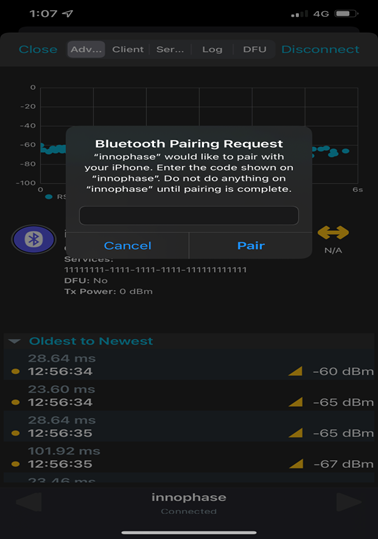

.. _at cmds uc as:

Advance Services
------------------

BLE Provisioning 
~~~~~~~~~~~~~~~~~~~~

Description
~~~~~~~~~~~

This use case is to demonstrate provisioning feature using BLE interface
and configuring Talaria TWO as BLE peripheral mode. Start GATT server.
Configure services, add characteristics, and advertise services. Connect
BLE central and send SSID and Passphrase of your network using write
operation from central (device with BLE app)

Talaria TWO receives credentials (SSID, Passphrase) and MCU triggers
Wi-Fi connection manager to connect to the network using the received
credentials.

Prerequisites
~~~~~~~~~~~~~

Android device installed with native BLE app (BLE Scanner/nRF Connect).

AT Command Sequence 
~~~~~~~~~~~~~~~~~~~~

.. table:: Table 1: BLE Provisioning - AT Commands

   +----------------------------------------+-----------------------------+
   | **AT Command**                         | **Description**             |
   +========================================+=============================+
   | *at*                                   | Checks the connection state |
   +----------------------------------------+-----------------------------+
   | *at+btinit*                            | Initializes the BLE stack   |
   +----------------------------------------+-----------------------------+
   | *at+blecfg=02:03:04:1f:cc:9e,0,        | Configures BLE device with  |
   | InnoPhase_prov*                        | parameters,                 |
   |                                        |                             |
   |                                        | BLE mac address:            |
   |                                        | 02:03:04:1f:cc:9e           |
   |                                        |                             |
   |                                        | BLE address type: 0 (BLE    |
   |                                        | public address)             |
   |                                        |                             |
   |                                        | BLE device name:            |
   |                                        | InnoPhase_prov              |
   +----------------------------------------+-----------------------------+
   | *at+blesrvstart*                       | Starts BLE GATT Server      |
   +----------------------------------------+-----------------------------+
   | *at+bleser                             | Creates unique custom       |
   | vcfg=11111111111111111111111111111111* | service ID (32-bit long     |
   |                                        | value)                      |
   |                                        |                             |
   |                                        | UUID:                       |
   |                                        | *111111                     |
   |                                        | 11111111111111111111111111* |
   +----------------------------------------+-----------------------------+
   | *at+blech                              | Creates a unique custom     |
   | radd=11111111111111111111111111111111, | characteristic ID for the   |
   | 2A29,a,3*                              | above created custom        |
   |                                        | service ID with parameters, |
   |                                        |                             |
   |                                        | Services uuid:              |
   |                                        | *111111                     |
   |                                        | 11111111111111111111111111* |
   |                                        |                             |
   |                                        | Char uuid: *2A29*           |
   |                                        |                             |
   |                                        | Properties: *"a" sets read  |
   |                                        | and write property*         |
   |                                        |                             |
   |                                        | Permission: *3* sets read   |
   |                                        | and write permission        |
   +----------------------------------------+-----------------------------+
   | *at+bleser                             | This includes the           |
   | vadd=11111111111111111111111111111111* | customized service into     |
   |                                        | gatt server where,          |
   |                                        |                             |
   |                                        | Custom service UUID:        |
   |                                        | *111111                     |
   |                                        | 11111111111111111111111111* |
   +----------------------------------------+-----------------------------+
   | *at+bleadvcfg=100,0,1600,0*            |  This configures the        |
   |                                        | advertisement parameters    |
   |                                        | where,                      |
   |                                        |                             |
   |                                        | Fast adv interval: 100      |
   |                                        | which equals 62.5ms (100 \* |
   |                                        | 625 μs)                     |
   |                                        |                             |
   |                                        | Fast adv duration: 0        |
   |                                        | (continues advertisement)   |
   |                                        |                             |
   |                                        | Slow adv interval: 1600,    |
   |                                        | which equals 1000ms (1600   |
   |                                        | \* 625 μs)                  |
   |                                        |                             |
   |                                        | Slow adv duration: 0        |
   +----------------------------------------+-----------------------------+
   | *at+bleadvstart*                       | Start the BLE Advertisement |
   +----------------------------------------+-----------------------------+
   | *at+blecharwrdata=2a29,14*             | Acknowledges BLE            |
   |                                        | Characteristic Write        |
   |                                        | Request with parameters,    |
   |                                        |                             |
   |                                        | characteristic UUID:        |
   |                                        | *2a29,*                     |
   |                                        |                             |
   |                                        | data len (in hex format):   |
   |                                        | *14*                        |
   +----------------------------------------+-----------------------------+
   | *at+wcon= IP,Inno@9070*                | Connect to a desired AP     |
   |                                        | from the received scan      |
   |                                        | results                     |
   |                                        |                             |
   |                                        | Connect to WLAN Network as  |
   |                                        | a Station with SSID= *IP*   |
   |                                        | and                         |
   |                                        |                             |
   |                                        | Passphrase= *Inno@9070*     |
   +----------------------------------------+-----------------------------+
   | *at+wstatus=0*                         | Get IP address of Talaria   |
   |                                        | TWO to verify the           |
   |                                        | connection is successful    |
   +----------------------------------------+-----------------------------+

**Procedure**

**Step 1**: Execute the following commands on Talaria TWO:

.. code-block:: shell

    at
    at+btinit
    at+blecfg=02:03:04:1f:cc:9e,0,InnoPhase_prov
    at+blesrvstart
    at+bleservcfg=11111111111111111111111111111111
    at+blechradd=11111111111111111111111111111111,2A29,a,3
    at+bleservadd=11111111111111111111111111111111
    at+bleadvcfg=100,0,1600,0
    at+bleadvstart

|image94|

Figure 1: BLE Provisioning- serial log

**Step 2**: Launch BLE Scanner app from the Android device and connect
to Talaria TWO GATT Server with the BLE name: InnoPhase_Prov.

|image95|

Figure 2: InnoPhase_Prov-GATT server

**Step 3**: Once the BLE connection is established successfully, send
data/Write Request by pressing W from BLE central. Here, add the SSID
and passphrase of the network.

|image96|

Figure 3: BLE write to add the SSID and Passphrase

Data received from the BLE central app on Talaria TWO. Send an
acknowledgment of the write request from Talaria TWO using following
command on serial terminal:

.. code:: shell

      at+blecharwrdata=2a29,14

|image97|

Figure 4: Acknowledgment of Write request

**Step 4**: Connect to the network with SSID=IP and
Passphrase=Inno@9070.

.. code:: shell

    at+wcon=IP,Inno@9070
    at+wstatus=0

|image98|

Figure 5: WLAN connection

Secure BLE Provisioning Passkey method
~~~~~~~~~~~~~~~~~~~~

.. _description-1:

Description
~~~~~~~~~~~

This use case demonstrates secure BLE provisioning Passkey Entry STK
generation method using mobile device as central.

Talaria TWO is configured as BLE peripheral which consists of
configuring services, characteristics, SMP and advertise services.
Initiate BLE connection from BLE central (device with BLE app) by
entering the 6-digit passkey and send SSID and Passphrase of your
network using write operation from central.

Talaria TWO receives credentials (SSID, Passphrase) and MCU triggers
Wi-Fi connection manager to connect to the network using the received
credentials.

.. _prerequisites-1:

Prerequisites
~~~~~~~~~~~~~

Android/ iOS device installed with BLE app (BLE Scanner/nRF Connect).

.. _at-command-sequence-1:

AT Command Sequence 
~~~~~~~~~~~~~~~~~~~~

.. table:: Table 2: BLE Provisioning - AT Commands

    +----------------------------------------+-----------------------------+
    | **AT Command**                         | **Description**             |
    +========================================+=============================+
    | *at*                                   | Checks the connection state |
    +----------------------------------------+-----------------------------+
    | *at+btinit*                            | Initializes the BLE stack   |
    +----------------------------------------+-----------------------------+
    | *at                                    | Configures BLE device with  |
    | +blecfg=01:01:06:06:01:01,0,innophase* | parameters,                 |
    |                                        |                             |
    |                                        | BLE mac address\ *:         |
    |                                        | 01:01:06:06:01:01*          |
    |                                        |                             |
    |                                        | BLE address type: *0* (BLE  |
    |                                        | public address)             |
    |                                        |                             |
    |                                        | BLE device name:            |
    |                                        | *innophase*                 |
    +----------------------------------------+-----------------------------+
    | *at+blesrvstart*                       | Starts BLE GATT Server      |
    +----------------------------------------+-----------------------------+
    | *at+bleser                             | Creates unique custom       |
    | vcfg=11111111111111111111111111111111* | service ID (32-bit long     |
    |                                        | value)                      |
    |                                        |                             |
    |                                        | UUID:                       |
    |                                        | *111111                     |
    |                                        | 11111111111111111111111111* |
    +----------------------------------------+-----------------------------+
    | *at+blech                              | Creates a unique custom     |
    | radd=11111111111111111111111111111111, | characteristic ID for the   |
    | 0x2a19,a,3*                            | above created custom        |
    |                                        | service ID with parameters, |
    |                                        |                             |
    |                                        | Services uuid:              |
    |                                        | *111111                     |
    |                                        | 11111111111111111111111111* |
    |                                        |                             |
    |                                        | Char uuid: *0x2a19*         |
    |                                        |                             |
    |                                        | Properties: *"a" sets read  |
    |                                        | and write property*         |
    |                                        |                             |
    |                                        | Permission: *3* sets read   |
    |                                        | and write permission        |
    +----------------------------------------+-----------------------------+
    | *at+bleser                             | This includes the           |
    | vadd=11111111111111111111111111111111* | customized service into     |
    |                                        | gatt server where,          |
    |                                        |                             |
    |                                        | Custom service UUID:        |
    |                                        | *111111                     |
    |                                        | 11111111111111111111111111* |
    +----------------------------------------+-----------------------------+
    | *at+bleadvcfg=32,0,160,480*            | This configures the         |
    |                                        | advertisement parameters    |
    |                                        | where,                      |
    |                                        |                             |
    |                                        | Fast adv interval: 32 which |
    |                                        | equals 20ms (32 \* 625 μs)  |
    |                                        |                             |
    |                                        | Fast adv duration: 0        |
    |                                        | (continues advertisement)   |
    |                                        |                             |
    |                                        | Slow adv interval: 160,     |
    |                                        | which equals 100ms (160 \*  |
    |                                        | 625 μs)                     |
    |                                        |                             |
    |                                        | Slow adv duration: 480      |
    |                                        | which equals 300ms (480 \*  |
    |                                        | 625 μs)                     |
    +----------------------------------------+-----------------------------+
    | *at+blesmpcfg=0,0,1,1,0,0,16,1*        | Configures the SMP          |
    |                                        | (security) with parameters, |
    |                                        |                             |
    |                                        | io cap: 0 (display_only)    |
    |                                        |                             |
    |                                        | oob : 0 (default)           |
    |                                        |                             |
    |                                        | bondable: 1                 |
    |                                        |                             |
    |                                        | mitm: 1                     |
    |                                        |                             |
    |                                        | sc: 0                       |
    |                                        |                             |
    |                                        | keypress: 0                 |
    |                                        |                             |
    |                                        | key size min: 16 bytes      |
    |                                        |                             |
    |                                        | encrypt: 1                  |
    +----------------------------------------+-----------------------------+
    | *at+bleadvstart*                       | Start BLE advertisement     |
    +----------------------------------------+-----------------------------+
    | *at+blecharwrdata=2a19,1F*             | Acknowledges BLE            |
    |                                        | Characteristic Write        |
    |                                        | Request with parameters,    |
    |                                        |                             |
    |                                        | characteristic UUID:        |
    |                                        | *2a19,*                     |
    |                                        |                             |
    |                                        | data len(in hex format):    |
    |                                        | *1F*                        |
    +----------------------------------------+-----------------------------+
    | *at+wcon= InnoPhase_AE,Inno@1234*      | Connect to WLAN Network as  |
    |                                        | a Station with SSID=        |
    |                                        | *InnoPhase_AE* and          |
    |                                        |                             |
    |                                        | Passphrase= *Inno@1234*     |
    +----------------------------------------+-----------------------------+

For more details on the AT command parameters, refer BT/BLE commands
section of UG_AT_Commands.pdf

.. _procedure-1:

Procedure 
~~~~~~~~~~

**Step 1**: Execute the following commands on Talaria TWO:

.. code:: shell

    at
    at+btinit
    at+blecfg=01:01:06:06:01:01,0,innophase
    at+blesrvstart
    at+bleservcfg=11111111111111111111111111111111
    at+blechradd=11111111111111111111111111111111, 0x2a19,a,3
    at+bleservadd=11111111111111111111111111111111
    at+bleadvcfg=32,0,160,480
    at+blesmpcfg=0,0,1,1,0,0,16,1
    at+bleadvstart

|image99|

Figure 6: BLE Provisioning- serial log

**Step 2**: Launch nRF Connect app from the iOS device and scan. Talaria
TWO GATT Server with the BLE name innophase will be listed. Click on
connect.

|image100|

Figure 7: innophase-GATT server

The passkey for pairing will be generated and shown on the AT command
line.

|image101|

Figure 8: Randomly generated 6-digit Passkey

**Step 3**: Add the 6-digit passkey “707476” to the app and click on
Pair. Now the BLE GATT connection is created.

|image102|

Figure 9: Pairing request

**Step 4:** Once the BLE connection is established successfully, send
data/Write Request by pressing W from BLE central. Here, add the SSID
and passphrase of the network.

|image103|

Figure 10: BLE write to add the SSID and Passphrase

An asynchronous message on Talaria TWO will be displayed for the Write
Request sent from the BLE central app.

|image104|

Figure 11: Async data reception from mobile app

Send an acknowledgment of the write request from Talaria TWO using
following command:

.. code:: shell

      at+blecharwrdata=2a19,1F

|image105|

Figure 12: Acknowledgment of Write request

**Step 4**: Connect to the network with SSID= InnoPhase_AE and
Passphrase= Inno@1234.

.. code:: shell

      at+wcon= InnoPhase_AE,Inno@1234

|image106|

Figure 13: WLAN connection

Secure BLE Provisioning Just Works Method
~~~~~~~~~~~~~~~~~~~~

.. _description-2:

Description
~~~~~~~~~~~

This use case is to demonstrate secure BLE provisioning Just Works STK
generation method using two Talaria TWO EVBs (say T1 and T2), one as
peripheral and other as central.

One Talaria TWO EVB (T1) is configured as BLE peripheral which consists
of configuring services, characteristics, SMP and advertise services.
Initiate BLE connection from BLE central (another Talaria TWO module)
and send SSID and Passphrase of your network.

T1 receives credentials (SSID, Passphrase) and MCU triggers Wi-Fi
connection manager to connect to the network using the received
credentials.

.. _prerequisites-2:

Prerequisites
~~~~~~~~~~~~~

Two Talaria TWO devices programmed with t2_atcmds.elf

.. _at-command-sequence-2:

AT Command Sequence 
~~~~~~~~~~~~~~~~~~~~

.. table:: Table 3: Secure BLE Provisioning Just Works Method - AT Commands

    +-----------------------------------+----------------------------------+
    | **AT Command**                    | **Description**                  |
    +===================================+==================================+
    | *at*                              | Checks the connection state      |
    +-----------------------------------+----------------------------------+
    | *at+btinit*                       | Initializes the BLE stack        |
    +-----------------------------------+----------------------------------+
    | *at+blec                          | Configures BLE device with       |
    | fg=01:01:06:06:01:01,0,innophase* | parameters,                      |
    |                                   |                                  |
    |                                   | BLE mac address\ *:              |
    |                                   | 01:01:06:06:01:01*               |
    |                                   |                                  |
    |                                   | BLE address type: *0* (BLE       |
    |                                   | public address)                  |
    |                                   |                                  |
    |                                   | BLE device name: *innophase*     |
    +-----------------------------------+----------------------------------+
    | *at+blesrvstart*                  | Starts BLE GATT Server           |
    +-----------------------------------+----------------------------------+
    | *at+bleservcfg=                   | Creates unique custom service ID |
    | 11111111111111111111111111111111* | (32-bit long value)              |
    |                                   |                                  |
    |                                   | UUID:                            |
    |                                   | *1                               |
    |                                   | 1111111111111111111111111111111* |
    +-----------------------------------+----------------------------------+
    | *at+blechradd=                    | Creates a unique custom          |
    | 11111111111111111111111111111111, | characteristic ID for the above  |
    | 0x2a19,a,3*                       | created custom service ID with   |
    |                                   | parameters,                      |
    |                                   |                                  |
    |                                   | Services uuid:                   |
    |                                   | *1                               |
    |                                   | 1111111111111111111111111111111* |
    |                                   |                                  |
    |                                   | Char uuid: *0x2a19*              |
    |                                   |                                  |
    |                                   | Properties: *"a" sets read and   |
    |                                   | write property*                  |
    |                                   |                                  |
    |                                   | Permission: *3* sets read and    |
    |                                   | write permission                 |
    +-----------------------------------+----------------------------------+
    | *at+bleservadd=                   | This includes the customized     |
    | 11111111111111111111111111111111* | service into gatt server where,  |
    |                                   |                                  |
    |                                   | Custom service UUID:             |
    |                                   | *1                               |
    |                                   | 1111111111111111111111111111111* |
    +-----------------------------------+----------------------------------+
    | *at+bleadvcfg=32,0,160,480*       | This configures the              |
    |                                   | advertisement parameters where,  |
    |                                   |                                  |
    |                                   | Fast adv interval: 32 which      |
    |                                   | equals 20ms (32 \* 625 μs)       |
    |                                   |                                  |
    |                                   | Fast adv duration: 0 (continues  |
    |                                   | advertisement)                   |
    |                                   |                                  |
    |                                   | Slow adv interval: 160, which    |
    |                                   | equals 100ms (160 \* 625 μs)     |
    |                                   |                                  |
    |                                   | Slow adv duration: 480 which     |
    |                                   | equals 300ms (480 \* 625 μs)     |
    +-----------------------------------+----------------------------------+
    | *at+blesmpcfg=0,0,1,1,0,0,16,1*   | Configures the SMP (security)    |
    |                                   | with parameters,                 |
    |                                   |                                  |
    |                                   | io cap: 0 (display_only)         |
    |                                   |                                  |
    |                                   | oob : 0 (default)                |
    |                                   |                                  |
    |                                   | bondable: 1                      |
    |                                   |                                  |
    |                                   | mitm: 1                          |
    |                                   |                                  |
    |                                   | sc: 0                            |
    |                                   |                                  |
    |                                   | keypress: 0                      |
    |                                   |                                  |
    |                                   | key size min: 16 bytes           |
    |                                   |                                  |
    |                                   | encrypt: 1                       |
    +-----------------------------------+----------------------------------+
    | *at+bleadvstart*                  | Start BLE advertisement          |
    +-----------------------------------+----------------------------------+
    | *at+blecharwrdata=2a19,1F*        | Acknowledges BLE Characteristic  |
    |                                   | Write Request with parameters,   |
    |                                   |                                  |
    |                                   | characteristic UUID: *2a19,*     |
    |                                   |                                  |
    |                                   | data len(in hex format): *1F*    |
    +-----------------------------------+----------------------------------+
    | *at+wcon= InnoPhase_AE,Inno@1234* | Connect to WLAN Network as a     |
    |                                   | Station with SSID=               |
    |                                   | *InnoPhase_AE* and               |
    |                                   |                                  |
    |                                   | Passphrase= *Inno@1234*          |
    +-----------------------------------+----------------------------------+

For more details on the AT command, refer BT/BLE commands section of
UG_AT_Commands.pdf

.. _procedure-2:

Procedure 
~~~~~~~~~~

**Step 1**: On the first Talaria TWO board (BLE peripheral), execute the
following commands:

.. code:: shell

    at
    at+btinit
    at+blecfg=02:01:04:1f:cc:9e,0,innophase
    at+blesrvstart
    at+bleservcfg=11111111111111111111111111111111
    at+blechradd=11111111111111111111111111111111,0x2a19,a,3
    at+bleservadd=11111111111111111111111111111111
    at+bleadvcfg=32,0,160,480
    at+blesmpcfg=0,0,1,1,0,0,16,1
    at+bleadvstart

|image107|

Figure 14: BLE Peripheral- serial log

**Step 2**: Configure the second Talaria TWO board as BLE central. Scan
for BLE devices and connect to the desired BLE device.

Configure the SMP using at+bleauth with parameters connection id: 0,
oob:0, bondable:1, Mitm: 0, sc:1 and keypress: 0.

Write GATT characteristic with parameters connection id: 0, handle: 1,
length: 51 bytes, data: 31 and Send SSID and PWD for the desired network
using at+blecharw command.

.. code:: shell

    at
    at+btinit
    at+blescancfg=5000,96,48,96,24,1
    at+blecfg=02:03:05:05:03:02,0,central
    at+blescan
    at+blecon=9e-cc-1f-04-01-02,0
    at+bleauth=0,0,1,0,1,0
    at+blecharwr=0,1,51,31,SSID=InnoPhase_AE:PWD=Inno@1234

|image108|

Figure 15: BLE central- serial log

For the data received from the BLE central device, Send an
acknowledgment of the write request from peripheral.

.. code:: shell

      at+blecharwrdata=2a19,1f

|image109|

Figure 16: Acknowledgement of Write request

**Step 4**: Issue at+wcon command to connect to an AP with SSID
"InnoPhase_AE" and passphrase "Inno@1234" from the first EVB(T1)

.. code:: shell

      at+wcon= InnoPhase_AE,Inno@1234

|image110|

Figure 17: WLAN connection

FOTA
~~~~~~~~~~~~~~~~~~~~

Firmware-Over-the-Air (FOTA) allows wireless delivery of firmware
updates or configurations to the embedded devices.

.. _description-3:

Description 
~~~~~~~~~~~~

This use case describes the FOTA process for Talaria TWO EVB using the
Talaria TWO AT commands with details on implementing and triggering FOTA
feature

.. _prerequisites-3:

Prerequisites 
~~~~~~~~~~~~~~

1. Apache server/HFS or any HTTP server to store Talaria TWO ELF
   (t2_atcmds.elf) and FOTA configuration file (fota_config.json).

2. Access Point configured with WPA/WPA2/WPA3 personal/enterprise
   security.

3. Minicom Serial terminal for host interface to execute AT commands.

.. _at-command-sequence-3:

AT Command Sequence 
~~~~~~~~~~~~~~~~~~~~

.. table:: Table 3: FOTA - AT Commands

    +------------+---------------------------------------------------------+
    | **AT       | **Description**                                         |
    | Command**  |                                                         |
    +============+=========================================================+
    | *at*       | To check the connection state                           |
    +------------+---------------------------------------------------------+
    | *at+wcon*  | Connect to secured Access Point                         |
    +------------+---------------------------------------------------------+
    | *a         | Get IP address of Talaria TWO to verify if the          |
    | t+wstatus* | connection (L2+L3) is successful                        |
    +------------+---------------------------------------------------------+
    | *at+f      | This command is optional and is required to update the  |
    | otacfgadd* | configuration file present in the root filesystem of    |
    |            | Talaria TWO                                             |
    +------------+---------------------------------------------------------+
    | *at+fota*  | Start FOTA operation                                    |
    +------------+---------------------------------------------------------+

.. _procedure-3:

Procedure
~~~~~~~~~

The FOTA demo process involves the following steps:

1. Generating hash value for atcmds.elf.

2. Modify fota_config.json file.

3. Server setup.

4. Program and running the application:

   a. Generate root filesystem and program filesystem, application
      image(t2_atcmds.elf) and partition table (ssbl_part_table.json)

   b. Issue the AT commands to connect to network and trigger FOTA.

**Generate the hash value**:

Execute the following command on ubuntu terminal from SDK directory to
generate the hash value:

.. code:: shell

      sha256sum binaries/product/at/bin/atcmds.elf

|image111|

Figure 18: Generate the hash value

**Modification of fota_config.json file**:

Change the following fields in the fota_config.json
(*freertos_sdk_x.y\\binaries\\product\\at\\fs\\fota_config.json*):

1. “hostname” as IP address based on server IP address.

2. “uri” with the path of the fota_config.json and t2_atcmds.elf stored
   at the Apache server.

3. “hash” value.

.. code:: shell

      {
   "package_version"	: "2.0",	
 
  "files"   : [
 
     {
 
    	"type" : "configuration",
 
    	"name" : "fota.config",
 
    	"protocol" : "http",
 
        "hostname" : "192.168.201.233",
 
    	"port" : 80,
 
    	"secured" : 0,  	
 
    	"uri" : "/FOTA/fota_config.json"
 
    },
 
    {
     	"type" : "firmware",
 
    	"name" : "atcmd",
 
    	"version" : "2.1",
 
    	"protocol" : "http",
 
    	"hostname" : "192.168.201.233",
 
    	"port" : 80,
 
    	"secured" : 0,
 
    	"uri" : "/FOTA/t2_atcmds.elf",
 
    	"hash" : "a93ce95fddea0f635f726311d0f8c912909858bfb8c9b4d4204ec5971d9d1aa4 "
     }	
     ]
 }

**Server Setup**:

1. Using Apache:

   a. Apache server is set up in Windows OS.

   b. Download the Apache server from the following link:
      https://httpd.apache.org/docs/current/platform/windows.html#down

..

|image112|

Figure 19: Apache server setup link

c. Place the modified fota_config.json and t2_atcmds.elf under the
   Apache folder htdocs by creating any default folder.

..

   For example: **FOTA**. The same path is added in the “uri” section of
   fota_config.json file.

   |image113|

   Figure 20: Folder to add the JSON and elf file

   **Note**: If using hash to verify the image integrity, ensure to
   place the same t2_atcmds.elf in *\\Apache24\\htdocs\\FOTA* folder for
   which hash was generated.

4. Using HFS (HTTP File Server):

   a. The HTTP File Server can be downloaded from the following link:
      https://github.com/rejetto/hfs/releases

..

   |image114|

   Figure 21: HTTP File Server setup link

b. Open the HFS tool and create a folder (for example: FOTA) and to
   this, copy the modified fota_config.json and t2_atcmds.elf. Same path
   is added in the “uri” section of fota_config.json file.

..

   |image115|

   Figure 22: Folder to add the JSON and elf file

c. Check the server accessibility by sending HTTP GET from the browser
   as shown:

..

   Open Browser-> Enter IP address followed by resource path i.e.,
   "/`192.168.1.216/FOTA <http://192.168.1.7/FOTA>`__\ “ where
   192.168.1.216 is the server IP address (IP address of the laptop) and
   80 is the server port.

   |image116|

   Figure 23: HTTP get from browser to verify server accessibility

**Programming and running the application**:

1. In the ubuntu terminal, run the following command from the SDK
   directory to generate root image and flash root image, SSBL partition
   table and t2_atcmds.elf.

.. code:: shell

      python3 ./script/program_flash.py --no_reset -i binaries/product/at/bin/atcmds.elf -spt tools/partition_files/ssbl_part_table.json

|image117|

Figure 24: Generated root image

|image118|

Figure 25: Flashing the AT command ELF

2. In any terminal window, open miniterm at baud rate of 2457600 to view
   CONSOLE logs for Talaria TWO.

.. code:: shell

      miniterm.py /dev/ttyUSB3 2457600

|image119|

Figure 26: Miniterm console

**Note:** After programming Talaria TWO, it is recommended to reset the
module either using the following command from SDK directory or press
the reset button on the EVB.

.. code:: shell

      ./script/boot.py --device /dev/ttyUSB2 --reset=evk42

|image120|

Figure 27: Talaria TWO reset – console

3. The module boots up with the programmed at command ELF. Issue the
   following commands on the serial terminal to perform the FOTA
   operation.

.. code:: shell

    at
    at+wcon=InnoPhase,Inno@1234
    at+wstatus=0
    at+fota=1

**Note:** Updating the configuration file in Talaria TWO’s root
filesystem:

a. Navigate to the config file (*sdk_x.y\\binaries\\product\\at\\fs*)
   and modify the fota_config.json file.

b. Execute the following command to update the FOTA configuration file
   in the root file system of Talaria TWO:

c. Open the miniterm (miniterm.py /dev/ttyUSB3 2457600) to check the
   console logs on Talaria TWO

.. code:: shell

      at+fotacfgadd=<len>

..

   For example: at+fotacfgadd=652

d. Transfer the updated config file from minicom.

..

   Press CTRL-A Z-> Enter S -> Select ascii -> Select folder where
   config is located -> select continue.

   |image121|

   Figure 28: Updated file received - Talaria TWO console

Serial Log
~~~~~~~~~~

|image122|

Figure 29: FOTA - serial log

Talaria TWO console output when at+fota command is issued on the serial
terminal:

.. code:: shell

    CMD:~ Hexdump of uartbuf before processing, len=10
    7E 04 00 00 00 10 0E 00  63 00                    |  ~.......c.
     Zero arguments
    cmd:~ :2
     resp-len:28
    CMD:atHexdump of uartbuf before processing, len=3
    61 74 00                                          |  at.

     Zero arguments
    cmd:at:2
    Ready
     resp-len:9
    CMD:at+wcon=InnoPhase,Inno@1234Hexdump of uartbuf before processing, len=28
    61 74 2B 77 63 6F 6E 3D  49 6E 6E 6F 50 68 61 73  |  at+wcon=InnoPhas
    65 2C 49 6E 6E 6F 40 31  32 33 34 00              |  e,Inno@1234.

    cmd:at+wcon=InnoPhase,Inno@1234:8

     arg:InnoPhase,Inno@1234

     ssid:0x00059e2c
     passphrase:0x00059e36SSID:InnoPhase,timeo=0xaba9500
    add_network_profile:0
    [43.201,304] CONNECT:b0:95:75:5c:d2:8f Channel:11 rssi:-8 dBm

    MSG:202
     notify
    MSG:200

     notify[43.242,749] MYIP 192.168.0.146
    [43.242,913] IPv6 [fe80::e269:3aff:fe00:167e]-link
    MSG:204

     notify
     resp-len:9
    CMD:at+wstatus=0Hexdump of uartbuf before processing, len=13
    61 74 2B 77 73 74 61 74  75 73 3D 30 00           |  at+wstatus=0.

    cmd:at+wstatus=0:11

     arg:0
     str:0:1
     string : 0 : endptr : :0
    IP:192.168.0.146:255.255.255.0:192.168.0.1
     resp-len:49
     resp-len:9
    CMD:at+fota=1Hexdump of uartbuf before processing, len=10
    61 74 2B 66 6F 74 61 3D  31 00                    |  at+fota=1.

    cmd:at+fota=1:8
     arg:1
     option:1:

     str:1:1

     string : 1 : endptr : :0

    End of command line

     option:<null>:
    fota_json_init: /root/fota_config.json  f = 0x000be1f8
    Parsing rootfs FOTA config file***
    package_version = 1.0
    Package version = 1.0
    type = configuration
    name = fota.config
    version, <null>
    protocol = http
    hostname = 192.168.0.177
    port = 80
    secured = 0
    uri = /FOTA/fota_config.json
    url, <null>
    hash, <null>
    configuration
        fota.config
        http
        192.168.0.177
        80
        0
        /FOTA/fota_config.json
        <null>
        <null>
    type = firmware
    name = atcmd
    version = 2.2
    protocol = http
    hostname = 192.168.0.177
    port = 80
    secured = 0
    uri = /FOTA/t2_atcmds.elf
    url, <null>
    hash = 34aadc96b19b4aff23b08400523d427435be8aa0ff82b6084820165ceadc9174
    firmware
        atcmd
        http
        192.168.0.177
        80
        0
        /FOTA/t2_atcmds.elf
        <null>
        2.2
    Fota Init Success: bc388

    Performing Fota..cc

    check_for_update = 1
    auto_reset=1
    fota_perform check_for_update = 1
    fota_config_file_download 1049
    fota_http_connect:host=192.168.0.177 port=80
    Calling http_client_open()
    fota_config_file_download 1062
    Parsing Remote FOTA config file***
    package_version = 2.0
    Package version = 2.0
    type = configuration
    name = fota.config
    version, <null>
    protocol = http
    hostname = 192.168.0.177
    port = 80
    secured = 0
    uri = /FOTA/fota_config.json
    url, <null>
    hash, <null>
    configuration
        fota.config
        http
        192.168.0.177
        80
        0
        /FOTA/fota_config.json
        <null>
        <null>
    type = firmware
    name = atcmd
    version = 2.1
    protocol = http
    hostname = 192.168.0.177
    port = 80
    secured = 0
    uri = /FOTA/t2_atcmds.elf
    url, <null>
    hash = 34aadc96b19b4aff23b08400523d427435be8aa0ff82b6084820165ceadc9174
    firmware
        atcmd
        http
        192.168.0.177
        80
        0
        /FOTA/t2_atcmds.elf
        <null>
        2.1
    utils_num_str_cmp
     2
     0
     1
     0

    deci1 = 2, fracn1 = 0, deci2 = 1, fracn2 = 0

    Using the Remote config (Newly fetched) file
     type = configuration
     type = firmware
    fota_json_init: /root/part.json  f = 0x000bd3c8
    Image array size = 2
    name = atcmd
    version = 1.0
    start_sector = 32
    1.0 :32
    name = atcmd
    version = 0.0
    start_sector = 232
    0.0 :232
    utils_num_str_cmp
     1
     0
     0
     0
    deci1 = 1, fracn1 = 0, deci2 = 0, fracn2 = 0

    Selected index = 1
    Download the new f/w @ sector = 232

    fota_http_connect:host=192.168.0.177 port=80
    Calling http_client_open().
        fota_http_cb: resp->resp_len = 1252, resp->resp_total_len = 614932 total_rcvd_len= 1252
        fota_http_cb: resp->resp_len = 1460, resp->resp_total_len = 614932 total_rcvd_len= 541452
        fota_http_cb: resp->resp_len = 1460, resp->resp_total_len = 614932 total_rcvd_len= 579412
        fota_http_cb: resp->resp_len = 1460, resp->resp_total_len = 614932 total_rcvd_len= 614452
    .	fota_http_cb: resp->resp_len = 480, resp->resp_total_len = 614932 total_rcvd_len= 614932

    sector_cache_flush_all
    Fw download complete
     image size = 614932
    image hash:    34aadc96b19b4aff23b0840523d427435be8aa0ff82b684820165ceadc9174
    hash from cfg: 34aadc96b19b4aff23b0840523d427435be8aa0ff82b684820165ceadc9174
    Image integity verified. ok.
    next index = 1
    Performing Fota Commit.....

    fota_commit
    utils_num_str_add
     0
     0
     2
     0
    deci1 = 0, fracn1 = 0, deci2 = 2, fracn2 = 0

    utils_num_str_add : out_str = 2.0
    fota_update_part_file: !!!Updated new version = 2.0
    fota_json_init: /root/boot.json  f = 0x000b3718
    Setting next boot index = 1

    Y-BOOT 208ef13 2019-07-22 12:26:54 -0500 790da1-b-7
    ROM yoda-h0-rom-16-0-gd5a8e586
    FLASH:PWAE
    WWWWWAE[0.017,903] heapsize is less than requested 29952 < 30000
    Build $Id: git-4304eac2 $Build $Id: git-4304eac2 $
    Flash detected. flash.hw.uuid: 39483937-3207-00b0-0064-ffffffffffff
    Bootargs: vm.flash_location=0x0003fc00 passphrase=123467890 ssid=innotest

Application Information:
------------------------
Name       : atcmd
Version    : 2.0
Build Date : Oct 25 2023
Build Time : 23:34:21
Heap Available: 268 KB (274456 Bytes)
$App:git-6f5f99b
SDK Ver: FREERTOS_SDK_1.0
At Command App
addr e0:69:3a:00:16:d4

domain:1-11@20before: magic1=0x0, val=0x0, magic2=0x0
Crash detection logic initialized
after: magic1=0x11223344, val=0x0, magic2=0x55667788
Serial-to-Wireless: Ready

starting thread-sock
SSBL Application

Boot indx = 1
Getting Addres of first virt section, name = .virt0 offset = 16c00
vm_flash_location= =fec00
Elf Load OK...

Boot-args:
vm.flash_location=0x000fec00

Build $Id: git-4304eac2 $
Flash detected. flash.hw.uuid: 39483937-3207-00b0-0064-ffffffffffff
Bootargs: vm.flash_location=0x0003fc00 passphrase=123467890 ssid=innotest

Application Information:
------------------------
Name       : atcmd
Version    : 2.0
Build Date : Oct 25 2023
Build Time : 23:34:21
Heap Available: 268 KB (274456 Bytes)
$App:git-6f5f99b
SDK Ver: FREERTOS_SDK_1.0
At Command App
addr e0:69:3a:00:16:d4

domain:1-11@20before: magic1=0x0, val=0x0, magic2=0x0
Crash detection logic initialized
after: magic1=0x11223344, val=0x0, magic2=0x55667788
Serial-to-Wireless: Ready

starting thread-sock

.. |image113| image:: media/image113.png
   :width: 5.90551in
   :height: 3.1661in

.. |image117| image:: media/image117.png
   :width: 6.88976in
   :height: 0.83124in

