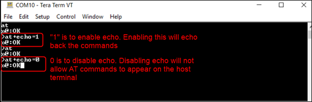

.. _at cmds uc misc:

Miscellaneous
-----------------

Echo Enable/Disable
~~~~~~~~~~~~~~~~~~~~

Description 
~~~~~~~~~~~~

This use case is used to demonstrate echo enable and disable.

Prerequisites 
~~~~~~~~~~~~~~

None.

AT Command Sequence 
~~~~~~~~~~~~~~~~~~~~

.. table:: Table 1: Echo enable/disable - AT Commands

   +---------------+------------------------------------------------------+
   | **AT          | **Description**                                      |
   | Command**     |                                                      |
   +===============+======================================================+
   | *at*          | Check communication state                            |
   +---------------+------------------------------------------------------+
   | *at+echo*     | Enable/Disable the Command Echo Feature              |
   +---------------+------------------------------------------------------+

Procedure 
~~~~~~~~~~

**Step 1**: Execute the followings commands on Talaria TWO:

.. code:: shell

      at
at+echo=1
at
at+echo=0

Serial Log
~~~~~~~~~~

|image123|

.. rst-class:: imagefiguesclass
Figure 1: Echo enable/disable - Serial log

