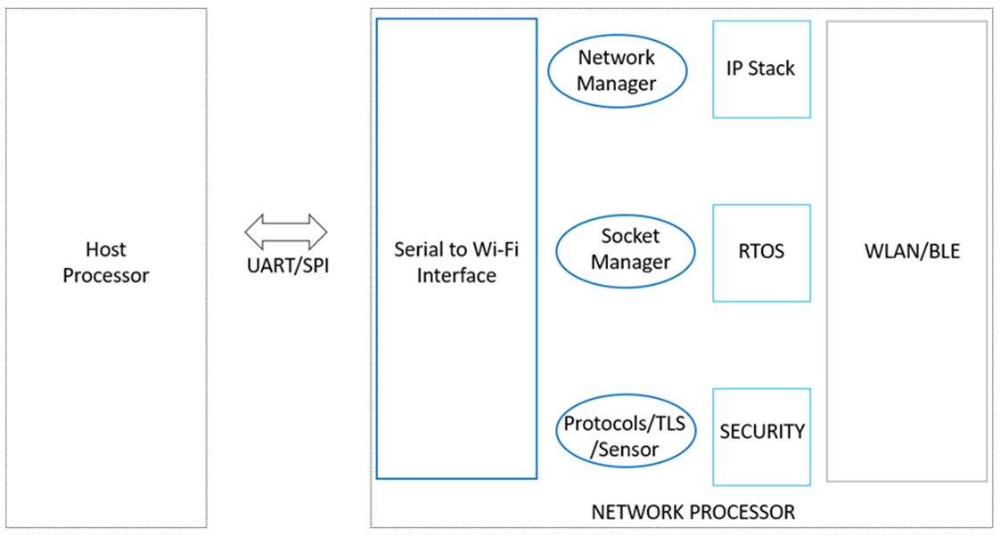
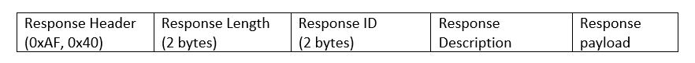

.. _at cmds:

AT commands application provides the Wi-Fi capability to any device having a serial (SPI/UART) interface.

Architecture
************
The overall architecture of the atcmds application interface is shown in Figure 1.

|image1|

.. rst-class:: imagefiguesclass
Figure 1: Architecture of atcmds application

Host CPU uses serial commands to interface and configure the Wi-Fi module. This approach off- loads WLAN, TCP/IP stack and network management to the Wi-Fi chip (Talaria TWO), allowing a small, embedded host to communicate with other hosts on the network using the Wi-Fi link.

Atcmds application mainly runs on command processing mode in which all AT commands are parsed and converted to the corresponding WLAN/Network calls. This mode returns the responses in the same ASCII format as success or failure with additional response data.

The atcmds application is mainly driven using a state machine. On power-up, the required initialization of all modules is performed and then the state machine is entered. This state machine is event driven and process the events received from either the serial port or from the Wi- Fi/network interface as well as internal events from its own module. The state machine calls the appropriate handler for a given set of events.

AT commands are classified as follows:

1.	Configuration Commands

      - Provides commands to configure the module

2.	Wi-Fi Commands

      - WLAN related commands to configure Wi-Fi interface

3.	Socket Commands

      - Commands to perform TCP/IP socket operations

4.	Network Application Commands

      - Commands for various network application (MDNS, HTTP)

5.	BLE Commands 

      - Commands to configure BLE interface and send/receive data

6.	FOTA Commands 

      - Commands to use FOTA functionality

**All AT commands are case insensitive.**

AT commands are terminated with any of the following characters:

1.	CR (Carriage return)

2.	LF (Line feed)

3.	CR+LF

AT Command Response is formatted as:

|image2|

.. rst-class:: imagefiguesclass
Figure 2: Command response format

1.	Each filed in command response message is separated with “:”.

2.	Response Header: This indicates the start of command response. The two-byte header is fixed with values 0xAF and 0x40.

3.	Response Length: This field indicate the total length of Command response.

4.	Response ID: This field indicate the type of response.

5.	Response Description: Indicates the description of command response.

6.	Response Payload: contains the supporting information related to response. Each value will be delimited with colon (“:”).

AT command parser treats some characters are special characters and the details are:

1.	Backspace

2.	Line feed(\n) (0x0D)

3.	Carriage return (\r) (0x0A)

4.	Slash (\) (0x5C)

If any of the mentioned characters are a part of the data to be sent, the user is required to add (0x5C) as a prefix to it. 
Also, another special character is comma (,), which should not be a part of any arguments of any AT commands other than the last parameter.
The subsequent sections describe the steps to setup the Evaluation Board (EVB) and run the AT application on Talaria TWO EVB.

Prerequisites
------------

.. toctree::
   :maxdepth: 2

   1. Prerequisites/Prerequisites.rst

Set-up and Usage
-----------------

.. toctree::
    :maxdepth: 2

    2. Set-up and Usage/1. Pre-setup on Talaria TWO.rst
    2. Set-up and Usage/2. Programming the Application.rst
    2. Set-up and Usage/3. Pre-setup on Host.rst
    2. Set-up and Usage/4. Configure the Serial Port.rst
    2. Set-up and Usage/5. Run the Application.rst

AT Commands
------------------
.. toctree::
   :maxdepth: 2

   3. AT Commands/AT Commands.rst

Commands response Description
------------------------------
.. toctree::
   :maxdepth: 2

   4. Command Response Description/Command Response Description.rst

FOTA Configuration and Environment Set-up
------------------------------
.. toctree::
   :maxdepth: 2

   5. FOTA Configuration and Environment Set-up/FOTA Configuration and Environment Set-up.rst

UseCases
-------------

.. toctree::
   :maxdepth: 2
   
   6. UseCases/1. Usecases - Landing Page.rst
   6. UseCases/2. Wireless Operations.rst
   6. UseCases/3. Network Protocol.rst
   6. UseCases/4. Application Protocol and Data Transfer.rst
   6. UseCases/5. Advanced Services .rst
   6. UseCases/6. Miscellaneous.rst

