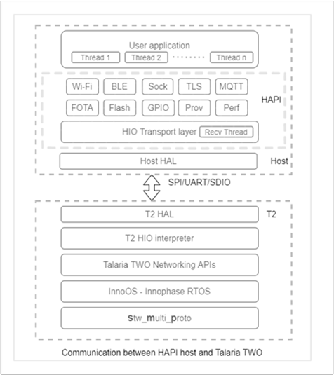
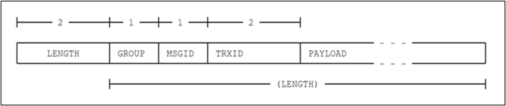

.. _stw mp host app:

Host Application
------------------

The host application uses a library called HAPI (Host Application
Processor Interface) which is a portable library of ‘c’ functions that
wraps the HIO (Host Input/Output) data structs to send a request packet
and receive a response packet from the SMP application executing on
Talaria TWO.

There are three types of messages exchanged between the host and Talaria
TWO:

1. Request message from the host to Talaria TWO.

2. Response message from Talaria TWO to host.

3. Indication message from Talaria TWO to host.

Subsequent section provides description of the HAPI library used by the
host application.

HAPI
~~~~~~

The following block diagram provides an overview of the HAPI
architecture and the communication mechanism between the host
application (using the HAPI APIs and the SMP application running on
Talaria TWO.

|image1|

.. rst-class:: imagefiguesclass
Figure 1: Talaria TWO HAPI SW Stack

The host application follows a protocol to exchange the commands/data
with Talaria TWO’s SMP application. The HAPI layer contains the
following sub layers:

1. HIO transport layer: The HIO transport layer manages sending and
   receiving the commands and data to and from the host.

2. HAPI Groups: The HAPI groups reside on the HIO transport layer and
   provides the APIs to the host/user application. Each of these groups
   provide APIs of a particular type depending on the functionality.

For example, Wi-Fi group provides Wi-Fi related APIs, BLE group provides BLE related APIs etc.

Each of these groups have a unique GROUP ID. Each of the commands sent from a given group will have a unique MSGID.

For example, The Wi-Fi group provides APIs to connect with a unique MSGID and disconnect with another MSGID to an AP.

For every HAPI group in the host application, there is a corresponding HIO group in the SMP application which receives the 
request messages and sends a response message.

The user application calls the HAPI API and provides the required payload through the arguments and the corresponding HAPI group will
generate a frame in the following format:

|image2|

.. rst-class:: imagefiguesclass
Figure 2: Frame format of a request packet

Each frame will contain the following fields.

1. Length: Length of the frame excluding the length field.

2. Group ID: The unique group ID of a HAPI group.

3. MSGID: Message-ID corresponding to each of the commands.

4. TRXID: Number used by the host to sequence requests.

5. Payload: The information/data to be sent to Talaria TWO.

The request frame generated by a HAPI group is sent to Talaria TWO by
the HIO transport layer. The receive thread of the transport layer
blocks until the response from the Talaria TWO is received. Upon
receiving the response, the receive thread unblocks and sends the
response to the user application.

