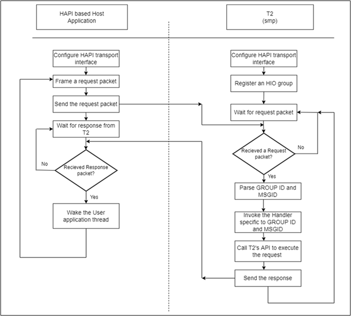
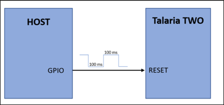

.. _stw mp app:

STW Multi Proto Application
----------------------------

Description
~~~~~~~~~~~~~~~~~~~~

This application represents various host interface APIs in groups called
HIO groups. The HIO groups are similar to the HAPI groups, except that
the HIO groups are part of the SMP application running on Talaria TWO.

HAPI and HIO groups maintain the same GROUP ID and MSGID numbers. The
list of required APIs can be enabled from the Makefile. Few APIs (like
WCM) are enabled by default.

Following is the description of the types of APIs supported by each of
these groups.

1.  WCM: Provides APIs to:

    a. Connect to and disconnect from a Wi-Fi network.

    b. Set and get IPV4/IPV6 address.

    c. Set/Get Wi-Fi power management.

    d. Get RSSI and Tx power values.

    e. Set regulatory domains.

2.  Socket: Provides APIs to:

    a. Create a server and client socket.

    b. Send and receive data.

    c. Get peer information.

3.  MDNS: Provides APIs to:

    a. Set up, stop, and resolve MDNS.

    b. Add and remove an MDNS service.

4.  MQTT: Provides APIs to:

    a. Connect to and disconnect from MQTT server.

    b. Publish and subscribe to and unsubscribe from a topic.

    c. Store and delete certificates required to perform MQTT over TLS.

5.  TLS: Provide APIs to:

    a. Set up and close a TLS connection.

    b. Upload a certificate.

    c. Perform TLS handshake.

    d. Read and write.

6.  BLE: Provides APIs to:

    a. Create a BT host.

    b. Perform GAP operations like setting GAP address, scan, discovery,
       initiate/terminate a connection, configure broadcast,
       discoverable modes and configure advertising interval.

    c. Start a GATT server, initiate/destroy a GATT service, add
       characteristics, configure the device to send notifications,
       indications.

7.  HTTP: Provides APIs to:

    a. Set up and start a HTTP client.

    b. Send client data, set, and delete the HTTP client header.

    c. Store and delete the certificates required to perform a TLS
       connection.

8.  GPIO: Provides APIs to:

    a. Select a GPIO.

    b. Set and reset the state of the GPIO.

9.  File: Provides APIs to:

    a. Add a file to the file system.

    b. Delete a file from file system.

10. AWS: Provides APIs to:

    a. Connect to and disconnect from AWS server.

    b. Set configuration like AWS host URL, thing name, AWS port, the
       path of the certificates, client id.

    c. Send and receive data from AWS server.

11. FOTA: Provides APIs to:

    a. Start FOTA operation.

    b. Send FOTA configuration data.

12. FOS: Provides APIs to:

    a. Start firmware upgrade over serial port.

    b. Send FOTA configuration data.

    c. Commit FOS data to mark as end of image data received by Talaria
       TWO.

13. Un-assoc: Provides APIs to:

    a. Start and stop the unassoc mode.

    b. Configure the mode with parameters like number of probes to be
       transmitted, transmission interval, data rate and information
       element.

Talaria TWO device will service the functionality over UART/SPI/SDIO
interface. The normal operation is to first issue a HIO query request
message. The HIO query response message will include a table of groups
and messages supported by Talaria TWO. It also includes the maximum
request size the device can handle.

Request-Response Message Exchange
~~~~~~~~~~~~~~~~~~~~

The SMP application registers a particular HIO group by calling the
<group>_hio_init() function which in turn calls the hio_api_init(const
struct hio_api \*api, void \*ctx) API to register the HIO message group.

The first argument struct hio_api \*api has the following prototype:

.. code:: shell

    static const struct hio_api hio_api = {
        .group = 0,
        .num_handlers = n,
        .handler = {
        Handler_1,
              .
              .
        Handler_n,
                }
    };

The hio_api struct specifies the following:

1. Group ID.

2. Number of handlers to be registered as a part of HIO group
   registration.

3. Pointers to the handlers that call a Talaria TWO networking API (or a
   custom user API which will be discussed in the subsequent sections)
   to perform the request from the host.

Each handler is associated with a unique ID called MSGID. When a request
packet is sent from a HAPI-based host, The HIO interpreter invokes the
corresponding handler based on the group_id and msg_id. The handler
calls the relevant Talaria TWO’s networking API to execute the request
received from the host and returns a response.

The communication between a HAPI-based application and the SMP
application is illustrated in Figure 1.

|image1|

.. rst-class:: imagefiguesclass
Figure 1: Exchange of request-response packets between Host and Talaria
TWO

Talaria TWO Reset Sequence
--------------------------

After Talaria TWO powers up, a reset needs to be issued by the host
application. This can be done by pulling down the reset pin low for a
period of about 100 ms and then high for a period of about 100 ms.

|image2|

.. rst-class:: imagefiguesclass
Figure 2: Talaria TWO reset sequence block diagram

Code Walkthrough
~~~~~~~~~~~~~~~~~~~~
  

The application first mounts the filesystem to access the certificates
and network configuration files.

.. code:: shell

    rval = utils_mount_rootfs();
    if(0 != rval) {
        os_printf("Muonting rootfs failed.!\n");
        while(1);
    }
    os_printf("\n[APP]root fs mounted, rval = %d", rval);

The application enables the API groups depending on the flag value set
in the make file (i.e., HAVE\_<GROUP>_HIO). The HIO transport driver
initialization also occurs when the first message group is initialized.

The following block initializes the WCM, socket and MDNS groups if the
HAVE\_<GROUP>_HIO value of the corresponding group is set to 1. Since
the WCM group is the first HIO group which is being initialized, the HIO
transport driver initialization occurs and the corresponding interface
i.e., UART/SPI/SDIO is configured on Talaria TWO.

.. code:: shell

    #if HAVE_WCM_HIO==1
        strcat(banner, ", wcm");
        wcm_hio_init();
        num_groups_registered ++;
    #endif

    #if HAVE_SOCK_HIO==1
        strcat(banner, ", sock");
        sock_hio_init();
        num_groups_registered ++;
    #endif

    #if HAVE_MDNS_HIO==1
        strcat(banner, ", mdns");
        mdns_hio_init();
        num_groups_registered ++;
    #endif

The following block initializes the MQTT, TLS, BT, HTTP, FOTA, FOS,
unassoc, provisioning and GPIO groups:

.. code:: shell

    #if HAVE_MQTT_HIO==1
        strcat(banner, ", mqtt");
        mqtt_hio_init();
        num_groups_registered ++;
    #endif

    #if HAVE_TLS_HIO==1
        strcat(banner, ", tls");
        tls_hio_init();
        num_groups_registered ++;
    #endif

    #if HAVE_BT_HIO==1
        strcat(banner, ", bt");
        register_bt_host_hio();
        num_groups_registered ++;
    #endif

    #if HAVE_HTTP_HIO==1
        strcat(banner, ", http");
        hio_http_client_init();
        num_groups_registered ++;
    #endif

    #if HAVE_HTTPS_HIO==1
        strcat(banner, ", https");
        tls_hio_init();
        num_groups_registered ++;
    #endif
    #if HAVE_FOTA_APP==1
        strcat(banner, ", FOTA");
        hio_fota_init();
        num_groups_registered ++;
    #endif

    #if HAVE_FOS_APP==1
        strcat(banner, ", FOS");
        hio_fos_init();
        num_groups_registered ++;
    #endif

    #if HAVE_UNASSOC_SUPPORT==1
        strcat(banner, ", UNASSOC");
        unassoc_api_init();
        num_groups_registered ++;
    #endif

    #if HAVE_PROV_APP==1
        strcat(banner, ", PROV");
        hio_prov_init();
        num_groups_registered ++;
    #endif

    #if HAVE_FILE_HIO==1
        strcat(banner, ", file");
        hio_file_init();
        num_groups_registered ++;
    #endif

    #if HAVE_AWS_HIO==1
        strcat(banner, ", aws");
        aws_app_init();
        num_groups_registered ++;
    #endif

register_hio_packet_hook() function displays the group_id and msg_id of
every packet being sent and received on Talaria TWO.

First, the hook functions to display the packet data being received by
Talaria TWO (input hook) and the packet data being sent by Talaria TWO
(output hook) are defined.

.. code:: shell

    void hio_input_packet_info(struct packet *pkt)
    {
        os_printf("input-hook\n");
        show_packet_info(pkt);
    }
    void hio_output_packet_info(struct packet *pkt)
    {
        os_printf("output-hook\n");
        show_packet_info(pkt);
    }

The show_packet_info() function extracts the GROUP ID and the MSGID and
displays it.

.. code:: shell

    void show_packet_info(struct packet *pkt)
    {
        const struct hio_msghdr *hdr;
        hdr = packet_data(pkt);
        uint32_t group = hdr->group, msgid = hdr->msgid;
        os_printf("hio: group=%d.msgid=%d\n", group, msgid);
    }

Now, the register_hio_packet_hook() function registers the input packet
hook and the output packet hook callback functions.

.. code:: shell

    void register_hio_packet_hook()
    {
        int ret;
        ret = hio_packet_hook_register(hio_input_packet_info,
                hio_output_packet_info);
        os_printf("Packet hook register status = %d\n", ret);
    }

The application will register the HIO packet hook by calling the
register_hio_packet_hook () function when the bootarg displ_pkt_info=1
is issued.

.. code:: shell

    if(os_get_boot_arg_int("disp_pkt_info", 0) != 0) {
        /* Register packet hook.
        * Hook will print the msg_id and group_id of every packets sent and received
        */
        register_hio_packet_hook();
    }

Finally, if LWIP is running, the iPerf3 server is started and SNTP is
initialized.

Adding Custom Groups to SMP Application
~~~~~~~~~~~~~~~~~~~~

When in hosted mode, there might be a requirement to add additional
features to the existing SMP application depending on the end user’s
requirements.

This section describes the procedure to add support for a custom group
to the SMP application with an example. The example application
demonstrates a message exchange between the host application and the SMP
application. The host sends a request message to Talaria TWO and waits
for a response message.

The enhancements need to be performed on both the HAPI-based host
application and the SMP application.

Subsequent sections describe the procedure to add support to custom
groups of the host application and then the procedure to add the support
for custom group.

Procedure to Add Custom Group to the Host Application
~~~~~~~~~~~~~~~~~~~~~~~~~~~~~~~~~~~~~~~~~~~~~~~~~~~~~

1. Define a group number greater than 150 as GROUP ID. The group numbers
   from 0 to 149 will be used by the existing groups.

2. Define a structure for the request message to be sent.

3. Define a structure for the response message to be received.

4. Create a HAPI packet to be sent.

5. Update/copy the data to be sent to the HAPI packet created.

6. Send the HAPI packet to Talaria TWO and wait for the response.

7. If the response is received, read the contents of the response
   packet.

8. Release the memory allocated for the packet.

From the above-described procedure, the following are defined in
api/custom.h in the example application:

1. Custom GROUP ID -158

2. MSGIDs for the custom request message-0x03

3. Custom response message-0x83

4. Structures for the custom request message

5. Custom response message

.. code:: shell

    #define HIO_GROUP_CUSTOM     158
    #define HAPI_CUSTOM_MSG_REQ 0x03
    #define HAPI_CUSTOM_MSG_RSP 0x83

Following is the structure defined for a custom request message:

.. code:: shell

    struct hapi_custom_msg_req {
        char echo_req[MAX_MSG_SIZE]; /*Request message from host*/
    };

Corresponding structure for a custom response message also needs to be
defined:

.. code:: shell

    struct hapi_custom_msg_rsp {
        uint32_t status; /**< result status, zero is success */
        char echo_rsp[MAX_MSG_SIZE]; /**< response from T2 */
    };

A function to send and receive a packet to/from Talaria TWO (i.e.,
api_send_custom_msg()) is defined in *hapi\\lib\\src\\hapi_custom.c.*

First, a packet has to be created by allocating the required amount of
message buffer by calling hapi_pkt_msg_alloc()API.This API will allocate
the required memory and return a pointer of type struct hapi_packet. The
definitions of struct hapi_packet, struct hapi_msg_frame and struct
hapi_msg_hdr are as follows:

.. code:: shell

    /* Headers for all device communication ----- */
    struct hapi_msg_hdr {
        uint8_t group;
        uint8_t  msgid;
        uint16_t trxid;
    };

    struct hapi_msg_frame {
        uint16_t size;      // sizeof data + msghdr
        struct hapi_msg_hdr msg_hdr;
    };

    /* Packet definition ----------------------- */

    #define HAPI_PACKET_MAGIC 0x600D

    struct hapi_packet {
        uint16_t magic;
        struct hapi_msg_frame frame;
        void * msg;
        struct hapi_packet * next;
    };

The pkt_out variable contains the pointer to the struct hapi_packet type
created. The hapi_pkt_msg(pkt_out) API returns a pointer to the message
buffer in the packet created.

.. code:: shell

    struct hapi_custom_msg_req *req;
    struct hapi_packet *pkt_out =
    hapi_pkt_msg_alloc(hapi, HIO_GROUP_CUSTOM, HAPI_CUSTOM_MSG_REQ, sizeof(struct hapi_custom_msg_req), 0);
    req = hapi_pkt_msg(pkt_out);
    /* update req fields */
    memcpy(req->echo_req, msg, sizeof(req->echo_req));

The data to be sent by the host (in the msg buffer in this example) is
copied to the request message buffer. Now, the packet to be sent to
Talaria TWO is ready. The packet contains the following fields:

|image3|

.. rst-class:: imagefiguesclass
Figure 3: Packet contents

The host sends a message: “Hello from host”.

The length of the packet is: sum of size of Payload+TRX ID+MSG ID+GROUP
ID.

This packet will be sent to Talaria TWO by the HIO transport layer. The
application calls the hapi_send_recv_validate() API to send the packet
(i.e., pkt_out) and blocks until a response is received from Talaria
TWO.

.. code:: shell

    struct hapi_packet *pkt_in = hapi_send_recv_validate(hapi, pkt_out, HIO_GROUP_CUSTOM, HAPI_CUSTOM_MSG_RSP);
    if (pkt_in == NULL) {
        /* Unexpected behaviour */
        printf("%s failed.\n", __FUNCTION__);
        goto end;
    }

On receiving the response packet from Talaria TWO,
hapi_send_recv_validate()will return the pointer to the received
response packet.

.. code:: shell

    struct hapi_custom_msg_rsp *rsp = hapi_pkt_msg(pkt_in);
    if (rsp->status != 0) {
        /* Unexpected behaviour */
        printf("%s status failed.\n", __FUNCTION__);
        goto end;
    }

   ok = true;
   printf("recieved :%s-%d\r\n",rsp->echo_rsp,test);
   memcpy(rsp->echo_rsp,resp_msg , sizeof(req->echo_req));

The contents of the message buffer of the received packet are copied
into a buffer for the application to process it.

Procedure to Add Custom Group to Host Application.
~~~~~~~~~~~~~~~~~~~~~~~~~~~~~~~~~~~~~~~~~~~~~~~~~~

The SMP application includes the same GROUP ID, MSG ID and the
structures of request and response message used by the HAPI-based host
application.

1. Create a header file – custom_group.h and include the same custom
   GROUP ID -158, MSGIDs for the custom request message-0x03, custom
   response message-0x83 and the structures for the custom request
   message and custom response message.

2. Define a handler to receive a request packet from the host and send a
   response packet.

3. Define a HIO interface API of type struct hio_api and provide the
   GROUP ID, number of the handlers to be registered and the pointer to
   the handler to be called when a request message with the
   corresponding GROUP ID and MSGID is received. Following is the
   definition of struct hio_api:

.. code:: shell

    struct hio_api {
    uint16_t group;
    uint16_t num_handlers;
    struct packet *(*const handler[])(void *ctx, struct packet *pkt);
    };

Refer document: Talaria_TWO_Host_API_Reference_Guide.pdf (path:
*freertos_sdk_x.y\\doc\\reference_guides\\api_reference_guide*) for more
information on struct hio_api.

4. Register the custom group by calling the hio_api_init(const struct
   hio_api \*api, void \*ctx) API.

5. Following the procedure described above, the custom_group.h header
   file contains the GROUP ID, MSG ID, and the structure definitions of
   the request and response messages. These definitions are same as the
   ones defined in api/custom_group.h file in HAPI-based host
   application.

.. code:: shell

    #define HIO_GROUP_CUSTOM     158

    #define HAPI_CUSTOM_MSG_REQ 0x03
    #define HAPI_CUSTOM_MSG_RSP 0x83

    struct hapi_custom_msg_req {
        char echo_req[MAX_MSG_SIZE]; /*Request message from host*/
    };

    struct hapi_custom_msg_rsp {
        uint32_t status; /**< result status, zero is success */
        char echo_rsp[MAX_MSG_SIZE]; /**< response from T2 */
    };

6. The required functions to register the custom group and the handlers
   are defined in custom_group.c.

   custom_data_send_recieve handler receives request packet, extracts
   the content of the packet, and sends a response packet.

.. code:: shell

    static struct packet *custom_data_send_recieve(void *ctx, struct packet *msg)
    {
        struct hapi_custom_msg_req *req = packet_data(msg);
        os_printf("host sent:%s\r\n",req->echo_req);
        return custom_send_resp();
    }

7. custom_send resp() function creates a response packet, copies the payload to be included in the response packet and returns a pointer
of type struct packet.

.. code:: shell

    static struct packet* custom_send_resp(void)
    {
        char t2_rsp[64] = "Resp from T2";
        struct packet *pkt;
        struct hapi_custom_msg_rsp *rsp;
        pkt = OS_ERROR_ON_NULL(alloc_custom_data_rsp(&rsp));
        rsp->status  = 0;
        memcpy(rsp->echo_rsp, t2_rsp,sizeof(t2_rsp));
        return pkt;
    }

8. alloc_custom_data_rsp() function creates a packet by allocating
   memory for the response packet to be sent. The payload – “Resp from
   Talaria TWO” is copied to the message buffer of the packet created
   and the pointer to the created packet is returned by this function.

.. code:: shell

    static inline struct packet * alloc_custom_data_rsp(struct hapi_custom_msg_rsp **rsp)
    {
        struct packet *pkt = packet_alloc(sizeof(struct hio_msghdr) + sizeof **rsp);
        if (pkt) {
            pfrag_reserve(packet_first_frag(pkt), sizeof(struct hio_msghdr));
            *rsp = packet_insert_tail(pkt, sizeof **rsp);
        }
      return pkt;
    }

9. pfrag_reserve() API returns the data and the address of head of the
   linked list in which the packet is included. packet_insert_tail
   returns the data and address of the tail node in the list. The
   address of the packet created is returned. custom_send_resp()
   function copies the response message payload and returns the packet.

   This packet is sent to the host by the custom_data_send_recieve()
   handler. The host now receives the response packet from Talaria TWO.

