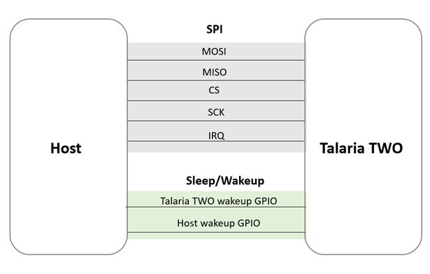
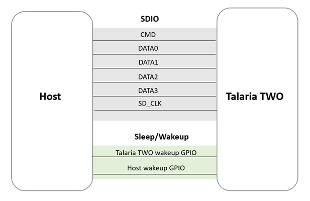

.. _ds hw requirements:

Hardware Requirements 
----------------------

Talaria TWO module supports SPI and SDIO interfaces for host
communication. The interface can be specified by the following boot
argument in Talaria TWO during firmware ELF programming:

.. code:: shell

      hio.transport=[spi|sdio]

1. With SPI interface, Talaria TWO module runs as SPI slave. Host must
   run as the SPI master. The maximum SPI clock frequency supported is
   25MHz. Pins of the Talaria TWO module are fixed. Table 1 provides the
   details:

.. table:: Table 1: SPI interface - PIN details

   +-----------------------+-----------------------+-----------------------+
   | **PIN NUMBER@T2**     | **PIN NAME@T2**       | **PINAME@HOST**       |
   +=======================+=======================+=======================+
   | GPIO_1                | MOSI                  | MOSI                  |
   +-----------------------+-----------------------+-----------------------+
   | GPIO_2                | MISO                  | MISO                  |
   +-----------------------+-----------------------+-----------------------+
   | GPIO_5                | CS                    | CS                    |
   +-----------------------+-----------------------+-----------------------+
   | GPIO_0                | SCK                   | SCK                   |
   +-----------------------+-----------------------+-----------------------+
   | GPIO_4                | IRQ (interrupt)       | HOST IRQ              |
   +-----------------------+-----------------------+-----------------------+

|image1|

.. rst-class:: imagefiguesclass
Figure 1: SPI interface for host communication

2. With SDIO interface, Talaria TWO module runs as SDIO device with the
   SDIO clock at 10MHz. Host must run as the SDIO host. Pins of the
   Talaria TWO module are fixed. Table 2 provides the details:

.. table:: Table 2: SDIO interface - PIN details

    +-----------------------+-----------------------+-----------------------+
    | **PIN NUMBER@T2**     | **PIN NAME@T2**       | **PINAME@HOST**       |
    +=======================+=======================+=======================+
    | GPIO_1                | CMD                | SD-CMD                |
    +-----------------------+-----------------------+-----------------------+
    | GPIO_2                | DATA0              | SD-DATA0              |
    +-----------------------+-----------------------+-----------------------+
    | GPIO_3                | DATA1                 | SD-DATA1              |
    +-----------------------+-----------------------+-----------------------+
    | GPIO_0                | SD_CLK             | SDIO_CLK              |
    +-----------------------+-----------------------+-----------------------+
    | GPIO_4                | DATA2                 | SD-DATA2              |
    +-----------------------+-----------------------+-----------------------+
    | GPIO_5                | DATA3                 | SD-DATA3              |
    +-----------------------+-----------------------+-----------------------+

|image2|

.. rst-class:: imagefiguesclass
Figure 2: SDIO interface for Host communication

3. Two additional GPIOs are required for the following functionalities:

   a. Talaria TWO Wakeup

   This is usually controlled by the host. It is used by the host to
   wake up the Talaria TWO module from sleep. GPIO-14 is used for this
   operation and can be modified depending on the GPIO availability.
   This pin should be connected to one of the GPIOs available on the
   host.

b. Host Power Control

   This connection is controlled by Talaria TWO module and is used to
   turn ON/OFF the host. GPIO-3(SPI)/GPIO-20(SDIO) is used for this
   operation on Talaria TWO module and can be altered depending on the
   GPIO availability.

