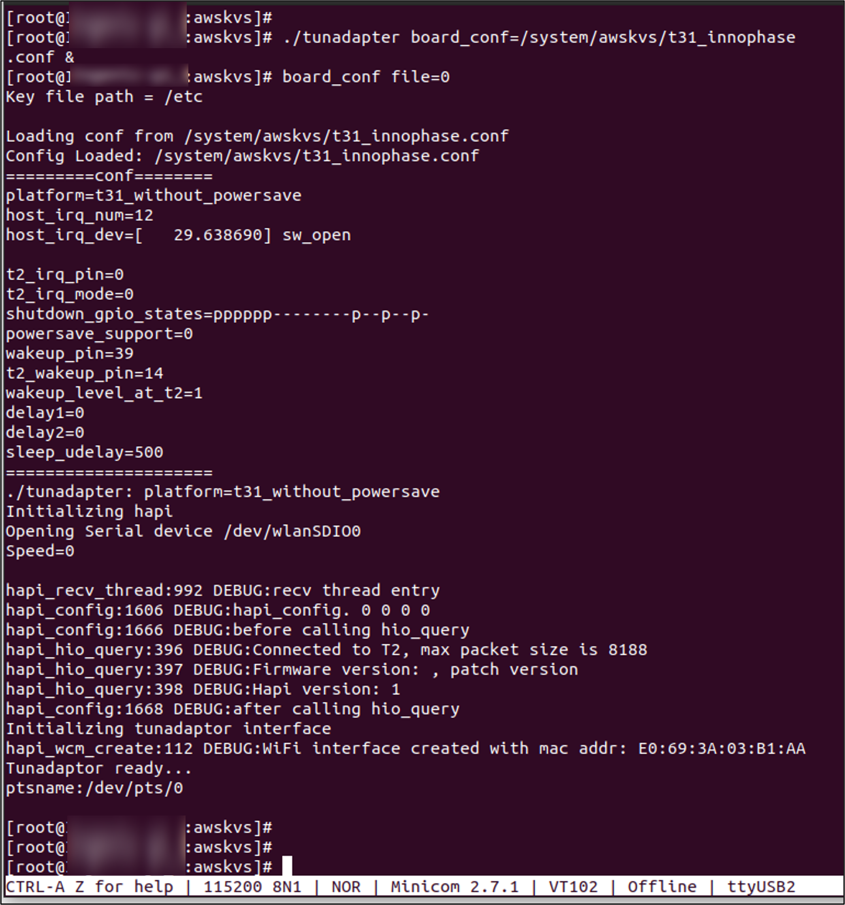

.. _ds tunadapter:

Tunadapter
------------

TUN is a standard Linux network stack feature, which allows the
application to add an interface (physical/virtual device) for data
communication. The TUN interface of this solution allows to tap the IP
frame from the network stack, feed it to the HAPI interface and sends it
to Talaria TWO over SPI/SDIO.

.. table:: Table 1: TUN Adapter - command description

   +--------------+-------------------------------------------------------+
   | **Command**  | **Description**                                       |
   +==============+=======================================================+
   | *.           | Ready to accept connection manager commands and       |
   | /tunadapter* | socket application.                                   |
   +--------------+-------------------------------------------------------+

|image1|

Figure 1: ./tunadapter

The tunadapter has the following optional command line arguments:

.. table:: Table 2: tunadapter - optional command line arguments
+------------------+---------------------------------------------------+
| **Options**      | **Description**                                   |
+==================+===================================================+
| *if_f            | Optional. If not specified, tunadapter uses the   |
| req=<frequency>* | optimal best frequency.                           |
|                  |                                                   |
|                  | For example: $ ./tunadapter if_freq=25000000      |
|                  | configures frequency as 25MHz.                    |
|                  |                                                   |
|                  | **Note**: if_freq is not supported for SDIO       |
|                  | interface.                                        |
+------------------+---------------------------------------------------+
| *wifi_co         | Wi-Fi connect/disconnect offloaded to Talaria TWO |
| n_offload=<1|0>* |                                                   |
|                  | 1= Wi-Fi handled at Talaria TWO                   |
|                  |                                                   |
|                  | 0= Wi-Fi handled at Host                          |
|                  |                                                   |
|                  | For example: $ ./tunadapter wifi_con_offload=0    |
+------------------+---------------------------------------------------+
| *tos=<tos        | Sets tos (type of service) for the network        |
| value>*          | packet.                                           |
|                  |                                                   |
|                  | For example: $./tunadapter tos=160& starts the    |
|                  | tunadpater with video.                            |
+------------------+---------------------------------------------------+
| *board_conf=<b   | Specifies the board specific configuration to be  |
| oard_conf_file>* | used.                                             |
|                  |                                                   |
|                  | For example: $./tunadapter board_conf=../xxx.conf |
|                  | wifi_con_offload=1 heartbeat=1                    |
+------------------+---------------------------------------------------+
| *                | Enables/Disables heartbeat to detect Talaria TWO  |
| heartbeat=<1|0>* | crash.                                            |
|                  |                                                   |
|                  | For example: ./tunadapter heartbeat=1.            |
+------------------+---------------------------------------------------+

