.. ds conmgr commands:

Connection Manager Commands
===========================

Connection manager provides the user interface and the supported
commands are described in the subsequent sections.

Connection Manager supports the following features:

1.  Wi-Fi Scan

2.  Wi-Fi Association/Authentication

3.  Wi-Fi Disassociation

4.  Wi-Fi Disconnect Management.

5.  Static/Dynamic IP set/get

6.  Wi-Fi Connection status

7.  Keep alive connection configuration

8.  Keep alive start/stop

9.  Keep alive connection TLS support

10. Host wakeup configuration (wake word) and clear

11. Auto scan enable/disable/configuration status

12. Shutdown command

13. Wi-Fi Power management set/get

14. FOTA configuration/start/stop

15. WLAN power management configuration

16. TOS parameter for network packets

17. Incoming/outgoing packet information display

18. Kill tunadapter

19. Wi-Fi provisioning over BLE

Connection Manager commands are in the following format:

.. code:: shell

      conmgr <operation> <argument-1>….<argument-n>

**Note**: *Arguments in [ ] are optional and those in <> are mandatory.*

scan - Performs Wi-Fi Scan
---------------------------

.. table:: Table 1: Scan - command, parameters and responses

   +---------+------------------------------------------------------------+
   | **Co    | conmgr scan                                                |
   | mmand** |                                                            |
   +=========+============================================================+
   | **Param | NA                                                         |
   | eters** |                                                            |
   +---------+------------------------------------------------------------+
   | **Res   | Scan results as listed:                                    |
   | ponse** |                                                            |
   |         | -  BSSID                                                   |
   |         |                                                            |
   |         | -  Channel                                                 |
   |         |                                                            |
   |         | -  RSSI                                                    |
   |         |                                                            |
   |         | -  Security                                                |
   |         |                                                            |
   |         | -  SSID                                                    |
   +---------+------------------------------------------------------------+

Example: ./conmgr scan.

|image1|

.. rst-class:: imagefiguesclass
Figure 1: ./conmgr scan – Wi-Fi scan

connect – Connects to Wi-Fi Network 
------------------------------------

Enterprise security type: Personal

.. table:: Table 2: Connect (Personal) - command, parameters and responses

   +---------+------------------------------------------------------------+
   | **Co    | conmgr connect <ssid> <passphrase>[PMK_PATH]               |
   | mmand** |                                                            |
   +=========+============================================================+
   | **Param | *ssid*: Name of the Access Point                           |
   | eters** |                                                            |
   |         | *passphrase*: Password (optional for open security)        |
   |         |                                                            |
   |         | *pmk_path*: Path of the data file containing PMK           |
   |         | cache,(optional, PMK cache works only on WPA2.)            |
   +---------+------------------------------------------------------------+
   | **Res   | “Connected” to the mentioned AP.                           |
   | ponse** |                                                            |
   +---------+------------------------------------------------------------+

Example 1: Configure to connect to an Access Point of SSID innotest and
passphrase 123456789:

.. code:: shell

    ./conmgr connect innotest 123456789

|image2|

.. rst-class:: imagefiguesclass
Figure 2: ./conmgr connect (Personal) – Connect to Wi-Fi network

Enterprise security type: EAP-PSK

.. table:: Table 3: Connect (EAP-PSK) - command, parameters and responses

   +---------+------------------------------------------------------------+
   | **Co    | conmgr connect <ssid> <passphrase><2> <identity>           |
   | mmand** |                                                            |
   +=========+============================================================+
   | **Param | *ssid*: Name of the Access Point                           |
   | eters** |                                                            |
   |         | *passphrase*: Password (optional for open security)        |
   |         |                                                            |
   |         | *2:* Network security type                                 |
   |         |                                                            |
   |         | *identity:* EAP username identity string                   |
   +---------+------------------------------------------------------------+
   | **Res   | “Connected” to the mentioned AP.                           |
   | ponse** |                                                            |
   +---------+------------------------------------------------------------+

|image3|

.. rst-class:: imagefiguesclass
Figure 3: ./conmgr connect (EAP-PSK) – Connect to Wi-Fi network

Enterprise security type: EAP-TLS

.. table:: Table 4: Connect (EAP-TLS) - command, parameters and responses

   +---------+------------------------------------------------------------+
   | **Co    | conmgr connect <ssid> <3> <identity> <ca_path> <cert_path> |
   | mmand** | <pkey_path> <pkey_pwd>                                     |
   +=========+============================================================+
   | **Param | *ssid*: Name of the Access Point                           |
   | eters** |                                                            |
   |         | *3:* Network security type                                 |
   |         |                                                            |
   |         | *identity:* EAP username identity                          |
   |         |                                                            |
   |         | *ca_path:* CA certificate path in Talaria TWO filesystem   |
   |         |                                                            |
   |         | *cert_path:* Client certificate path in Talaria TWO        |
   |         | filesystem                                                 |
   |         |                                                            |
   |         | *pkey_path:* Path of private key file in Talaria TWO       |
   |         | filesystem                                                 |
   |         |                                                            |
   |         | *pkey_pwd:* Private key password                           |
   +---------+------------------------------------------------------------+
   | **Res   | “Connected” to the mentioned AP.                           |
   | ponse** |                                                            |
   +---------+------------------------------------------------------------+

|image4|

.. rst-class:: imagefiguesclass
Figure 4: ./conmgr connect (EAP-TLS) – Connect to Wi-Fi network

Enterprise security type: EAP-PEAP

.. table:: Table 5: Connect (EAP-PEAP) - command, parameters and responses

   +---------+------------------------------------------------------------+
   | **Co    | conmgr connect <ssid> <4> <identity> <ca_path> <identity2> |
   | mmand** | <password><phase2auth>                                     |
   +=========+============================================================+
   | **Param | *ssid*: Name of the Access Point                           |
   | eters** |                                                            |
   |         | *4:* Network security type                                 |
   |         |                                                            |
   |         | *identity:* EAP username identity                          |
   |         |                                                            |
   |         | *ca_path:* CA certificate path                             |
   |         |                                                            |
   |         | *identity2:* EAP username identity for Phase 2             |
   |         |                                                            |
   |         | *password:* Private key password                           |
   |         |                                                            |
   |         | *phase2auth:* Phase 2 authentication                       |
   +---------+------------------------------------------------------------+
   | **Res   | “Connected” to the mentioned AP.                           |
   | ponse** |                                                            |
   +---------+------------------------------------------------------------+

|image5|

.. rst-class:: imagefiguesclass
Figure 5: ./conmgr connect (EAP-PEAP) – Connect to Wi-Fi network

**Certificate Storing Method for Enterprise Security Certificates**

.. code:: shell

    sudo openocd -s conf/ -f ftdi_swd.cfg -f t2_swd.cfg
    sudo ./script/arden.py ./apps/gordon-jtag/bin/gordon-jtag.elf
    sudo python3 ./script/gdbrun.py  ./apps/gordon-jtag/bin/gordon-jtag.elf --noconsole –nowait
    ./script/storage.py --device localhost:10000 write ~/Downloads/rootCACert.pem /data/ca.pem
    ./script/storage.py --device localhost:10000 write ~/Downloads/client_cert.pem /data/client.pem
    ./script/storage.py --device localhost:10000 write ~/Downloads/client_key.pem /data/client.key

disconnect – Disconnects from Wi-Fi Network
-------------------------------------------

.. table:: Table 6: Disconnect - command, parameters and responses

   +---------+------------------------------------------------------------+
   | **Co    | conmgr disconnect                                          |
   | mmand** |                                                            |
   +=========+============================================================+
   | **Param | None                                                       |
   | eters** |                                                            |
   +---------+------------------------------------------------------------+
   | **Res   | “Disconnected” from the Wi-Fi network.                     |
   | ponse** |                                                            |
   +---------+------------------------------------------------------------+

Example: ./conmgr disconnect.

|image6|

.. rst-class:: imagefiguesclass
Figure 6: ./conmgr disconnect – Disconnect from Wi-Fi network

IP – Get/Set ipv4 Address 
--------------------------

.. table:: Table 7: IP - command, parameters and responses

   +----------------+------------------------------------------------------------+
   | **Command**    | conmgr ip <ipaddr4> <net mask> <gateway ip> <dns serverip> |
   +================+============================================================+
   | **Parameters** | *ipaddr4*: IP address, as big-endian integer               |
   |                | *netmask*: Netmask, as big-endian integer                  |
   |                | *gateway ip*: Default-route address, as big-endian         |
   |                | integer.                                                   |
   |                | *dns server ip*: DNS server address, as big-endian         |
   |                | integer.                                                   |
   |                | Execute the following to get current ipv4 address          |
   |                | information:                                               |
   |                |                                                            |
   |                | .. code:: shell                                            |
   |                |                                                            |
   |                |        conmgr ip                                           |
   +----------------+------------------------------------------------------------+
   | **Response**   | Gets the IP configuration status.                          |
   +----------------+------------------------------------------------------------+

Example: Set static IP address 192.168.1.174, subnetmask 255.255.255.0,
Gateway 192.168.1.1 and DNS serverip 192.168.1.1:

.. code:: shell

      ./conmgr ip 192.168.1.174 255.255.255.0 192.168.1.1 192.168.1.1

|image7|

.. rst-class:: imagefiguesclass
Figure 7: ./conmgr ip – Set/Get Static IP Address

kaconfig – Configures keepalive/shadow Service
----------------------------------------------

.. table:: Table 8: kaconfig - command, parameters and responses

   +--------+-------------------------------------------------------------+
   | **Com  | conmgr kaconfig <server ip > <server port> <interval>       |
   | mand** | <heartbeat msg> <wakeup word> <timeout>                     |
   +========+=============================================================+
   | **     | *server ip*: Server IP address to start keep alive socket.  |
   | Parame |                                                             |
   | ters** | *server port*: Server port number.                          |
   |        |                                                             |
   |        | *interval*: Interval to send heartbeat message.             |
   |        |                                                             |
   |        | *heartbeat msg*: Heartbeat message to be sent.              |
   |        |                                                             |
   |        | *wakeup word*: Wake word to receive from server. This wake  |
   |        | word will be compared with data received from the server.   |
   |        | If this matches, host wakeup will be triggered.             |
   |        |                                                             |
   |        | *timeout*: Timeout for heartbeat acknowledge message.       |
   +--------+-------------------------------------------------------------+
   | **Resp | Keepalive config: success message.                          |
   | onse** |                                                             |
   +--------+-------------------------------------------------------------+

Example: Send HeartBeatPacket message to server IP address 172.16.16.155
using port number 5000 every 3 seconds.

It times out if there has been no acknowledgment received from server
after 10 seconds.

WakeUP is the string using which cloud can trigger Talaria TWO host wake
up.

.. code:: shell

      ./conmgr kaconfig 172.16.16.155 5000 3 HeartBeatPacket WakeUP 10

|image8|

.. rst-class:: imagefiguesclass
Figure 8: kaconfig: Configure Keepalive Send

kaconfigget – Gets keepalive/shadow Service Configuration
---------------------------------------------------------

.. table:: Table 9: kaconfigget - command, parameters and responses

   +---------+------------------------------------------------------------+
   | **Co    | conmgr kaconfigget                                         |
   | mmand** |                                                            |
   +=========+============================================================+
   | **Param | None                                                       |
   | eters** |                                                            |
   +---------+------------------------------------------------------------+
   | **Res   | This command provides the following information:           |
   | ponse** |                                                            |
   |         | -  association status: associated/not associated           |
   |         |                                                            |
   |         | -  keepalive configuration status: keepalive_configured    |
   |         |    /keepalive not configured                               |
   |         |                                                            |
   |         | -  keepalive status: Keepalive connected/ Keepalive Not    |
   |         |    connected”                                              |
   |         |                                                            |
   |         | -  keepalive interval: Interval in seconds to send         |
   |         |    keepalive message                                       |
   |         |                                                            |
   |         | -  keepalive port: Port number                             |
   |         |                                                            |
   |         | -  keepalive IP: IP address                                |
   |         |                                                            |
   |         | -  heartbeat msg: Keepalive message format                 |
   |         |                                                            |
   |         | -  wakeup msg: Wakeup message format                       |
   |         |                                                            |
   |         | -  heartbeat sent times: Number of times keepalive message |
   |         |    was sent                                                |
   |         |                                                            |
   |         | -  wakeup recv times: Number of times wakeup message was   |
   |         |    received                                                |
   +---------+------------------------------------------------------------+

Example: ./conmgr kaconfigget.

|image9|

.. rst-class:: imagefiguesclass
Figure 9: kaconfigget - Read Keepalive Configuration

kastart – Starts keepalive/shadow Service
-----------------------------------------

.. table:: Table 10: kastart - command, parameters and responses

   +---------+------------------------------------------------------------+
   | **Co    | conmgr kastart                                             |
   | mmand** |                                                            |
   +=========+============================================================+
   | **Param | None                                                       |
   | eters** |                                                            |
   +---------+------------------------------------------------------------+
   | **Res   | Keepalive start: success/fail                              |
   | ponse** |                                                            |
   +---------+------------------------------------------------------------+

Example: ./conmgr kastart.

|image10|

.. rst-class:: imagefiguesclass
Figure 10: kastart - Start Sending Keepalive to Server

kastop – Stops keepalive/shadow Service
---------------------------------------

.. table:: Table 11: kastop - command, parameters and responses

   +---------+------------------------------------------------------------+
   | **Co    | conmgr kastop                                              |
   | mmand** |                                                            |
   +=========+============================================================+
   | **Param | None                                                       |
   | eters** |                                                            |
   +---------+------------------------------------------------------------+
   | **Res   | Keepalive stop: success/fail                               |
   | ponse** |                                                            |
   +---------+------------------------------------------------------------+

Example: ./conmgr kastop.

|image11|

.. rst-class:: imagefiguesclass
Figure 11: kastop - Stop Sending Keepalive to Server

kadel – Deletes keepalive/shadow Service Configuration
------------------------------------------------------

.. table:: Table 12: kadel - command, parameters and responses

   +---------+------------------------------------------------------------+
   | **Co    | conmgr kadel                                               |
   | mmand** |                                                            |
   +=========+============================================================+
   | **Param | None                                                       |
   | eters** |                                                            |
   +---------+------------------------------------------------------------+
   | **Res   | Keepalive conf delete: “success/failed”                    |
   | ponse** |                                                            |
   +---------+------------------------------------------------------------+

Example: ./conmgr kadel.

|image12|

.. rst-class:: imagefiguesclass
Figure 12: kadel - Delete Keepalive Configuration

status – Gets Dual-Stack Status
-------------------------------

.. table:: Table 13: status - command, parameters and responses

   +---------+------------------------------------------------------------+
   | **Co    | conmgr status                                              |
   | mmand** |                                                            |
   +=========+============================================================+
   | **Param | None                                                       |
   | eters** |                                                            |
   +---------+------------------------------------------------------------+
   | **Res   | The status command respond contains following information: |
   | ponse** |                                                            |
   |         | -  mode: STA. 0=STA                                        |
   |         |                                                            |
   |         | -  status: 1=associated/0=not associated                   |
   |         |                                                            |
   |         | -  ssid: SSID of the connected network                     |
   |         |                                                            |
   |         | -  bssid: BSSID of the connected network                   |
   |         |                                                            |
   |         | -  sta-mac – station mac address                           |
   |         |                                                            |
   |         | -  channel: Wi-Fi channel                                  |
   |         |                                                            |
   |         | -  rssi: Estimated RSSI for the station                    |
   |         |                                                            |
   |         | -  IPv4 address: IP address of the connected network       |
   |         |                                                            |
   |         | -  subnet mask: Netmask, as big-endian integer             |
   |         |                                                            |
   |         | -  default gateway: default route, as big-endian integer   |
   |         |                                                            |
   |         | -  dns: DNS server, as big-endian integer                  |
   |         |                                                            |
   |         | -  Security: WPA/WPA2 personal security                    |
   |         |                                                            |
   |         | -  heap remaining: Heap memory remaining                   |
   |         |                                                            |
   |         | -  Talaria TWO powersave: Power save status                |
   +---------+------------------------------------------------------------+

Example: ./conmgr status.

|image13|

.. rst-class:: imagefiguesclass
Figure 13: status: Get Status Information

wakeupconfig – Configures Host Wakeup PIN
-----------------------------------------

.. table:: Table 14: wakeupconfig - command, parameters and responses

   +---------+------------------------------------------------------------+
   | **Co    | conmgr wakeupconfig <wakeup pin> <wakeup level> <pin       |
   | mmand** | direction>                                                 |
   +=========+============================================================+
   | **Param | *wakeup pin*: Wake up pin number                           |
   | eters** |                                                            |
   |         | *wakeup level*: Host wakeup level (0/1)                    |
   |         |                                                            |
   |         | *pin direction*: 0 – output (default) / 1 – input          |
   |         |                                                            |
   |         | **Note**: If no value is provided to *pin direction*, 0 is |
   |         | taken as default.                                          |
   +---------+------------------------------------------------------------+
   | **Res   | Wakeup configuration: success/fail                         |
   | ponse** |                                                            |
   +---------+------------------------------------------------------------+

**Note**: To use wakeupconfig on a Host platform with MCU, GPIO14 and
GPIO21 should be configured as described below:

1. *./conmgr wakeupconfig 14 1 1*

where,

a. wakeup pin=14

b. wakeup level=1

c. pin direction=1

2. *./conmgr wakeupconfig 21 0*

where,

a. wakeup pin=21

b. wakeup level=0

Example: Configure gpio20 on Talaria TWO’s end as wakeup with high
state.

.. code :: shell

      ./conmgr wakeupconfig 20 1

|image14|

.. rst-class:: imagefiguesclass
Figure 14: wakeupconfig - Configure Host Wakeup using GPIO

getwakeupreason – Gets Host Wakeup Reason
-----------------------------------------

.. table:: Table 15: getwakeupreason - command, parameters and responses

   +---------+------------------------------------------------------------+
   | **Co    | conmgr getwakeupreason                                     |
   | mmand** |                                                            |
   +=========+============================================================+
   | **Param | None                                                       |
   | eters** |                                                            |
   +---------+------------------------------------------------------------+
   | **Res   | Valid wakeup reasons are as follows:                       |
   | ponse** |                                                            |
   |         | -  Network wakeup                                          |
   |         |                                                            |
   |         | -  TCP timeout                                             |
   |         |                                                            |
   |         | -  TCP fin                                                 |
   |         |                                                            |
   |         | -  AP Disconnect                                           |
   |         |                                                            |
   |         | -  PIR                                                     |
   |         |                                                            |
   |         | -  Button                                                  |
   |         |                                                            |
   |         | -  Autoscan                                                |
   |         |                                                            |
   |         | -  DHCP renewal                                            |
   |         |                                                            |
   |         | -  Connected to network                                    |
   |         |                                                            |
   |         | -  Wakeup gpio1                                            |
   |         |                                                            |
   |         | -  Wakeup gpio2                                            |
   +---------+------------------------------------------------------------+

Example: ./conmgr getwakeupreason

|image15|

.. rst-class:: imagefiguesclass
Figure 15: getwakeupreason - Get Wakeup Reason

wakeupreasoncls – Clears Host Wakeup Reason
-------------------------------------------

.. table:: Table 16: wakeupreasoncls - command, parameters and responses

   +---------+------------------------------------------------------------+
   | **Co    | conmgr wakeupreasoncls                                     |
   | mmand** |                                                            |
   +=========+============================================================+
   | **Param | None                                                       |
   | eters** |                                                            |
   +---------+------------------------------------------------------------+
   | **Res   | Wakeup reason clear: success                               |
   | ponse** |                                                            |
   +---------+------------------------------------------------------------+

Example: ./conmgr wakeupreasoncls

|image16|

.. rst-class:: imagefiguesclass
Figure 16: wakeupreasoncls - Clear Wakeup Reason

autoscanenable – Enables Autoscan Operation
-------------------------------------------

.. table:: Table 17: autoscanenable - command, parameters and responses

   +---------+------------------------------------------------------------+
   | **Co    | conmgr autoscanenable<interval> <ssid>                     |
   | mmand** |                                                            |
   +=========+============================================================+
   | **Param | *interval*: Scan interval in seconds.                      |
   | eters** |                                                            |
   |         | *ssid*: SSID to scan for.                                  |
   +---------+------------------------------------------------------------+
   | **Res   | Autoscan Enabled/Autoscan Enable: failed                   |
   | ponse** |                                                            |
   +---------+------------------------------------------------------------+

Example: Set the scan interval to 1 second for ssid ct_asus.

.. code:: shell

      ./conmgr autoscanenable 1 ct_asus

|image17|

.. rst-class:: imagefiguesclass
Figure 17: autoscanenable - Enable Autoscan

autoscandisable – Disables Autoscan Operation
---------------------------------------------

.. table:: Table 18: autoscandisable - command, parameters and responses

   +----------+-----------------------------------------------------------+
   | **C      | conmgr autoscandisable                                    |
   | ommand** |                                                           |
   +==========+===========================================================+
   | **Para   | None                                                      |
   | meters** |                                                           |
   +----------+-----------------------------------------------------------+
   | **Re     | Autoscan Disabled/Autoscan Disable: failed                |
   | sponse** |                                                           |
   +----------+-----------------------------------------------------------+

Example: ./conmgr autoscandisable.

|image18|

.. rst-class:: imagefiguesclass
Figure 18: autoscandisable - Disable Autoscan

shutdown – Triggers Host Shutdown
---------------------------------

.. table:: Table 19: shutdown - command, parameters and responses

   +--------------------+-------------------------------------------------+
   | **Command**        | conmgr shutdown                                 |
   +====================+=================================================+
   | **Parameters**     | None                                            |
   +--------------------+-------------------------------------------------+
   | **Response**       | Shutdown: success/failed                        |
   +--------------------+-------------------------------------------------+

Example: ./conmgr shutdown.

|image19|

.. rst-class:: imagefiguesclass
Figure 19: shutdown - Host shutdown

kasecconfig – Configures Keepalive Security Parameters
------------------------------------------------------

.. table:: Table 20: kasecconfig - command, parameters and responses

   +----------+-----------------------------------------------------------+
   | **C      | conmgr kasecconfig <config> <certificate name>            |
   | ommand** |                                                           |
   +==========+===========================================================+
   | **Para   | *config*: Configuration options:                          |
   | meters** |                                                           |
   |          | 1-> enable                                                |
   |          |                                                           |
   |          | 0-> disable                                               |
   |          |                                                           |
   |          | *certificate name*: TLS certificate name                  |
   +----------+-----------------------------------------------------------+
   | **Re     | Keep-alive sec config: success/failed                     |
   | sponse** |                                                           |
   +----------+-----------------------------------------------------------+

Example: Enable keepalive secure configuration with the certificate name
cert.pem.

.. code:: shell

      ./conmgr kasecconfig 1 cert.pem

|image20|

.. rst-class:: imagefiguesclass
Figure 20: kasecconfig - Enable Keepalive TLS

**Certificate storing method for kasecconfig:**

.. code:: shell

      sudo openocd -s conf/ -f ftdi_swd.cfg -f t2_swd.cfg 
sudo ./script/arden.py ./apps/gordon-jtag/bin/gordon-jtag.elf 
sudo python3 ./script/gdbrun.py  ./apps/gordon-jtag/bin/gordon-jtag.elf --noconsole –nowait
./script/storage.py --device localhost:10000 write ~/Downloads/www-google-com.pem /data/cert/www-google-com.pem

wpmconfig – Configures WLAN Power Management
--------------------------------------------

.. table:: Table 21: wpmconfig - command, parameters and response

   +---------+------------------------------------------------------------+
   | **Co    | conmgr wpmconfig <listen_interval> <traffic_timeout>       |
   | mmand** | <pm_options>                                               |
   +=========+============================================================+
   | **Param | *listen_interval*: Listen to each listen_interval beacon.  |
   | eters** |                                                            |
   |         | *traffic_tmo*: Traffic timeout in milliseconds. The Wi-Fi  |
   |         | interface will go to Wi-Fi power save if no traffic has    |
   |         | occurred for this time.                                    |
   |         |                                                            |
   |         | *pm_options* : Power save options:                         |
   |         |                                                            |
   |         | 1. ps-poll(1): Send ps poll if a beacon was missed.        |
   |         |                                                            |
   |         | 2. Dynamic_listen_interval(2): Listen to each beacon if    |
   |         |    there has been traffic recently.                        |
   |         |                                                            |
   |         | 3. sta_rx_nap(4): Turn off receiver for uninteresting      |
   |         |    frames/station.                                         |
   |         |                                                            |
   |         | 4. sta_bcast_only(8): Do not receive multicast frames that |
   |         |    are not broadcasted.                                    |
   |         |                                                            |
   |         | 5. tx_ps(16): Send outgoing frames without leaving Wi-Fi   |
   |         |    power save                                              |
   |         |                                                            |
   |         | 6. mcast_ignore(32): Ignore the multicast flag in beacons. |
   |         |                                                            |
   |         | 7. dtim_only(64): Listen to only DTIM beacons              |
   +---------+------------------------------------------------------------+
   | **Res   | Talaria TWO wcm pm config: success/failed                  |
   | ponse** |                                                            |
   +---------+------------------------------------------------------------+

Example: Configure the listen interval to 3, traffic timeout to 12ms and
enable ps-poll.

.. code:: shell

      ./conmgr wpmconfig 3 12 1

|image21|

.. rst-class:: imagefiguesclass
Figure 21: wpmconfig – Configure WLAN power management

powersave – Suspend Enable/Disable on Talaria TWO
-------------------------------------------------

.. table:: Table 22: powersave - command, parameters and response

   +----------+-----------------------------------------------------------+
   | **C      | conmgr powersave <Enable/Disable>                         |
   | ommand** |                                                           |
   +==========+===========================================================+
   | **Para   | Enable: 1                                                 |
   | meters** |                                                           |
   |          | Disable:0                                                 |
   +----------+-----------------------------------------------------------+
   | **Re     | powersave: “success/failed”                               |
   | sponse** |                                                           |
   +----------+-----------------------------------------------------------+

Example: Disable and enable suspend mode on Talaria TWO.

.. code:: shell

      ./conmgr powersave 0 
./conmgr powersave 1

|image22|

.. rst-class:: imagefiguesclass
Figure 22: powersave – Suspend disable/enable on Talaria TWO

version – Gets Version Information
----------------------------------

.. table:: Table 23: version - command, parameters and responses

   +-----------+----------------------------------------------------------+
   | **        | conmgr version                                           |
   | Command** |                                                          |
   +===========+==========================================================+
   | **Par     | None                                                     |
   | ameters** |                                                          |
   +-----------+----------------------------------------------------------+
   | **R       | version get: success/failed                              |
   | esponse** |                                                          |
   |           | Displays version information such as version of          |
   |           | tunadapter, embedded app, conmgr , dual_stack            |
   +-----------+----------------------------------------------------------+

Example: ./conmgr version.

|image23|

.. rst-class:: imagefiguesclass
Figure 23: version - Get Version Information

cbenable – Enable Connect/Disconnect Callback
---------------------------------------------

.. table:: Table 24: cbenable - command, parameters and responses

   +----------+-----------------------------------------------------------+
   | **C      | conmgr cbenable                                           |
   | ommand** |                                                           |
   +==========+===========================================================+
   | **Para   | None                                                      |
   | meters** |                                                           |
   +----------+-----------------------------------------------------------+
   | **Re     | cbenable: “success/failed”                                |
   | sponse** |                                                           |
   +----------+-----------------------------------------------------------+

Example: ./conmgr cbenable.

|image24|

.. rst-class:: imagefiguesclass
Figure 24: cbenable – Enable connect/disconnect callback

fos – Upgrade the WLAN firmware from Host
-----------------------------------------

.. table:: Table 25: fos- command, parameters and responses

   +----------+-----------------------------------------------------------+
   | **C      | conmgr <fos> <elf_path> <hash> <auto_reset>               |
   | ommand** |                                                           |
   +==========+===========================================================+
   | **Para   | *elf_path* (must): Path of the Dual-Stack ELF             |
   | meters** |                                                           |
   |          | *hash* (optional): sha256 hash of the elf provided        |
   |          | through elf_path. Use --no_hash to skip this argument     |
   |          |                                                           |
   |          | *auto_reset* (optional): 1 – Talaria TWO is reset         |
   |          | automatically after Successful Upgrade                    |
   |          |                                                           |
   |          | 0 - Host needs to reset Talaria TWO after Successful      |
   |          | Upgrade                                                   |
   +----------+-----------------------------------------------------------+
   | **Re     | Firmware upgrade: “success/failed”                        |
   | sponse** |                                                           |
   +----------+-----------------------------------------------------------+

Example: Upgrading WLAN firmware from Host

|image25|

.. rst-class:: imagefiguesclass
Figure 25: fos – Upgrade the WLAN firmware from Host

**Note**: Once the firmware upgrade is successfully completed, reset the
host to enable the tunadapter to re-establish communication with Talaria
TWO.

hcidevname – Device Name
------------------------

.. table:: Table 26: hcidevname - command, parameters and responses

   +----------+-----------------------------------------------------------+
   | **C      | conmgr hcidevname                                         |
   | ommand** |                                                           |
   +==========+===========================================================+
   | **Para   | None                                                      |
   | meters** |                                                           |
   +----------+-----------------------------------------------------------+
   | **Re     | HCI device name is displayed                              |
   | sponse** |                                                           |
   |          | **Note**: Supported only on host platforms with SPI       |
   |          | interface                                                 |
   +----------+-----------------------------------------------------------+

Example: ./conmgr hcidevname.

|image26|

.. rst-class:: imagefiguesclass
Figure 26: hcidevname – Device name

kasecconfigget – Get Keepalive Security Parameters
--------------------------------------------------

Get secure configuration, the information of certificate name and enable
security status will be resulted. If security is disabled (sec_enable=0)
then the certificate name will be NULL.

.. table:: Table 27: kasecconfigget - command, parameters and responses

   +----------+-----------------------------------------------------------+
   | **C      | conmgr kasecconfigget                                     |
   | ommand** |                                                           |
   +==========+===========================================================+
   | **Para   | None                                                      |
   | meters** |                                                           |
   +----------+-----------------------------------------------------------+
   | **Re     | Keepalive security parameters are displayed followed by a |
   | sponse** | success message.                                          |
   |          |                                                           |
   |          | **Note**: If security is disabled (sec_enable=0), the     |
   |          | certificate name will be NULL.                            |
   +----------+-----------------------------------------------------------+

Example: ./conmgr kaseccconfigget.

|image27|

.. rst-class:: imagefiguesclass
Figure 27: kasecconfigget - Get keepalive security parameters

wakeupcfgget – Get Wakeup Configuration 
----------------------------------------

.. table:: Table 28: wakeupcfgget - command, parameters and responses

+----------+-----------------------------------------------------------+
| **C      | conmgr wakeupcfgget                                       |
| ommand** |                                                           |
+==========+===========================================================+
| **Para   | None                                                      |
| meters** |                                                           |
+----------+-----------------------------------------------------------+
| **Re     | Wakeup configuration information followed by success      |
| sponse** | message.                                                  |
+----------+-----------------------------------------------------------+

Example: ./ conmgr wakeupcfgget.

|image28|

.. rst-class:: imagefiguesclass
Figure 28: wakeupcfgget - Get wakeup configuration

autoscancfgget – Get autoscan Configuration Status
--------------------------------------------------

.. table:: Table 29: autoscancfgget - command, parameters and responses

+-----------+----------------------------------------------------------+
| **        | conmgr autoscancfgget                                    |
| Command** |                                                          |
+===========+==========================================================+
| **Par     | None                                                     |
| ameters** |                                                          |
+-----------+----------------------------------------------------------+
| **R       | Get autoscan status: success/fail message followed by    |
| esponse** | the following parameters:                                |
|           |                                                          |
|           | -  interval: Scan interval in seconds                    |
|           |                                                          |
|           | -  ssid: SSID to scan                                    |
+-----------+----------------------------------------------------------+

Example: ./conmgr autoscancfgget.

|image29|

.. rst-class:: imagefiguesclass
Figure 29: autoscancfgget - Get autoscan configuration status

wpmconfigget – Get WLAN Power Management Configuration
------------------------------------------------------

.. table:: Table 30: wpmconfigget - command, parameters and responses

+----------+-----------------------------------------------------------+
| **C      | conmgr wpmconfigget                                       |
| ommand** |                                                           |
+==========+===========================================================+
| **Para   | None                                                      |
| meters** |                                                           |
+----------+-----------------------------------------------------------+
| **Re     | Provides WLAN power management configuration such as:     |
| sponse** |                                                           |
|          | -  listen_interval: Listen interval in units of beacon    |
|          |    intervals.                                             |
|          |                                                           |
|          | -  traffic_tmo: Traffic timeout in milliseconds. The      |
|          |    Wi-Fi interface will go to Wi-Fi power save in case of |
|          |    no traffic for this duration.                          |
|          |                                                           |
|          | -  pm_options : Power save options:                       |
|          |                                                           |
|          |    -  ps-poll(1): Send ps poll if a beacon was missed     |
|          |                                                           |
|          |    -  dynamic_listen_interval(2): Listen to each beacon   |
|          |       if there has been traffic recently                  |
|          |                                                           |
|          |    -  sta_rx_nap(4): Turn off receiver for uninteresting  |
|          |       frames/station                                      |
|          |                                                           |
|          |    -  sta_bcast_only(8): Do not receive multicast frames  |
|          |       that are not broadcasted                            |
|          |                                                           |
|          |    -  tx_ps(16): Send outgoing frames without leaving     |
|          |       Wi-Fi power save                                    |
|          |                                                           |
|          |    -  mcast_ignore(32): Ignore the multicast flag in      |
|          |       beacons.                                            |
+----------+-----------------------------------------------------------+

Example : ./ conmgr wpmconfigget.

|image30|

.. rst-class:: imagefiguesclass
Figure 30: wpmconfigget - Get WLAN power management configuration

tos – Set TOS Parameter for Network Packets
-------------------------------------------

.. table:: Table 31: tos - command, parameters and responses

    +----------+-----------------------------------------------------------+
    | **C      | conmgr tos <tos_value>                                    |
    | ommand** |                                                           |
    +==========+===========================================================+
    | **Para   | tos_value: Following are the values which can be used for |
    | meters** | setting tos:                                              |
    |          |                                                           |
    |          |    tos=160 → Video                                        |
    |          |                                                           |
    |          |    tos=192 → Voice                                        |
    |          |                                                           |
    |          |    tos=0 → Best Effort                                    |
    |          |                                                           |
    |          |    tos=32 → BK (Background)                               |
    +----------+-----------------------------------------------------------+
    | **Re     | TOS set: success                                          |
    | sponse** |                                                           |
    +----------+-----------------------------------------------------------+

Example : ./ conmgr tos 160.

|image31|

.. rst-class:: imagefiguesclass
Figure 31: tos - Set tos parameter for network packets

disp_pkt_info – Display Incoming and Outgoing Packet Information
----------------------------------------------------------------

.. table:: Table 32: disp_pkt_info - command, parameters and responses

    +----------+-----------------------------------------------------------+
    | **C      | conmgr disp_pkt_info<disp_option>                         |
    | ommand** |                                                           |
    +==========+===========================================================+
    | **Para   | disp_option: Following are the values for different       |
    | meters** | display options:                                          |
    |          |                                                           |
    |          | 0=Do not display                                          |
    |          |                                                           |
    |          | 1=Display at Host only                                    |
    |          |                                                           |
    |          | 2=Display at Talaria TWO only                             |
    |          |                                                           |
    |          | 3=Display at Host and Talaria TWO                         |
    +----------+-----------------------------------------------------------+
    | **Re     | disp_pkt_info: success                                    |
    | sponse** |                                                           |
    +----------+-----------------------------------------------------------+

Example : ./ conmgr disp_pkt_info 0

|image32|

.. rst-class:: imagefiguesclass
Figure 32: disp_pkt_info: Display incoming and outgoing packet
information

kill-tun – Gracefully Kills the Tunadapter
------------------------------------------

.. table:: Table 33: kill-tun - command, parameters and responses

    +----------+-----------------------------------------------------------+
    | **C      | conmgr kill-tun                                           |
    | ommand** |                                                           |
    +==========+===========================================================+
    | **Para   | None                                                      |
    | meters** |                                                           |
    +----------+-----------------------------------------------------------+
    | **Re     | tun-kill: success                                         |
    | sponse** |                                                           |
    +----------+-----------------------------------------------------------+

Example : ./ conmgr kill-tun

|image33|

.. rst-class:: imagefiguesclass
Figure 33: kill-tun: Gracefully kills the tunadapter

provstart – Wi-Fi Provisioning over BLE
---------------------------------------

.. table:: Table 34: provstart - command, parameters and responses

    +----------+-----------------------------------------------------------+
    | **C      | ./conmgr provstart <device_name> <manufacturer_name>      |
    | ommand** |                                                           |
    +==========+===========================================================+
    | **Para   | *device_name*: Name of the device for provisioning        |
    | meters** |                                                           |
    |          | *manufacturer_name*: Device manufacturer name             |
    |          |                                                           |
    |          | **Note**:                                                 |
    |          |                                                           |
    |          | -  device_name and manufacturer_name are mandatory        |
    |          |    arguments, without providing which the BLE             |
    |          |    advertisement or scanning feature will not work.       |
    |          |                                                           |
    |          | -  If the device is connected to another Wi-Fi network    |
    |          |    previously, ensure it is disconnected from the network |
    |          |    before running provstart.                              |
    +----------+-----------------------------------------------------------+
    | **Re     | Success: Prov_success                                     |
    | sponse** |                                                           |
    |          | Failure: Prov_fail                                        |
    +----------+-----------------------------------------------------------+

Once the provstart command is passed, the specified device begins
advertising which can be observed using the BLE provisioning mobile
application.

For more details on using the BLE provisioning mobile application, refer
section: *Running the Application using Android or iOS app* from
*Example_using_Provisioning.pdf* (*freertos_sdk_x.y\\examples\\prov\\doc*).

**Note**: x and y in sdk_x.y refer to the SDK package release version.

Once provisioning is a success, the selected SSID and passphrase is
displayed on the console. Pass the `./conmgr
connect <#connect-connects-to-wi-fi-network>`__ command with the same
SSID and passphrase. Connection status can be determined by passing the
`./conmgr status <#status-gets-dual-stack-status>`__ command.

Example : ./ conmgr provstart Inno_provisioning Innophase

|image34|

.. rst-class:: imagefiguesclass
Figure 34: provstart – Wi-Fi provisioning over BLE

add - Adds packet forward configuration and prints rule ID
----------------------------------------------------------

.. table:: Table 35: pfcadd - command, parameters and responses

    +---------+------------------------------------------------------------+
    | **Co    | conmgr pfcadd <ip_type> <remote_ip> <remote_port>          |
    | mmand** | <remote_port_start> <remote_port_end>                      |
    |         | <local_port><local_port_start> <local_port_end> <protocol> |
    |         | <direction>                                                |
    +=========+============================================================+
    | **Param | -  ip type : IP type (0-ipv4, 1-ipv6)                      |
    | eters** |                                                            |
    |         | -  remote_ip : Remote IP address                           |
    |         |                                                            |
    |         | -  remote_port : Remote port address                       |
    |         |                                                            |
    |         | -  remote_port_start : Remote port start address. Used to  |
    |         |    specify the port range                                  |
    |         |                                                            |
    |         | -  remote_port_end : Remote port end address. Used to      |
    |         |    specify the port range                                  |
    |         |                                                            |
    |         | -  local_port : Local (source) port address                |
    |         |                                                            |
    |         | -  local_port_start : Local port start address. Used to    |
    |         |    specify the port range                                  |
    |         |                                                            |
    |         | -  local_port_end : Local port end address. Used to        |
    |         |    specify the port range                                  |
    |         |                                                            |
    |         | -  protocol : Protocol to apply the rule. Standard         |
    |         |    protocol values are used                                |
    |         |                                                            |
    |         | (0-ignore protocol filter, 1- ICMP, 2- IGMP, 6-TCP,        |
    |         | 17-UDP)                                                    |
    |         |                                                            |
    |         | -  direction : The direction to forward the packet.        |
    |         |                                                            |
    |         | Whether to Talaria TWO (0) or Host (1)                     |
    +---------+------------------------------------------------------------+
    | **Res   | rule-id: 6                                                 |
    | ponse** |                                                            |
    |         | Success/Failure                                            |
    +---------+------------------------------------------------------------+

Example: ./conmgr pfcadd 0 0 0 0 0 0 0 0 6 1

|image35|

.. rst-class:: imagefiguesclass
Figure 35: add - Adds packet forward configuration and prints rule ID

del - Deletes packet forward configuration
------------------------------------------

.. table:: Table 36: pfcdel - command, parameters and responses

    +---------+------------------------------------------------------------+
    | **Co    | conmgr pfcdel <ip_type> <remote_ip> <remote_port>          |
    | mmand** | <remote_port_start> <remote_port_end> <local_port>         |
    |         | <local_port_start> <local_port_end> <protocol> <direction> |
    +=========+============================================================+
    | **Param | -  ip type : IP type (0-ipv4, 1-ipv6)                      |
    | eters** |                                                            |
    |         | -  remote_ip : Remote IP address                           |
    |         |                                                            |
    |         | -  remote_port : Remote port address                       |
    |         |                                                            |
    |         | -  remote_port_start : Remote port start address. Used to  |
    |         |    specify the port range                                  |
    |         |                                                            |
    |         | -  remote_port_end : Remote port end address. Used to      |
    |         |    specify the port range                                  |
    |         |                                                            |
    |         | -  local_port : Local (source) port address                |
    |         |                                                            |
    |         | -  local_port_start : Local port start address. Used to    |
    |         |    specify the port range                                  |
    |         |                                                            |
    |         | -  local_port_end : Local port end address. Used to        |
    |         |    specify the port range                                  |
    |         |                                                            |
    |         | -  protocol : Protocol to apply the rule. Standard         |
    |         |    protocol values are used                                |
    |         |                                                            |
    |         | (0-ignore protocol filter, 1- ICMP, 2- IGMP, 6-TCP,        |
    |         | 17-UDP)                                                    |
    |         |                                                            |
    |         | -  direction : The direction to forward the packet.        |
    |         |                                                            |
    |         | Whether to Talaria TWO(0) or host(1)                       |
    +---------+------------------------------------------------------------+
    | **Res   | Success/Failure                                            |
    | ponse** |                                                            |
    +---------+------------------------------------------------------------+

Example: ./conmgr pfcdel 0 0 0 0 0 0 0 0 6 1

|image36|

.. rst-class:: imagefiguesclass
Figure 36: del - Deletes packet forward configuration

del-id - Deletes packet forward configuration by providing rule ID
------------------------------------------------------------------

.. table:: Table 37: pfc-del - command, parameters and responses

    +---------+------------------------------------------------------------+
    | **Co    | conmgr pfc-del-id <ip_type> <rule_id>                      |
    | mmand** |                                                            |
    +=========+============================================================+
    | **Param | -  ip type : IP type (0-ipv4, 1-ipv6)                      |
    | eters** |                                                            |
    |         | -  rule_id : Rule ID to delete. This is provided by        |
    |         |    configuration **add** operation.                        |
    +---------+------------------------------------------------------------+
    | **Res   | Success/Failure                                            |
    | ponse** |                                                            |
    +---------+------------------------------------------------------------+

Example: ./conmgr pfc-del-id 0 0

|image37|

.. rst-class:: imagefiguesclass
Figure 37: del-id - Deletes packet forward configuration by providing
rule ID

query - Prints forward configurations
-------------------------------------

.. table:: Table 38: query - command, parameters and responses

    +---------+------------------------------------------------------------+
    | **Co    | conmgr pfcquery <ip_type>                                  |
    | mmand** |                                                            |
    +=========+============================================================+
    | **Param | 1. ip type : IP type (0-ipv4, 1-ipv6)                      |
    | eters** |                                                            |
    +---------+------------------------------------------------------------+
    | **Res   | Packet forward configurations                              |
    | ponse** |                                                            |
    |         | JSON format                                                |
    +---------+------------------------------------------------------------+

Example: ./conmgr pfcquery 0

|image38|

.. rst-class:: imagefiguesclass
Figure 38: query - Prints forward configurations

dirset/dirget - Sets/Gets packet forward direction
--------------------------------------------------

.. table:: Table 39: pfcdirset - command, parameters and responses

    +---------+------------------------------------------------------------+
    | **Co    | conmgr pfcdirset [direction]                               |
    | mmand** |                                                            |
    |         | conmgr pfcdirget                                           |
    +=========+============================================================+
    | **Param | -  direction: The direction to forward the packet. Whether |
    | eters** |    to Talaria TWO (0) or Host (1). This parameter is valid |
    |         |    for GET operation.                                      |
    +---------+------------------------------------------------------------+
    | **Res   | pfcdirset: Success/Failure                                 |
    | ponse** |                                                            |
    |         | pfcdirget: Packet forwarding direction (Talaria TWO or     |
    |         | Host)                                                      |
    +---------+------------------------------------------------------------+

Example:

1. ./conmgr pfcdirset 0 ; ./conmgr pfcdirget

2. ./conmgr pfcdirset 1 ; ./conmgr pfcdirget

|image39|

.. rst-class:: imagefiguesclass
Figure 39: dirset/dirget - Sets/Gets packet forward direction

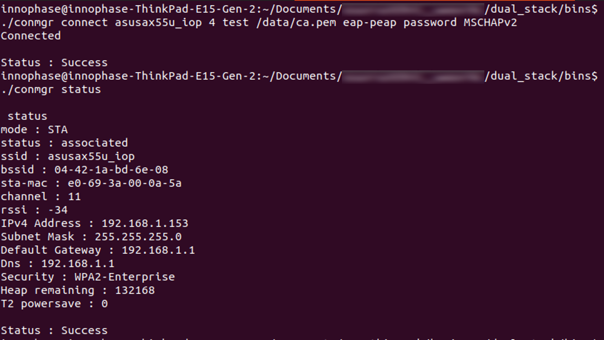
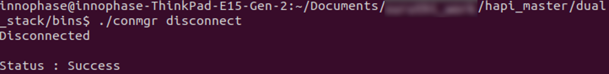
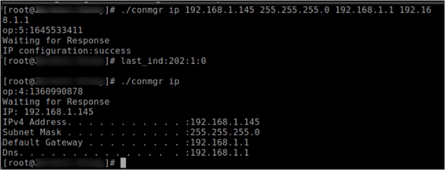
.. |image8| image:: media/image8.png
   :width: 8in

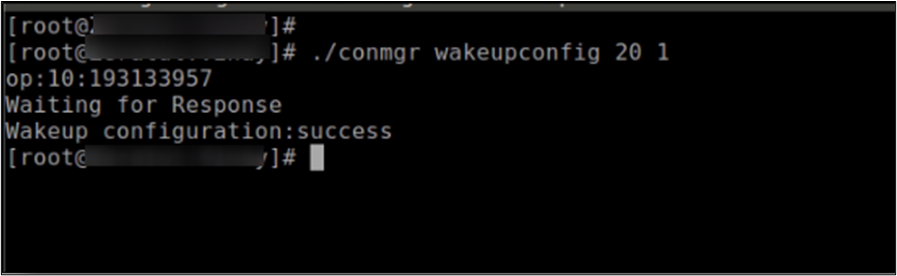

.. |image20| image:: media/image20.jpeg
   :width: 8in

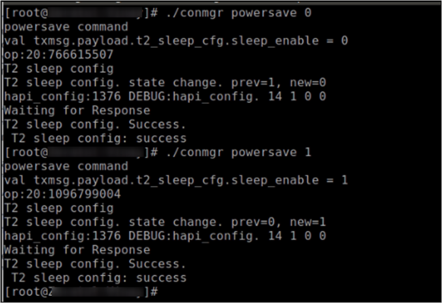
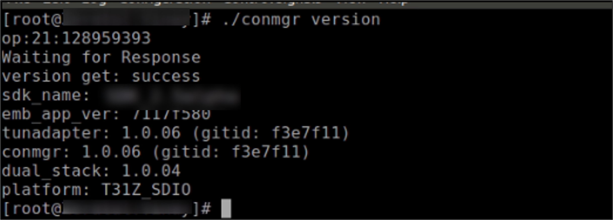
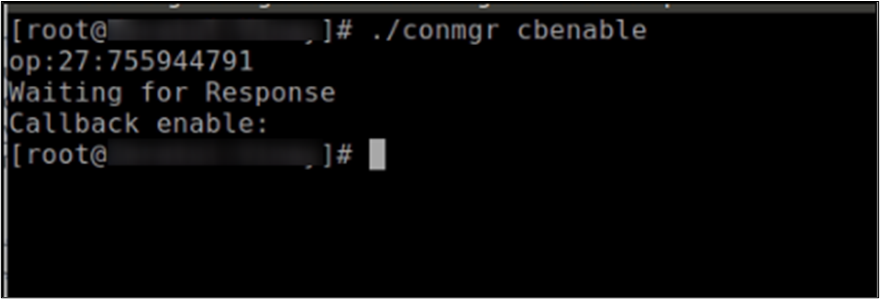

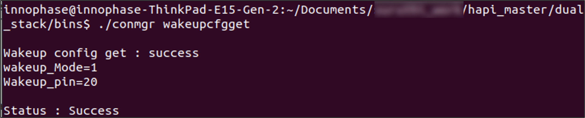
.. |image29| image:: media/image29.png
   :width: 8in

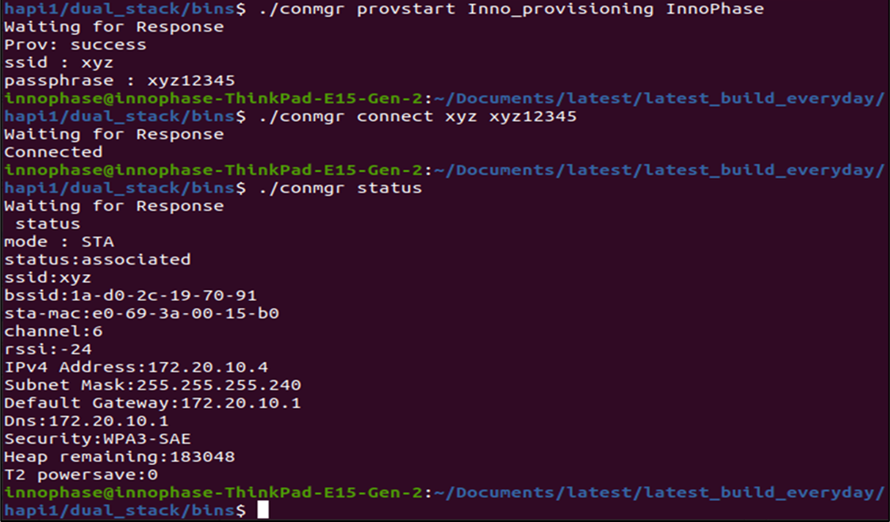

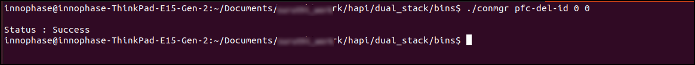

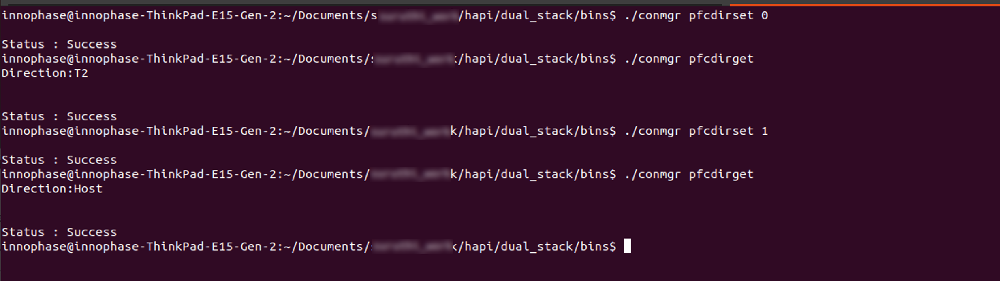
