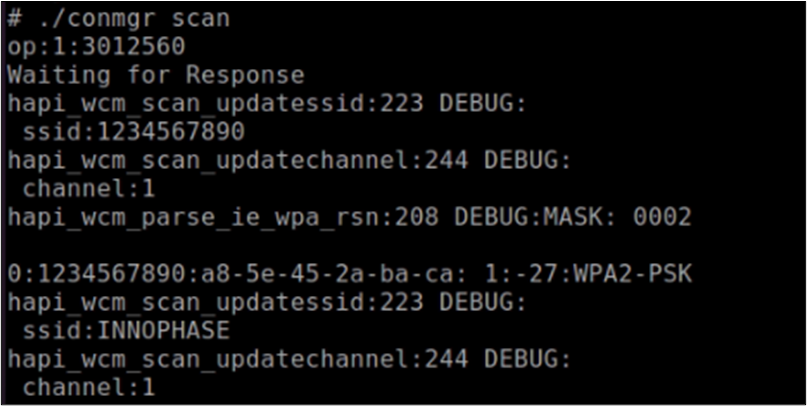
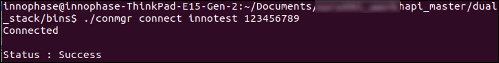
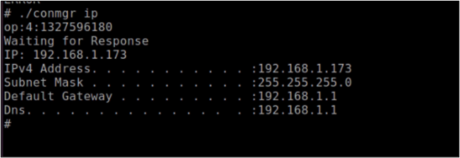
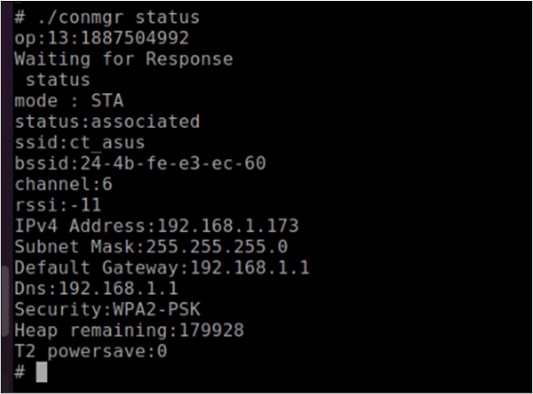
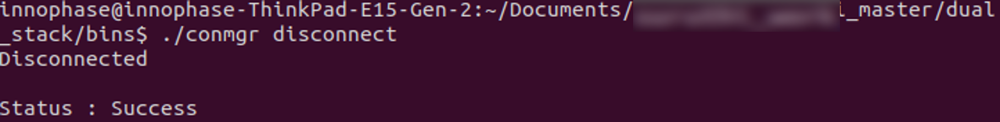
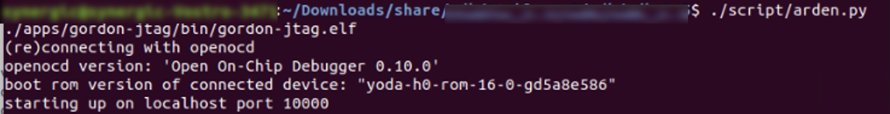
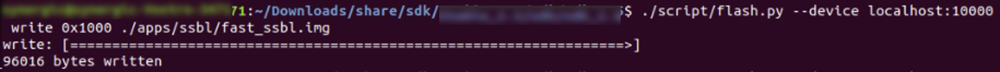

.. _ds conmgr uc:

Connection Manager UseCases 
====================

Station Mode Wi-Fi Connection
-----------------------------

Description 
~~~~~~~~~~~~

This use case is to demonstrate the station mode configuration and
connecting to the Wi-Fi Access Point.

Prerequisites 
~~~~~~~~~~~~~~

Access Point configured with WPA/WPA2 personal security.

Command Description
~~~~~~~~~~~~~~~~~~~

.. table:: Table 1: Station Mode Wi-Fi Connection - commands

   +-------------------------------------+--------------------------------+
   | **Command**                         | **Description**                |
   +=====================================+================================+
   | *./conmgr scan*                     | Scan                           |
   +-------------------------------------+--------------------------------+
   | *./conmgr connect <SSID><AP PWD>*   | Connect                        |
   +-------------------------------------+--------------------------------+
   | *./conmgr ip*                       | Get IP address                 |
   +-------------------------------------+--------------------------------+
   | *./conmgr status*                   | Get WLAN status                |
   +-------------------------------------+--------------------------------+
   | *./conmgr disconnect*               | Disconnect                     |
   +-------------------------------------+--------------------------------+

Procedure 
~~~~~~~~~~

Execute the following operations on the Talaria TWO:

**Step 1**: Scan the network.

**Step 2**: Connect to the desired network by providing SSID and
passphrase.

**Step 3**: Get the IP address of the Talaria TWO module.

**Step 4**: Get the WLAN status of the Talaria TWO module.

**Step 5**: Disconnect from the connected network.

Console Logs
~~~~~~~~~~~~

1. ./conmgr scan

|image40|

.. rst-class:: imagefiguesclass
Figure 1: ./conmgr scan – output

2. ./conmgr connect innotest 123456789

|image41|

.. rst-class:: imagefiguesclass
Figure 2: ./conmgr connect - output

3. ./conmgr ip

|image42|

.. rst-class:: imagefiguesclass
Figure 3: ./conmgr ip – output

4. ./conmgr status

|image43|

.. rst-class:: imagefiguesclass
Figure 4: ./conmgr status – output

5. ./conmgr disconnect

|image44|

.. rst-class:: imagefiguesclass
Figure 5: ./conmgr disconnect – output

Keepalive and Host Wake Up Mechanism
------------------------------------

.. _description-1:

Description
~~~~~~~~~~~

This use case demonstrates keep alive and host wake up mechanism on
Dual-Stack solution.

.. _prerequisites-1:

Prerequisites
~~~~~~~~~~~~~

1. Access Point configured with WPA/WPA2 personal security.

2. Netcat server on Linux host machine.

.. _command-description-1:

Command Description
~~~~~~~~~~~~~~~~~~~

.. table:: Table 2: Keepalive and host wake up mechanism – Commands

   +-----------------------------------------------+----------------------+
   | **Command**                                   | **Description**      |
   +===============================================+======================+
   | *./conmgr connect <SSID><AP PWD>*             | Connect              |
   +-----------------------------------------------+----------------------+
   | *./conmgr kaconfig <ip address of server>     | Keepalive            |
   | <srv_port> <interval> <heartbeat msg> <wakeup | configuration        |
   | word> <timeout>*                              |                      |
   +-----------------------------------------------+----------------------+
   | *./conmgr kaconfigget*                        | Get keepalive        |
   |                                               | configuration        |
   +-----------------------------------------------+----------------------+
   | *./conmgr kastart*                            | Start sending        |
   |                                               | keepalive to server  |
   +-----------------------------------------------+----------------------+
   | *./conmgr <wakeupconfig> <wakeup pin> <0/1>   | Configure wake up    |
   | <0/1>*                                        | pin                  |
   +-----------------------------------------------+----------------------+
   | *./conmgr wakeupreasoncls*                    | Clear wakeup reason  |
   +-----------------------------------------------+----------------------+
   | *./conmgr wakeupcfgget*                       | Get wakeup           |
   |                                               | configuration status |
   +-----------------------------------------------+----------------------+
   | *./conmgr shutdown*                           | Power off the host   |
   +-----------------------------------------------+----------------------+

.. _procedure-1:

Procedure
~~~~~~~~~

Execute the following operations:

**Step 1**: Start the netcat server on the Linux host machine. This host
should be connected to same network to which Talaria TWO will be
connected .

.. code:: shell

      nc -l -p 8888

**Step 2**: On Talaria TWO, connect to the desired network by providing
SSID and passphrase.

**Step 3**: Configure Keepalive.

**Step 4**: Read the Keepalive configuration.

**Step 5**: start sending Keepalive message keepalivemsg to the server.

**Step 6**: Configure GPIO20 for host wake up.

**Step 7**: Clear wakeup reason.

**Step 8**: Get wakeup configuration status.

**Step 9**: Power OFF the Host.

**Step 10**: From netcat server, send the wakeup word hello. Talaria TWO
receives and wakes up the host.

**Step 11**: Check the wakeup reason.

**Step 12**: Stop Keepalive.

.. _console-logs-1:

Console Logs
~~~~~~~~~~~~

|image45|

.. rst-class:: imagefiguesclass
Figure 6: Keepalive config and host shutdown with MCU– output

|image46|

.. rst-class:: imagefiguesclass
Figure 7: Keepalive config and host shutdown without MCU– output

|image47|

.. rst-class:: imagefiguesclass
Figure 8: Host wakeup– output

|image48|

.. rst-class:: imagefiguesclass
Figure 9: netcat server – output

Autoscan Operation
------------------

.. _description-2:

Description
~~~~~~~~~~~

This use case demonstrates enabling/disabling auto scan operation for
finding the specific SSID and SSID that are not in the vicinity of
Talaria TWO.

.. _prerequisites-2:

Prerequisites 
~~~~~~~~~~~~~~

Access Point configured with WPA/WPA2 personal security.

.. _command-description-2:

Command Description
~~~~~~~~~~~~~~~~~~~

.. table:: Table 3: Autoscan – commands

   +----------------------------------------+-----------------------------+
   | **Command**                            | **Description**             |
   +========================================+=============================+
   | *./conmgr autoscanenable <interval>    | Enable auto scan            |
   | <ssid>*                                |                             |
   +----------------------------------------+-----------------------------+
   | *./conmgr autoscancfgget*              | Get autoscan configuration  |
   |                                        | status                      |
   +----------------------------------------+-----------------------------+
   | *./conmgr autoscandisable*             | Disable auto scan           |
   +----------------------------------------+-----------------------------+

.. _procedure-2:

Procedure 
~~~~~~~~~~

Execute the following operations on the Talaria TWO:

**Step 1**: Enable auto scan with SSID information of an AP.

**Step 2**: Enable auto scan with SSID information of an AP which is not
in the vicinity.

**Step 3**: Get autoscan configuration status with the appropriate
interval and SSID.

**Step 4**: Disable the autoscan.

.. _console-logs-2:

Console Logs
~~~~~~~~~~~~

|image49|

.. rst-class:: imagefiguesclass
Figure 10: autoscanenable for specific SSID - host console output

Talaria TWO console log:

.. code:: shell

    event:9in dualstack_autoscan_process: entry:121864:0:
    scan start
    pssid:InnoPhase_AE_AP:InnoPhase_AE_APFound 1 nets:
    ssid:InnoPhase_AE_AP

|image50|

.. rst-class:: imagefiguesclass
Figure 11: autoscanenable and get autoscan status – output

|image51|

.. rst-class:: imagefiguesclass
Figure 12: autoscanenable for SSIDs not in the vicinity of station –
host console output

Talaria TWO console log:

.. code:: shell

    can start pssid:InnoPhase_AE:InnoPhase_AEFound 0 nets:
    in dualstack_autoscan_process: exit
    Dtx rate:{837(561),0(0),0(0),0(0),0(0),0(0),0(0),0(0) 59(26),0(0),0(0),0(0),4(2),1(0),17(7),0(0) 0(0),0(0),7(5),7(1),119(55),0(0),0(0),0(0)}
    ampdu:{0,0,0,0,0,0,0,0} sf:0.0 ba:0%(0%) to:8
    Drx rate:{286,0,0,0,0,0,0,0 0,0,0,0,0,0,0,0 0,0,0,0,4,7,23,13}
    mcs:{0(0,0),0(0,0),0(0,0),0(0,0),0(0,0),0(0,0),0(0,0),0(0,0)} no_mem:0/0 rx_idle:86755
    Drts: 81(54)
    Dlwip: 660(0/0/0)
    Dmem: heap:122336 page_faults:3825

    event:9in dualstack_autoscan_process: entry:122296:0:

    scan start pssid:InnoPhase_AE:InnoPhase_AEFound 0 nets:
    in dualstack_autoscan_process: exit

Enable Connect/Disconnect Callback
----------------------------------

.. _description-3:

Description
~~~~~~~~~~~

This use case demonstrates invocation of callback function during
connection and disconnection process with an Access Point.

.. _prerequisites-3:

Prerequisites 
~~~~~~~~~~~~~~

Access Point configured with WPA/WPA2 personal security.

.. _command-description-3:

Command Description
~~~~~~~~~~~~~~~~~~~

.. table:: Table 4: Connect/disconnect callback – commands

    +--------------------------------------+-------------------------------+
    | **Command**                          | **Description**               |
    +======================================+===============================+
    | *./conmgr connect <SSID><AP PWD>*    | Connect                       |
    +--------------------------------------+-------------------------------+
    | *./conmgr cbenable*                  | Callback enable               |
    +--------------------------------------+-------------------------------+
    | *./conmgr disconnect*                | Disconnect                    |
    +--------------------------------------+-------------------------------+
    | *./conmgr connect <SSID><AP PWD>*    | Connect                       |
    +--------------------------------------+-------------------------------+

.. _procedure-3:

Procedure
~~~~~~~~~

Execute the following operations on the Talaria TWO:

**Step 1**: Connect to the desired network by providing SSID and
passphrase.

**Step 2:** Enable callback.

**Step 3**: Disconnect from the network.

**Step 4**: Connect to the network.

.. _console-logs-3:

Console Logs
~~~~~~~~~~~~~~~~~~~~~~~

|image52|

.. rst-class:: imagefiguesclass
Figure 13: Disconnect - output

|image53|

.. rst-class:: imagefiguesclass
Figure 14: Connect – output

Talaria TWO console log:

.. code:: shell

    [1162.370,516] dualstack_wcm_notify:201:1[1162.371,762] DISCONNECTED

    event:24[1162.388,153]
    dualstack_wcm_notify:203:1
    event:22
    Disconnection callback

    [1174.265,374] CONNECT:98:da:c4:73:b7:76 Channel:2 rssi:-40 dBm
    [1174.340,947] MYIP 192.168.0.228
    [1174.341,114] IPv6 [fe80::e069:3aff:fe00:46e]-link

    event:16
    owcb:1:InnoPhase_AE_AP::1
    linkup:1
    Connection callback

Firmware Upgrade Over Serial
----------------------------

.. _description-4:

Description
~~~~~~~~~~~

This use case demonstrates firmware upgrade process from host to Talaria
TWO via SPI/SDIO interface.

.. _prerequisites-4:

Prerequisites
~~~~~~~~~~~~~

TFTP server on Linux machine.

Command Description with Procedure
~~~~~~~~~~~~~~~~~~~~~~~~~~~~~~~~~~

1. On Linux console machine, open a terminal and issue the following
   command to put Talaria TWO into bootloader mode.

.. code:: shell

      ./script/boot.py --device /dev/ttyUSB2 --reset=evk42_bl

2. Start openocd from the SDK root folder *(sdk_x.y\\)*. This enables
   in-system programming on Talaria TWO.

Command:

.. code:: shell

      openocd -s conf/ -f ftdi_swd.cfg -f t2_swd.cfg

|image54|

.. rst-class:: imagefiguesclass
Figure 15: In-system programming on Talaria TWO

3. In a separate terminal, start arden.py script from FreeRTOS SDK root folder
   *(freertos_sdk_x.y\\)* on a new terminal:

Command:

.. code:: shell

      ./script/arden.py ./apps/gordon-jtag/bin/gordon-jtag.elf

|image55|

.. rst-class:: imagefiguesclass
Figure 16: Start arden.py from SDK root folder

4. Run the script gdbrun.py from SDK root folder *(sdk_x.y\\)* on a new
   terminal. Given a host with running OpenOCD and UART relay, gdbrun.py
   connects to host and loads/boots an ELF image.

Command:

.. code:: shell

      ./script/gdbrun.py ./apps/gordon-jtag/bin/gordon-jtag.elf --noconsole --nowait

5. Flash SSBL partition table and dual_stack_sdio.elf/dual_stack.elf to
   Talaria TWO using the following commands:

   a. Invalidate the boot image.

.. code:: shell

      ./script/flash.py --device localhost:10000 write 0x1000 ./solutions/dual_stack/firmware_upgrade_images/empty.img

|image56|

.. rst-class:: imagefiguesclass
Figure 17: Invalidate boot image – Terminal Output

b. Flash SSBL partition.

.. code:: shell

      ./script/flash.py –device localhost:10000 from_json ./tools/partition_files/ssbl_part_table.json

|image57|

.. rst-class:: imagefiguesclass
Figure 18: Flash SSBL Partition - Terminal Output

c. Flash root filesystem.

.. code:: shell

      ./script/flash.py --device localhost:10000 write 0x180000 ./solutions/dual_stack/firmware_upgrade_images/root_sdio.img

   |image58|

.. rst-class:: imagefiguesclass
Figure 19: Flash root filesystem – Termina output

d. Flash SSBL.

.. code:: shell

      ./script/flash.py –device localhost:10000 write 0x1000 ./apps/ssbl/fast_ssbl.img

|image59|

.. rst-class:: imagefiguesclass
Figure 20: Flash SSBL – Terminal Output

e. Flash Dual-Stack ELF.

.. code:: shell

      ./script/flash.py --device localhost:10000 write 0x20000 ./solutions/dual_stack/bin/dual_stack_sdio.elf

|image60|

.. rst-class:: imagefiguesclass
Figure 21: Flash Dual-Stack ELF - Terminal Output

6. Using TFTP or SD card, copy the dual_stack_sdio.elf/dual_stack.elf
   from \\solutions\\dual_stack\\bin\\ folder to the lib\\modules\\
   folder on host using TFTP or SD card.

.. code:: shell

      tftp -g -r <filename> <tftp server IP>

7. Start the tunadapter in the background.

.. code:: shell

      ./tunadapter &

8. Start the firmware upgrade from host to Talaria TWO.

.. code:: shell

      ./conmgr <fos> <elf_path> <hash> <auto_reset>

**Note:** Turn off Talaria TWO powersave before upgrading the firmware
by using the command ./conmgr powersave 0.

.. _console-logs-4:

Console Logs
~~~~~~~~~~~~

|image61|

.. rst-class:: imagefiguesclass
Figure 22: Firmware upgrade – output

.. code:: shell

    [root@:Aug30_Master]# ./tunadapter &
    [root@: Aug30_Master]# ./tunadapter: platform=<host>_SDIO
    Opening Serial device /dev/wlanSDIO0
    Speed=10000000

    [   49.161440] sw_open
    hapi_recv_thread:943 DEBUG:recv thread entry
    wakeup gpio(gpio_63) conf success
    in hapi_wakeup_config. dev=/sys/class/gpio/gpio63/value
    wakeup_fd = 4
    hapi_config:1526 DEBUG:hapi_config. 14 1 0 0
    hapi_config:1586 DEBUG:before calling hio_query
    hapi_hio_query:352 DEBUG:Connected to T2, max packet size is 4092
    hapi_hio_query:353 DEBUG:Firmware version: , patch version
    hapi_hio_query:354 DEBUG:Hapi version: 1
    hapi_config:1588 DEBUG:after calling hio_query
    hapi init:start
    Registering Wake up Indication Handlers
    Registering Shutdown Indication Handlers
    hapi init:done
    dual_stack_status:688896:1:0
    dual_stack_ver:e4f2ebcd:SDK_2.6:1.0.05
    port:70-40000
    dual_stack_sockid:0:2:1
    Creating tun interface
    Initialising tun interface
    IP: 192.168.1.131
    Successfully connected to interface
    net.ipv4.ip_local_port_range = 70 40000
    cmd:ifconfig tun0 192.168.1.131 netmask 255.255.255.0
    ip set done
    Adding routing table entry:echo nameserver 192.168.1.1 > /etc/resolv_ds.conf
    readlink() returned /etc/resolv_ds.conf
    Adding default route
    UDP socket create success
    ICMP Raw socket create success
    Regsitering WCM Indication Handlers
    waiting for data from tun....
    ptsname:/dev/pts/0

    [root@:Aug30_Master]# ./conmgr fos ../dual_stack_sdio_qa.elf.strip 99abbc2dfc424992ea38d6063504a3916c353150b689b975c1dd5c1ac7740dfd 1

    file size = 666592
    hapi_fos_start:96 DEBUG:req->image_size = 666592
    Waiting for Response
    FOS Start Success
    file size = 666592
    End of Reading t2 image file
    Firmware upgrade:success

Wi-Fi Provisioning over BLE
---------------------------

.. _description-5:

Description
~~~~~~~~~~~

Using the device provisioning feature, SSID and passphrase can be
configured onto the device using the mobile application.

For information on downloading and using the mobile application for
device provisioning, refer section: *7.3 Running the Application using
Android or iOS App*, of the document: Example_using_Provisioning.pdf.

Once the provisioning is complete, the configured SSID and passphrase is
provided to the Host, which stores these parameters for further use.

.. _prerequisites-5:

Prerequisites
~~~~~~~~~~~~~

Mobile application (BLE Provisioning) to provision the device.

.. _command-description-4:

Command Description
~~~~~~~~~~~~~~~~~~~

.. table:: Table 5: Wi-Fi Provisioning over BLE – commands

    +--------------------------------------+-------------------------------+
    | **Command**                          | **Description**               |
    +======================================+===============================+
    | *./conmgr provstart*                 | Start provisioning            |
    +--------------------------------------+-------------------------------+
    | *./conmgr waitforprovinfo*           | Wait for the provisioned info |
    +--------------------------------------+-------------------------------+
    | *./conmgr provstop*                  | Stop provisioning             |
    +--------------------------------------+-------------------------------+
    | *./conmgr provstart*                 | Start provisioning            |
    +--------------------------------------+-------------------------------+

.. _procedure-4:

Procedure 
~~~~~~~~~~

**Step 1**: Initiate provisioning using ./conmgr provstart command

**Note**: ./conmgr waitforprovinfo should be passed immediately after
./conmgr provstart command

**Step 2**: Wait for the user to provision the device. This can be
achieved using the ./conmgr waitforprovinfo command

**Step 3**: Launch the InnophaseIoT mobile application on Android/iOS
mobile and connect to the device

**Step 4**: Provide the appropriate SSID and passphrase on the mobile
application

**Step 5**: If the right SSID and passphrase is provided, the same will
be provided to the Host and ./conmgr waitforprovinfo command is executed

**Step 6**: Use ./conmgr provstop to stop provisioning as per
requirement

.. _console-logs-5:

Console Logs
~~~~~~~~~~~~~~~~~~~~~~~

|image62|

.. code-block:: console

    Y-BOOT 208ef13 2019-07-22 12:26:54 -0500 790da1-b-7
    ROM yoda-h0-rom-16-0-gd5a8e586
    FLASH:PNWWWWWWAE4 DWT comparators, range 0x8000
    Build
    hio.transport=0 ds.pf_method=2
    $App:git-0ec71a86
    SDK Ver: FREERTOS_SDK_1.0
    DualStack App
    Serial-to-Wireless: Ready
    Registering dual stack apis
    Standard HIOs Enabled: fota fos prov
    Custom HIOs Enabled:
         gpio_ctrl 	 custom_echo 	 pir Registering pir apis

         chip_mon 	 custom_mqtt [0.207,059] mqtt_ping_interval=60
         custom_n/w 	 custom_wifi_connect 	 rssi_monitor

    DualStack: Ready...

    dual_stack_param_getaddr e0:69:3a:00:0a:5a

    dual_stack_param_update
     store:::1
     linkup:0

    dual_stack_btinitBT HCI: Ready

    dual_stack_host_ready
    dual_stack_btinit
        [PROV] bt_gap_init
        [PROV] common_server_create: Inno_provisioning InnoPhase 0

        [PROV] bt_gatt_create_service_128 ret = 0x0008f650
        [PROV] Adding Characteristics
        [PROV] bt_gatt_add_service
        [PROV] bt_gap_discoverable_mode, ret = 0
    prov_event_thread_entry[13.386,045] BT connect[0]: ia:54:c5:dd:79:4d:ad aa:05:04:03:02:01:00 phy2:0/0 phyC:00

    [PROV]BLE connection success
    [ROV] prov_srv_fn_wifi_scan
    prov_event_thread_entry: msg->event = 1
    [PROV]203 : len = 11
    [PROV] WiFi scan: Found 6 networks
    [PROV]231 : wc.scan_rslts_len = 70
    [PROV]231 : wc.scan_rslts_len = 136
    [PROV]231 : wc.scan_rslts_len = 197
    [PROV]231 : wc.scan_rslts_len = 250
    [PROV]231 : wc.scan_rslts_len = 313
    [PROV]231 : wc.scan_rslts_len = 373
    [PROV]237 : len = 375
    [PROV] prov_srv_fn_wifi_scan_rslts : length = 22

    [PROV] prov_srv_fn_wifi_scan_rslts : offset = 0

    [PROV] prov_wifi_scan_rslts_send : length = 22, index=0 , rslt_len=375

    [PROV]prov_wifi_scan_rslts_send: offset = 0 remaining_bytes = 375, copy_len = 18
    [PROV] prov_wifi_scan_rslts_send : wc.index = 18

    [PROV]prov_wifi_scan_rslts_send: index = 18, scan_rslts_len = 375

    Sending
    [PROV] prov_srv_fn_wifi_scan_rslts : length = 22

    [PROV] prov_srv_fn_wifi_scan_rslts : offset = 22

    [PROV] prov_wifi_scan_rslts_send : length = 22, index=18 , rslt_len=375

    [PROV]prov_wifi_scan_rslts_send: offset = 22 remaining_bytes = 357, copy_len = 22
    [PROV] prov_wifi_scan_rslts_send : wc.index = 40

    [PROV]prov_wifi_scan_rslts_send: index = 40, scan_rslts_len = 375

    Sending
    :"innotest","bssid":"c

    [PROV] prov_srv_fn_wifi_scan_rslts : length = 22

    [PROV] prov_srv_fn_wifi_scan_rslts : offset = 44

    [PROV] prov_wifi_scan_rslts_send : length = 22, index=40 , rslt_len=375

    [PROV]prov_wifi_scan_rslts_send: offset = 44 remaining_bytes = 335, copy_len = 22
    [PROV] prov_wifi_scan_rslts_send : wc.index = 62

    [PROV]prov_wifi_scan_rslts_send: index = 62, scan_rslts_len = 375

    Sending
    e:66:97:a2:74:ec","cha

    [PROV] prov_srv_fn_wifi_scan_rslts : length = 22

    [PROV] prov_srv_fn_wifi_scan_rslts : offset = 66

    [PROV] prov_wifi_scan_rslts_send : length = 22, index=62 , rslt_len=375

    [PROV]prov_wifi_scan_rslts_send: offset = 66 remaining_bytes = 313, copy_len = 22
    [PROV] prov_wifi_scan_rslts_send : wc.index = 84

    [PROV]prov_wifi_scan_rslts_send: index = 84, scan_rslts_len = 375

    Sending
    nnel":6},{"ssid":"DEN

    [PROV] prov_srv_fn_wifi_scan_rslts : length = 22

    [PROV] prov_srv_fn_wifi_scan_rslts : offset = 88

    [PROV] prov_wifi_scan_rslts_send : length = 22, index=84 , rslt_len=375

    [PROV]prov_wifi_scan_rslts_send: offset = 88 remaining_bytes = 291, copy_len = 22
    [PROV] prov_wifi_scan_rslts_send : wc.index = 106

    [PROV]prov_wifi_scan_rslts_send: index = 106, scan_rslts_len = 375

    Sending
    speaker.o,","bssid":"f

    [PROV] prov_srv_fn_wifi_scan_rslts : length = 22

    [PROV] prov_srv_fn_wifi_scan_rslts : offset = 110

    [PROV] prov_wifi_scan_rslts_send : length = 22, index=106 , rslt_len=375

    [PROV]prov_wifi_scan_rslts_send: offset = 110 remaining_bytes = 269, copy_len = 22
    [PROV] prov_wifi_scan_rslts_send : wc.index = 128

    [PROV]prov_wifi_scan_rslts_send: index = 128, scan_rslts_len = 375

    Sending
    a:8f:ca:85:b6:69","cha

    [PROV] prov_srv_fn_wifi_scan_rslts : length = 22

    [PROV] prov_srv_fn_wifi_scan_rslts : offset = 132

    [PROV] prov_wifi_scan_rslts_send : length = 22, index=128 , rslt_len=375

    [PROV]prov_wifi_scan_rslts_send: offset = 132 remaining_bytes = 247, copy_len = 22
    [PROV] prov_wifi_scan_rslts_send : wc.index = 150

    [PROV]prov_wifi_scan_rslts_send: index = 150, scan_rslts_len = 375

    Sending
    nnel":6},{"ssid":"Mura

    [PROV] prov_srv_fn_wifi_scan_rslts : length = 22

    [PROV] prov_srv_fn_wifi_scan_rslts : offset = 154

    [PROV] prov_wifi_scan_rslts_send : length = 22, index=150 , rslt_len=375

    [PROV]prov_wifi_scan_rslts_send: offset = 154 remaining_bytes = 225, copy_len = 22
    [PROV] prov_wifi_scan_rslts_send : wc.index = 172

    [PROV]prov_wifi_scan_rslts_send: index = 172, scan_rslts_len = 375

    Sending
    li3G","bssid":"8c:a3:9

    [PROV] prov_srv_fn_wifi_scan_rslts : length = 22

    [PROV] prov_srv_fn_wifi_scan_rslts : offset = 176

    [PROV] prov_wifi_scan_rslts_send : length = 22, index=172 , rslt_len=375

    [PROV]prov_wifi_scan_rslts_send: offset = 176 remaining_bytes = 203, copy_len = 22
    [PROV] prov_wifi_scan_rslts_send : wc.index = 194

    [PROV]prov_wifi_scan_rslts_send: index = 194, scan_rslts_len = 375

    Sending
    9:57:ef:b4","channel":

    [PROV] prov_srv_fn_wifi_scan_rslts : length = 22

    [PROV] prov_srv_fn_wifi_scan_rslts : offset = 198

    [PROV] prov_wifi_scan_rslts_send : length = 22, index=194 , rslt_len=375

    [PROV]prov_wifi_scan_rslts_send: offset = 198 remaining_bytes = 181, copy_len = 22
    [PROV] prov_wifi_scan_rslts_send : wc.index = 216

    [PROV]prov_wifi_scan_rslts_send: index = 216, scan_rslts_len = 375

    Sending
    11},{"ssid":"","bssid"

    [PROV] prov_srv_fn_wifi_scan_rslts : length = 22

    [PROV] prov_srv_fn_wifi_scan_rslts : offset = 220

    [PROV] prov_wifi_scan_rslts_send : length = 22, index=216 , rslt_len=375

    [PROV]prov_wifi_scan_rslts_send: offset = 220 remaining_bytes = 159, copy_len = 22
    [PROV] prov_wifi_scan_rslts_send : wc.index = 238

    [PROV]prov_wifi_scan_rslts_send: index = 238, scan_rslts_len = 375

    Sending
    :"8e:a3:99:57:ef:b4","

    [PROV] prov_srv_fn_wifi_scan_rslts : length = 22

    [PROV] prov_srv_fn_wifi_scan_rslts : offset = 242

    [PROV] prov_wifi_scan_rslts_send : length = 22, index=238 , rslt_len=375

    [PROV]prov_wifi_scan_rslts_send: offset = 242 remaining_bytes = 137, copy_len = 22
    [PROV] prov_wifi_scan_rslts_send : wc.index = 260

    [PROV]prov_wifi_scan_rslts_send: index = 260, scan_rslts_len = 375

    Sending
    channel":11},{"ssid":"

    [PROV] prov_srv_fn_wifi_scan_rslts : length = 22

    [PROV] prov_srv_fn_wifi_scan_rslts : offset = 264

    [PROV] prov_wifi_scan_rslts_send : length = 22, index=260 , rslt_len=375

    [PROV]prov_wifi_scan_rslts_send: offset = 264 remaining_bytes = 115, copy_len = 22
    [PROV] prov_wifi_scan_rslts_send : wc.index = 282

    [PROV]prov_wifi_scan_rslts_send: index = 282, scan_rslts_len = 375

    Sending
    Mithrandir","bssid":"0

    [PROV] prov_srv_fn_wifi_scan_rslts : length = 22

    [PROV] prov_srv_fn_wifi_scan_rslts : offset = 286

    [PROV] prov_wifi_scan_rslts_send : length = 22, index=282 , rslt_len=375

    [PROV]prov_wifi_scan_rslts_send: offset = 286 remaining_bytes = 93, copy_len = 22
    [PROV] prov_wifi_scan_rslts_send : wc.index = 304

    [PROV]prov_wifi_scan_rslts_send: index = 304, scan_rslts_len = 375

    Sending
    0:5f:67:f9:12:e4","cha

    [PROV] prov_srv_fn_wifi_scan_rslts : length = 22

    [PROV] prov_srv_fn_wifi_scan_rslts : offset = 308

    [PROV] prov_wifi_scan_rslts_send : length = 22, index=304 , rslt_len=375

    [PROV]prov_wifi_scan_rslts_send: offset = 308 remaining_bytes = 71, copy_len = 22
    [PROV] prov_wifi_scan_rslts_send : wc.index = 326

    [PROV]prov_wifi_scan_rslts_send: index = 326, scan_rslts_len = 375

    Sending
    nnel":13},{"ssid":"TP-

    [PROV] prov_srv_fn_wifi_scan_rslts : length = 22

    [PROV] prov_srv_fn_wifi_scan_rslts : offset = 330

    [PROV] prov_wifi_scan_rslts_send : length = 22, index=326 , rslt_len=375

    [PROV]prov_wifi_scan_rslts_send: offset = 330 remaining_bytes = 49, copy_len = 22
    [PROV] prov_wifi_scan_rslts_send : wc.index = 348

    [PROV]prov_wifi_scan_rslts_send: index = 348, scan_rslts_len = 375

    Sending
    LINK","bssid":"b0:be:7

    [PROV] prov_srv_fn_wifi_scan_rslts : length = 22

    [PROV] prov_srv_fn_wifi_scan_rslts : offset = 352

    [PROV] prov_wifi_scan_rslts_send : length = 22, index=348 , rslt_len=375

    [PROV]prov_wifi_scan_rslts_send: offset = 352 remaining_bytes = 27, copy_len = 22
    [PROV] prov_wifi_scan_rslts_send : wc.index = 370

    [PROV]prov_wifi_scan_rslts_send: index = 370, scan_rslts_len = 375

    Sending
    6:67:c7:a5","channel":

    [PROV] prov_srv_fn_wifi_scan_rslts : length = 22

    [PROV] prov_srv_fn_wifi_scan_rslts : offset = 374

    [PROV] prov_wifi_scan_rslts_send : length = 22, index=370 , rslt_len=375

    [PROV]prov_wifi_scan_rslts_send: offset = 374 remaining_bytes = 5, copy_len = 5
    [PROV] prov_wifi_scan_rslts_send : wc.index = 375

    [PROV]prov_wifi_scan_rslts_send: index = 375, scan_rslts_len = 375

    Sending
    11}]}
    scan_len is greaterthan index

    [PROV] prov_srv_fn_wifi_scan_rslts : length = 22

    [PROV] prov_srv_fn_wifi_scan_rslts : offset = 0

    [PROV] prov_wifi_scan_rslts_send : length = 22, index=0 , rslt_len=0

    [PROV] prov_wifi_scan_rslts_send : line = 257

    [PROV]prov_srv_fn_cfg_ssid:8   innotest
    [PROV]prov_conf_update:  key = ssid, val = innotest
    [PROV]prov_conf_update: prov_json_object_update ret = 0
    [PROV]prov_conf_update: prov_json_object_update ret = 0
    prov_srv_fn_cfg_ssid : 1 0
    [PROV]prov_conf_update:  key = passphrase, val = 1234567890
    [PROV]prov_conf_update: prov_json_object_update ret = 0
    [PROV]prov_conf_update: prov_json_object_update ret = 0
    prov_srv_fn_cfg_passphrase : 1 1
    prov_event_thread_entry: msg->event = 2
    ssid = innotest
    passphrase = 1234567890
    [PROV]Checking connectivity to...
        ssid = innotest passphrase = 1234567890
    network profile created for ssid: innotest
    [27.398,799] CONNECT:ce:66:97:a2:74:ec Channel:6 rssi:-53 dBm

    [PROV] prov_srv_fn_wifi_conn_state: data = waiting[33.014,922] MYIP 172.20.10.2
    [33.015,085] IPv6 [fe80::e269:3aff:fe00:a5a]-link
    [33.015,149] IPv6 [2401:4900:4e5a:edaa:e269:3aff:fe00:a5a]

    prov_hio_data_cb
     Sending Packet, size=: 16

    prov_hio_data_cb
     Sending Packet, size=: 18
     [33.220,501] DISCONNECTED

    [PROV] prov_srv_fn_wifi_conn_state: data = success
    [PROV] prov_srv_fn_wifi_conn_state: data = success
    [ROV] prov_srv_fn_cfg_apply
    [PROV]prov_conf_set_provisioned 173
    [PROV]prov_conf_set_provisioned 197
    [PROV]prov_conf_data_apply:354
    [PROV]prov_conf_data_apply:357
    {
        "image": [
            {
                "name": "dual_stack_app",
                "version": "1.0",
                "start_sector": 32,
                "bootargs_start": 1,
                "hio.transport": "0",
                "hio.maxsize": "4096",
                "hio.sdio_mhz": "10",
                "krn.coredump": "1",
                "krn.trace": "R:0x3ff",
                "krn.cop_error_fatal": "1",
                "ssid": "innotest",
                "passphrase": "1234567890",
                "bootargs_end": 1
            },
            {
                "name": "dual_stack_app",
                "version": "0.0",
                "start_sector": 208,
                "bootargs_start": 1,
                "hio.transport": "0",
                "hio.maxsize": "4096",
                "hio.sdio_mhz": "10",
                "krn.coredump": "1",
                "krn.trace": "R:0x3ff",
                "krn.cop_error_fatal": "1",
                "ssid": "innotest",
                "passphrase": "1234567890",
                "bootargs_end": 1
            }
        ],
        "baudrate": 2560000,
        "timeout": 0,
        "verbose": 1
    }

    [PROV]prov_conf_data_apply:362
    prov_hio_cb : status = 1
    prov_hio_data_cb
     Sending Packet, size=: 8

    prov_stop: Interface(Bit map) = 2
    dual_stack_btinitBT HCI: Ready

.. |image49| image:: media/image49.png
   :width: 8in

.. |image60| image:: media/image60.png
   :width: 8in

