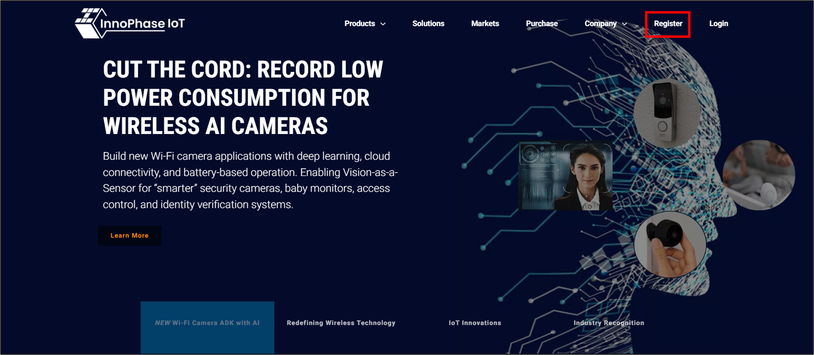
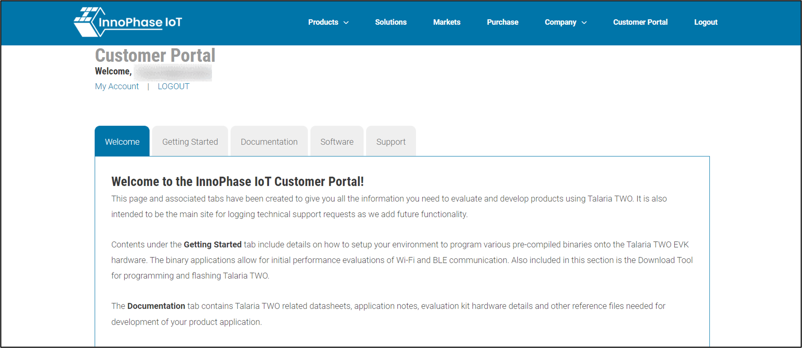
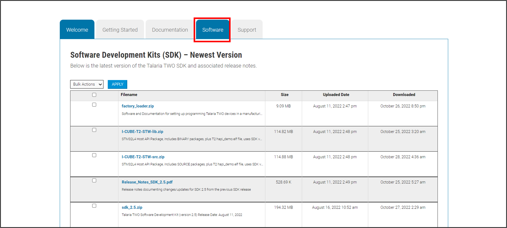

.. _3201 t2 package:

Talaria TWO SDK Package 
------------------------

Download the latest SDK package from the InnoPhase IoT website by
following the subsequent steps:

1. Go to the InnoPhase IoT website (https://innophaseiot.com/) and click
   on Register.

|image2|

Figure 1: InnoPhase IoT website

2. Provide the appropriate details to register onto the InnoPhase IoT
   Customer Portal.

**Note**: InnoPhase IoT requires a signed MNDA and Development Tool
License Agreement (DTLA) to be signed prior to granting access to the
Customer Portal.

3. On successfully registering to the Customer Portal, the following
   screen will appear:

|image3|

Figure 2: Customer portal registration

4. Navigate to the Software Tab and download the appropriate software
   package(s):

|image4|

Figure 3: Software tab

**Package Contents:**

The package includes dual_stack folder (Path:
*freertos_sdk_x.y\\solutions\\dual_stack*).

**Note**: x and y in freertos_sdk_x.y refers to the FreeRTOS SDK release version.

The dual_stack folder contains the following:

1. docs:

Readme which includes details of Files and folders of Talaria TWO
Dual-Stack solution.

2. bin:

Pre-built binaries (dualstack.elf and dualstack_sdio.elf).

3. src:

Source code of Dual-Stack, and custom groups.

4. lib:

Dual-Stack library/source.

5. fs:

Contains json files.

6. firmware_upgrade_images:

Root files.

