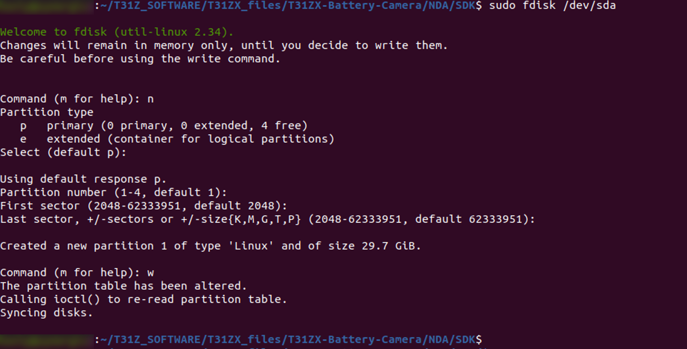
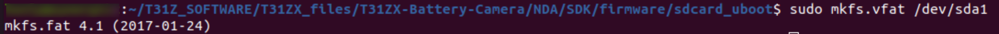
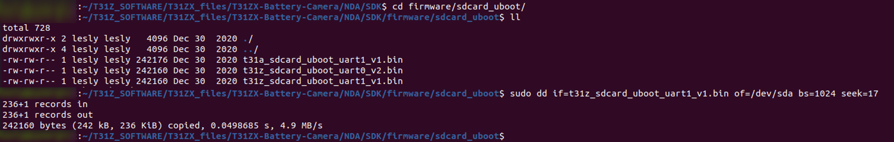

.. _3201 eval prep sd card:

Preparing the SD Card and Booting INP3201 Board
-----------------------------------------------

**Note**: The following steps need to be executed when booting the board
for the very first time.

1. Using a 16GB or 32GB SDCARD, connect to a Linux PC/LAPTOP using a
   card reader.

2. Create a new FAT partition in SDCARD – sdcard is enumerated as
   /dev/sda

.. code:: shell

   sudo fdisk /dev/sda
   //For creating a new partition type n
   Command (m for help): n <enter>

   //Select default primary partition
   Select (p(default) - primary (1 primary, 0 extended, 3 free), 
   e – extended(container for logical partitions)): <enter>

   //Use default partition number 1
   Partition number (1 - 4, default 1): <enter>

   First sector (2048 – 62333951, default 2048): <enter>
   Last sector, +/-sectors or +/-size{K,M,G,T,P} (2048 – 62333951, default 62333951): <enter>
   //Created a new partition 1 of ‘Linux’ and size of 29.7 GiB.
   //For writing the changes to SDCARD type w
   Command (m for help): w <enter>

|image1|

Figure 1: Create a new FAT partition

3. Create FAT filesystem on this new partition

.. code:: shell

      sudo mkfs.vfat /dev/sda1  

|image2|

Figure 2: Create FAT filesystem

4. Copy the pre-built MMC u-boot image given in the T31ZX SDK to SDCARD

SDK u-boot path: *T31ZX_files/T31ZX-Battery-Camera/NDA/SDK/firmware/sdcard_uboot*

.. code:: shell

      sudo dd if=t31z_sdcard_uboot_uart1_v1.bin of=/dev/sda1 bs=1024 seek=17

|image3|

Figure 3: Pre-build MMC u-boot image

5. Insert the SD card into the SD card slot of INP3201. Power ON the
   INP3201 by pressing the boot-select button to boot the uboot

