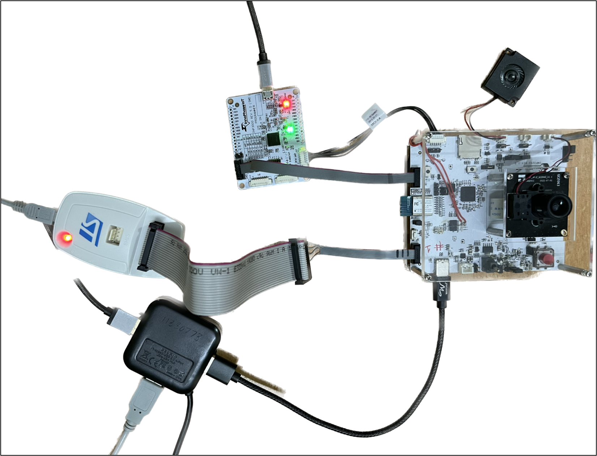

.. _3201 prog t2:

Programming Talaria TWO
-----------------------

Hardware Set-up
~~~~~~~~~~~~~~~

|image4|

Figure 1: Hardware set-up

**Note**:

1. For more details on the hardware requirements, refer section:
   *Hardware Requirements* of the document: UG_Dual-Stack.pdf
   (*talaria_two_dual_stack_vx.y\\host\\INP3201\\doc*).

2. For pin-outs details on INP3000 programmer board, refer
   UG_Programming_using_INP3000.pdf
   (*freertos_sdk_x.y\\doc\\user_guides\\ug_programming_using_INP3000*).

Procedure
~~~~~~~~~

Program the Dual-Stack ELF (<dual_stack_sdio>.elf) onto Talaria TWO
using the following steps:

1. Open a terminal on console machine and start openocd from FreeRTOS
   SDK root folder *(freertos_sdk_x.y\\)*. This enables in-system
   programming on Talaria TWO.

Command:

.. code:: shell

    sudo openocd -s ./conf/ -f ftdi_swd.cfg -f t2_swd.cfg 

Expected output:

.. code:: shell

    	Open On-Chip Debugger 0.10.0
	Licensed under GNU GPL v2
	For bug reports, read
		http://openocd.org/doc/doxygen/bugs.html
	adapter speed: 1000 kHz
	Info : FTDI SWD mode enabled
	cortex_m reset_config sysresetreq
	Info : clock speed 1000 kHz
	Info : SWD DPIDR 0x2ba01477
	Info : talaria_two.cpu: hardware has 6 breakpoints, 4 watchpoints
	Info : Talaria TWO rev. H0

	cortex_m reset_config sysresetreq
	Info : clock speed 1000 kHz
	Info : SWD DPIDR 0x2ba01477
	Info : talaria_two.cpu: hardware has 6 breakpoints, 4 watchpoints
	Info : Talaria TWO rev. H0

2. Start arden.py script from SDK root folder *(sdk_x.y\\)* on a new
   terminal:

Command:

.. code:: shell

    sudo python3 ./script/arden.py ./apps/gordon-jtag/bin/gordon-jtag.elf

Expected output:

.. code:: shell

    	[sudo] password for dell10: 
	(re)connecting with openocd
	openocd version: 'Open On-Chip Debugger 0.10.0'
	boot rom version of connected device: "yoda-h0-rom-16-0-gd5a8e586"
	starting up on localhost port 10000

3. Run the script gdbrun.py from FreeRTOS SDK root folder
   *(freertos_sdk_x.y\\)* on a new terminal. Given a HOST with running
   OpenOCD and UART relay, gdbrun.py connects to Host and load/boot an
   ELF image.

Command:

.. code:: shell

    sudo python3 ./script/gdbrun.py ./apps/gordon-jtag/bin/gordon-jtag.elf --noconsole --nowait

4. The <dual_stack_sdio>.elf generates dualstack.img and
   dualstack.img.vm and they are flashed to Talaria TWO using the
   following sequence of commands.

Command:

.. code:: shell

    sudo python3 ./script/boot.py --output dualstack.img ./solutions/dual_stack/bin/dual_stack_sdio.elf hio.transport=sdio hio.maxsize=8192 hio.sdio_mhz=10 wifi.outq_max=32 hio.irq_min_gap=60 hio.irq_retry_time=200 wifi.rts=2 wifi.pmode_cts=1

**Note**:

1. To enable Host reboot when Talaria TWO reboots, use the following bootargs:

.. code:: shell

    krn.gpio=--------------p----p-p ds.host_pwroff_gpio_state=LLLLLL--------p--p--p-

2. For video streaming, use the following bootargs:

.. code:: shell

    hio.min_heap_for_burst_tx=24000 hio.max_data_ind=3

a.  The minimum heap required for burst mechanism is 24000.

b. hio.max_data_ind specifies the maximum number of packets which can be queued in HIO for transmission.

Expected output:

.. code:: shell
	
   	Loading ./solutions/dual_stack/bin/dual_stack_sdio.elf
	Entrypoint 0xb1159
	Wrote bootimage to 
	.img 103_972 bytes
	Wrote vmimage to dualstack.img.vm 482_176 bytes

Command:

.. code:: shell

    ./script/flash.py --device localhost:10000 part_write BOOT @root/ freertos_sdk_x.y/dualstack.img

**Note**: Replace x and y in freertos_sdk_x.y with the appropriate SDK
release version.

Expected output:

.. code:: shell

 	write: [==================================================================>]
	103972 bytes written to addr 4096

Command:

.. code:: shell

    ./script/flash.py --device localhost:10000 part_write VIRT @root/ freertos_sdk_x.y/dualstack.img.vm

Expected output:

.. code:: shell

    write: [==================================================================>]
	482176 bytes written to addr 262144
	
	
	
	**
	**

After flashing the dual_stack_sdio.elf, update the root.img with AWS
certificates on /data partition.

Copy the AWS IoT certificates (aws_device_cert.crt, aws_device_pkey.key
& aws_root_ca.crt) into the rootfs folder
(*freertos_sdk_x.y/root_fs/root*) in the SDK package and use mklittlefs
command to create a new root image.

.. code:: shell

    ./tools/mklittlefs/mklittlefs -s 0x40000 -c ./root_fs/root root.img

Command:

.. code:: shell

    ./pc_tools/T2_Flasher/bin/T2_Flasher_Linux --operation=write_part --partition=DATA ./root.img

Expected output:

.. code:: shell

 	/tmp/_MEItbY8QH/bin
	Starting OpenOCD
	/tmp/_MEItbY8QH/bin/openocd/linux64/openocd_linux64 -s /tmp/_MEItbY8QH/bin/sdk-files -f /tmp/_MEItbY8QH/bin/openocd/interface/cmsis-dap.cfg -f t2_swd.cfg
	xPack OpenOCD, x86_64 Open On-Chip Debugger 0.10.0+dev (2020-10-13-17:27)
	Licensed under GNU GPL v2
	For bug reports, read
		http://openocd.org/doc/doxygen/bugs.html
	DEPRECATED! use 'adapter speed' not 'adapter_khz'
	cortex_m reset_config sysresetreq
	Error: couldn't bind tcl to socket on port 6666: Address already in use
	(re)connecting with openocd
	Info : accepting 'tcl' connection on tcp/6666
	talaria_two
	Open On-Chip Debugger 0.10.0
	openocd version: 'Open On-Chip Debugger 0.10.0'
	Connecting GDB
	Info : accepting 'gdb' connection on tcp/3333
	GDB: monitor reset halt
	Info : Talaria TWO rev. H0
	target halted due to debug-request, current mode: Thread 
	xPSR: 0x01000000 pc: 0x00020f90 msp: 0x00041a78
	GDB: gdb load /tmp/_MEItbY8QH/bin/tinyflasher.elf
	GDB: write WAIT_OP at 0x7ffe8
	Starting TinyFlasher
	GDB: gdb continue
	GDB: write READ_PTABLE_OP at 0x7ffe8
	GDB: gdb continue
	waiting...
	operation complete
	GDB: write WAIT_OP at 0x7ffe8
	Read ptable contents from memory
	Flashing ./root.img at 0x100000
	GDB: write sector count at 0x7fff0
	GDB: write target flash addr at 0x7fff4
	GDB: write image binary to RAM staging location (0x80000)
	GDB: write FLASH_OP at 0x7ffe8
	GDB: gdb continue
	waiting...
	operation complete
	GDB: write WAIT_OP at 0x7ffe8
	Disconnecting OpenOCD
	DONE
	Info : dropped 'tcl' connection
	Info : dropped 'gdb' connection

Once flashing and root image update is complete, reset Talaria TWO and
reboot T31ZX to start the demo application.

