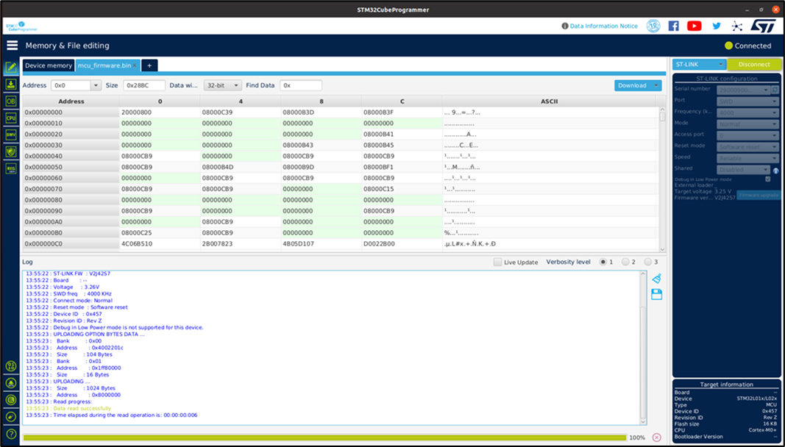

Flashing using STM32Cube Programmer
-------------------------

https://www.st.com/en/development-tools/stm32cubeprog.html

Execute the following steps to flash the binary file using STM32Cube
programmer:

|image1|

Figure 1: MCU ST-Link programmer connection

1. On launching the STM32Cube programmer, the following window pops-up.

|image2|

Figure 2: STM32Cube programmer board

2. To load the binary file, click on ‘Open File’ tab in the main window,
   select the .elf or .bin file to program from the Open File pop-up
   window and click Open.

|image3|

Figure 3: Load the binary file

The selected .elf or .bin file will be loaded in the STM32Cube
programmer. ST-Link configuration can be seen on the right-side.

a. Port: SWD

b. Frequency: 4000 Khz

c. Mode: Normal

d. Access Port: 0

e. Reset mode: Software reset

f. Speed: Reliable

g. Shared: Disabled

3. On confirming the ST-Link configurations, click on CONNECT button on
   the top right corner to connect to the target bard.

|image4|

Figure 4: Target window – device connected

4. Click on the Download button to program the STM32 MCU:

|image5|

Figure 5: Target -> Program & Verify

Once the programming is complete, a pop-up window with the following
message is displayed: File download completed. Click on OK to continue
and close the STM32Cube programming software.

5. After flashing the binary onto the MCU, press the reset button on the
   INP3201 board. This will turn the T31ZX Host ON and execute the
   app_init.sh script automatically.

The console output confirms the binary being loaded appropriately.

