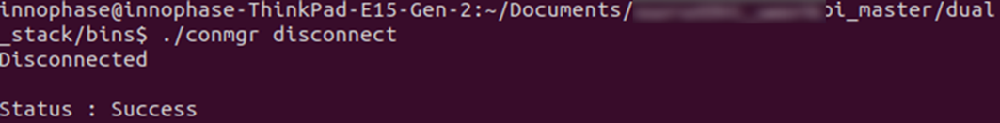

Use Case 1: Station Mode Wi-Fi Connection
~~~~~~~~~~~~~~~~~~~~~~~~~~~~~~~~~~~~~~~~~

This use case is to demonstrate the station mode configuration and
connecting to the Wi-Fi Access Point.

Execute the following operations on the Talaria TWO:

**Step 1**: Scan the network.

**Step 2**: Connect to the desired network by providing SSID and
passphrase

**Step 3**: Get the IP address of the Talaria TWO module

**Step 4**: Get the WLAN status of the Talaria TWO module

**Step 5**: Disconnect from the connected network

.. table:: Table 1: Station Mode Wi-Fi Connection – Commands

   +----------------------------------+-----------------------------------+
   | **Command**                      | **Description**                   |
   +==================================+===================================+
   | *./conmgr scan*                  | Scan                              |
   +----------------------------------+-----------------------------------+
   | *./conmgr connect <SSID><AP      | Connect                           |
   | PWD>*                            |                                   |
   +----------------------------------+-----------------------------------+
   | *./conmgr ip*                    | Get IP address                    |
   +----------------------------------+-----------------------------------+
   | *./conmgr status*                | Get WLAN status                   |
   +----------------------------------+-----------------------------------+
   | *./conmgr disconnect*            | Disconnect                        |
   +----------------------------------+-----------------------------------+

Console outputs:

1. ./conmgr scan

..

   |Text Description automatically generated|

Figure 9: ./conmgr scan – output

2. ./conmgr connect innotest 123456789

|A screenshot of a computer Description automatically generated|

Figure 10: ./conmgr connect - output

3. ./conmgr ip

|A screenshot of a computer Description automatically generated with
medium confidence|

Figure 11: ./conmgr ip – output

4. ./conmgr status

|image1|

Figure 12: ./conmgr status – output

5. ./conmgr disconnect

..

   |image2|

Figure 13: ./conmgr disconnect – output

.. |A screenshot of a computer Description automatically generated| image:: media/image2.png
   :width: 7.10694in
   :height: 0.91319in

