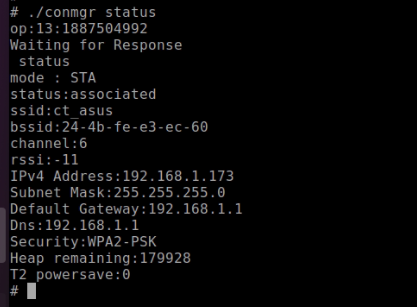

Use Case 2: Performance Test using iPerf Application
~~~~~~~~~~~~~~~~~~~~~~~~~~~~~~~~~~~~~~~~~~~~~~~~~~~~

This use case is to test the performance using iPerf application.
Execute the following steps:

**Step 1**:

1. Scan the network

2. Connect to the network of SSID ct_asus and passphrase 12345678

3. Get the IP address of the Talaria TWO module

4. Get the WLAN status of the Talaria TWO module

5. Start the UDP server and send data once the client connects

.. table:: Table 2: Performance Test using iPerf Application – Commands

   +----------------------------------+-----------------------------------+
   | **Command**                      | **Description**                   |
   +==================================+===================================+
   | *./conmgr scan*                  | Scan                              |
   +----------------------------------+-----------------------------------+
   | *./conmgr connect <SSID><AP      | Connect                           |
   | PWD>*                            |                                   |
   +----------------------------------+-----------------------------------+
   | *./conmgr ip*                    | Get IP address                    |
   +----------------------------------+-----------------------------------+
   | *./conmgr status*                | Status                            |
   +----------------------------------+-----------------------------------+
   | *iperf3 -s -i 1*                 | Iperf traffic for UDP UL          |
   +----------------------------------+-----------------------------------+

Console outputs:

1. ./conmgr connect innotest 123456789

|A screenshot of a computer Description automatically generated|

Figure 14: ./conmgr connect - output

2. ./conmgr status

|Text Description automatically generated|

Figure 15: ./conmgr status – output

**Step 2**: From the Linux host machine, start the UDP client using the
following command, connect to the Talaria TWO UDP server of IP address
192.168.1.173 and port 5201. Once the client connects, Talaria TWO will
start sending the data over UDP socket:

+-----------------------------------------------------------------------+
| iperf3 -c <Ipaddress> -i 1 -t 36000 -u -b 15M -R                      |
+=======================================================================+
+-----------------------------------------------------------------------+

Output:

|A picture containing graphical user interface Description automatically
generated|

Figure 16: Starting UDP Client

.. |A screenshot of a computer Description automatically generated| image:: media/image1.png
   :width: 7.10694in
   :height: 0.91319in

.. |A picture containing graphical user interface Description automatically generated| image:: media/image3.png
   :width: 7.48056in
   :height: 2.63681in
