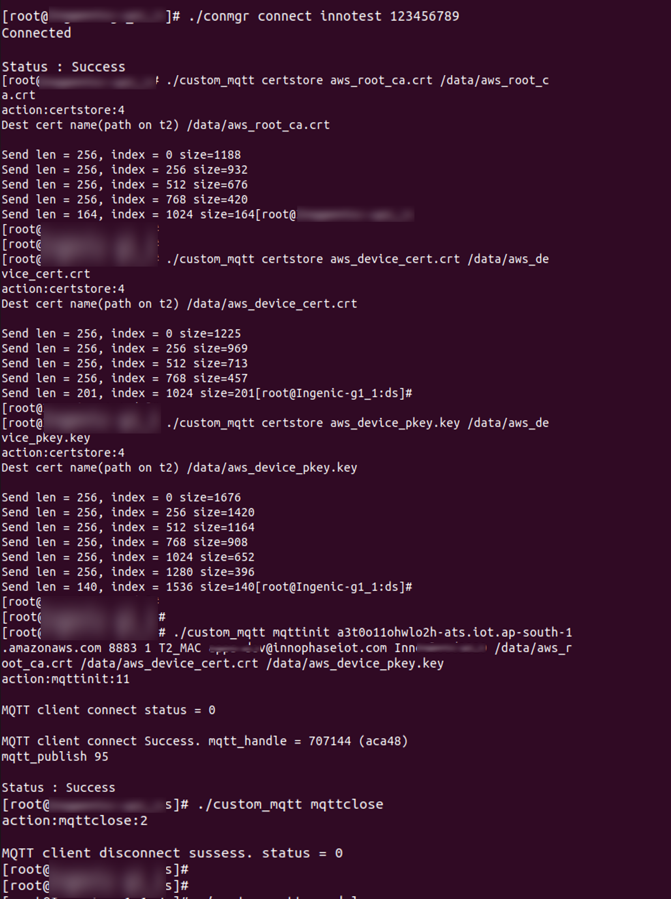

.. _3201 custom mqtt:

Custom MQTT Application
-----------------------

Description
~~~~~~~~~~~

Custom MQTT (custom_mqtt) application is used to demonstrate MQTT client
on Talaria TWO.

This application can download the certificates onto Talaria TWO, start
the MQTT connection, subscribe to a topic, publish message to MQTT
server and close the MQTT connection.

This application uses MQTT message IDs and group IDs provided by
InnoPhase IoT as well as custom defined IDs.

Prerequisites
~~~~~~~~~~~~~

1. GTKTerm or similar application.

2. Access Point configured with WPA/WPA2 personal security.

3. Mosquitto.exe from http://mosquitto.org/download/.

4. Generate certificates from:

   a. Download certificate authority file: https://test.mosquitto.org/.

   b. Generate client certificates: https://test.mosquitto.org/ssl/.

**Note**: Ensure Talaria TWO is connected to an Access Point to run the
custom MQTT application.

Command Description
~~~~~~~~~~~~~~~~~~~

Connect to an Access Point with specified SSID and passphrase.

.. code:: shell

      $ ./conmgr connect <SSID> <passphrase>    

Store the certificate.

.. code:: shell

      ./custom_mqtt {certstore} <filename> <store as>   

where,

1. filename: Certificate file path (absolute) as on the Host

2. store as: Path to be stored as in Talaria TWO filesystem. Must start
   with */data/*

Start MQTT connection with Mosquitto server.

.. code:: shell

      $ ./custom_mqtt {mqttinit} <server name> <port number> <transport> <mqtt id> <usr name> <password> [ca cert]  [client cert]  [client key]

where,

1. server name: MQTT broker address

2. port number: Port number

3. transport: Transport mode 0 -> TCP , 1-> TLS with Client auth

4. mqtt id: MQTT client ID

5. usr name: Username (use --no_un if no username is required)

6. password: Password (use --no_pw if no password is required)

7. ca cert: CA certificate name

8. client cert: Client certificate name

9. client key: Client key certificate name

Close MQTT connection.

.. code:: shell

      $ ./custom_mqtt {mqttclose}   

Procedure
~~~~~~~~~

Execute the following operations on the Talaria TWO:

**Step 1**: Connect Talaria TWO to the desired network by providing SSID
and passphrase.

**Step 2**: Store the client certificates on Talaria TWO.

**Step 3**: Start MQTT connection with Mosquitto server.

**Step 4**: Connect the backend Host machine to the same network as
Talaria TWO and issue the commands to start MQTT client on Linux
terminal to observe publish/subscribe messages.

**Step 5**: Close the MQTT connection.

Expected Output
~~~~~~~~~~~~~~~

Host Console Logs
^^^^^^^^^^^^^^^^^

|image4|

Figure 1: custom_mqtt - Host console logs

.. code:: shell

      [root@:ds]# reboot                                                  
      [root@:ds]# umount: tmpfs busy - remounted read-only                
      The system is going down NOW!                                                   
      Sent SIGTERM to all processes                                                   
      Sent SIGKILL to all processes                                                   
      Requesting system reboot[  147.951504] sw_read: ERESTARTSYS                     
      [  147.959702] sw_release                                                       
      [  147.962204] sw_fasync: fd=-1, file=807a5960, mode=0                          
      [  148.951328] Restarting system.                                               
      [  148.954522] Restarting after 4 ms                                            
                                                                                      
      U-Boot SPL 2013.07 (Nov 14 2022 - 10:37:43)                                     
      Timer init                                                                      
      CLK stop                                                                        
      PLL init                                                                        
      pll_init:366                                                                    
      pll_cfg.pdiv = 10, pll_cfg.h2div = 5, pll_cfg.h0div = 5, pll_cfg.cdiv = 1, pll_2
      nf=116 nr = 1 od0 = 1 od1 = 2                                                   
      cppcr is 07405100                                                               
      CPM_CPAPCR 0740510d                                                             
      nf=100 nr = 1 od0 = 1 od1 = 2                                                   
      cppcr is 06405100                                                               
      CPM_CPMPCR 0640510d                                                             
      nf=100 nr = 1 od0 = 1 od1 = 2                                                   
      cppcr is 06405100                                                               
      CPM_CPVPCR 0640510d                                                             
      cppcr 0x9a7b5510                                                                
      apll_freq 1392000000                                                            
      mpll_freq 1200000000                                                            
      vpll_freq = 1200000000                                                          
      ddr sel mpll, cpu sel apll                                                      
      ddrfreq 600000000                                                               
      cclk  1392000000                                                                
      l2clk 696000000                                                                 
      h0clk 240000000                                                                 
      h2clk 240000000                                                                 
      pclk  120000000                                                                 
      CLK init                                                                        
      SDRAM init                                                                      
      sdram init start                                                                
      ddr_inno_phy_init ..!                                                           
      phy reg = 0x00000007, CL = 0x00000007                                           
      ddr_inno_phy_init ..! 11:  00000004                                             
      ddr_inno_phy_init ..! 22:  00000006                                             
      ddr_inno_phy_init ..! 33:  00000006                                             
      REG_DDR_LMR: 00000210                                                           
      REG_DDR_LMR: 00000310                                                           
      REG_DDR_LMR: 00000110                                                           
      REG_DDR_LMR, MR0: 00f73011                                                      
      T31_0x5: 00000007                                                               
      T31_0x15: 0000000c                                                              
      T31_0x4: 00000000                                                               
      T31_0x14: 00000002                                                              
      INNO_TRAINING_CTRL 1: 00000000                                                  
      INNO_TRAINING_CTRL 2: 000000a1                                                  
      T31_cc: 00000003                                                                
      INNO_TRAINING_CTRL 3: 000000a0                                                  
      T31_118: 0000003c                                                               
      T31_158: 0000003c                                                               
      T31_190: 0000001e                                                               
      T31_194: 0000001c                                                               
      jz-04 :  0x00000051                                                             
      jz-08 :  0x000000a0                                                             
      jz-28 :  0x00000024                                                             
      DDR PHY init OK                                                                 
      INNO_DQ_WIDTH   :00000003                                                       
      INNO_PLL_FBDIV  :00000014                                                       
      INNO_PLL_PDIV   :00000005                                                       
      INNO_MEM_CFG    :00000051                                                       
      INNO_PLL_CTRL   :00000018                                                       
      INNO_CHANNEL_EN :0000000d                                                       
      INNO_CWL        :00000006                                                       
      INNO_CL         :00000007                                                       
      DDR Controller init                                                             
      DDRC_STATUS         0x80000001                                                  
      DDRC_CFG            0x0aa88a42                                                  
      DDRC_CTRL           0x0000011c                                                  
      DDRC_LMR            0x00400008                                                  
      DDRC_DLP            0x00000000                                                  
      DDRC_TIMING1        0x050f0a06                                                  
      DDRC_TIMING2        0x021c0a07                                                  
      DDRC_TIMING3        0x200a0722                                                  
      DDRC_TIMING4        0x26240031                                                  
      DDRC_TIMING5        0xff060405                                                  
      DDRC_TIMING6        0x321c0505                                                  
      DDRC_REFCNT         0x00910603                                                  
      DDRC_MMAP0          0x000020f8                                                  
      DDRC_MMAP1          0x00002800                                                  
      DDRC_REMAP1         0x030e0d0c                                                  
      DDRC_REMAP2         0x07060504                                                  
      DDRC_REMAP3         0x0b0a0908                                                  
      DDRC_REMAP4         0x0f020100                                                  
      DDRC_REMAP5         0x13121110                                                  
      DDRC_AUTOSR_EN      0x00000000                                                  
      sdram init finished                                                             
      SDRAM init ok                                                                   
      board_init_r                                                                    
      image entry point: 0x80100000                                                   
                                                                                      
                                                                                      
      U-Boot 2013.07 (Nov 14 2022 - 10:37:43)                                         
                                                                                      
      Board: ISVP (XXXXXX)                                            
      DRAM:  128 MiB                                                                  
      Top of RAM usable for U-Boot at: 84000000                                       
      Reserving 443k for U-Boot at: 83f90000                                          
      Reserving 32784k for malloc() at: 81f8c000                                      
      Reserving 32 Bytes for Board Info at: 81f8bfe0                                  
      Reserving 124 Bytes for Global Data at: 81f8bf64                                
      Reserving 128k for boot params() at: 81f6bf64                                   
      Stack Pointer at: 81f6bf48                                                      
      Now running in RAM - U-Boot at: 83f90000                                        
      MMC:   msc: 0                                                                   
      the manufacturer c8                                                             
      SF: Detected GD25Q128                                                           
                                                                                      
      In:    serial                                                                   
      Out:   serial                                                                   
      Err:   serial                                                                   
      Net:   ====>PHY not found!Jz4775-9161                                           
      Hit any key to stop autoboot:  0                                                
      the manufacturer c8                                                             
      SF: Detected GD25Q128                                                           
                                                                                      
      --->probe spend 4 ms                                                            
      SF: 2621440 bytes @ 0x40000 Read: OK                                            
      --->read spend 843 ms                                                           
      ## Booting kernel from Legacy Image at 80600000 ...                             
         Image Name:   Linux-3.10.14__isvp_swan_1.0__                                 
         Image Type:   MIPS Linux Kernel Image (lzma compressed)                      
         Data Size:    1994978 Bytes = 1.9 MiB                                        
         Load Address: 80010000                                                       
         Entry Point:  80450890                                                       
         Verifying Checksum ... OK                                                    
         Uncompressing Kernel Image ... OK                                            
                                                                                      
      Starting kernel ...                                                             
                                                                                      
      [    0.000000] Initializing cgroup subsys cpu                                   
      [    0.000000] Initializing cgroup subsys cpuacct                               
      [    0.000000] Linux version 3.10.14__isvp_swan_1.0__ (lesly@synergic) (gcc ver3
      [    0.000000] bootconsole [early0] enabled                                     
      [    0.000000] CPU0 RESET ERROR PC:8020DE80                                     
      [    0.000000] [<8020de80>] __delay+0x0/0x10                                    
      [    0.000000] CPU0 revision is: 00d00100 (XXXXX)                      
      [    0.000000] FPU revision is: 00b70000                                        
      [    0.000000] CCLK:1392MHz L2CLK:696Mhz H0CLK:200MHz H2CLK:200Mhz PCLK:100Mhz  
      [    0.000000] Determined physical RAM map:                                     
      [    0.000000]  memory: 00593000 @ 00010000 (usable)                            
      [    0.000000]  memory: 0003d000 @ 005a3000 (usable after init)                 
      [    0.000000] User-defined physical RAM map:                                   
      [    0.000000]  memory: 04000000 @ 00000000 (usable)                            
      [    0.000000] Zone ranges:                                                     
      [    0.000000]   Normal   [mem 0x00000000-0x03ffffff]                           
      [    0.000000] Movable zone start for each node                                 
      [    0.000000] Early memory node ranges                                         
      [    0.000000]   node   0: [mem 0x00000000-0x03ffffff]                          
      [    0.000000] Primary instruction cache 32kB, 8-way, VIPT, linesize 32 bytes.  
      [    0.000000] Primary data cache 32kB, 8-way, VIPT, no aliases, linesize 32 bys
      [    0.000000] pls check processor_id[0x00d00100],sc_jz not support!            
      [    0.000000] MIPS secondary cache 128kB, 8-way, linesize 32 bytes.            
      [    0.000000] Built 1 zonelists in Zone order, mobility grouping off.  Total p6
      [    0.000000] Kernel command line: console=ttyS1,115200n8 mem=64M@0x0 rmem=64M)
      [    0.000000] PID hash table entries: 256 (order: -2, 1024 bytes)              
      [    0.000000] Dentry cache hash table entries: 8192 (order: 3, 32768 bytes)    
      [    0.000000] Inode-cache hash table entries: 4096 (order: 2, 16384 bytes)     
      [    0.000000] Memory: 58512k/65536k available (4389k kernel code, 7024k reserv)
      [    0.000000] SLUB: HWalign=32, Order=0-3, MinObjects=0, CPUs=1, Nodes=1       
      [    0.000000] Preemptible hierarchical RCU implementation.                     
      [    0.000000] NR_IRQS:358                                                      
      [    0.000000] clockevents_config_and_register success.                         
      [    0.000040] Calibrating delay loop... 1386.49 BogoMIPS (lpj=2772992)         
      [    0.029794] pid_max: default: 32768 minimum: 301                             
      [    0.034662] Mount-cache hash table entries: 512                              
      [    0.039568] Initializing cgroup subsys debug                                 
      [    0.043856] Initializing cgroup subsys freezer                               
      [    0.049935] regulator-dummy: no parameters                                   
      [    0.054191] NET: Registered protocol family 16                               
      [    0.069542] bio: create slab <bio-0> at 0                                    
      [    0.075026] jz-dma jz-dma: JZ SoC DMA initialized                            
      [    0.080068] SCSI subsystem initialized                                       
      [    0.083958] usbcore: registered new interface driver usbfs                   
      [    0.089492] usbcore: registered new interface driver hub                     
      [    0.094928] usbcore: registered new device driver usb                        
      [    0.100124] i2c-gpio i2c-gpio.1: using pins 57 (SDA) and 58 (SCL)            
      [    0.106312]  (null): set:249  hold:250 dev=100000000 h=500 l=500             
      [    0.113771] Switching to clocksource jz_clocksource                          
      [    0.118697] cfg80211: Calling CRDA to update world regulatory domain         
      [    0.125578] NET: Registered protocol family 2                                
      [    0.130351] TCP established hash table entries: 512 (order: 0, 4096 bytes)   
      [    0.137294] TCP bind hash table entries: 512 (order: -1, 2048 bytes)         
      [    0.143710] TCP: Hash tables configured (established 512 bind 512)           
      [    0.150011] TCP: reno registered                                             
      [    0.153251] UDP hash table entries: 256 (order: 0, 4096 bytes)               
      [    0.159166] UDP-Lite hash table entries: 256 (order: 0, 4096 bytes)          
      [    0.165703] NET: Registered protocol family 1                                
      [    0.170302] RPC: Registered named UNIX socket transport module.              
      [    0.176280] RPC: Registered udp transport module.                            
      [    0.181008] RPC: Registered tcp transport module.                            
      [    0.185774] RPC: Registered tcp NFSv4.1 backchannel transport module.        
      [    0.192594] freq_udelay_jiffys[0].max_num = 10                               
      [    0.197048] cpufreq  udelay  loops_per_jiffy                                 
      [    0.201442] 12000     23905   23905                                          
      [    0.204699] 24000     47810   47810                                          
      [    0.207973] 60000     119525  119525                                         
      [    0.211416] 120000    239051  239051                                         
      [    0.214948] 200000    398418  398418                                         
      [    0.218479] 300000    597627  597627                                         
      [    0.222010] 600000    1195255         1195255                                
      [    0.225719] 792000    1577736         1577736                                
      [    0.229427] 1008000   2008028         2008028                                
      [    0.233224] 1200000   2390510         2390510                                
      [    0.241282] squashfs: version 4.0 (2009/01/31) Phillip Lougher               
      [    0.247798] jffs2: version 2.2. © 2001-2006 Red Hat, Inc.                    
      [    0.253627] msgmni has been set to 114                                       
      [    0.258430] io scheduler noop registered                                     
      [    0.262430] io scheduler cfq registered (default)                            
      [    0.268212] jz-uart.1: ttyS1 at MMIO 0x10031000 (irq = 58) is a uart1        
      [    0.275802] console [ttyS1] enabled, bootconsole disabled                    
      [    0.275802] console [ttyS1] enabled, bootconsole disabled                    
      [    0.289612] brd: module loaded                                               
      [    0.294168] loop: module loaded                                              
      [    0.297913] zram: Created 2 device(s) ...                                    
      [    0.302145] logger: created 256K log 'log_main'                              
      [    0.307206] jz TCU driver register completed                                 
      [    0.311969] wait stable.[289][cgu_ssi]                                       
      [    0.315926] the id code = c84018, the flash name is GD25Q127C                
      [    0.321864] the flash->board_info->quad_mode = 6b                            
      [    0.326718] JZ SFC Controller for SFC channel 0 driver register              
      [    0.332842] 4 cmdlinepart partitions found on MTD device jz_sfc              
      [    0.338974] Creating 4 MTD partitions on "jz_sfc":                           
      [    0.343927] 0x000000000000-0x000000040000 : "boot"                           
      [    0.349298] 0x000000040000-0x0000002c0000 : "kernel"                         
      [    0.354790] 0x0000002c0000-0x000000ac0000 : "root"                           
      [    0.360112] 0x000000ac0000-0x000001000000 : "appfs"                          
      [    0.365522] SPI NOR MTD LOAD OK                                              
      [    0.368857] dma dma0chan17: Channel 17 have been requested.(phy id 14,type 0)
      [    0.377805] dma dma0chan18: Channel 18 have been requested.(phy id 13,type 0)
      [    0.386874] jz-ssi jz-ssi.0: master is unqueued, this is deprecated          
      [    0.393387] JZ SSI Controller for SPI channel 0 driver register              
      [    0.399546] tun: Universal TUN/TAP device driver, 1.6                        
      [    0.404770] tun: (C) 1999-2004 Max Krasnyansky <maxk@qualcomm.com>           
      [    0.411236] usbcore: registered new interface driver zd1201                  
      [    0.417073] jz-dwc2 jz-dwc2: cgu clk gate get error                          
      [    0.422144] DWC IN OTG MODE                                                  
      [    0.425658] dwc2 dwc2: Keep PHY ON                                           
      [    0.429174] dwc2 dwc2: Using Buffer DMA mode                                 
      [    0.433588] dwc2 dwc2: Core Release: 3.00a                                   
      [    0.437854] dwc2 dwc2: DesignWare USB2.0 High-Speed Host Controller          
      [    0.444340] dwc2 dwc2: new USB bus registered, assigned bus number 1         
      [    0.451532] hub 1-0:1.0: USB hub found                                       
      [    0.455444] hub 1-0:1.0: 1 port detected                                     
      [    0.459602] dwc2 dwc2: DWC2 Host Initialized                                 
      [    0.464180] usbcore: registered new interface driver usb-storage             
      [    0.470642] jzmmc_v1.2 jzmmc_v1.2.0: vmmc regulator missing                  
      [    0.476652] jzmmc_v1.2 jzmmc_v1.2.0: register success!                       
      [    0.482076] jzmmc_v1.2 jzmmc_v1.2.1: vmmc regulator missing                  
      [    0.487959] jzmmc_v1.2 jzmmc_v1.2.1: register success!                       
      [root@:~]# cd config/ds
      [root@:ds]# ./start.sh 
      [root@:ds]# [   36.834768] wait stable.[289][cgu_msc1]
      [   36.840434] cs:0x7, vnd:0xABCD, dev:0x1
      [   36.844401] mmc1: new SDIO card at address 0001
      [   36.851589] sdio_t2_probe: 793
      [   36.857290] sw_uevent
      [   36.861765] New device wlanSDIO0
      
      [root@:ds]# ./tunadapter board_conf=board.conf&
      [root@:ds]# board_conf file=0
      Key file path = /etc
      
      Loading conf from board.conf
      Config Loaded: board.conf
      =========conf========
      platform=t31_without_powersave
      host_irq_num=12
      host_irq_dev=
      t2_irq_pin=0
      t2_irq_mode=0
      shutdown_gpio_s[   42.685728] sw_open
      tates=pppppp--------p--p--p-
      powersave_support=0                                                             
      wakeup_pin=39                                                                   
      t2_wakeup_pin=14                                                                
      wakeup_level_at_t2=1                                                            
      delay1=0                                                                        
      delay2=0                                                                        
      sleep_udelay=500                                                                
      =====================                                                           
      ./tunadapter: platform=t31_without_powersave                                    
      Initializing hapi                                                               
      Opening Serial device /dev/wlanSDIO0                                            
      Speed=0                                                                         
                                                                                      
      hapi_recv_thread:992 DEBUG:recv thread entry                                    
      hapi_config:1606 DEBUG:hapi_config. 0 0 0 0                                     
      hapi_config:1666 DEBUG:before calling hio_query                                 
      hapi_hio_query:396 DEBUG:Connected to T2, max packet size is 4092               
      hapi_hio_query:397 DEBUG:Firmware version: , patch version                      
      hapi_hio_query:398 DEBUG:Hapi version: 1                                        
      hapi_config:1668 DEBUG:after calling hio_query                                  
      Initializing tunadaptor interface                                               
      hapi_wcm_create:112 DEBUG:WiFi interface created with mac addr: E2:69:3A:00:04:E
      Tunadaptor ready...                                                             
      ptsname:/dev/pts/0                                                              
                                                                                      
      [root@:ds]# ./conmgr connect innotest 123456789                     
      Connected                                                                       
                                                                                      
      Status : Success                                                                
      [root@:ds]# ./custom_mqtt certstore aws_root_ca.crt /data/aws_root_c
      a.crt
      action:certstore:4                                                              
      Dest cert name(path on t2) /data/aws_root_ca.crt                                
                                                                                      
      Send len = 256, index = 0 size=1188                                             
      Send len = 256, index = 256 size=932                                            
      Send len = 256, index = 512 size=676                                            
      Send len = 256, index = 768 size=420                                            
      Send len = 164, index = 1024 size=164[root@:ds]#                    
      [root@:ds]#                                                         
      [root@:ds]#                                                         
      [root@:ds]# ./custom_mqtt certstore aws_device_cert.crt /data/aws_de
      vice_cert.crt                                                                   
      action:certstore:4                                                              
      Dest cert name(path on t2) /data/aws_device_cert.crt                            
                                                                                      
      Send len = 256, index = 0 size=1225                                             
      Send len = 256, index = 256 size=969                                            
      Send len = 256, index = 512 size=713                                            
      Send len = 256, index = 768 size=457                                            
      Send len = 201, index = 1024 size=201[root@:ds]#                    
      [root@:ds]#                                                         
      [root@:ds]# ./custom_mqtt certstore aws_device_pkey.key /data/aws_de
      vice_pkey.key                                                                   
      action:certstore:4                                                              
      Dest cert name(path on t2) /data/aws_device_pkey.key                            
                                                                                      
      Send len = 256, index = 0 size=1676                                             
      Send len = 256, index = 256 size=1420                                           
      Send len = 256, index = 512 size=1164                                           
      Send len = 256, index = 768 size=908                                            
      Send len = 256, index = 1024 size=652                                           
      Send len = 256, index = 1280 size=396                                           
      Send len = 140, index = 1536 size=140[root@:ds]#                    
      [root@:ds]#                                                         
      [root@ ds]# ./custom_mqtt mqttinit a3t0o11ohwlo2h-ats.iot.ap-south-1
      .amazonaws.com 8883 1 T2_MAC apps-dev@innophaseiot.com InnoCloud2020 /data/aws_r
      oot_ca.crt /data/aws_device_cert.crt /data/aws_device_pkey.key                  
      action:mqttinit:11                                                              
                                                                                      
      MQTT client connect status = 0                                                  
                                                                                      
      MQTT client connect Success. mqtt_handle = 707144 (aca48)                       
      mqtt_publish 95                                                                 
                                                                                      
      Status : Success                                                                
      [root@:ds]# ./custom_mqtt mqttclose                                 
      action:mqttclose:2                                                              
                                                                                      
      MQTT client disconnect sussess. status = 0                                      
      [root@:ds]#

List of Message IDs Used
~~~~~~~~~~~~~~~~~~~~~~~~

This application makes use of following message IDs and uses Group
numbers 68 (HIO_GROUP_MQTT_CUSTOM), 80 (HIO_GROUP_FILE),
71(HIO_GROUP_MQTT):

1. FILE_HIO_ADD_REQ

This message will be sent to Talaria TWO when this application is
invoked to store certificate files in Talaria TWO. Path of the file to
be stored as, in the filesystem will be sent to Talaria TWO prior to
certificate DATA to Talaria TWO.

2. FILE_HIO_SEND_REQ

This message is sent to Talaria TWO to store the certificate. The
certificate file is sent in multiple chunks of bytes. Hence, this
message is sent with each chunk. Talaria TWO receives this message and
replies with FILE_HIO_SEND_RSP with status.

3. FILE_HIO_DELETE_REQ

This message will be sent to Talaria TWO to remove the certificate files
from Talaria TWO filesystem when invoked with “certdel”

4. MQTT_CLIENT_CONNECT_REQ

This message is sent to Talaria TWO to start the MQTT client. Talaria
TWO receives this message and replies with MQTT_CLIENT_CONNECT_RSP along
with the status.

5. MQTT_CLIENT_DISCONNECT_REQ

This message is sent to Talaria TWO to close the MQTT client. Talaria
TWO receives this message and replies with MQTT_CLIENT_DISCONNECT_RSP
along with the status.

6. MQTT_CUSTOM_ITERATIVE_PUBLISH_REQ

This message will be sent to Talaria TWO to request for publish message
from MQTT server when there is any publish message received on the
server.

