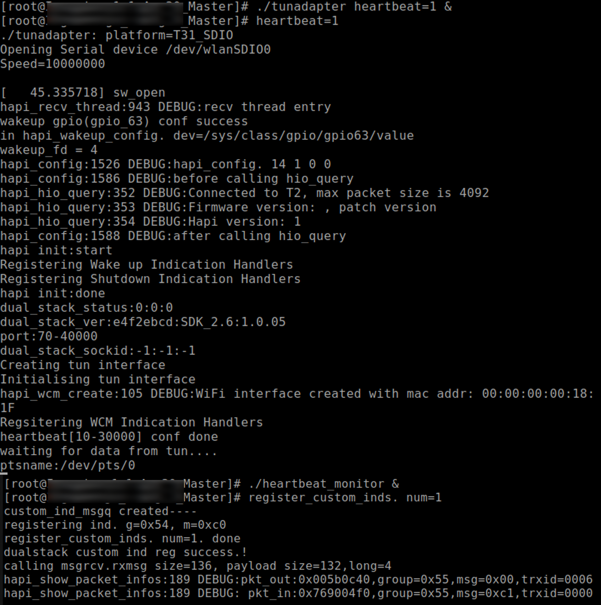
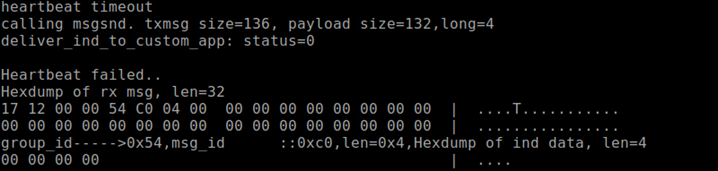

.. _3201 heartbeat:

Heartbeat Monitor Application
-----------------------------

Description
~~~~~~~~~~~

Heartbeat monitor application demonstrates use of custom indications in
Dual-Stack custom applications. It monitors heartbeat failure.

Under normal Dual-Stack working, if Talaria TWO crashes or hangs, the
host application will be unable to detect it. The heartbeat feature is
implemented to avoid this. Every 10 seconds, the host sends a heartbeat
signal to Talaria TWO. Talaria TWO acknowledges this by sending an
indication of its normal working. If Talaria TWO stops responding, the
host detects this issue notifies this in the custom application:
heartbeat_monitor.

The custom application is located in *hapi/dual_stack/bins* folder.

Prerequisites
~~~~~~~~~~~~~

1. GTKTerm or similar application.

2. Start the tunadapter with heartbeat=1.

Command Description
~~~~~~~~~~~~~~~~~~~

Enable the heartbeat feature. By default, the heartbeat feature is
disabled.

.. code:: shell

      ./tunadapter heartbeat=1&  

Monitor heartbeat failure.

.. code:: shell

      $./heartbeat_monitor  

Procedure
~~~~~~~~~

Execute the following operations on Talaria TWO:

**Step 1**: Start the tunadapter with heartbeat=1.

**Step 2**: Heartbeat message is sent every 10 seconds, which is fixed.

**Step 3**: Run the custom application (heartbeat_monitor), to monitor
heartbeat feature.

**Step 4**: When Talaria TWO crashes or is out-of-sync with the host,
the host notifies the custom application and displays the same.

**Step 5**: The custom application waits for the indication message from
the host and once received, prints the message.

Expected Output
~~~~~~~~~~~~~~~

Host Console Logs
^^^^^^^^^^^^^^^^^

|image5|

Figure 1: Heartbeat monitor - Host console logs

Host serial log – text output:

.. code:: shell

      [root@:]# ./tunadapter heartbeat=1 &
      [root@:]# heartbeat=1
      ./tunadapter: platform=<host>_SDIO
      Opening Serial device /dev/wlanSDIO0
      Speed=10000000
      [   45.335718] sw_open
      hapi_recv_thread:943 DEBUG:recv thread entry
      wakeup gpio(gpio_63) conf success
      in hapi_wakeup_config. dev=/sys/class/gpio/gpio63/value
      wakeup_fd = 4
      hapi_config:1526 DEBUG:hapi_config. 14 1 0 0
      hapi_config:1586 DEBUG:before calling hio_query
      hapi_hio_query:352 DEBUG:Connected to T2, max packet size is 4092
      hapi_hio_query:353 DEBUG:Firmware version: , patch version 
      hapi_hio_query:354 DEBUG:Hapi version: 1
      hapi_config:1588 DEBUG:after calling hio_query
      hapi init:start
      Registering Wake up Indication Handlers
      Registering Shutdown Indication Handlers
      hapi init:done
      dual_stack_status:0:0:0
      dual_stack_ver:e4f2ebcd:FREERTOS_SDK_1.0:1.0.05
      port:70-40000
      dual_stack_sockid:-1:-1:-1
      Creating tun interface
      Initialising tun interface
      hapi_wcm_create:105 DEBUG:WiFi interface created with mac addr: 00:00:00:00:18:1F
      Regsitering WCM Indication Handlers
      heartbeat[10-30000] conf done
      waiting for data from tun....
      ptsname:/dev/pts/0
      
      [root@:]# ./heartbeat_monitor &
      [root@:]# register_custom_inds. num=1
      custom_ind_msgq created----
      registering ind. g=0x54, m=0xc0
      register_custom_inds. num=1. done
      dualstack custom ind reg success.!
      calling msgrcv.rxmsg size=136, payload size=132,long=4
      hapi_show_packet_infos:189 DEBUG:pkt_out:0x005b0c40,group=0x55,msg=0x00,trxid=0006
      hapi_show_packet_infos:189 DEBUG: pkt_in:0x769004f0,group=0x55,msg=0xc1,trxid=0000

In case of heartbeat failure, host prints the following hexdump on the
console:

|image6|

Figure 2: Heartbeat failure hexdump

.. code:: shell

      heartbeat timeout 
      calling msgsnd. txmsg size=136, payload size=132,long=4
      deliver_ind_to_custom_app: status=0
      Heartbeat failed..
      Hexdump of rx msg, len=32
      17 12 00 00 54 C0 04 00  00 00 00 00 00 00 00 00  |  ....T........... 
      00 00 00 00 00 00 00 00  00 00 00 00 00 00 00 00  |  ................ 
      group_id----->0x54,msg_id      ::0xc0,len=0x4,Hexdump of ind data, len=4
      00 00 00 00

List of Message IDs Used
~~~~~~~~~~~~~~~~~~~~~~~~

This application demonstrates the use of custom indications in
Dual-Stack custom apps and uses Group number 84. Following is the
message ID used:

1. HEARTBEAT_MONITOR_FAILED_IND

This message is sent to indicate heartbeat failure.

