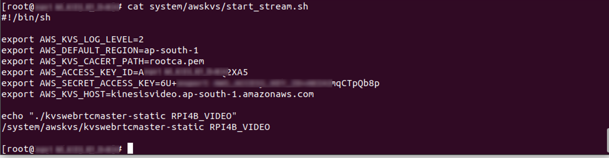
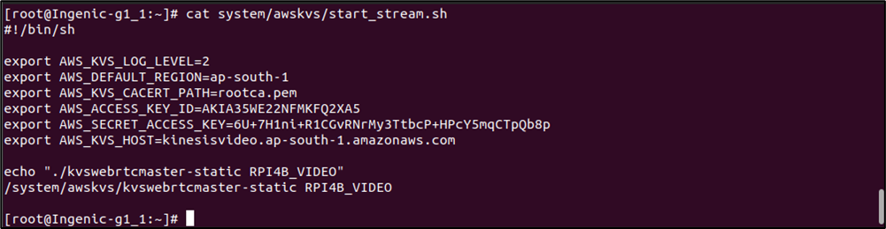

Talaria TWO AWS KINESIS Video Streaming Setup
-----------------------------------------------

After the hardware setup (refer section: `Getting
Started <#_Getting_Started>`__), follow the subsequent steps to run the
AWS KINESIS video streaming application. Use any serial port terminal
application such as GTKTerm to issue the commands on T31z INP3201 Host.

**Note**: The video streaming set-up supports streaming from a single
web connection/browser at a given time.

**Method 1: Manual Setup**

1. Insert the kernel modules using the following command:

+-----------------------------------------------------------------------+
| insmod mmc_detect_test.ko                                             |
|                                                                       |
| insmod sdio-wlan.ko                                                   |
+=======================================================================+
+-----------------------------------------------------------------------+

2. Start the tunadapter in the background.

+-----------------------------------------------------------------------+
| ./tunadapter board_conf=t31_innophase.conf &                          |
+=======================================================================+
+-----------------------------------------------------------------------+

|MicrosoftTeams-image (4)|

Figure 1: Start tunadapter

3. Connect Talaria TWO to an Access Point. This can be achieved using
   either one of the following methods:

   a. Execute the following set of commands:

      i. Start provisioning:

+-----------------------------------------------------------------------+
| ./conmgr provstart <device_name> <manufacturer_name>                  |
+=======================================================================+
+-----------------------------------------------------------------------+

ii. Get provisioning information (SSID and passphrase of the Access
    Point):

+-----------------------------------------------------------------------+
| ./conmgr waitforprovinfo                                              |
+=======================================================================+
+-----------------------------------------------------------------------+

iii. Stop provisioning:

+-----------------------------------------------------------------------+
| ./conmgr provstop                                                     |
+=======================================================================+
+-----------------------------------------------------------------------+

..

   |image1|\ |image2|\ |image3|\ |image4|

Figure 2: Enabling Wi-Fi provisioning over BLE

   **Note**: <device_name> will be visible in the BLE scan list on the
   mobile app.

b. Enable Wi-Fi provisioning over BLE using the `AWS_Streaming
   APP <#_AWS_Streaming_APP>`__. It can be used to enable Wi-Fi
   provisioning over BLE and stream video.

..

   For more details on passing the SSID and passphrase through the
   AWS_Sreaming mobile app, refer section: *Running the Application
   using Android or iOS app* from *Example_using_Provisioning.pdf*
   (*freertos_sdk_x.y\\examples\\prov\\doc*).

   **Note**: x and y in freertos_sdk_x.y refer to the SDK package
   release version.

c. **Alternate method**: Pass the SSID and passphrase of the appropriate
   AP by executing the following command:

+-----------------------------------------------------------------------+
| ./conmgr connect <ssid> <password>                                    |
+=======================================================================+
+-----------------------------------------------------------------------+

..

   |image5|

Figure 3: Connect to AP

4. Run the NTP service from T31z host:

+-----------------------------------------------------------------------+
| [root@Ingenic-g1_1:ces_master]# ntpd -nqp pool.ntp.org                |
+=======================================================================+
+-----------------------------------------------------------------------+

|INP_NTPD_time|

Figure 4: Run NTP service

5. To start the video streaming, insert kernel modules and start RTSP
   server on T31z host:

+-----------------------------------------------------------------------+
| insmod /lib/modules/tx-isp-t31.ko                                     |
|                                                                       |
| insmod /lib/modules/sensor_gc2053_t31.ko data_interface=1             |
|                                                                       |
| insmod /lib/modules/avpu.ko clk_name='vpll' avpu_clk=400000000        |
|                                                                       |
| insmod /lib/modules/audio.ko                                          |
+=======================================================================+
+-----------------------------------------------------------------------+

|image6|

Figure 5: Insert ko modules

6. The following script configures the AWS access key, secret access
   key, region and starts streaming:

..

   |image7|\ |image8|\ |MicrosoftTeams-image (2)|

Figure 6: Start kinesis video streaming

   **Note**: For information on creating the AWS security credentials
   (access key, secret access key), refer `Create AWS Security
   Credentials <#_Create_AWS_Security>`__.

**Method 2 – Automated Shell Scripts**

1. Execute the init script file to automatically load kernel drivers,
   connect Wi-Fi, and start the AWS KINESIS Video Streaming after
   booting.

**Note**:

a. Change the SSID and passphrase in app_init.sh to the required
   configuration.

b. Steaming duration is configurable. Modify the same in app_init.sh for
   the required duration.

..

   Use Delay=0 for uninterrupted streaming without entering the
   low-power mode.

+-----------------------------------------------------------------------+
| ./T31_mcu_app <Delay 0 to 300 sec> <Trun OFF devices 1= T31, 3= T31 & |
| T2 >                                                                  |
+=======================================================================+
+-----------------------------------------------------------------------+

c. Configure Talaria TWO Wi-Fi wakeup from MCU.

+-----------------------------------------------------------------------+
| ./conmgr wakeupconfig <T2 wakeup GPIO pin> <GPIO level> <GPIO         |
| direction 0=output / 1= input>                                        |
+=======================================================================+
+-----------------------------------------------------------------------+

d. Configure MCU wakeup from Talaria TWO.

+-----------------------------------------------------------------------+
| ./conmgr wakeupconfig <MCU wakeup GPIO pin> <GPIO level>              |
+=======================================================================+
+-----------------------------------------------------------------------+

e. Initialize the MQTT connection.

+-----------------------------------------------------------------------+
| ./sc scinit <server name> <port number> <tranport> <mqtt id> <usr     |
| name> <password> [ca cert] [client cert] [client key]                 |
+=======================================================================+
+-----------------------------------------------------------------------+

f. Close the MQTT connection.

+-----------------------------------------------------------------------+
| ./sc scdeinit                                                         |
+=======================================================================+
+-----------------------------------------------------------------------+

g. Update the streaming status.

+-----------------------------------------------------------------------+
| ./sc scstatusupdate < status : 1/0 >                                  |
+=======================================================================+
+-----------------------------------------------------------------------+

..

   where,

   1- ON, 0 - OFF

app_init.sh script for INP3201 board with MCU loads the required kernel
driver modules, starts the MQTT connection and turns the camera ON.
Kinesis video streaming is then started for a specified time. The device
is put to sleep mode in case of inactivity on the PIR sensor connected
to the MCU.

   **Note**: To put the INP3201 board with MCU in low-power mode,
   execute the following steps:

a. Start tunadapter in the background and connect to the AP:

+-----------------------------------------------------------------------+
| ./tunadapter board_conf =./t31.conf &                                 |
|                                                                       |
| ./conmgr connect <ssid> <Pass>                                        |
+=======================================================================+
+-----------------------------------------------------------------------+

b. Initiate Host shutdown:

   1. Provide the number of seconds for which streaming needs to be
      enabled:

+-----------------------------------------------------------------------+
| ./T31_mcu_app <Delay> 1                                               |
+=======================================================================+
+-----------------------------------------------------------------------+

2. Configure the Host wakeup PIN:

+-----------------------------------------------------------------------+
| ./conmgr wakeupconfig 14 1 1                                          |
|                                                                       |
| ./conmgr wakeupconfig 21 0                                            |
+=======================================================================+
+-----------------------------------------------------------------------+

..

   **Note**: For more information on configuring the Host wakeup PIN,
   refer section: *wakeupconfig – Configures Host Wakeup PIN* of
   UG_Dual-Stack.pdf
   (*\\talaria_two_dual_stack\\talaria_two_dual_stack_vx.y\\doc*)

3. Get the previous wakeup reason:

+-----------------------------------------------------------------------+
| ./conmgr getwakeupreason                                              |
+=======================================================================+
+-----------------------------------------------------------------------+

4. Clear wakeup reason before initiating shutdown:

+-----------------------------------------------------------------------+
| ./conmgr wakeupreasoncls                                              |
+=======================================================================+
+-----------------------------------------------------------------------+

5. Trigger Host shutdown:

+-----------------------------------------------------------------------+
| ./conmgr shutdown                                                     |
+=======================================================================+
+-----------------------------------------------------------------------+

1. The following script configures the AWS access key, secret access
   key, region and starts streaming:

..

   |image9|\ |image10|\ |image11|

Figure 7: Script to configure AWS access parameters

**Note**: For information on creating the AWS security credentials
(access key, secret access key), refer `Create AWS Security
Credentials <#_Create_AWS_Security>`__.

.. |MicrosoftTeams-image (4)| image:: media/image1.png
   :width: 6.29931in
   :height: 5.34861in

.. |INP_NTPD_time| image:: media/image5.png
   :width: 7.00764in
   :height: 0.46736in

.. |MicrosoftTeams-image (2)| image:: media/image8.png
   :width: 7.00764in
   :height: 1.82014in

