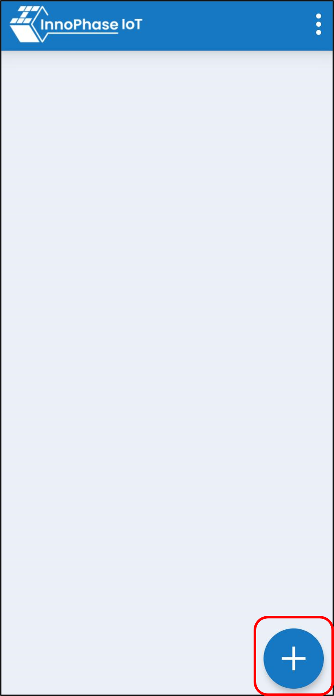

Web browser
-------------

1. For viewing the Kinesis Video Stream on AWS Dashboard, open the
   following link in the web browser:
   https://us-east-1.console.aws.amazon.com/kinesisvideo/home?region=us-east-1#/dashboard

|A screenshot of a sign in Description automatically generated|

Figure 12: AWS KINESIS Login

2. Select the AWS Cloud region from the top-right drop-down menu

|A screenshot of a computer Description automatically generated|

Figure 13: AWS Region selection

3. Click on [Signaling channels] on the left panel and select [T2_VIDEO]
   from Signaling channels.

|Graphical user interface Description automatically generated|

Figure 14: AWS KINESIS Dashboard – signaling channels

4. Click on [Media playback viewer] and click the center Play button to
   start/pause the streaming.

|A picture containing text, screenshot, monitor, indoor Description
automatically generated|

Figure 15: AWS KINESIS Dashboard – video streaming

5. Click on [Viewer statistics] link below the Media playback viewer to
   view stream information such as: bitrate and audio/video codec,
   resolution and so on.

.. |A screenshot of a computer Description automatically generated| image:: media/image2.png
   :width: 6.88958in
   :height: 3.51528in
.. |Graphical user interface Description automatically generated| image:: media/image3.png
   :width: 7.08681in
   :height: 2.69097in
.. |A picture containing text, screenshot, monitor, indoor Description automatically generated| image:: media/image4.png
   :width: 7.08681in
   :height: 3.7in
