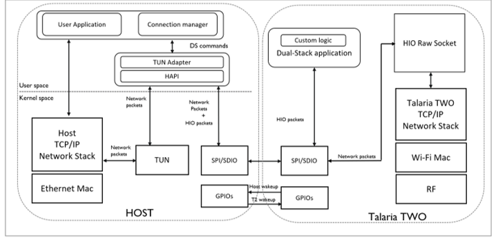

.. _ds landing:

Dual-Stack Solution
###################

Dual-Stack is a hosted solution with Talaria TWO Wi-Fi module which
helps replace the normal Wi-Fi driver concept of Linux stack. This
solution is designed to reduce power consumption without compromising
the throughput performance for Linux based application SoCs used by
ISPs, Industrial computers etc.

Dual-Stack provides the following advantages:

1. Maintains Wi-Fi connectivity during host power off/sleep state.

2. Supports low power.

3. Easy to migrate across different kernel versions.

In this solution, the Wi-Fi driver software runs in the user space with
minimal kernel modifications and makes use of the network stack on the
Wi-Fi module for housekeeping tasks (such as cloud keepalive). The
network stack on the Linux host is used to transfer high bandwidth data.

|image1|

Figure 1: Software architecture block diagram

Following are the key advantages of the Dual-Stack solution:

1. Solution is a user space program and hence easy to maintain.

2. Portability across platform and kernel versions.

3. Linux kernel modifications are minimal to support SPI/TUN.

4. Existing socket applications will be able to run on the host without
   any modification.

5. It provides a shadow service of sockets so that the always connected
   feature can be achieved even when the host is in sleep.

6. FOTA and provisioning features are supported.

Overview
-----------
.. toctree::
   :maxdepth: 2

   1. Overview/2. Dual-Stack Packages.rst
   1. Overview/3. Key Features.rst
   1. Overview/4. Tunadapter.rst
   1. Overview/5. Configuration.rst

Interface Requirements
~~~~~~~~~~~~
.. toctree::
   :maxdepth: 2

   1. Overview/1. Interface Requirements/1. Hardware Requirements.rst
   1. Overview/1. Interface Requirements/2. Software Requirements.rst

Connetion manager
-----------------

.. toctree::
   :maxdepth: 3

   2. Connection Manager/1. Commands .rst
   2. Connection Manager/2. UseCases.rst

INP3201-HOST
--------------

.. toctree::
   :maxdepth: 2

Getting Started
~~~~~~~~~~~~~~~~
.. toctree::
   :maxdepth: 2

   3. INP3201-HOST/1. Getting Started/INP3201 Getting Started - Landing Page.rst

Evaluation Setup and Usage
~~~~~~~~~~~~~~~~~~~~~~~~
.. toctree::
   :maxdepth: 2

   3. INP3201-HOST/2. Evaluation Set-up & Usage/1. Evaluation Set-up & Usage - Landing Page.rst

Current Measurement
~~~~~~~~~~~~~~~~~~~~~~~~
.. toctree::
   :maxdepth: 2

   3. INP3201-HOST/3. Current Measurement/Current Measurement.rst

Example applications
~~~~~~~~~~~~~~~~~~~~~~~
.. toctree::
   :maxdepth: 2

   3. INP3201-HOST/4. Example Applications/Example applications - Landing Page.rst

AWS Kinesis Video streaming
~~~~~~~~~~~~~~~~~~~~~~~~~~~
.. toctree::
   :maxdepth: 2

   3. INP3201-HOST/5. AWS Kinesis Video Streaming/1. AWS Kinesis Video Streaming - Landing Page.rst
