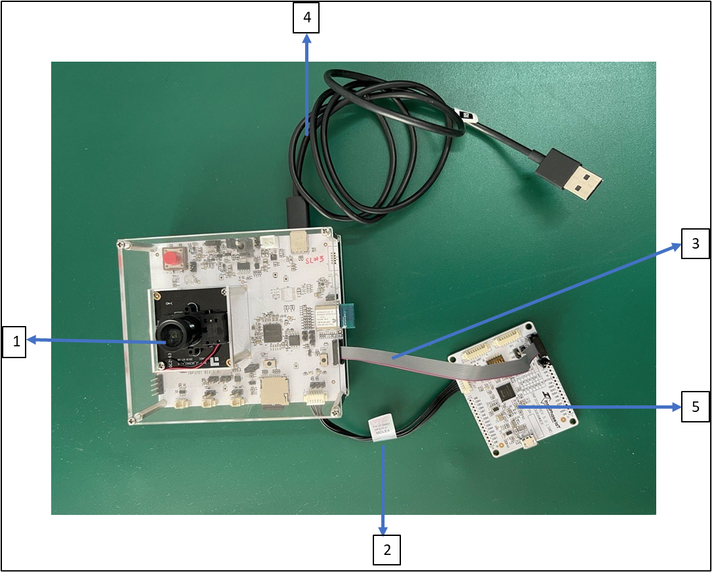
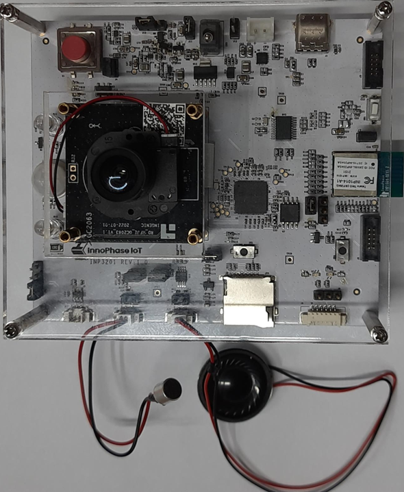
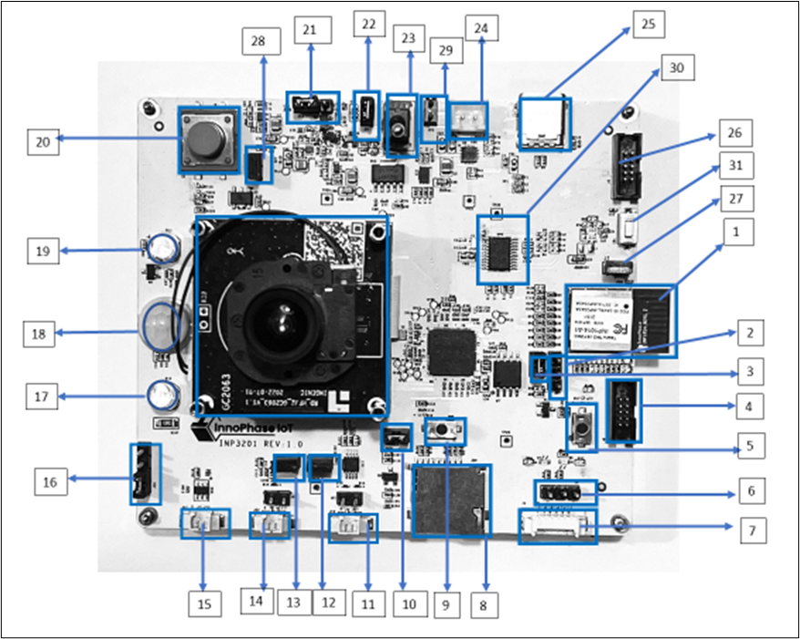
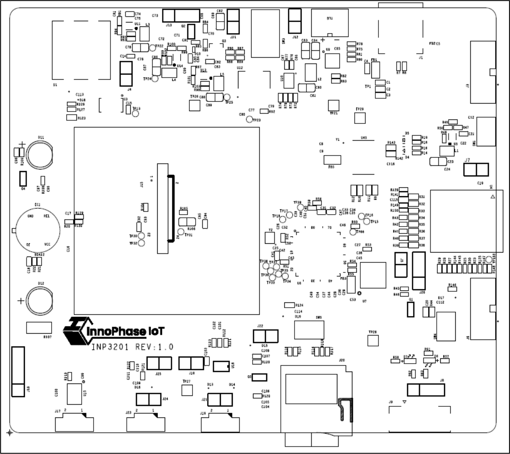

.. _3201 hw board overview:

INP3201 Board Overview 
--------------------------

Figure 1 describes the construction of the INP3201 evaluation board.

|image2|

.. rst-class:: imagefiguesclass
Figure 1: INP3201 block diagram

This block diagram has three major components:

1. Wireless Connectivity: Reference kit (RK) has an onboard Wi-Fi and
   BLE module powered by InnoPhase IoT INP1014 module. The image data
   from the camera is transferred wirelessly through the INP1014 module,
   powered by Talaria TWO chipset which supports:

   a. Wi-Fi: 802.11 b/g/n, up to MCS7 single-stream (1x1), BLE: BLE 5.0
      w/

   b. Advanced Features: 2Mbps PHY, LE, Coding (Long-Range), Extended
      Advertising, Frequency Supported: 2.4GHz

2. Host processer: RK is powered with a highly integrated T31ZX
   processor QFN84pin which can accommodate Linux on it.

3. PowerSave MCU: This is an MCU from ST microelectronics STM32L010F4
   which mainly takes over during the power save scenarios. It handles
   the sleep and wake up of Talaria TWO as well as T31, the algorithm
   for which depends on the application requirement.

INP3201 Board Description 
~~~~~~~~~~~~~~~~~~~~~~~~~~

|image3|

.. rst-class:: imagefiguesclass
Figure 2: INP3201 Board - with MCU

|image4|

.. rst-class:: imagefiguesclass
Figure 3: INP3201 board – without MCU

|image5|

.. rst-class:: imagefiguesclass
Figure 4: INP3201 board components

.. table:: Table 1: INP3201 components

   +--------------+-------------------------------------------------------+
   | **Sl.no      | **Description**                                       |
   | from**       |                                                       |
   | Figure 4     |                                                       |
   +==============+=======================================================+
   | 1            | INP1014 module                                        |
   +--------------+-------------------------------------------------------+
   | 2            | J14 - 3 PIN jumper Talaria TWO pull-up configuration  |
   +--------------+-------------------------------------------------------+
   | 3            | J5 - 2 PIN jumper for SDIO pull-up configuration      |
   +--------------+-------------------------------------------------------+
   | 4            | J6 - 10 pin connector for Talaria TWO SWD programming |
   +--------------+-------------------------------------------------------+
   | 5            | SW4 - Talaria TWO reset button                        |
   +--------------+-------------------------------------------------------+
   | 6            | J8 - T31 debug console (UART)                         |
   +--------------+-------------------------------------------------------+
   | 7            | J9 - T31 debug connector for INP3000 2 PIN UART port  |
   +--------------+-------------------------------------------------------+
   | 8            | J20 - T31 SD card connector                           |
   +--------------+-------------------------------------------------------+
   | 9            | SW5 - Bootsel button for T31                          |
   +--------------+-------------------------------------------------------+
   | 10           | J22 - µSD card slot pull-up jumper                    |
   +--------------+-------------------------------------------------------+
   | 11           | J19 - Speaker connector                               |
   +--------------+-------------------------------------------------------+
   | 12           | J18 - Power supply for speaker                        |
   +--------------+-------------------------------------------------------+
   | 13           | J25 - 1.8V jumper for microphone                      |
   +--------------+-------------------------------------------------------+
   | 14           | J23 - Microphone connector                            |
   +--------------+-------------------------------------------------------+
   | 15           | J17 - IRCUT LED connector                             |
   +--------------+-------------------------------------------------------+
   | 16           | J16 - IRCUT VCC options connector                     |
   +--------------+-------------------------------------------------------+
   | 17           | D12 - IR LED                                          |
   +--------------+-------------------------------------------------------+
   | 18           | J4 - Digital PIR sensor                               |
   +--------------+-------------------------------------------------------+
   | 19           | D11 - IR LED                                          |
   +--------------+-------------------------------------------------------+
   | 20           | S1 - Doorbell button                                  |
   +--------------+-------------------------------------------------------+
   | 21           | J13 – T31 power selection and current measurement     |
   |              | jumper                                                |
   +--------------+-------------------------------------------------------+
   | 22           | J11 - Complete board current measurement jumper       |
   +--------------+-------------------------------------------------------+
   | 23           | SW3 - Power ON/OFF switch                             |
   +--------------+-------------------------------------------------------+
   | 24           | BT1 - Battery connector                               |
   +--------------+-------------------------------------------------------+
   | 25           | J1 – USB Type C connector                             |
   +--------------+-------------------------------------------------------+
   | 26           | J3 – MCU programming connector                        |
   +--------------+-------------------------------------------------------+
   | 27           | J7 – Talaria TWO current measurement                  |
   +--------------+-------------------------------------------------------+
   | 28           | J4 – PIR Power Enable                                 |
   +--------------+-------------------------------------------------------+
   | 29           | Battery Connector same as BT1                         |
   +--------------+-------------------------------------------------------+
   | 30           | MCU                                                   |
   +--------------+-------------------------------------------------------+
   | 31           | MCU Reset Switch                                      |
   +--------------+-------------------------------------------------------+

The silk-screen top helps identify the jumper on the board:

|image6|

Figure 5: INP3201 silk-screen top

INP3201 Working Modes
~~~~~~~~~~~~~~~~~~~~~~~~~~

INP3201 EVB – MCU Bypass Mode
~~~~~~~~~~~~~~~~~~~~~~~~~~~~~

In the MCU bypass mode, the board will work with T31 as a video
application Host processor and Talaria TWO will act as a wireless
bridge, enabling power save feature for the whole system. In this mode,
the optional STM Power-save MCU will not be populated on board.

On the INP3201 board, ensure to select the right jumper resistors to
completely run in the MCU bypass mode without MCU. While using the
INP3201 in MCU bypass mode, DNP (do not populate) the resistors
mentioned in Table 2:

.. table:: Table 2: DNP resistors for IN3201 in power-save MCU bypass
mode

   +-----------------------------------+-----------------------------------+
   | **Resistor DNP**                  | **Schematics Net name**           |
   +===================================+===================================+
   | R12                               | CPU_UART0_TXD                     |
   +-----------------------------------+-----------------------------------+
   | R10                               | CPU_UART0_RXD                     |
   +-----------------------------------+-----------------------------------+
   | R23                               | MCU-WAKE-WIFI/RX                  |
   +-----------------------------------+-----------------------------------+
   | R49                               | MCU-T2-PWR                        |
   +-----------------------------------+-----------------------------------+
   | R87                               | MCU-T31-PWR                       |
   +-----------------------------------+-----------------------------------+
   | R129                              | PIR-ACTIVE-MCU                    |
   +-----------------------------------+-----------------------------------+
   | R126                              | MCU-DB                            |
   +-----------------------------------+-----------------------------------+
   | R141                              | WIFI-WAKE-MCU/TX                  |
   +-----------------------------------+-----------------------------------+

For more details on the schematics, refer:
INP3201_schematic_MCU_Bypass.pdf.

INP3201 with Low Power MCU
~~~~~~~~~~~~~~~~~~~~~~~~~~

In this mode, STM32L010F MCU and its software takes care of controlling
the power-save mechanism of Talaria TWO and T31 by putting them to
sleep/wakeup depending on the application. Based on the application, one
can write the software on the STM power-save MCU for INP3201.

**Note**: The dotted lines in the block diagram (Figure 1) are for
INP3201 with power-save MCU.

To enable the MCU, the following components must be mounted. Check the
board to ensure the components are mounted.

.. table:: Table 3: Enable MCU - components to be mounted

   +-----------------------------------+-----------------------------------+
   | **Components**                    | **Net Name on Schematics**        |
   +===================================+===================================+
   | R09                               | MCU-WAKE-WIFI/RX                  |
   +-----------------------------------+-----------------------------------+
   | R10                               | CPU_UART0_RXD                     |
   +-----------------------------------+-----------------------------------+
   | R11                               | WIFI-WAKE-MCU/TX                  |
   +-----------------------------------+-----------------------------------+
   | R12                               | CPU_UART0_TXD                     |
   +-----------------------------------+-----------------------------------+
   | R23                               | MCU-WAKE-WIFI/RX                  |
   +-----------------------------------+-----------------------------------+
   | R47                               | ENABLE T2 LDO                     |
   +-----------------------------------+-----------------------------------+
   | R87                               | MCU-T31-PWR                       |
   +-----------------------------------+-----------------------------------+
   | R126                              | MCU-DB                            |
   +-----------------------------------+-----------------------------------+
   | R141                              | WIFI-WAKE-MCU/TX                  |
   +-----------------------------------+-----------------------------------+
   | Y1                                | 32Khz Crystal Mounted             |
   +-----------------------------------+-----------------------------------+
   | C8, C9                            | Mounted                           |
   +-----------------------------------+-----------------------------------+
   | U45                               | Mounted                           |
   +-----------------------------------+-----------------------------------+

Components to be unmounted:

.. table:: Table 4: Enable MCU - components to be unmounted

   +-----------------------------------+-----------------------------------+
   | **Components**                    | **Net name on Schematics**        |
   +===================================+===================================+
   | R127                              | T2-DB remove                      |
   +-----------------------------------+-----------------------------------+
   | R128                              | T2-T31-PWR                        |
   +-----------------------------------+-----------------------------------+
   | R130                              | PIR-ACTIVE-T2                     |
   +-----------------------------------+-----------------------------------+
   | R142, R143                        | GR-LED Not Used                   |
   +-----------------------------------+-----------------------------------+
   | R30                               | PIR-ACTIVE-T2                     |
   +-----------------------------------+-----------------------------------+
   | R49                               | MCU-T2-PWR                        |
   +-----------------------------------+-----------------------------------+
   | R89                               | T2-T31-PWR                        |
   +-----------------------------------+-----------------------------------+

For more details on the schematics, refer:
INP3201_schematic_with_Low_Power_MCU.pdf.

.. |image4| image:: media/image4.jpeg
   :width: 7.48031in
   :height: 5.50923in

