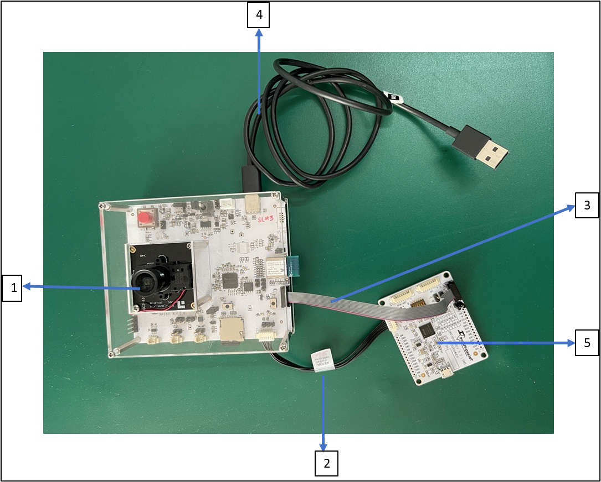

.. _3201 hw prog t2:

Programming Talaria TWO Module on INP3201 Board
------------------------------------------------

Talaria TWO (INP1014) module on the INP3201 board can be programmed
using the SWD mode. Ensure the following while programming the module:

1. Programing Talaria TWO (INP1014) without powering up INP3201: Talaria
   TWO module can be programmed using the SWD connector J6 on the
   module. Power to the Talaria TWO module can be supplied through the
   SWD connector from the INP3000 board rev 5.0.:

|image1|

.. rst-class:: imagefiguesclass
Figure 1: INP3201 J6 SWD connector for Talaria TWO

|image2|

.. rst-class:: imagefiguesclass
Figure 2: Talaria TWO SWD programming

**Note**: If the INP3201 is already powered through Type C USB cable,
ensure to remove the 3.3V power Jumper J9 on the programmer board
INP3000 as indicated in Figure 2.

