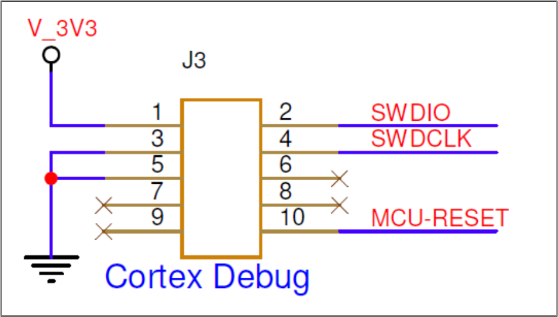

.. _3201 hw prog stm32 mcu:

Programming STM32 MCU
-------------------------

The MCU STM32L010F4P6 on INP3201 can be programmed using the connector
J3:

|image9|

.. rst-class:: imagefiguesclass
Figure 1: Programming STM32 MCU

The bin file for STM32L010F4P6 is provided as part of the software
package and STlink can be used to program the MCU.

For more details, refer: MUC_Firmware_Flashing

