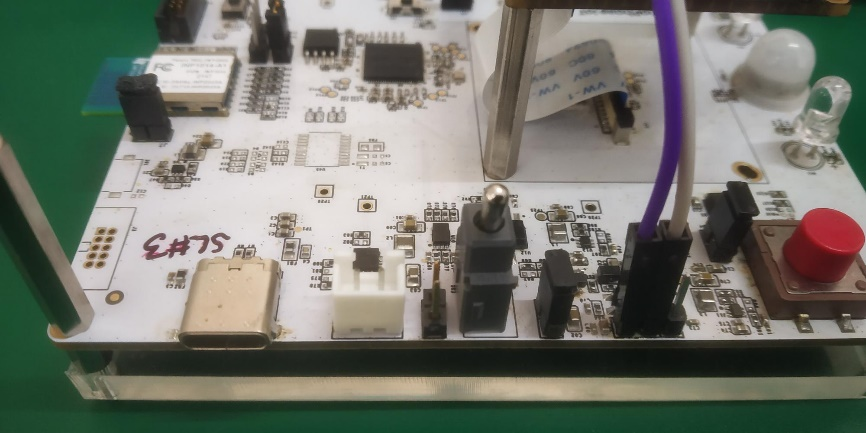

.. _3201 current measurement:

Current Measurement
------------------------

Talaria TWO
~~~~~~~~~~~~~~~

Jumper J7 as indicated in Table 2 can be used to measure the Talaria TWO
current anytime during the INP3201 testing. A series of ammeters can be
connected between the J7 jumper for accurate current measurement at all
modes including the powersave mode of Talaria TWO.

Figure 1 depicts the current measurement setup for Talaria TWO.

|image1|

.. rst-class:: imagefiguesclass
Figure 1: Talaria TWO current measurement on INP3201

T31
~~~~

Jumper J13 as indicated in Table 2 can be used to measure the T31
current during INP3201 testing. A series of ammeters can be connected
between the J13 PIN 1 and 2 for current measurement in powersave mode
and J13 PIN 2 and 3 when powersave is disabled.

|image2|

.. rst-class:: imagefiguesclass
Figure 2: T31 current measurement - powersave enabled

|image3|

.. rst-class:: imagefiguesclass
Figure 3: T31 current measurement - powersave disabled

INP3201 Board
~~~~~~~~~~~~~~~

Jumper J11 as indicated in Table 2 can be used to measure the complete
board current during INP3201 testing. A series of ammeters can be
connected between the J11 as indicated in Figure 15.

|image4|

.. rst-class:: imagefiguesclass
Figure 4: Complete INP3201 board current measurement

