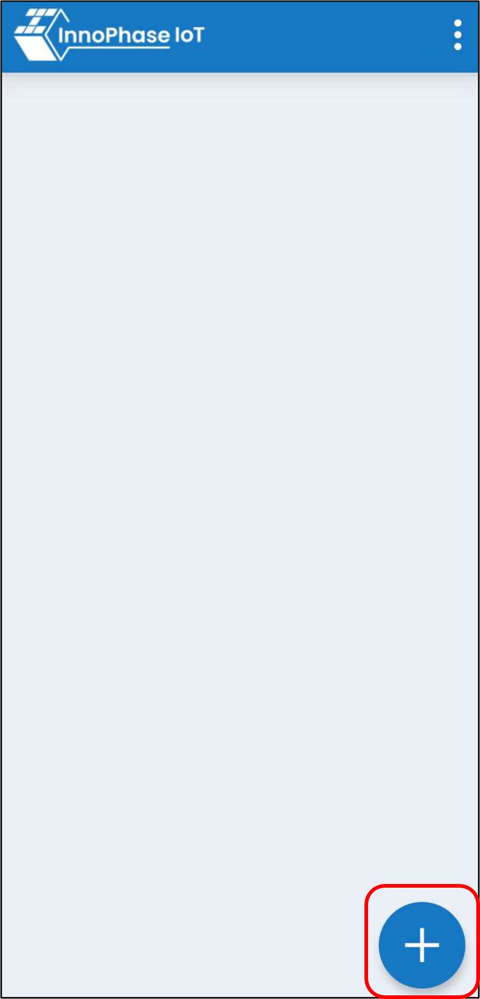
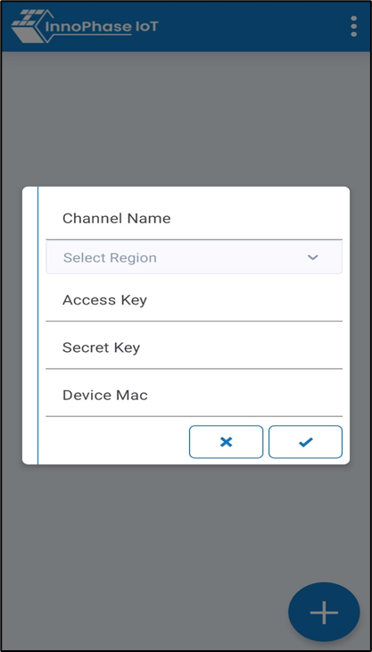
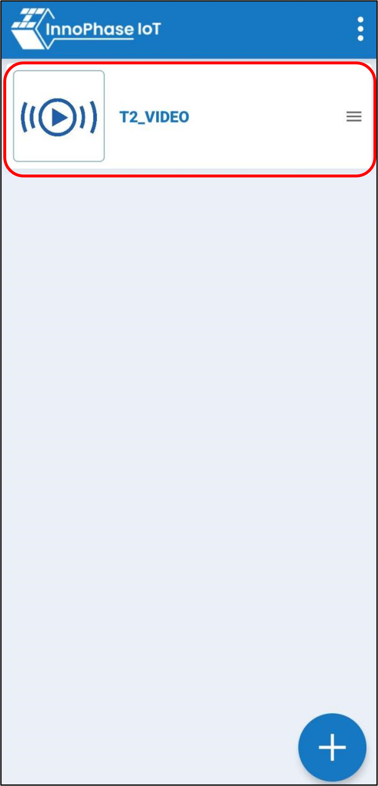
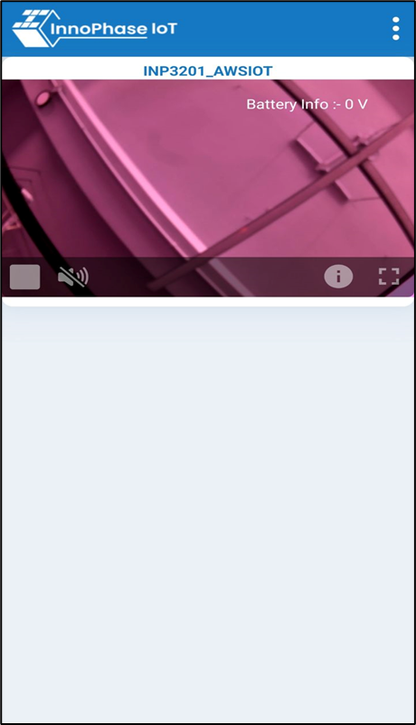

.. _3201 aws vs app:

InnoPhase IoT Video Streamer
----------------

1. Create the following credentials from the AWS account
   (https://us-east-1.console.aws.amazon.com/kinesisvideo/home?region=us-east-1#/dashboard):

   a. AWS_ACCESS_KEY

   b. AWS_SECRET_ACCESS_KEY

   c. AWS_KVS_HOST

**Note**: Steps to create the AWS security credentials are explained in
section: `Create AWS Security Credentials <#_Create_AWS_Security>`__.

2. On opening the AWS streaming mobile app- *InnoPhase IoT Video Streamer*, click on the plus sign at
   the bottom right corner.

|image1|

.. rst-class:: imagefiguesclass
Figure 1: AWS_Streaming APP

3. Enter the AWS credentials in the mobile app.

Select the appropriate AWS cloud location using the Select Region
drop-down. Enter the Talaria TWO MAC ID in the device Mac field.

|image2|

.. rst-class:: imagefiguesclass
Figure 2: Enter AWS credentials

4. On providing the AWS credentials, the video streaming channel appears
   in the streaming app listing. Click on the channel to start video
   streaming.

|image3|

.. rst-class:: imagefiguesclass
Figure 3: AWS_Streaming APP - T2_VIDEO

|image4|

.. rst-class:: imagefiguesclass
Figure 4: AWS_Streaming app- video streaming

