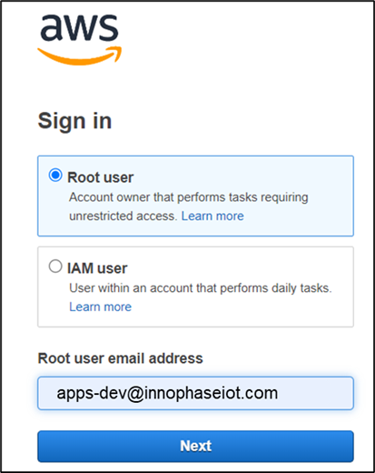
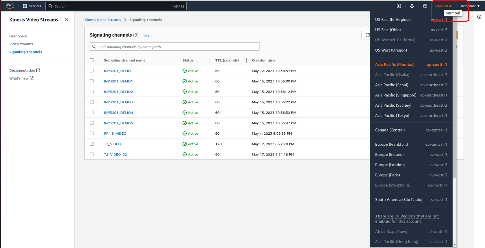
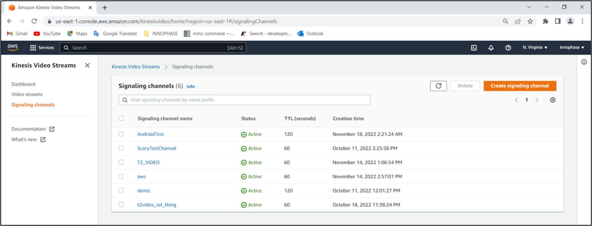
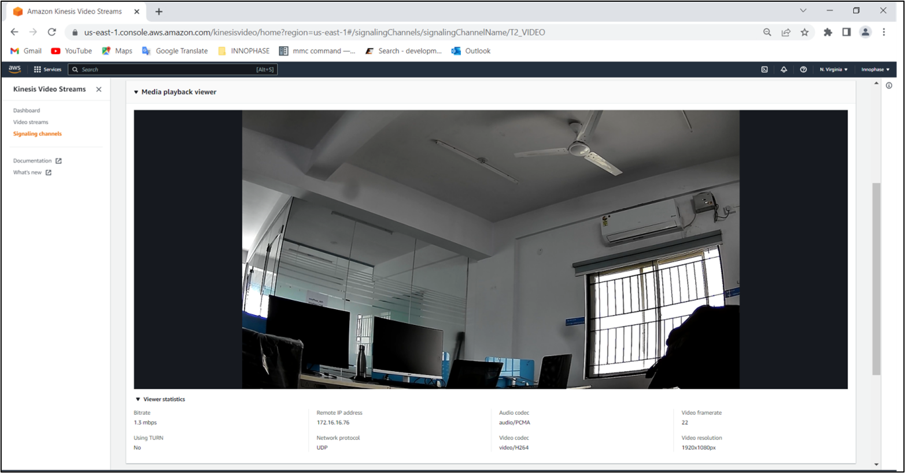

.. _3201 aws vs web:

Web browser
-------------

1. For viewing the Kinesis Video Stream on AWS Dashboard, open the
   following link in the web browser:
   https://us-east-1.console.aws.amazon.com/kinesisvideo/home?region=us-east-1#/dashboard

|image5|

.. rst-class:: imagefiguesclass
Figure 1: AWS KINESIS Login

2. Select the AWS Cloud region from the top-right drop-down menu

|image6|

.. rst-class:: imagefiguesclass
Figure 2: AWS Region selection

3. Click on [Signaling channels] on the left panel and select [T2_VIDEO]
   from Signaling channels.

|image7|

.. rst-class:: imagefiguesclass
Figure 3: AWS KINESIS Dashboard – signaling channels

4. Click on [Media playback viewer] and click the center Play button to
   start/pause the streaming.

|image8|

.. rst-class:: imagefiguesclass
Figure 4: AWS KINESIS Dashboard – video streaming

5. Click on [Viewer statistics] link below the Media playback viewer to
   view stream information such as: bitrate and audio/video codec,
   resolution and so on.

