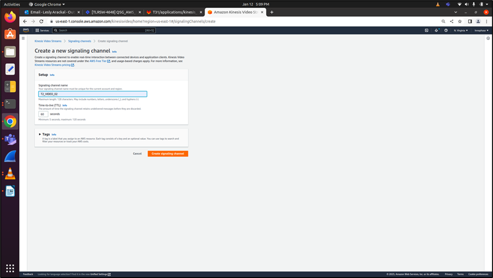

.. _3201 aws vs ms:

Multiple Streaming
-------------------

1. AWS Dashboard Modification

For using additional cameras, use the Create a new signaling channel
option in the AWS console:

|image8|

.. rst-class:: imagefiguesclass
Figure 1: Creating a new signaling channel

2. CLI Command Modification

Modify the CLI command to include the new signaling channel (refer step
6 (Method 1: Manual Setup) of section: `T31z INP3201 Host - Talaria TWO
AWS KINESIS Video Streaming Setup <#_T31z_INP3201_Host>`):

.. code:: shell

      /system/awskvs/kvswebrtcmaster-static <new signaling_channel name> 

3. Script Modification

Update the new signaling channel name in start_stream.sh script file as
parameter to kvswebrtcmaster application.

**Note**: As mentioned in step 2 (Method 2 – Automated Shell Scripts) of
section: `T31z INP3201 Host - Talaria TWO AWS KINESIS Video Streaming
Setup <#_T31x_Host_->`, modify the signaling channels to include the
new signaling channel:

a. echo “.kvswebrtcmaster-static RPI4B_VIDEO”

b. /system/awskvs/kvswebrtcmaster-static RPI4B_VIDEO

