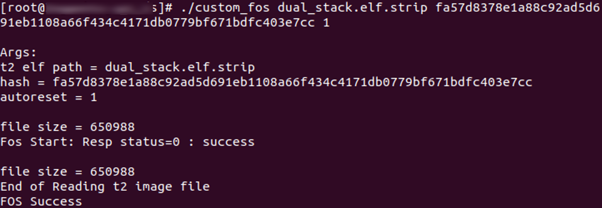

.. _3201 custom fos:

Custom FOS Application
----------------------

Description
~~~~~~~~~~~

Custom FOS application (custom_fos) demonstrates Firmware Upgrade Over
Serial. Using this application, Talaria TWO ELF can be upgraded from the
Host. Host provides Talaria TWO ELF to be upgraded. The ELF is sent over
serial using FOS commands.

Prerequisites
~~~~~~~~~~~~~

1. GTKTerm or similar application.

Command Description
~~~~~~~~~~~~~~~~~~~

Send ELF image to Talaria TWO.

.. code:: shell

      #./custom_fos <elf_path> <hash> <auto_reset>   

where,

1. elf_path (must): Path of the Dual-Stack ELF

2. Hash (optional): sha256 hash of the ELF provided through elf_path.
   Use --no_hash to skip this argument

3. auto_reset (optional):

   a. 1 – Talaria TWO is reset automatically after successful upgrade

   b. 0 - Host needs to reset Talaria TWO after successful upgrade

Procedure
~~~~~~~~~

Execute the following operations on Talaria TWO:

.. code:: shell

      #./custom_fos /root/t2_firmware.elf --no_hash 1  

Expected Output
~~~~~~~~~~~~~~~

Host Console Logs
^^^^^^^^^^^^^^^^^

|image2|

Figure 1: custom_fos - host console logs

Host serial log – text output:

.. code:: shell

      [root@:]# ./custom_fos dual_stack.elf.strip fa57d8378e1a88c92ad5d691eb1108a66f434c4171db0779bf671bdfc403e7cc 1

      Args:
      t2 elf path = dual_stack.elf.strip
      hash = fa57d8378e1a88c92ad5d691eb1108a66f434c4171db0779bf671bdfc403e7cc
      autoreset = 1
      
      file size = 650988
      Fos Start: Resp status=0 : success
      
      file size = 650988
      End of Reading t2 image file
      FOS Success

List of Message IDs Used
~~~~~~~~~~~~~~~~~~~~~~~~

This application demonstrates the use of custom Wi-Fi connection in
Dual-Stack custom applications and uses Group number 70. Following are
the message IDs used:

1. FOS_HIO_START_REQ

This message is sent to Talaria TWO by Host with the ELF image name,
sha256 hash of the ELF, image size and a flag to indicate auto-reset of
Talaria TWO after firmware upgrade completes. Talaria TWO replies with
status code to Host.

2. FOS_HIO_IMG_SEND_REQ

When Talaria TWO replies with a successful response for FOS start
request, Host will do the base64 encoding for ELF image and starts
sending it to Talaria TWO. If Talaria TWO successfully receives the ELF
data of size mentioned in the start request, it will send the status to
Host. As the size is set during FOS start request, Talaria TWO upgrades
the image and resets by itself it the auto reset flag is set.

3. FOS_HIO_COMMIT_REQ

There is no necessity to call commit(), commit will be done implicitly
as the image size is set during fos_start.

